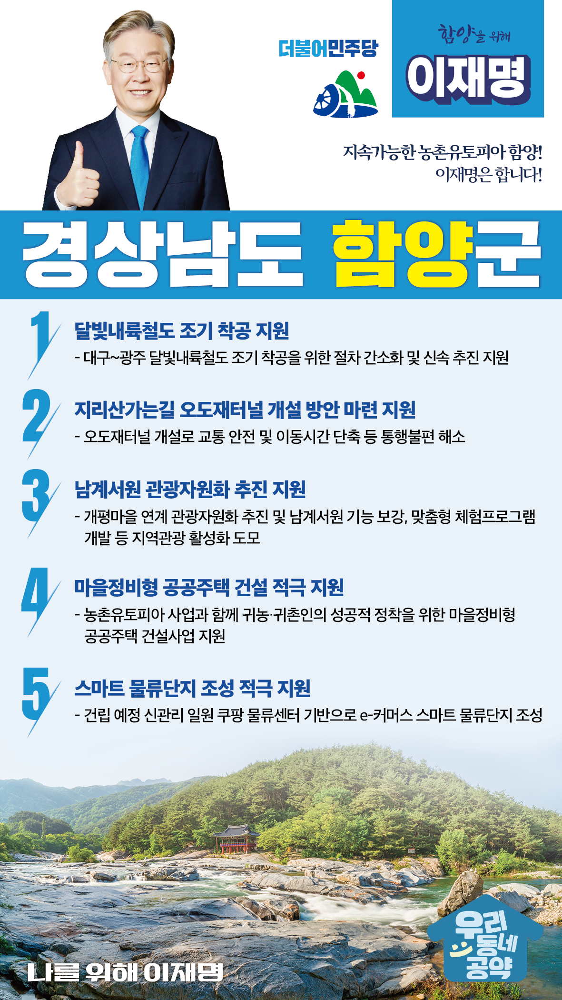

## 경남 지역 공약

# 함양군

### 지속가능한 농촌유토피아 함양! 이재명은 합니다! 
> 2022-02-10

존경하는 경남 함양군민 여러분,

 

산삼항노화엑스포와 우리나라에서 가장 오래된 인공림인 상림공원으로 유명한 함양은 연간 100만 명이 방문하는 관광도시인 한편 항노화 산업으로 도약을 꿈꾸고 있습니다. 

 

함양의 도전을 지원하기 위해 저 이재명의 ‘함양 발전 5대 공약’을 말씀드리겠습니다.

 

첫째, 대구~광주 간 달빛내륙철도를 조기에 착공하겠습니다. 

대구에서 광주를 연결하는 달빛내륙철도는 영‧호남 상생과 화합의 상징입니다. 달빛내륙철도가 완성되면 영호남 지역간 인적, 물적 교류가 촉진되고 남부내륙지역 광역경제권 구축이 가능해질 것입니다. 철도소외지 함양에 철길을 놓아 함양의 관광과 산업에 큰 발전을 가져오겠습니다.

 

둘째, 지리산가는길 오도재터널 개설 방안 마련을 지원하겠습니다.

화개에서 함양을 잇는 지방도 1023호선은 급경사에 굴곡이 심합니다. 눈이 많이 오는 겨울에는 통행 제한이 잦고 군민들이 남원으로 우회해야 하는 등 교통 불편이 큽니다. 교통 안전과 이동시간 단축을 위해 오도재터널 사업이 진행될 수 있는 방안 마련을 지원하겠습니다.

 

셋째, 남계서원의 관광자원화 추진을 지원하겠습니다.

남계서원은 유네스코 세계문화유산인 ‘한국의 서원’ 9곳 중 하나로 조선시대를 대표하는 서원입니다. 서원으로서 기능을 보강하고 맞춤형 체험프로그램을 개발하여 남계서원의 가치를 높이기 위해 지원하겠습니다.  

 

넷째, 함양의 마을정비형 공공주택 건설을 적극 지원하겠습니다.

함양군은 지방 소멸위기 극복을 위해 ‘농촌유토피아’ 사업을 추진하고 있습니다. 귀농·귀촌인의 함양 정착이 성공적으로 추진될 수 있도록 마을정비형 공공주택 건설사업을 지원하겠습니다.

 

다섯째, 함양에 스마트 물류단지가 조성되도록 적극 지원하겠습니다. 

함양읍 신관리 일원에 쿠팡 물류센터가 들어설 예정입니다. 이를 기반으로 e-커머스 스마트 물류단지가 조성될 수 있도록 적극 지원하겠습니다. 함양이 영호남을 잇는 남부내륙 물류·유통의 허브로 도약할 수 있도록 돕겠습니다. 

 

 

존경하는 함양군민 여러분!

이재명은 지킬 수 있는 것만 약속했고 약속했던 것은 지켜왔습니다.

살기좋은 함양군 미래를 위한 약속 실력과 성과로 입증된 이재명이 반드시 실천하겠습니다.

 

함양 앞으로! 발전 제대로!

함양군민을 위해, 이재명! 

						