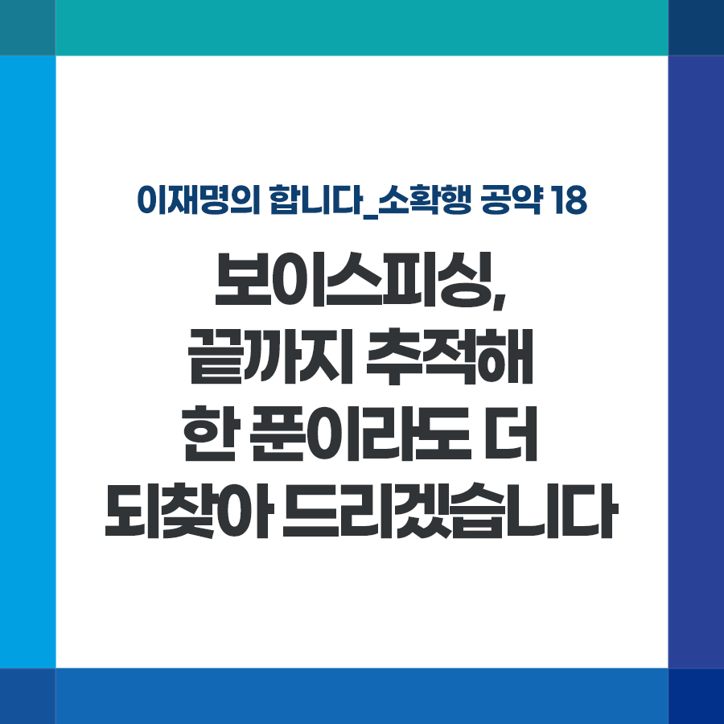

## 소확행 시리즈
# 보이스피싱, 끝까지 추적해 한 푼이라도 더 되찾아 드리겠습니다
### 2021-12-02 16:16:55

이재명의 합니다_소확행 공약 18

3년간 모은 3,000만 원에 대출금까지 몽땅 넘긴 청년, 손자의 대학등록금을 날린 할머니... 보이스피싱은 어려운 사람들을 낭떠러지로 밀어버리는 악질 중에서도 악질 범죄입니다.

​

보이스피싱 피해는 2020년에 신고된 것만 5만2천여 건에 달합니다. 국민 1000명당 1명이 피해자인 셈입니다. 수법도 나날이 진화해 단속 역량은 따라가질 못합니다.

​

벼랑 끝 서민의 삶을 위협하는 보이스피싱, 반드시 뿌리 뽑겠습니다.

​

첫째, 불법사채업과 기획부동산 단속에서 큰 성과를 냈던 경기도 특별사법경찰단을 전국으로 확대해 강력히 단속하겠습니다.

​

둘째, 첨단기술 활용, 수사역량 강화 등 대응 수준을 획기적으로 높이겠습니다. 피해 발생 시 재난문자와 같은 전 국민 전파 시스템 도입, 경찰청 개발 예방 앱 핸드폰 기본 탑재 추진, 빅데이터·AI 기반의 방지기술 개발, 경찰청 전담인력 확대, 해외 수사기관 및 국제금융기구 협력 강화 등을 통해 발신지가 어디라도 추적해내겠습니다.

​

셋째, 통신사와 금융회사의 책임도 강화하겠습니다. 통신사 '스팸 안내 앱'의 대응 시간 단축, 보이스피싱 의심계좌 지급정지 등 피해예방 의무 규정 강화, 지급지연제도 확대, 대포통장 인출 제한 강화 등 금융회사 책임도 강화하겠습니다.

​

끝으로 가해자 처벌 수위, 피해자의 가해자 둔갑 등 보이스피싱 전반의 문제들도 두루 점검하겠습니다.

​

더 이상 '제2의 김미영 팀장'에게 당하는 국민이 없도록, 과하다 싶을 정도로 강력하게 대응하고 해결하겠습니다.