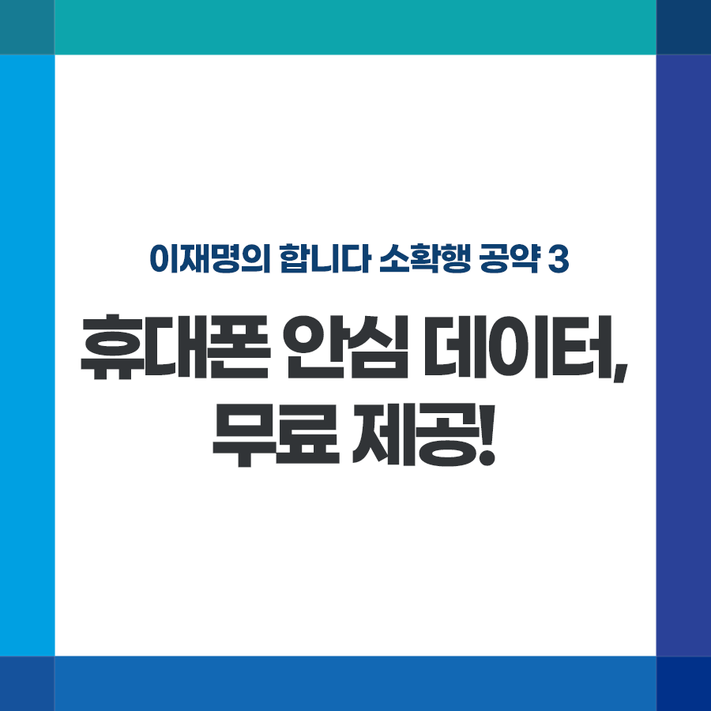

## 소확행 시리즈
# 휴대폰 안심 데이터, 무료 제공!
> 2021-11-26 17:42:37

이재명의 합니다 소확행 공약 3

휴대폰 안심 데이터, 무료 제공!

​

휴대폰 인터넷 이용은 이제 국민생활의 필수입니다.

​

뉴스, 동영상 시청, 모바일 메신저, SNS 소통, 각종 공공서비스 이용을 못하는 일상은 상상조차 할 수 없습니다.

​

시대변화에 걸맞는 새로운 데이터 이용 제도 정립이 필요합니다. 

​

그동안 유선인터넷서비스 접근만 보장하던 데서 더 나아가 최소한의 이용권을 보장해야 합니다.

​

저 이재명은 기본 데이터용량을 모두 소진하더라도 최소한의 메신저와 공공서비스(예컨대 KTX예매, 전자결제 등) 만큼은 이용할 수 있도록 하는 전 국민 ‘안심 데이터’를 도입하겠습니다.

​

현재 이동통신사들은 기본 데이터 사용량을 소진한 뒤에도, 최소 수준의 속도로 데이터 이용을 보장하는 옵션 상품을 3천 원~5천 원에 판매하고 있습니다.

​

안심 데이터는 이 혜택을 무료로, 전 국민에게 보장하는 것입니다.

​

안심 데이터 도입을 위한 전기통신사업법 개정을 2022년 내에 완료하도록 하겠습니다. 

​

국민 누구나 최소한의 인터넷과 데이터 이용을 보장하는 나라, 이재명이 만들겠습니다.