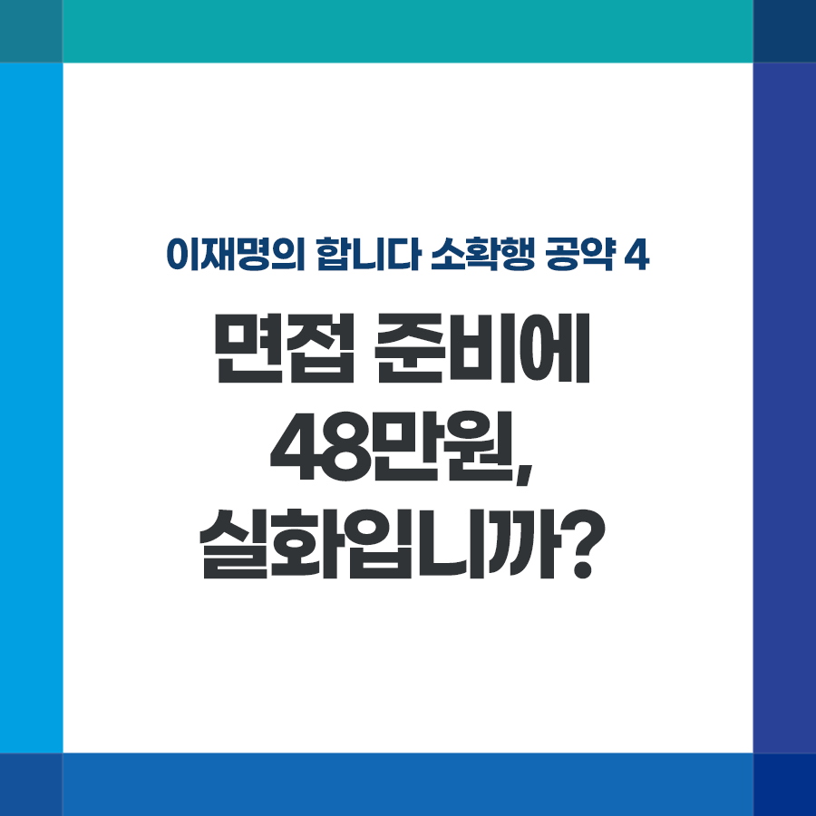

## 소확행 시리즈
# 면접 준비에 48만원, 실화입니까?
> 2021-11-26 17:43:14

이재명의 합니다 소확행 공약 4

면접 준비에 48만원, 실화입니까?

​

​

경찰 면접을 앞둔 여자친구가 메이크업에 35만 원을 쓴다고 해 싸웠다는 글을 봤습니다.

​

한 취업 플랫폼 조사를 보니 취준생이 예상하는 평균 면접 예상 비용이 48만 원에 달한다고 합니다.

​

부모님 부담도 덜어주고, 혼자 끙끙 앓지 않도록 를 도입하겠습니다.

​

첫째, 면접에 필요한 정장 대여, 헤어·메이크업과 사진촬영을 지원하고, 이력서, 자기소개서 컨설팅, 전문가와의 모의면접 코칭 서비스도 제공하겠습니다.

​

기초자치단체 단위에 서비스를 제공할 수 있는 지원센터를 설립하거나, 열린옷장과 같은 공유기업과 연계하여 진행하겠습니다.

​

둘째, 공공부문 면접 수당 지급을 의무화하겠습니다. 공기업, 민간기업 가리지 않고 청년 한 명당 수십 회씩 취업문을 두드립니다. 공공부문부터라도 부담을 덜어야 하지 않겠습니까?

​

경기도 청년면접수당제는 올해 한 회에 2만500명이 54,000건을 신청할 정도로 관심이 높았습니다. 만족도 85%로 검증된 사업입니다.

​

셋째, 면접 수당을 지급하는 중소기업에게는 ‘일자리 우수기업’ 등의 인센티브를 부여해 민간기업의 자발적 참여를 확대해 가겠습니다.

​

취업문을 넓히는 일도 중요하지만 당장의 취업활동에 도움이 될 수 있는 일부터 하겠습니다.