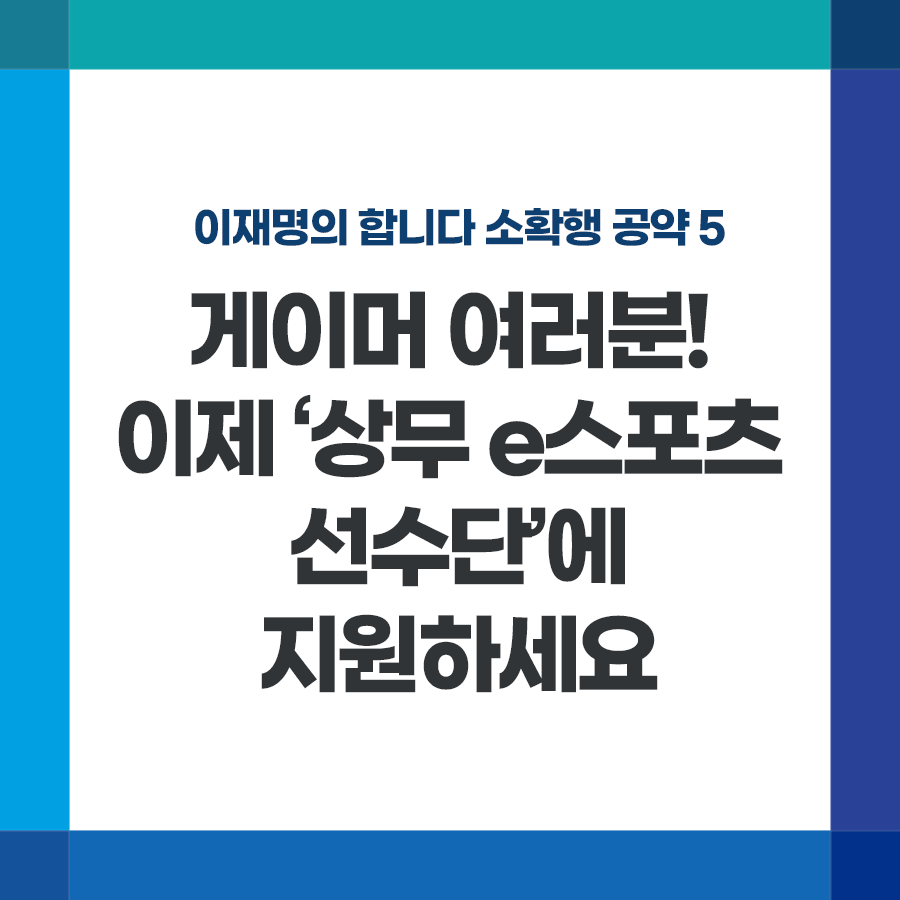

## 소확행 시리즈
# 게이머 여러분! 이제 ‘상무 e스포츠 선수단’에 지원하세요
> 2021-11-26 17:45:03

이재명의 합니다 소확행 공약 5

게이머 여러분! 이제 ‘상무 e스포츠 선수단’에 지원하세요.

​

내년 항저우 아시안게임에 e스포츠가 정식 종목으로 채택되었습니다.

​

우리나라 크래프톤이 만든 '배틀그라운드 모바일' 등 8개 종목과 2개 시범종목에서 열띤 메달 경쟁이 펼쳐집니다.

​

우리나라는 자타가 공인하는 세계 게임강국입니다. 그러나 e스포츠에 대한 지원은 턱없이 부족했습니다.

​

얼마 전 우리당 전용기 의원님의 노력으로 폐지되긴 했지만 셧다운제 등도 게임산업 발전에 악영향을 끼쳤습니다.

​

우선 2022년 아시안게임 e스포츠의 우승을 위해 전폭적인 지원을 약속합니다.

메달이 다는 아니지만 e스포츠가 또 하나의 양궁, 또 하나의 쇼트트랙으로 체육강국 대한민국의 위상을 전 세계에 떨칠 수 있도록 최대한의 지원을 하겠습니다.

​

아울러 지속적인 e스포츠 산업 발전을 위해 임기 내에 국군 체육부대 상무팀에 e스포츠 선수단을 만들도록 하겠습니다.

​

또한 배틀그라운드, 카트라이더 등 우리 게임회사들이 만든 인기 e스포츠 게임의 국제대회 위상 강화를 위해서도 적극 노력하겠습니다.

​

경기도지사 때 e스포츠에 대한 관심으로 전용경기장을 조성키로 하고, 2023년 성남에 준공을 앞두고 있습니다.

​

이미 부산, 대전, 광주, 성남 등 지역에 만들어졌거나 건설 예정인 e스포츠 경기장을 적극 활용하고 대학 e스포츠학과 확대도 추진하겠습니다. 또 경기도에서 시행한 생활 e스포츠 지원과 교육, 상담센터 도입도 적극 추진하겠습니다.

​

강력한 e스포츠 육성으로 미래에 가장 먼저 다가가는 젊은 대한민국을 만들고, e스포츠가 경제 대전환을 이끄는 신산업으로 자리 잡을 수 있도록 최선을 다하겠습니다.