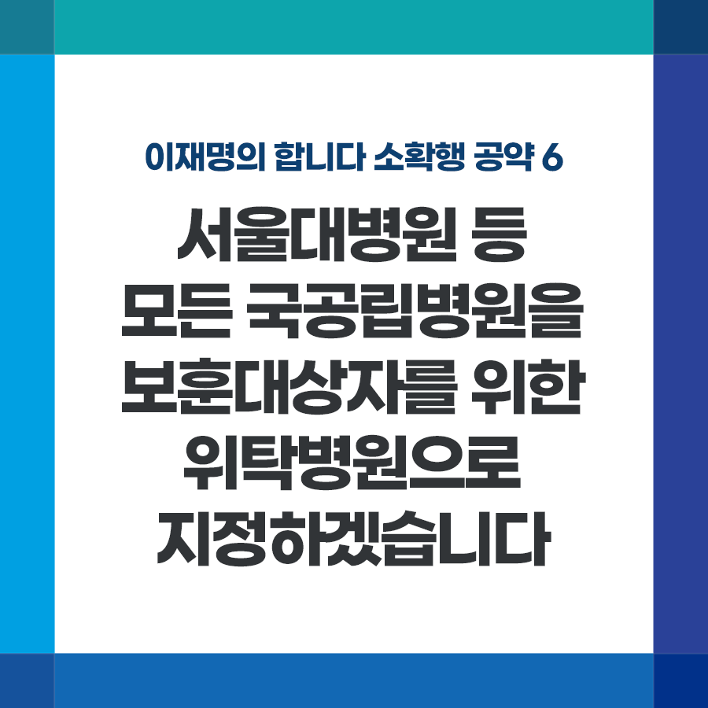

## 소확행 시리즈
# 서울대병원 등 모든 국공립병원을 보훈대상자를 위한 위탁병원으로 지정하겠습니다
> 2021-11-26 17:45:39

이재명의 합니다 소확행 공약 6

서울대병원 등 모든 국공립병원을

보훈대상자를 위한 위탁병원으로 지정하겠습니다

​

오늘은 순국선열의 날입니다. 특별한 희생과 헌신에 존중과 예우가 따르도록 하는 것이 보훈의 기본 정신입니다.

​

애국지사나 국가유공상이자 등 보훈대상자의 의료비 부담을 덜어주고 의료접근성을 높이는 것도 그 중 하나입니다.

​

그러나 현재 전국에서 운영 중인 보훈병원은 서울, 부산 등 6곳에 불과해 의료접근성이 매우 취약합니다.

​

그 외 지역에 거주하는 보훈대상자를 위해 475개 병의원을 위탁병원으로 지정하고 있으나 그 중 국공립병원은 29곳에 불과합니다.

​

170여곳의 국공립병원이 위탁병원으로 지정되지 않아 보훈대상자들이 이용에 불편해 하고 있습니다.

​

서울대병원 등 모든 국공립병원을 위탁병원으로 의무화해 보훈대상자의 의료접근성과 의료비 부담을 덜어드리겠습니다.

​

집 근처에 국공립의 대학병원이나 종합병원이 있음에도 위탁병원이 아니기 때문에 입원진료 지원을 받을 수 없는 일이 벌어지지 않도록 하겠습니다.

​

일제 총칼에도 자주독립을 위해 헌신한 영령과 대한민국을 지키기 위해 희생한 모든 분들에게 감사드립니다.