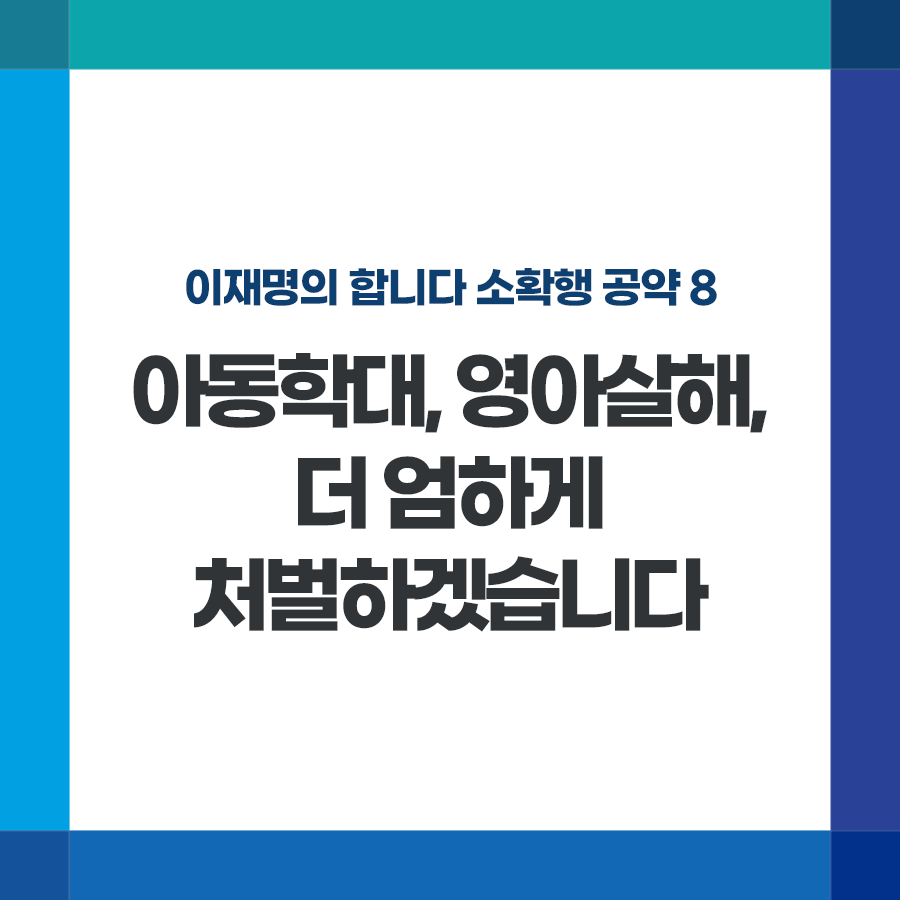

## 소확행 시리즈
# 아동학대, 영아살해, 더 엄하게 처벌하겠습니다
> 2021-11-26 17:46:38

이재명의 합니다 소확행 공약 8

아동학대, 영아살해, 더 엄하게 처벌하겠습니다

​

오늘은 ‘세계 아동학대 예방의 날’입니다. 한 해 4만 건이 넘는 아동학대 신고가 접수되고 있습니다. 신고하지 않는 것까지 포함하면 이보다 훨씬 많을 것으로 추산됩니다.

​

다양한 대책을 마련해야겠지만 우선 법적 처벌을 강화해야 합니다.

​

출산 직후 아이를 창밖으로 내던져 사망케 하고, 아이를 해하고 시신을 훼손하려 한 부모가 이 조항으로 인해 집행유예 등을 받았습니다. 생명을 함부로 훼손하고도 고작 집행유예를 받은 데 국민적 공분이 매우 높았습니다.

​

영아살해죄, 영아유기죄가 보통의 살해, 유기보다 형량이 가볍기 때문에 발생한 일입니다.

​

68년 전 만들어진 이 법은 전쟁 직후 극심한 가난으로 아이를 제대로 부양할 수 없다는 점, 성범죄 등으로 인한 출산 등의 사정을 감안해 일반죄보다 낮은 형량을 적용했습니다.

​

그러나 지금은 가난과 범죄로부터 국민을 지켜주지 못했던 70년 전 대한민국이 아닙니다. 생명권 존중에 대한 국민적 의식도 매우 높아졌습니다.

​

영아살해죄, 영야유기죄를 폐지해 보통 살해, 유기죄와 동일하게 처벌하도록 하겠습니다.

​

또한 잔혹한 아동학대범죄에 대해 공소시효를 배제해 반드시 처벌받도록 하겠습니다. 음주 또는 약물로 인한 심신장애를 들어 형량을 감면하지 못하게 하겠습니다.

​

아이를 키우는 데 대한민국의 온 힘을 써야 하듯, 아이들을 지키는 데도 모든 노력을 다하겠습니다.