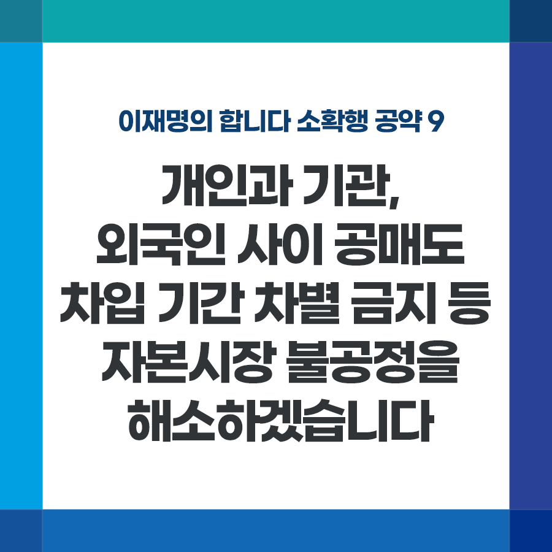

## 소확행 시리즈
# 개인과 기관, 외국인 사이 공매도 차입 기간 차별 금지 등 자본시장 불공정을 해소하겠습니다
> 2021-11-26 17:47:06

이재명의 합니다 소확행 공약 9

​

개인과 기관, 외국인 사이 공매도 차입 기간 차별 금지 등 

자본시장 불공정을 해소하겠습니다.

​

우리 주식시장의 고질적 문제 중 하나가 코리아 디스카운트입니다.

​

한국 주식 시장의 신뢰도를 높여 매력적인 시장으로 만드는 것이 장기적으로 코리아 디스카운트를 극복하는 길입니다. MSCI 선진국 지수 편입이 필요한 이유이기도 합니다.

​

일부에서는 개미투자자들의 투자 여건을 위해 공매도 폐지를 약속하지만 무책임한 주장입니다. 공매도를 폐지할 경우 우리는 MSCI 선진국 지수에 편입될 수 없기 때문입니다.

​

앞서 공매도 제도 개선을 약속드린 바 있습니다. 관련해 기관 외국인과 개인투자자간 공매도 차입 기간 차별을 금지하겠습니다.

​

개인은 90일 안에 상환해야 하나 기관, 외국인은 제한이 없어 수익이 날 때까지 무기한 버티기가 가능합니다. 기관과 개인 간 형평성에 맞게 개선하겠습니다.

​

또한 기업 인수·합병, 물적 분할 과정 등에서 대주주의 탈법과 소액주주에 대한 차별을 시정해, 시장의 신뢰를 높이고, 소액주주의 권리를 강화해야 합니다.

​

대주주의 기업 분할로 인한 경영권 프리미엄 독점, 자사주를 통한 의사결정 왜곡으로 투자자의 불신을 자초하고 있는 상황입니다.

​

아울러 대주주의 탈법을 막기 위해 특사경 대폭 확대 등 금감원의 단속 역량을 강화하고, 적극적인 스튜어드십 코드 활용 등 제도 개선도 필요합니다.

​

건전한 시장 구조를 만들어 개인의 자산 형성 기회를 늘려주는 것도 성장회복의 한 방법입니다. 자본시장 불공정 해소, 반드시 해내겠습니다.