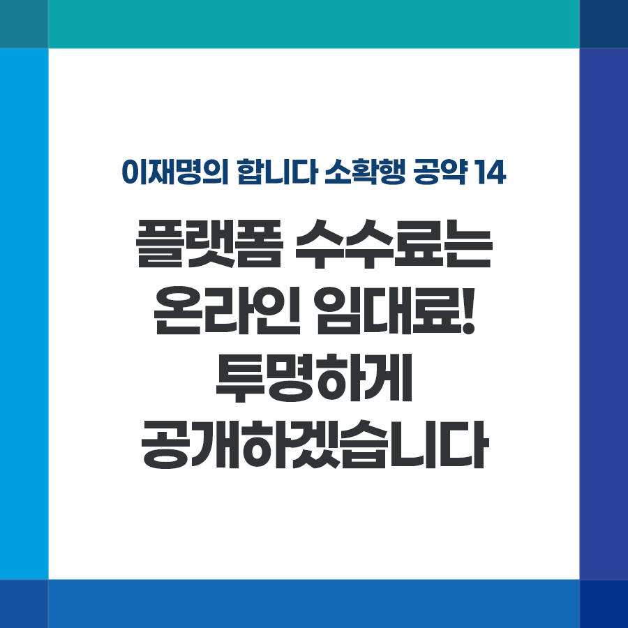

## 소확행 시리즈
# 플랫폼 수수료는 온라인 임대료! 투명하게 공개하겠습니다.	
> 2021-11-28 14:21:11

이재명의 합니다 소확행 공약 14

​

코로나 이후 네카라쿠배(네이버, 카카오, 라인, 쿠팡, 배달의민족)로 대표되는 온라인 플랫폼 성장속도가 더욱 가팔라졌습니다.

​

문제는 투명성과 공정성이 따라가지 못하고 있다는 것입니다.

​

대표적인 것이 수수료입니다. 판매수수료, 주문관리수수료, 간편결제수수료, 심지어 광고비까지... 온라인 플랫폼이 부과하는 각종 수수료는 종류도 많은데 수수료율을 제대로 공개하지도 않습니다.

​

신용카드사가 법에 따라 가맹수수료를 공개하고 3년마다 적정성 여부를 점검하여 조정하고 있는 것과 비교해 형평성에도 맞지 않습니다.

​

소상공인이 온라인 플랫폼에 종속되지 않으면서 공정하게 거래할 수 있도록 거래 비용을 투명하게 공개해야 합니다.

​

첫째, 일정 규모 이상의 온라인 플랫폼이 부과하는 모든 수수료를 투명하게 공개하도록 하겠습니다.

​

공개대상은 현재 논의 중인 '온라인 플랫폼 공정화법' 적용 대상 플랫폼이 될 것입니다.

​

둘째, 카드수수료처럼 정부가 주기적으로 수수료의 적정성 여부를 점검하겠습니다.

​

온라인 플랫폼과 이용업체 간 대등한 협상에도 유용하게 활용되도록 하겠습니다.

​

일정 규모 이상의 온라인 플랫폼에 적용함으로써 혁신은 해치지 않고 소상공인의 부담은 줄이도록 하겠습니다.