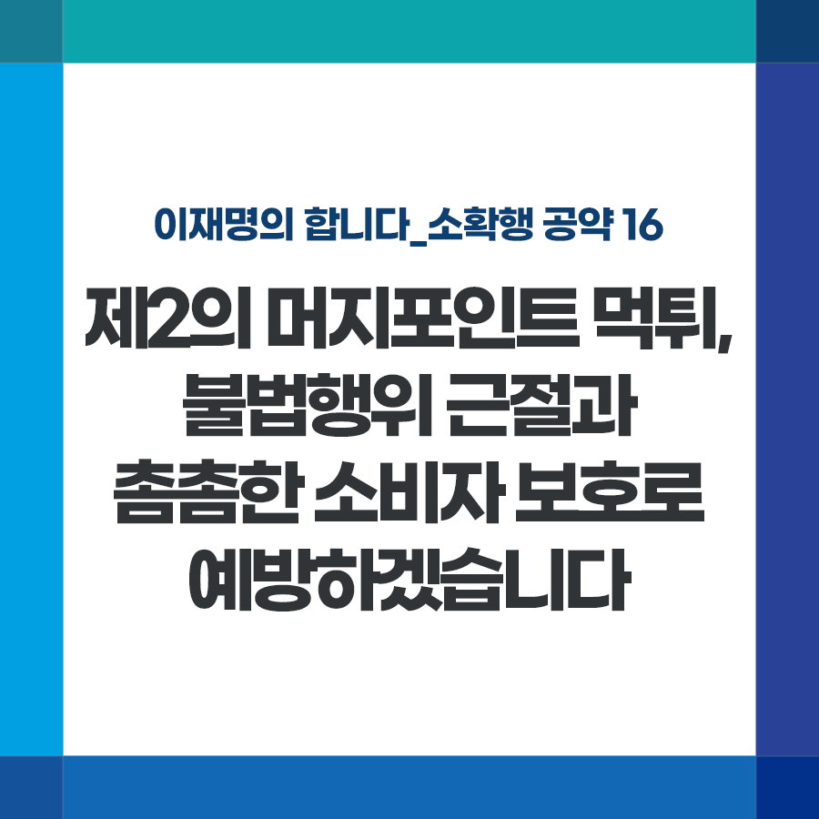

## 소확행 시리즈
# 제2의 머지포인트 먹튀, 불법행위 근절과 촘촘한 소비자 보호로 예방하겠습니다
> 2021-12-01 10:40:13

이재명의 합니다_소확행 공약 16

머지포인트 사태를 기억하십니까? 선불충전 후 제휴 가맹점 사용 시 20% 파격 할인 혜택을 제공한다는 광고에 순식간에 100만 명의 가입자가 모였습니다.

​

그러나 해당 기업이 돌연 서비스를 중단하면서 수많은 가입자가 서비스 이용은커녕 환불도 제대로 못 받아 막대한 피해를 입었습니다. 해당 기업은 순차적으로 환불하겠다는 입장 외에 구체적인 대책도 제시하지 않으면서 피해자들의 희망고문만 계속되고 있습니다.

​

해당 사업자가 미등록 상태로 영업한 것이 가장 큰 문제입니다. 그러나 설령 등록을 했더라도 현행법에 선불충전금이나 이용자 예탁금 보호 장치가 없어 피해를 막기는 역부족이었을 것입니다. 근본적 제도 개선 없인 제2의 머지사태는 불 보듯 뻔합니다.

​

전자상거래 활성화로 선불충전금 이용실적도 급증하고 있습니다. 연간 실적은 2019년 기준 62.5조 원으로 5년 만에 10배 이상 늘었고 예탁잔액도 두 배 가까이 증가하였습니다.

​

핀테크와 온라인 플랫폼의 급격한 성장 뒤에 가려진 불법행위 엄정 대응하고 강력한 금융소비자 보호, 피해 시 재발 방지를 위한 제도 정비에 나서겠습니다.

​

첫째, 머지포인트와 같은 미등록 업체의 형사처벌을 강화하여 등록을 확대하고, 이용자 예탁금을 별도 관리해 파산 시 이용자에게 우선 지급하도록 하겠습니다. 관계 법령개정을 신속하게 추진하겠습니다.

​

둘째, 갈수록 지능화되고 다양해지는 디지털 금융 범죄에 대한 범부처 차원의 모니터링시스템을 상시화할 수 있도록 하겠습니다.

​

불법행위 근절과 촘촘한 소비자 보호, 신뢰 속에 신산업이 성장할 수 있는 해법입니다.