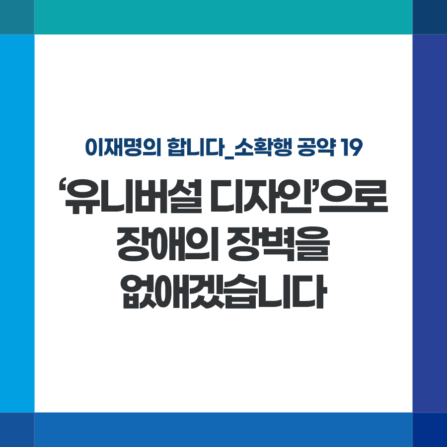

## 소확행 시리즈
# ‘유니버설 디자인’으로 장애의 장벽을 없애겠습니다
> 2021-12-03 17:58:19

이재명의 합니다_소확행 공약 19

오늘은 UN이 지정한 ‘국제 장애인의 날’입니다. 모든 장애인 분들도 맘껏 행복한 하루가 되시면 좋겠습니다.

​

살면서 소소하지만 행복한 고민, ‘오늘 뭘 먹을까?’

​

보통 비장애인이 메뉴, 가격, 분위기를 고민할 때, 장애인 분들은 가게 문턱을 어떻게 넘을지부터 고민해야 합니다.

​

비단 이런 걱정을 장애인만 하는 것은 아닙니다.

​

몸이 불편한 어르신, 혼자 걷기 힘든 아이들, 유아차를 끄는 부모님들도 작은 계단, 높은 손잡이, 비좁은 화장실에 불편할 수 있습니다.

​

이제는 장애 유무뿐 아니라 연령, 성별, 언어로 인한 불편 없이 모두가 안전하고 편리하도록 생활환경을 만들고 바꾸는 ‘유니버설 디자인’이 필요합니다.

​

일부 지방자치단체가 조례로 공원, 도서관 등에 '유니버설 디자인'을 적용하고 있습니다. 다만 지자체마다 적용 기준이 달라 효과가 높지 않습니다.

​

첫째, ‘유니버설 디자인’을 법제화하겠습니다. 교통, 건축, 도시, 제품, 환경 등에 종합적이고 체계적으로 적용되게 하겠습니다.

​

공공부문부터 먼저 시행하고 점차 민간영역으로 확대해나가겠습니다.

​

둘째, 기업의 보다 많은 참여를 이끌어내기 위해 유니버설 디자인 인증제를 시행하겠습니다.

​

국제 장애인의 날을 맞아 누구나, 어느 곳에서도 안전하고 편리하게 일상을 누릴 수 있는 세상, 꼭 만들겠습니다.