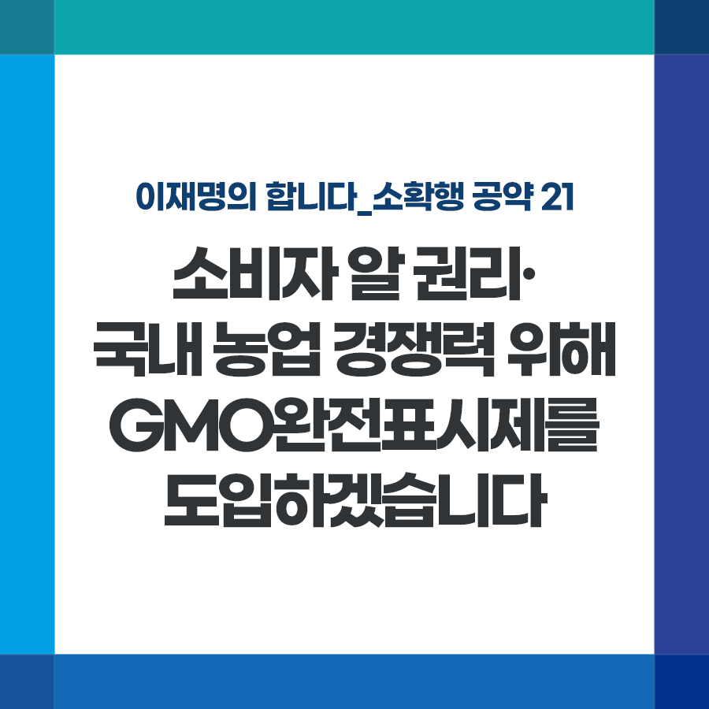

## 소확행 시리즈
# 소비자 알 권리·국내 농업 경쟁력 위해 GMO완전표시제를 도입하겠습니다.

> 2021-12-06 16:48:46

이재명의 합니다_소확행 공약 21

우리나라는 세계 최상위권의 유전자변형(GMO) 농산물 수입국입니다. 2020년 한 해 동안 수입한 옥수수의 92.6%, 콩의 79%가 GMO 농산물입니다.

​

이미 상당량의 유전자변형 식품이 취급되고 있지만 국민 대다수는 자신이 먹는 음식에 유전자변형 원료가 포함돼 있는지 알기 어렵습니다.

현행 표시제는 가공과정에서 유전자변형 DNA가 파괴되었을 경우는 표시를 하지 않아도 되고, 남아있는 식품에만 표시를 의무화하고 있기 때문입니다.

​

GMO완전표시제를 도입하겠습니다.

​

가공과정에서 유전자변형 DNA가 파괴되었더라도 유전자변형 원료를 사용한 경우에는 표시를 의무화하겠습니다.

​

우선 국민 소비가 많은 식용유와 당류, 장류 식품부터 유전자변형 표시제를 의무화하여 소비자인 국민의 알 권리와 선택권을 강화하겠습니다.

​

유럽연합(EU)은 유전자변형 원료를 사용한 모든 식품에 대해 유전자변형(GMO) 완전표시제를 시행하고 있습니다.

​

경기도지사 시절, 전국 최초로 유전자변형 원료를 사용하지 않고 제조, 가공한 식품에 대해 비유전자변형(non-GMO) 식품 표시 조례를 제정해 인증 및 관리사업을 시행한 바 있습니다. 친환경 학교 급식 등에 유용하게 활용되고 있습니다.

​

GMO완전표시제도 시행으로 소비자 선택권을 보장하고 국내 농업의 경쟁력도 강화하겠습니다.