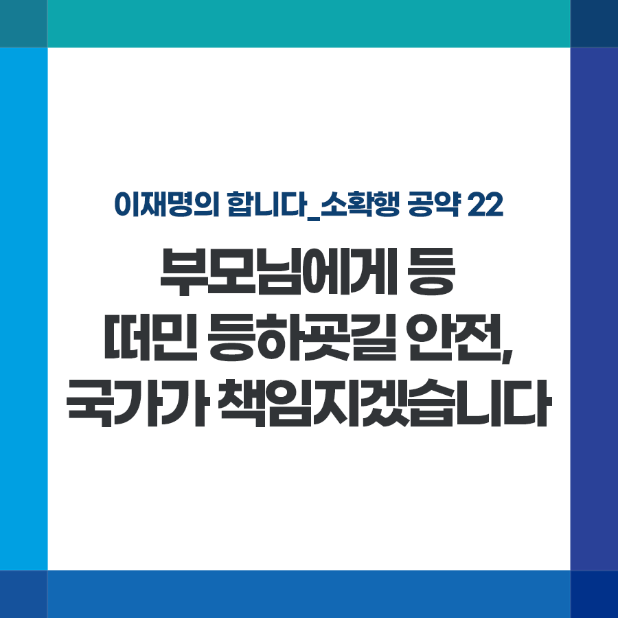

## 소확행 시리즈
# 부모님에게 등 떠민 등하굣길 안전, 국가가 책임지겠습니다
> 2021-12-07 10:03:37

이재명의 합니다_소확행 공약 22

‘히어로를 모십니다. ㅜㅜ’

학부모가 중고거래 앱에 어린이 등하굣길 교통봉사 알바를 구하며 올린 글입니다.

​

말이 봉사지 사실상 강제 할당이다 보니 사정이 있는 부모들은 이런 ‘웃픈’ 알바까지 구해야 합니다.

​

등하굣길 봉사활동은 갈수록 학부모들의 스트레스이자 단골 민원입니다.

​

맞벌이 가구 증가, 육아와 직장의 병행 등 변화된 가족상, 시대상을 반영하지 못하고 있습니다.

​

학부모의 무임 노동에 기댄 말뿐인 봉사활동을 없애고 어린이 안전은 당연히 국가가 책임지겠습니다.

​

첫째, 사회적 일자리를 활용하여 등하굣길 교통안전을 대폭 강화하겠습니다. 낮은 처우를 개선하고, 안전교육을 강화해 안전 사고 대응 능력도 더 키우겠습니다.

​

둘째, 신설학교는 설계 단계부터 안전이 보장된 통학로 설치를 의무화하겠습니다.

​

그동안 아이들의 안전을 위해 묵묵히 교통 봉사를 해주신 학부모님들의 노고에 감사드립니다. 등하굣길 안전, 이제 나라가 책임지겠습니다.