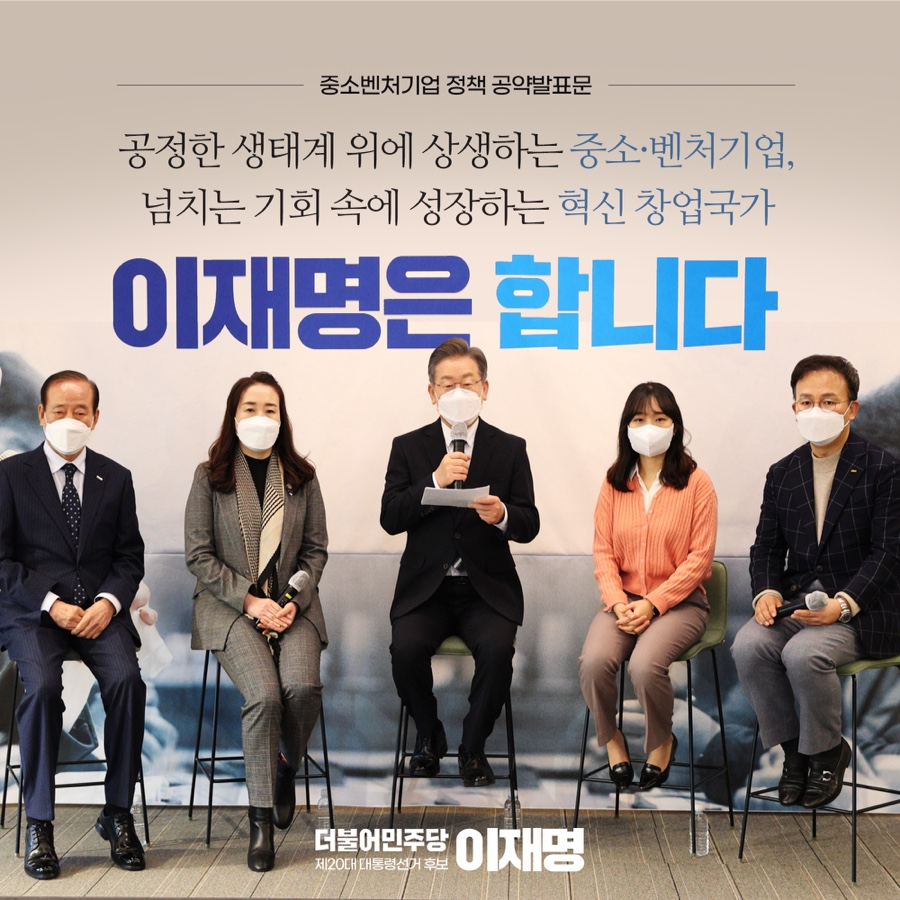
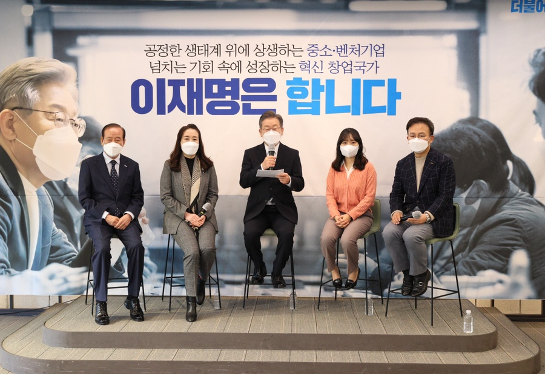
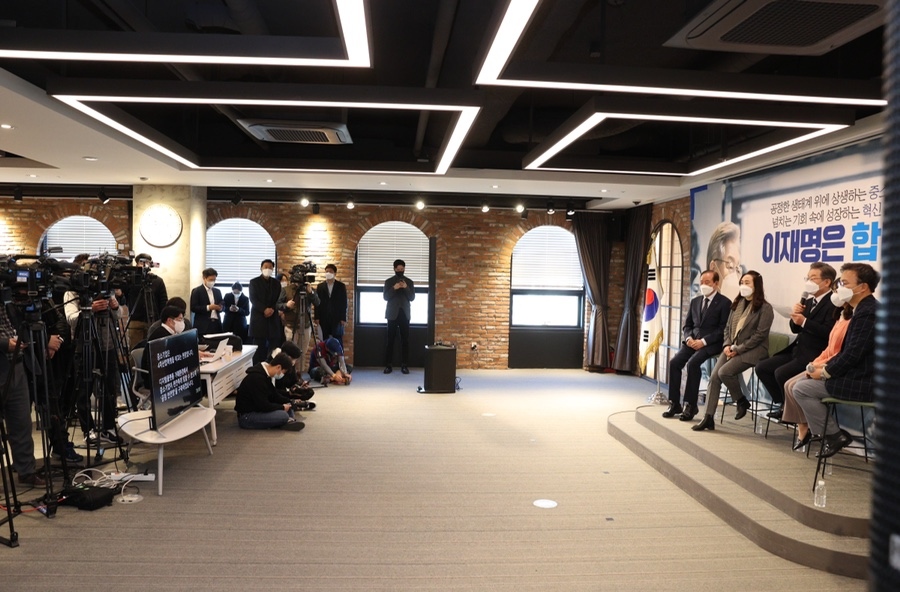
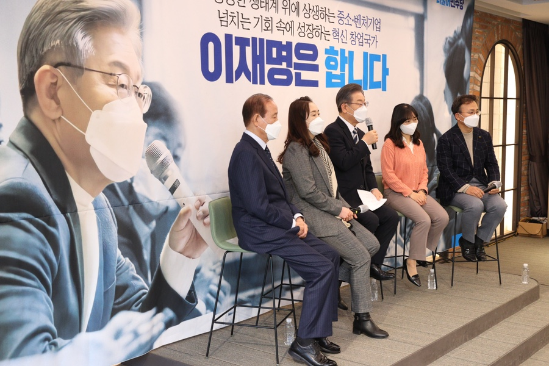
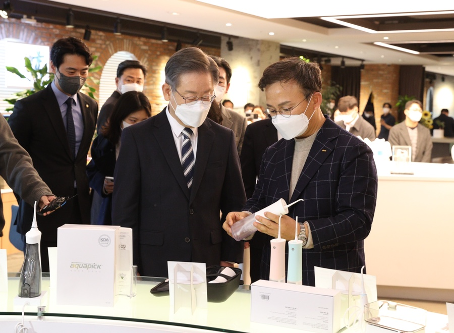
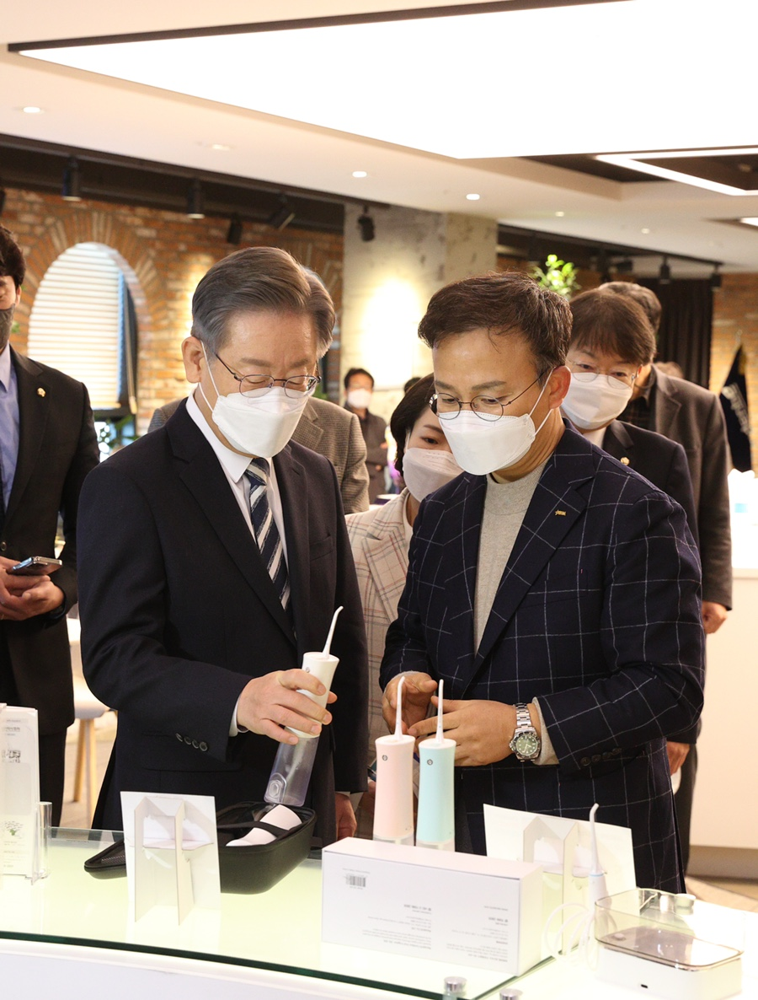
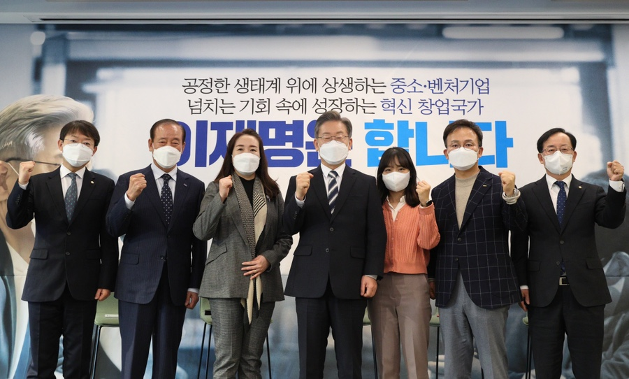
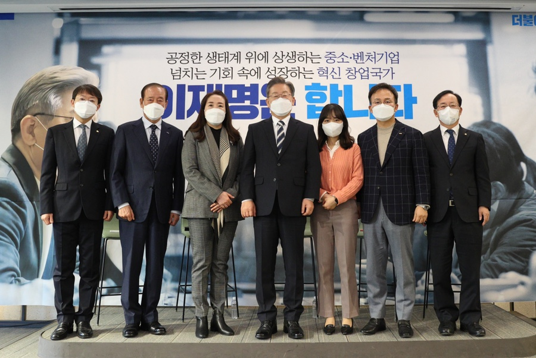

## 대표공약
# 공정한 생태계 위에 상생하는 중소·벤처기업, 넘치는 기회 속에 성장하는 혁신 창업국가 이재명은 합니다!

> 2021-12-08 13:40:27

대한민국은 선진국에 진입했습니다. 올해 OECD는 우리나라에 선진국 지위를 부여했습니다. 대한민국은 더 부강하고, 더 풍요로운 나라로 도약해야 합니다.

​

청년의 희망찬 꿈이 실현되는 나라, 장년의 오늘이 안정적인 나라, 노년의 삶이 평안한 나라를 만들어야 합니다.

​

지금 우리는 더 나은 대한민국으로 나아가느냐 아니면 수구세력의 케케묵은 갈등과 반목에 발목을 잡혀 발전의 정체 속에서 허우적거리느냐 중차대한 기로에 서 있습니다.

​

부강한 대한민국은 국민이 부강한 나라입니다. 풍요로운 대한민국은 국민이 다 함께 누리는 나라입니다.

​

일부 기득권과 특권층만 잘 먹고 잘사는 나라를 부강한 나라, 풍요로운 나라라고 말할 수 없습니다.

​

국민이 부강하고, 국민이 풍요로워지기 위한 조건, 첫째도, 둘째도, 셋째도 공정입니다.

창의와 혁신이 자유롭게 발휘되는 시장 질서는 공정성의 토대에서 시작됩니다.

​

우리 사회의 불공평한 격차를 해소하고 공평한 바탕에서 공정하게 경쟁해야 합니다. 그리고 그 틀을 만들고 조정하는 일이 국가의 책무입니다.

​

저는 우리 산업 생태계를 공평하다고 말하지 못하겠습니다. 극소수 대기업과 소수의 중소기업을 제외한 대다수 중소기업은 경영난에 어려움을 겪고 있습니다. 대기업에는 돈과 사람이 몰리는데 중소기업은 자금난으로 시달리며 임금 격차로 구인난에 허덕이고 있습니다.

​

기업 간 불공정거래, 약탈적 하도급 거래, 관행화된 갑질과 내부거래, 강자의 시장 독과점 등 불합리한 시장 질서가 만들어 낸 뼈 아픈 현실입니다.

​

우리나라 중소기업은 전체기업의 99%입니다. 고용만 83%를 차지하고, 지난 5년 창출한 일자리도 140만개입니다.

​

중소기업이 살아나면 대한민국 기업과 일자리가 살아납니다. 중소기업을 살리기 위해서 가장 필요한 것은 성장의 회복과 기회의 총량을 늘리는 일입니다. 수많은 국제기구와 경제 전문가들은 공정한 분배가 불평등을 해소하고 지속가능한 성장의 길이라고 강조하고 있습니다.

​

이제 우리는 대한민국의 모든 불평등과 격차와 맞서야 합니다. 대기업과 중소기업, 자본과 노동 간의 불균형은 공정한 경쟁과 협력의 바탕 위에서만 해소할 수 있습니다.

​

저는 단언합니다. 공정하지 않은 경제구조에서는 창의와 혁신, 그리고 성장도 없습니다.

​

지금 우리는 기후위기 에너지전환, 기술혁명 디지털전환, 코로나 팬데믹 전환의 3대 대전환에 직면해 있습니다.

​

대전환의 파고 속에서도 중소기업이 견딜 수 있는튼튼한 돛과 닻을 만들어야 합니다.

​

이재명 정부, 중소기업·벤처인 여러분과 함께 3대 대전환의 격랑을 헤쳐 나가겠습니다.

​

대공황 시기의 루즈벨트처럼, 미국 바이든 정부처럼 강력하고 대대적인 투자를 단행하겠습니다. 망설이지 않는 결단과 행동하는 실천으로 대전환의 위기를 새로운 성장의 기회로 만들겠습니다.

​

이재명 정부, ‘전환적 공정성장’을 반드시 성공시키겠습니다. 우리 경제를 재도약시키고 중소·벤처기업이 잘 나가는 나라, 노동자도 남부럽지 않은 세상을 만들겠습니다.

​

이재명 정부의 중소·벤처기업 7대 정책공약을 말씀드리겠습니다.

첫째, 대·중소기업 간 힘의 균형을 회복시키고 ‘상생의 가치’를 실현하겠습니다.



먼저 ‘자발적 상생협력 생태계’를 조성하겠습니다. 우수 참여기업에게는 규제특례 등 두둑한 우대제도를 마련할 것입니다. 이를 위해 상생기반의 기업가정신 혁신 프로그램을 확대하겠습니다.

​

하도급·위수탁 거래의 협상력 강화를 위한 중소기업 협동조합의 공동사업행위 허용범위를 확대하겠습니다. 그 실현 방안으로 「중소기업협동조합법」개정안이 국회에서 조속히 통과되도록 챙기겠습니다.

​

이재명 정부의 국정과제에 ‘중소기업 제품 제값 받기’를 못 박아 두겠습니다. ‘납품단가 연동제’를 조속히 실시하여 공급원가 변동의 부담을 하도급에 떠넘기지 못하게 하겠습니다. 대금 지급이 제때 이루어지도록 더 강력하게 관리하겠습니다. 대·중소기업 간 정례회의체를 구성하여 지속적인 소통을 돕겠습니다.

​

하도급 갑질·기술 탈취 등, 불공정거래와 불법행위는 뿌리를 뽑아야 합니다. 감독·분쟁조정·손해배상에 대한 법과 제도의 실행력을 획기적으로 강화하겠습니다. 지방정부에 불공정거래 조사권·조정권을 부여하고, 징벌적 손해배상 범위를 확대하겠습니다.

​

기술 탈취는 상생 생태계를 파괴하는 범죄입니다. 범죄는 마땅히 죄를 물어야 합니다. 기술 탈취로 인한 피해구제 소송기간을 단축하고 일벌백계하겠습니다.

​

이와 함께 기술 탈취 방지시스템과 제도를 재정립하겠습니다. 여러 부처에 산재한 기술분쟁 조정관리 제도를 일원화하고 기술 침해사건 조사관의 조사 권한을 확대하겠습니다.

​

중소기업은 4차산업혁명을 이끄는 현장입니다. 디지털플랫폼 거래환경에서 중소기업이 편안하게 일할 수 있도록 ‘공정 안전망’을 구축하겠습니다. 일정 규모 이상의 온라인 플랫폼이 부과하는 모든 수수료를 투명하게 공개하겠습니다. 플랫폼 사업자의 지배력 남용, 알고리즘을 이용한 부당행위로 피해받는 입점 중소기업과 소상공인이 없도록 제도의 공백을 메꾸고 허술한 제도는 보강하겠습니다.

둘째, 기업인이 존경받고 노동자가 행복한 ‘명품 중소기업 나라’를 만들겠습니다.

기업가가 존경받는 사회에서 존경받는 기업이 탄생합니다. 기업인이 존경받는 문화를 조성하여 기업승계 등 세대를 뛰어넘는 기업의 영속성 확보방안을 강구하겠습니다.

​

중소기업이 중견기업, 대기업으로 성장할 수 있는 기업 성장 사다리를 튼튼하게 만들겠습니다. 이를 위해 금융·조세·규제제도를 개선하고 기술 개발, 인력 수급, 판로 확대를 위한 특화된 중소·중견기업 지원정책을 마련하겠습니다.

​

결국 사람이 힘입니다. 중소기업 청년재직자 내일채움공제 사업은 더욱 활성화하겠습니다. 부동산 특별청약 지원 확대 등 중소기업 종사자의 복지 수준을 향상하겠습니다. 중소기업 특성화고를 늘리고 계약학과를 통해 중소기업 진출, 청년 인력의 미래역량 교육프로그램을 확대 강화하겠습니다. 특히, AI·반도체설계·SW 등 첨단기술 분야의 중소기업 인력양성을 적극 추진하겠습니다.

셋째, ‘중소기업이 강한 경제구조’를 만들어 글로벌 경쟁력을 갖추도록 하겠습니다.

중소기업 전 분야에 환경친화, 사회책임, 경영혁신 등 ESG 맞춤형 지원을 확대하겠습니다. 기존 스마트공장에 탄소제로와 안전 등이 결합된 스마트공장 2.0을 추진하겠습니다.

​

국가 핵심 제조뿌리산업의 스마트화를 지원해 시장 경쟁력을 강화하겠습니다. 제조기업의 인력난을 해소하고 전기요금 부담을 완화하겠습니다. 전통기업과 신산업 간의 공존을 위한 사회적 대타협을 추진하겠습니다.

​

우리 중소기업이 압도적인 IT 기술력을 바탕으로 세계 속 비즈니스 역량을 강화하고 지구촌 구석구석 한류의 가치가 비즈니스로 뻗어나가도록 지원하겠습니다.

​

K-팝·K-푸드·K-콘텐츠 등 K-브랜드를 적극 활용해 중소기업의 수출 경쟁력 확보를 돕겠습니다. 수출 물류비 지원을 확대하고 공항·항만 등 거점별 중소기업 물류센터를 구축하겠습니다. 신기술 상품의 수출을 돕기 위한 실적확보 및 판로지원을 위한 국내 공공구매를 확대하고 최저가 낙찰 관행을 개선하겠습니다.

넷째, 중소기업의 ‘성공적 디지털 전환’을 지원하겠습니다.

중소기업의 디지털 기술 역량 강화를 적극 지원해 4차 산업혁명 시대의 디지털 대전환에 선제적으로 대응하겠습니다.

​

디지털 전환 중소기업을 위해 데이터 수집·분석 인프라와 업종별·지역별 클라우드를 구축해 그 활용방안을 지원하겠습니다. 공공기관이 보유한 플랫폼 및 IT솔루션의 개방을 추진하겠습니다.

​

아울러 연구·생산·OEM을 포괄하는 스마트 공급망을 구축하겠습니다. 지역별 중소기업 R&D 실증센터를 구축하고 공공기관 실증공간 개방을 추진하겠습니다. 대-중소기업 간 기술교류와 상생협력을 위한 한국형 기술혁신 상생 스테이션 프로그램을 추진하겠습니다.

​

반도체·바이오·미래차·AI 등 미래산업 육성을 위해 지역 테크노파크 중심의 산업·기업 인프라와 연계한 K-혁신밸리를 조성하겠습니다.

​

전통 중소기업의 디지털전환, 에너지전환을 돕기 위해 중소기업 전용 R&D를 확대하고, 투자형 R&D 펀드 1조 원을 조성하겠습니다.

다섯째, 과감한 벤처투자로 ‘혁신 창업국가’를 건설하겠습니다.

정부의 벤처투자 예산 규모를 2027년까지 10조 원으로 대폭 확대하고, 전 국민을 대상으로 공모형 벤처투자 펀드를 도입하겠습니다. 선배 스타트업과 정부가 함께 투자하는 창업연대기금 1조 원을 조성하겠습니다.

​

혁신적 초연결이 가능한 클라우드·기술 플랫폼을 구축하고 데카콘 기업 육성을 위한 대규모 메가 테크펀드인 K-비전펀드를 조성하겠습니다.

​

이를 통해 신기술·신산업 분야의 기술창업기업 연 30만개 시대를 열겠습니다.

여섯째, 견고한 벤처기업 성장 사다리를 만들어 ‘글로벌 Top3’ 벤처 대한민국으로 발돋움하겠습니다.

각종 벤처 지원의 효율성과 연계성이 높아지도록 창업 지원시스템을 강화하겠습니다. 창업기업의 부담을 완화하는 세제 개선을 추진하겠습니다. 벤처기업의 규모화와 경쟁력 강화를 위해 M&A 관련 세제와 보증 혜택 확대 등으로 M&A 활성화를 최대한 지원하겠습니다. 지식재산권 소득에 대한 세제 지원 등 K-특허박스를 도입하겠습니다.

​

규제샌드박스와 규제자유특구를 더욱 활성화하고, 중소기업 옴부즈만 제도를 지역별로 확대하여 벤처기업의 자유로운 경제활동을 촉진하겠습니다.

​

이를 통해 한국의 유니콘 기업 100개 시대를 열고 ‘글로벌 Top3’ 벤처 대한민국으로 나아가겠습니다.

일곱째, 실패도 자산이 되는 ‘재도전 가능 국가’를 만들겠습니다.

실패도 자산입니다. 성실한 실패를 경험한 창업자의 경험을 자산화하고, 재기의 기회를 제공하겠습니다.

​

재기지원펀드·상생협력기금 등을 늘려 재창업을 적극 지원하겠습니다. 재도전 창업자의 사업계획을 심사하여 신용불량자 등록을 유예하고 채무를 조정, 경감하는 제도를 도입하겠습니다.

​

실패의 교훈을 반면교사로 하는 실패 사례 연구 플랫폼을 구축하여 재도전 교육·멘토링·투자유치를 돕고, 재도전지원센터의 기능을 확대하겠습니다.

존경하는 국민 여러분!

중소·벤처기업인과 종사자 여러분!

​

그동안 대한민국의 경제는 대기업 중심의 성장정책으로 발전해왔습니다. 이로 인해 경제 대국의 외형은 갖추었지만 내부적으로 극심한 양극화, 최저 출생률, 높은 자살률 등 사회적 불평등과 구조적 격차를 만들었습니다. 우린 지금 그 성장의 한계에 직면해 있습니다.

​

대기업과 중소기업, 자본과 노동이 상생·협력하는 공정한 성장이 저성장의 늪에서 벗어날 해법입니다. 국가 경제의 허리인 중소기업이 살아나고 튼튼해지면 고용이 늘고 일자리의 질이 좋아집니다. 국가 경제의 실핏줄인 골목상권과 전통시장에 훈기가 돌 것입니다.

​

대한민국은 할 수 있습니다. 우리도 독일처럼 ‘중소기업이 강한 경제구조’로 혁신해야 합니다.

​

이재명 정부, 공정한 산업 생태계 구축과 중소·벤처기업에 대한 과감한 투자로, 국민이 함께 성장하는 대한민국 경제로 재도약하겠습니다.

​

저 이재명은 반드시 ‘경제 대통령, 민생 대통령’이 되겠습니다. 국민의 지갑을 두툼하게 채우고 선진국가를 넘어 국민이 부강한 경제 다 함께 풍요로움을 누리는 경제로 성장시키겠습니다. 이재명이 가진 모든 역량을 쏟아 붓겠습니다.

​

공정한 생태계 위에 상생하는 중소·벤처기업, 넘치는 기회 속에 성장하는 혁신 창업국가 이재명은 합니다!

​

감사합니다.

2021년 12월 8일

​

더불어민주당 제20대 대통령 후보 이재명