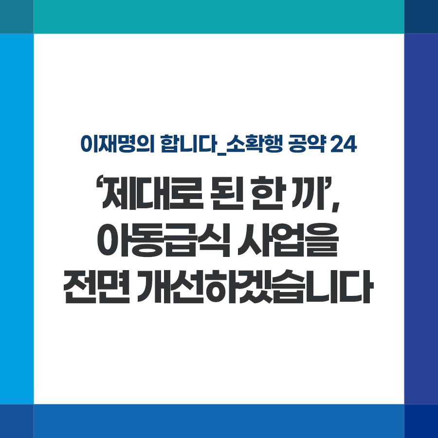

## 소확행 시리즈
# ‘제대로 된 한 끼’, 아동급식 사업을 전면 개선하겠습니다
> 2021-12-12 11:01:56

이재명의 합니다_소확행 공약 24

코로나19로 학교 등교일이 줄면서 학교 못가면 굶을 걱정을 하는 취약계층 아이들이 늘고 있습니다.

​

아동급식 지원 사업을 통해 급식카드를 제공하지만 일부 지자체는 사용처를 일반음식점·편의점 등으로 제한해 아이들이 편의점 삼각김밥, 컵라면 등으로 끼니를 때우는 경우도 있습니다.

​

또한 지자체마다 급식 단가가 천차만별이고 심지어 전국 지자체중 68%는 권장단가인 6,000원도 지급하지 못하고 있습니다. 또한 아동급식카드를 별도 제작하는 바람에 결과적으로 저소득층 낙인을 찍기도 합니다.

​

경기도는 작년 8월부터 ‘모든 음식점에서 당당하게 식사하고 결제’할 수 있도록 아동급식카드 시스템을 전면 개선한 바 있습니다.

​

앞으로 모든 아이들이 밥은 제대로 먹고 다니도록 경기도처럼 개선하겠습니다.

​

첫째, 아동급식카드 사용처를 확대하겠습니다. 일반식당뿐만 아니라 대형마트 푸드코트, 반찬가게, 정육점 부식 구입도 할 수 있도록 하겠습니다.

​

둘째, 아이들이 눈치 보지 않게 급식카드 디자인을 일반체크카드와 통일하고 IC카드 결제방식을 도입하겠습니다.

​

셋째, 아동급식 지원 단가를 인상하겠습니다. 최저기준 이상의 단가를 책정해 사는 곳에 따라 식사의 질이 차이 나는 일은 없도록 하겠습니다. 국가가 비용도 지원하겠습니다.

​

먹는 것만큼은 차별해선 안 됩니다. 특히 자라나는 아이들에게는 더욱 그러해야 합니다. ‘제대로 된 한 끼’ 먹는 당연한 권리를 반드시 보장하겠습니다.