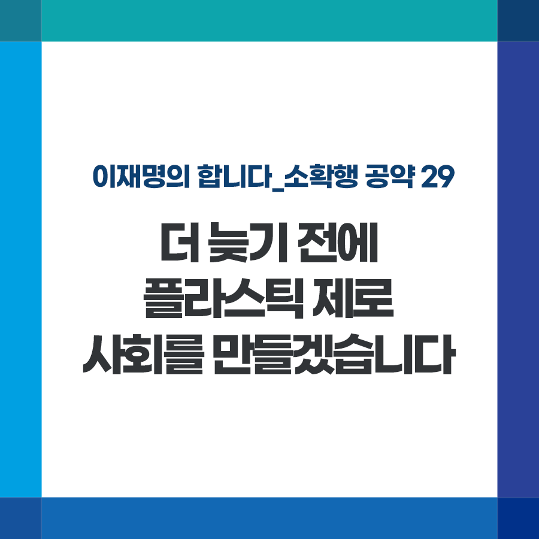

## 소확행 시리즈
# 더 늦기 전에 플라스틱 제로 사회를 만들겠습니다
> 2021-12-19 16:08:55

이재명의 합니다_소확행 공약 29

제주도 참고래가 폐그물에 걸려 죽은 채 발견되고 브라질 마젤란 펭귄 뱃속에서는 방진 마스크가 나왔습니다.

​

코로나 팬데믹으로 비대면 생활 방식이 자리 잡으면서 플라스틱 쓰레기도 급증하고 있습니다. 점점 지구를 삼킬 듯 늘어나는 탓에 생태계 파괴를 가속화하고 있습니다.

​

분리수거만으로는 늘어나는 속도를 따라잡을 수 없습니다. 생산, 사용, 재사용‧재활용 정책의 전면적인 변화가 필요합니다.

​

첫째, 일회용품 사용은 최대한 줄이고, 다회용기 보급과 재활용이 쉬운 유리, 금속으로 전환시키겠습니다.

​

경기도지사 시절 시행한 공공배달 앱 ‘배달특급’을 통해 다회용 배달‧포장용기 시범사업을 진행하고 있습니다. 다회용기 1년 사용만으로 탄소배출량을 일회용기의 35분의 1 수준으로 줄일 수 있습니다.

​

둘째, 현재 배출량 대비 절반도 안 되는 폐플라스틱 재활용율을 높이기 위해 공공선별장을 확충하고 기존 시설을 현대화하겠습니다.

​

셋째, 일회용품과 포장재의 재질을 단일화해서 분리수거와 재활용이 쉽게 하겠습니다. 무(無)라벨 제품 생산에 대한 지원도 대폭 늘리겠습니다.

​

넷째, 착한자판기(PET·캔 무인회수기) 보급을 늘려 재활용품 수거율을 높이겠습니다. 포인트나 재구매 할인 등 혜택을 제공해 시민의 동참을 끌어내겠습니다.

​

우리 국민은 세계 최고 수준의 분리수거를 실천해왔습니다. 국민과 함께 플라스틱 제로 대한민국을 향해 가겠습니다.