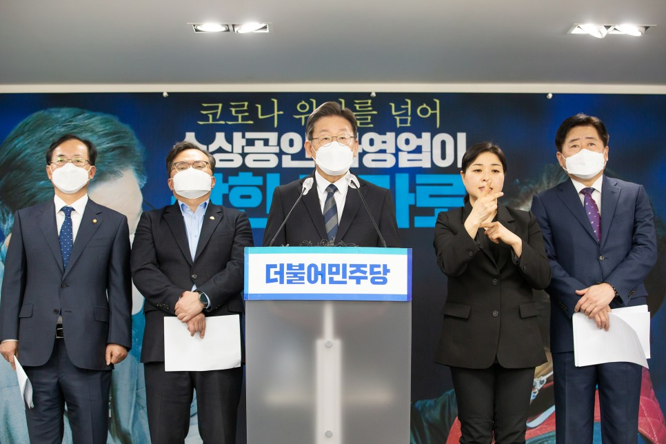
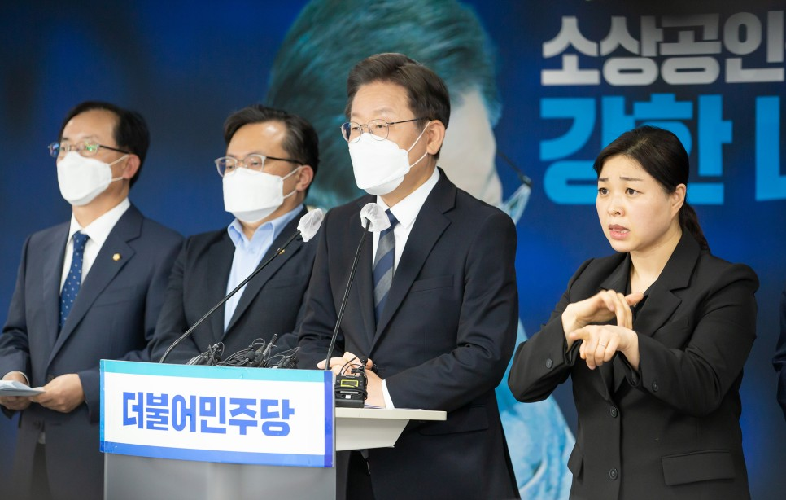
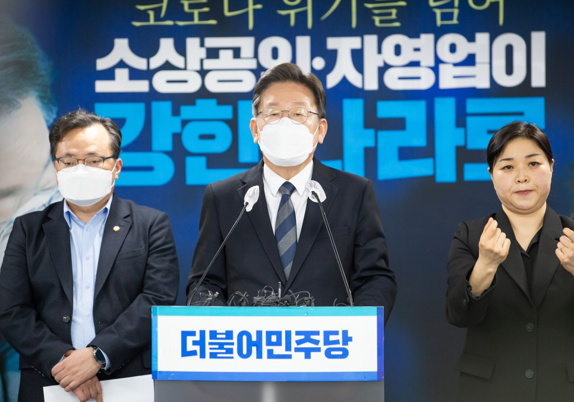
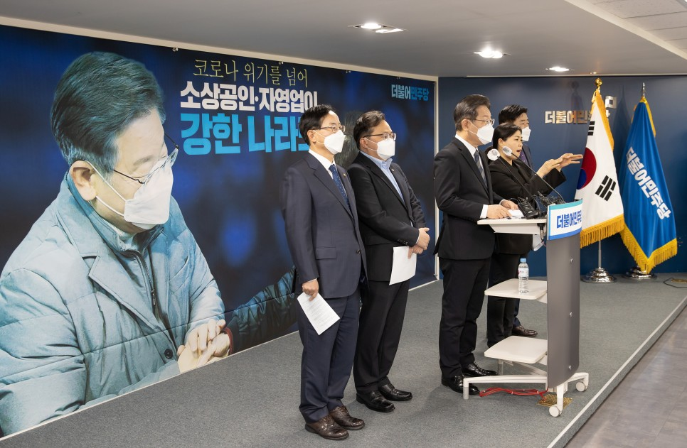
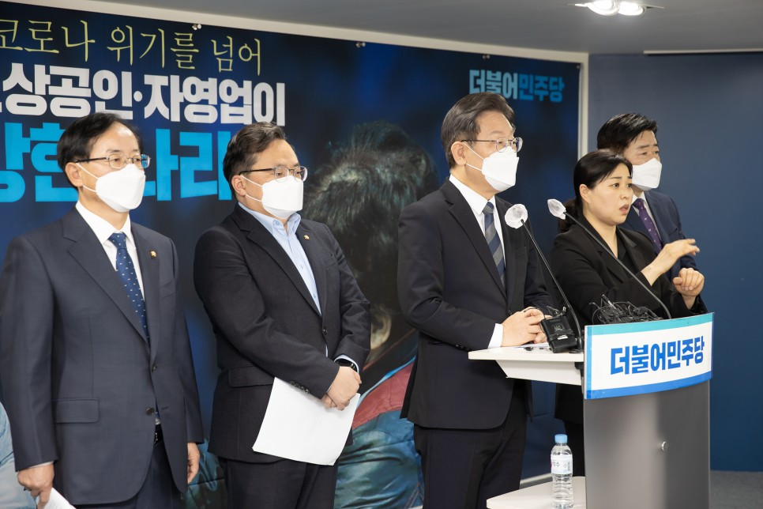
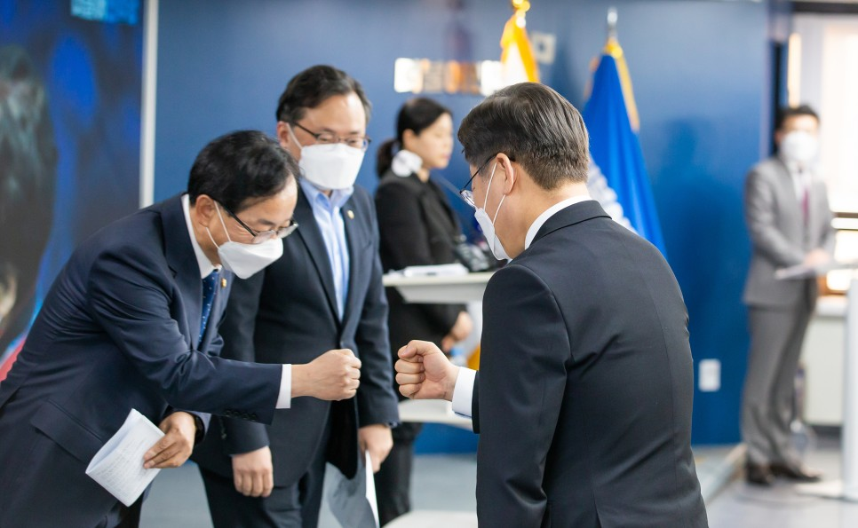
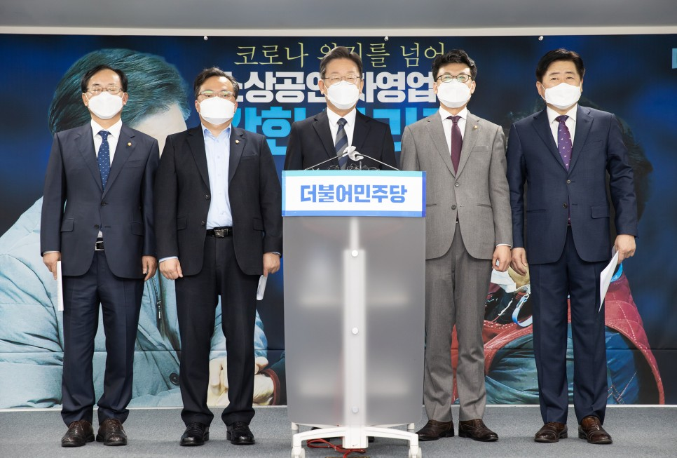

## 대표공약
# 코로나 위기를 넘어서 소상공인⋅자영업이 강한 나라를 만들겠습니다
> 2021-12-20 15:48:50

소상공인과 자영업에 종사하시는 국민 여러분, 죄송하다 말씀을 드리기조차 송구스럽습니다.

한파가 몰아치는 이 겨울 얼마나 힘드십니까? 연말연시 그나마 기대했던 소상공인 자영업 경기가 한 순간에 사그라들고 말았습니다.

​

2년 가까이 국민의 건강과 생명을 지키기 위해서 여러분께서 걸어 닫은 가게의 문은 가족 생계의 문이었습니다. 동시에 자식들과 내일에 대한 희망의 문도 함께 닫혀버렸습니다. 그 희생의 눈물이 이제 가슴에 대못으로 박히고 말았습니다.

​

누군가는 그 못을 뽑아야 합니다. 그리고 그 구멍 난 상처에 치유와 회복의 희망을 메꿔넣어야 합니다. 진심으로 약속드립니다. 이재명 정부가 반드시 하겠습니다.

​

국가의 행정으로 손실을 당한 국민을 보호하는 일은 행정의 마땅한 준칙이고 나아가 국가의 존재 이유입니다. 저 이재명이, 지금까지와 전혀 다른 방식으로 여러분의 희생에 보답하겠습니다.

‘부분이 아닌 전부’,

누구는 주고 누구는 안 주는 방식이 아닙니다. 피해를 당한 국민 전부에게 지급하겠습니다.

​

‘금융보다 재정지원’,

돈을 빌려주면서 버티라하는 금융지원 아니라 피해 당사자에게 직접 지급하는 재정지원으로 바꾸겠습니다.

​

‘사후가 아닌 사전’,

가게 문을 닫고 난 뒤에 뒷북치는 사후가 아니라 급하고 힘들 때 적재적소의 지원을 원칙으로 하겠습니다.

​

저 이재명이, 지금까지 유지해 온 지원과 보상의 패러다임을 완전히 새롭게 바꿔서 보다 더 신속하게, 보다 더 도움이 되는 지원으로 일대혁신 하겠습니다.

​

존경하는 국민 여러분.

방역에 협조하는 일이 국민 개개인의 경제적 손실로 이어져선 안 됩니다. 국가가 국민의 손실를 강요하는 것은 20세기 패러다임입니다. 애국이라는 이름, 사회적 헌신이라는 소중한 가치가 국민의 참다운 권리와 국민행복으로 함께 승화되어야 합니다. 이제, 국민에게 국가를 위해 무엇을 해 줄 수 있느냐 물어서는 안 됩니다. 국가가 국민을 위해서 할 수 있는 일이 뭔지를 먼저 제시해야 합니다.

​

이재명이 하겠습니다. 이제 ‘국민 우선’입니다. '국민이 먼저'입니다. 이번 코로나 위기 극복 과정을 통해서 ‘국민을 위한 대전환 시대’의 원년으로 삼겠습니다. 그 시작의 문을 소상공인과 자영업자의 자생력을 키워서 지금의 위기를 대전환의 기회로 전환시키겠습니다.

​

‘국민 먼저’, '국민이 우선' 인 이재명 정부의 소상공인‧자영업 7대 공약을 말씀드리겠습니다.

​

첫째, 한국형 PPP 도입으로 사전보상과 온전한 보상을, 지역화폐 대폭 확대로 신속한 매출 회복을 지원하겠습니다.

반쪽이 아닌 온전한 손실보상이 돼야 합니다. 지금의 제도를 개선해서 코로나 방역 협조가 결코 국민의 손실로 돌아가지 않도록 하겠습니다. 정부의 방역조치 실시와 동시에 손실을 지원하는 사전보상 방식으로 손실보상의 패러다임을 완전히 바꾸겠습니다.

​

그동안 ‘인원 제한'을 당했으면서도 손실보상을 받지 못했던 업종에도 보상을 확대하겠습니다.

사회적 거리두기로 경영피해를 당한 업종을 꼼꼼하게 세부적으로 살펴서 보상 사각지대를 없애겠습니다.

​

미국의 급여보호프로그램(PPP)을 도입해서 업체의 매출과 관계없이 발생하는, 임대료와 고용유지 인건비 등 고정비 상환을 감면하는 한국형 고정비 상환감면 대출제도를 도입하겠습니다.

​

코로나19가 발생하고 개인사업자 대출이 무려 170조 원이 증가했다고 합니다. 특히 고금리 대출이 급증해서 신용위험이 극도로 커지고 있습니다. 이미 연체에 들어갔거나 연체 위기에 빠진 소상공인⋅자영업자 중에서 회생 가능성이 있는 분들의 채무를 국가가 매입하는 채무 조정을 실시하겠습니다. 대환 대출과 무이자 대출을 확대하는 포용적 금융정책과 연계하도록 하겠습니다.

​

고금리 사채의 늪과 폐업의 벼랑으로 내몰린 소상공인⋅자영업자의 신용회복을 돕고 채무 부담을 줄여드리겠습니다. 코로나 팬데믹으로 신용등급이 낮아져서 시중은행이 아닌 고리 대부업체를 찾을 수밖에 없는 소상공인⋅자영업자를 대상으로 신용등급 회복을 위한 ‘신용 대사면’을 단행하겠습니다. 다시 시작하려는 소상공인⋅자영업자들이 다시 일어설 수 있도록 재기의 발판을 만들어서 경제활동을 다시 정상 궤도에 올려놓겠습니다.

​

손실보상만큼이나 중요한 것이 매출 회복입니다. 임기 내에 지역화폐를 연간 50조 원 목표로 발행을 하고 서민들의 생업터전인 골목상권이 북적북적 다시 살아나도록 하겠습니다.

​

지역화폐의 골목경제 활성화 효과는 이미 성남시와 경기도에서 여러 차례 확인했습니다. 최근 전국 각지를 순회할 때 만나 뵌 수많은 소상공인, 그리고 자영업자 여러분들께서 현장에서, 시장에서 고맙다는 말씀을 참으로 많이 해주셨습니다. 지역화폐 발행 지원을 체계화하여 중앙정부의 상시 지원으로 바꿔서 지방정부의 상황을 고려한 맞춤형 지원으로 각 지역 간의 불균형을 완화할 것입니다.

​

정부와 국민이 함께하면 서민경제가 다시 살아날 수 있습니다. 온 국민에게 소상공인 전용 소비쿠폰을 지급해서 다함께 잘 사는 행복한 골목경제를 만들겠습니다.

둘째, 코로나 팬데믹으로 폐업한 소상공인·자영업자의 재기를 지원하겠습니다.

감염병 같은 국가적 재난 때문에 불가피하게 폐업을 선택할 수밖에 없는 소상공인⋅자영업자들의 경우 폐업 지원을 확대하고 생계비 지원을 검토하겠습니다. 대출 원리금 일시상환, 신용불량 문제 등 폐업의 지체요인을 개선해서 적시에 폐업한 후에 신속하게 재도전할 수 있도록 지원하겠습니다.

​

코로나 재난 상황에서 임대계약, 가맹계약, 대리점계약 등의 계약해지권을 보장하고 위약금을 완화하거나 면제하도록 지원하겠습니다. 폐업하는 소상공인⋅자영업자에게는 직업훈련을 비롯한 재취업⋅재창업 관련 교육⋅컨설팅 같은 재도전 특례보증을 도입해서 다시 일어설 수 있는 기반을 정부가 지원하겠습니다.

​

자영업자 고용보험 가입률이 0.5%에 불과하다고 합니다. 자영업자가 고용보험을 꺼리는 이유를 찾아서 해결하겠습니다. 국민을 탓할 것이 아니라 제도의 문제점을 찾아서 고용보험 가입을 적극적으로 지원하겠습니다.

​

소상공인⋅자영업자의 퇴직금인 노란우산 공제의 활성화를 더욱 지원하겠습니다. 최소 납부금액을 완화하고 신규가입 지원을 확대하고, 10년 이상 장기가입자의 임의 해지를 할 경우에 퇴직소득세 적용을 통한 세금 부담 완화 조치도 하겠습니다. 공제 가입에 따른 혜택과 복지사업을 대폭 확대하겠습니다.

​

셋째, 감염병 등 재난 시기의 임차상인 임대료 부담을 완화하겠습니다. 

조사결과에 따르면 소상공인⋅자영업자 네 명 중의 한 명은 정부가 지급하는 손실보상금을 고스란히 임대료 납부에 써야 한다고 합니다. 그리고 열 명 중의 세 명의 손실보상금은 집합금지·영업제한이 실시된 세 달치의 임대료조차도 미치지 못했다고 합니다.

​

감염병 등 재난에 의한 집합금지·영업제한 등이 실시될 경우에 캐나다 같은 해외에서는 임대인, 임차인, 그리고 정부가 임대료 부담을 나누고 있습니다. 우리도 못할 이유가 없습니다.

​

정부가 임대료 부담을 낮출 수 있는 제도를 도입하겠습니다. 감염병 재난 상황 동안은 임대료 연체를 이유로 임차상인에 대해서 건물주가 마음대로 계약해지, 갱신거절, 강제퇴거 조치를 할 수 없도록 하겠습니다.

​

공정임대료 가이드라인을 만들겠습니다. 매출변동과 임대료 조정비율을 연동한 표준안을 마련해서 자율적인 임대료 협상에 도움이 되도록 하겠습니다. 자율적인 상가임대료 협상이 성립되지 않으면 법원을 통해서 비용도 많이 들고 시간도 많이 쓰는 소송이 아니라 비송사건절차법 같은 방식을 동원해서 임대료 분쟁을 신속하게, 쉽게 해결하는 방안을 마련하겠습니다. 임대료, 관리비 등을 책정할 때 임차상인들이 대표를 선임해서 집단적으로 단체협상을 할 수 있도록 제도를 만들어가겠습니다.

넷째, 플랫폼 시장 속의 ‘을’의 권리를 보장하겠습니다.

온라인플랫폼 시장에 공정한 질서를 반드시 확보하겠습니다. 온라인플랫폼 중개거래의 공정화에 관한 법률을 즉각 제정하겠습니다.

​

저는 지난 9월, 플랫폼 입점 소상공인⋅자영업자의 단체결성권과 협상권 보장, 그리고 경기도 공공배달앱인 ‘배달특급’의 전국 확장을 공약한 바가 있습니다. 이와 함께 소확행 공약으로 동네 슈퍼의 온라인플랫폼 즉시 배송 서비스도 지원할 것을 약속드렸습니다.

​

온라인플랫폼 시장에서 일부 대기업의 갑질과 전횡을 막아야 합니다. 막 활성화되고 있는 온라인플랫폼 시장에서 소상공인⋅자영업자가 경쟁력을 갖추고 상권의 중심이 될 수 있도록 법과 제도를 보완하고 정비해 나가겠습니다.

​

온·오프라인 상권 분석, 온라인몰 입점 및 온라인 수출 등 필요한 지원을 수행할 수 있도록 빅데이터 플랫폼을 구축할 것입니다. 아울러서 디지털 상권, 메타버스 가게 등 스마트 상점 구축도 지원하겠습니다.

​

가맹점⋅대리점의 단체결성권과 협상권 강화를 위해서 제도 개선을 하겠습니다. 가맹본부, 대리점 사업자, 대기업 같은 집단의 불법⋅불공정 행위에 대해서는 징벌적 손해배상 제도 같은 방식을 도입해서 엄정하게 제재하고 책임을 묻겠습니다.

​

가맹점⋅대리점 계약은 공정하게 이익을 나누고 함께 성장해야 합니다. 가맹본부와 대리점 본사도 함께 성장하는 상생 체계도 만들어야 합니다. 가맹점⋅대리점의 매출액에 비례해서 수수료를 납부하는 체계가 안착될 수 있도록 하겠습니다.

​

다섯째, 중소벤처기업부 내 소상공인⋅자영업 전담차관을 신설할 것입니다.

우리나라 소상공인⋅자영업 사업체는 전체 사업체의 무려 93.4%에 해당합니다. 종사자 수는 43.7%에 이를 만큼 매우 비중이 높습니다. 그럼에도 정책의 우선순위는 늘 뒷전이었습니다. 중소벤처기업부 내에 소상공인⋅자영업 전담 차관을 신설하고 관련 정책을 총괄하고 정책 역량을 강화하도록 하겠습니다.

​

소상공인⋅자영업자의 실패를 최소화하고 경쟁력을 강화할 수 있도록 창업교육 등 지속적인 교육으로 전문성을 높여 나가겠습니다. 폴리텍대학과 각 지역 대학들과 연계하여 장인⋅기능장 교육을 비롯한 소상공인⋅자영업 특화 교육을 지원하겠습니다.

​

빅데이터를 활용해서 소상공인⋅자영업 위기 신호등을 개발하겠습니다. 위기 단계에 따른 대처방안을 매뉴얼로 만들어서 위기 상황의 조짐부터 파악해서 선제적으로 대응해가겠습니다.

여섯째, 지역상권 중심의 현장 밀착형 지원을 대폭 강화하겠습니다.

소상공인⋅자영업자 정책을 지자체와 연계해서 지역상권을 살리는 지역 시장경제 밀착형으로 바꿔가겠습니다. 성남시상권활성화재단, 경기도시장상권진흥원 같은 골목상권 전담 지원기관을 각 지역에 설립할 것입니다. 지역의 문화와 특색을 살린 특화된 맞춤형 골목형 상점가를 적극 육성하겠습니다. 지역상생구역 그리고 자율상권구역을 지정하고 골목형 상점가 지정기준을 완화하겠습니다. 그래서 불합리하고 미흡한 제도를 적극적으로 개선할 것입니다.

​

소상공인⋅자영업자들의 사업장이 급변하는 디지털 환경에 적응할 수 있도록 경력단절 여성, 취업준비생, 학생 같은 지역사회 디지털 전문 인력이 참여하는 디지털 전환 교육 프로그램을 만들고 활성화시키도록 하겠습니다.

마지막 일곱 번째입니다. 원자재 구매에서 판매까지 소공인들을 종합지원해서 도심 제조업 르네상스 시대를 열겠습니다.

소상공인 정책이 후순위인 이런 불합리한 상황에서도 특히 소공인 정책은 더더욱 뒷전이었습니다. 소상인과 소공인이 다른 것처럼 소상인 정책과 소공인 정책도 달라야 합니다. 소공인들을 위한 정책을 별도로 구분해서 세심하게 시행하도록 하겠습니다.

​

납품단가 현실화는 소공인들의 오래된 염원입니다. 소공인이 노력한 만큼 제대로 된 보상을 받을 수 있도록 하겠습니다. 원자재 값 상승에 따른 납품단가 연동제를 조속하게 실시하겠습니다.

​

소상공인의 협상력을 높일 수 있게 지원할 것입니다. 소공인 밀집지역을 중심으로 협동조합 설립을 지원하겠습니다. 이를 통해서 납품단가 협상을 비롯해서 공동연구개발, 공동구매 같은 협동조합의 공동사업을 정책적으로 적극적으로 지원하겠습니다. 안전하고 효율적인 작업환경을 위한 시설 투자비를 비롯해서 공정 자동화, 스마트화 등을 위한 정책자금 지원도 확대하겠습니다.

​

소공인 전용 전기요금제를 도입해서 전기요금 부담을 덜어드리겠습니다. 기가 막히게도 전기요금이 대기업보다 소상공인들이 더 많이 내고 있다고 합니다. 이와 함께 지역에 특화된 영세 소공인을 지원하는 개방형 복합지원센터를 구축하겠습니다.

존경하는 국민 여러분!

전국의 소상공인과 자영업자 여러분!

​

우리 사회의 건강과 생명, 공동체의 안전을 위한 희생과 헌신에 다시 한 번 고개 숙여서 감사드립니다. 그리고 아울러 방역을 위한 여러분의 손실을 완전하고 신속하게 보상하지 못해온 점에 대해서도 정말로 사과드립니다. 특별한 희생에는 특별한 보상이 뒤따라야 합니다. 생존의 기로 앞에서 나중에, 당선된 다음에, 다음 정부에서, 이런 건 있을 수 없습니다.

​

야당에게 간절하게 요청 드립니다. 국민이 있어야 정권도 있는 것입니다. 부디 위험에 빠진 국민을 위해서 함께해주시기를 부탁드립니다. 방역 강화와 함께 소상공인⋅자영업자에 대한 신속⋅과감한 지원과 보상을 위해서 조속한 국회 입법이 필요합니다.

​

윤석열 후보님과 김종인 위원장님께서 이미 말씀하셨지 않습니까. 50조 원, 100조 원의 대규모 보상지원은 본인들이 당선된 후에, 나중에, 이렇게 말씀하실 것이 아니라 지금 당장 필요합니다. 그래서 신속한 예산 편성이 반드시 이루어져야 합니다.

​

50조 원, 100조 원 발언이 국민을 위한 충심이라고 믿고 싶습니다. 이제 정말로 ‘국민의힘’을 보여주십시오. 우리 국민의힘의 진정성과 더불어민주당의 진정성을 합쳐서 '국민과 더불어 사는' 그런 나라 함께 만들어야 되지 않겠습니까? 국민의힘의 전향적인 자세를 국민과 함께 기대하겠습니다.

​

정부에도 간곡히 요청합니다. 여야 모두 대규모 지원에 의견을 같이 하고 있습니다. 이런 점을 반영해서 추경예산 편성을 시급히 추진해주시도록 요청 드립니다. 코로나 팬데믹 때문에 우리 사회가 양극화가 점점 심해지고 있습니다. 구조적 격차를 깨트리는 일은 약육강식 자본에게만 맡겨둘 수 없습니다. 지금이야말로 정부의 억강부약 정책이 필요한 때입니다. 정부가 혼신의 힘을 다해서 취약계층을 보호하고, 자본의 논리가 아닌 상생의 논리로 바꿔야 합니다.

​

그 일환으로 지역화폐와 소비쿠폰의 시행은 대기업과 일부 대형 플랫폼 업체에만 이익이 몰리는 구조적인 격차를 완화시켜 줄 것이 분명합니다.

​

큰 길, 대로는 골목이 있어야 제 기능을 합니다. 소상공인, 자영업의 골목상권 살리기는 단순한 서민경제 활성화를 넘어서서 대한민국 경제 요소요소에 자양분을 제공하는 실핏줄 역할을 할 겁니다.

​

소상공인·자영업자의 매출 지원과 회복은 대한민국 혁신경제에도 활력을 불어넣어 줄 것입니다. 코로나 위기를 극복하고 소상공인⋅자영업이 강한 나라로 이재명은 반드시 해나가겠습니다. 고맙습니다.