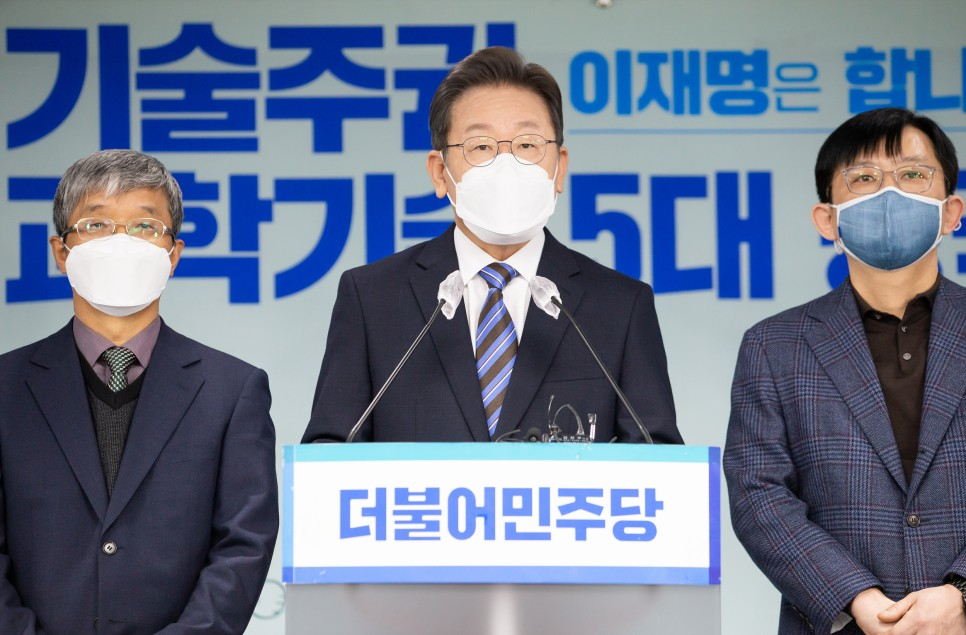

## 대표공약
# 기술패권 경쟁을 과학기술 선도국 도약의 기회로! 기술주권 확립과 과학기술 강대국 실현, 이재명은 합니다
> 2021-12-22 11:43:37

2021년 10월 21일, 대한민국 과학기술이 세계를 넘어서 우주로 날아올랐습니다. 최초 순수 국내기술로 완성된 한국형 발사체 누리호가 1%의 아쉬움을 남겼지만 99% 성공해서 궤도에 진입했습니다.

​

역사는 그날을 대한민국이 세계 속에 우주 강국임을 선언한 날이자 한국의 과학기술이 우주영토에 새로운 지평을 개막한 날로 기록할 것입니다.

​

뿌리 없는 나무가 없습니다.

​

박정희 정부는 한국과학기술연구원을 설립하고 과학입국 초석을 다졌습니다. 김대중 정부는 대한민국을 세계 정보통신기술 1등 국가로 이끌었습니다. 노무현 정부는 이공계 출신의 공직 진출과 인공위성 연구의 기초를 닦았습니다.

​

여기서 만족할 수 없습니다. 이분들이 남긴 미래 과학에 대한 깊은 통찰력, 강한 추진력과 리더십을 배우겠습니다.

​

지금 세계는 치열한 과학기술패권 경쟁시대입니다. 세계 주요국들은 과학기술 패권을 다투며 기술주권 강화를 위해서 과학기술 혁신전략을 수립하고 있습니다. 과학이 곧 미래를 이끌어 갈 힘이기 때문입니다. 저는 과학의 발전이 세계를 주도할 것이다라고 확신합니다.

​

선진기술로 무장한 2천여 명의 일본군 앞에서 열 배가 넘는 2만여 명의 동학혁명군이 전멸당한 후 국권을 빼앗긴 그 아픈 역사를 다시는 되풀이할 수 없습니다.

​

저 이재명은, 과학기술 혁신전략을 국정과제 맨 앞줄에 배치하겠습니다. 세계가 놀랄 정도로 강력하게 과학기술 투자에 집중하겠습니다. 명운을 걸고 대한민국을 과학기술강국으로 발돋움시키겠습니다.

​

국가 전략기술의 확보, 과학기술강국의 길이 오늘 우리가 직면한 에너지 전환, 디지털 전환, 그리고 팬데믹의 위기를 헤쳐나갈 승리의 길입니다.

​

이재명 정부는 기술주권을 확보해서 기술패권 시대를 선도하겠습니다. 첨단과학기술인재 육성을 위한 교육인프라를 다지고 과학기술연구에 대한 전폭적인 지원과 투자로 대한민국을 미국, EU, 중국, 일본과 어깨를 나란히 하는 세계 5대 과학강국으로 발돋움시키겠습니다.

​

과학기술의 힘으로 새로운 성장 동력을 만들어 내고 정체된 성장을 반등시켜서 새로운 대한민국의 미래를 준비하겠습니다.

​

과학기술이 국민안전과 국가안보를 보장하는 나라, 과학기술로 국제사회에 공헌하는 그런 나라를 만들겠습니다.

​

이를 위한 이재명 정부의 과학기술 7대 공약을 말씀드리겠습니다.

첫째, 과학기술혁신 부총리제를 도입하겠습니다.

과학기술의 혁신전략을 최우선 국정과제로 삼겠습니다. 과학기술혁신 부총리가 국가 과학기술 혁신전략을 주도하도록, 기획과 예산 권한을 대폭 위임하겠습니다.

​

연구개발 체제를 추격형에서 선도형으로 혁신하겠습니다. 새로운 지식과 미래 기술 창출을 위한 기초과학 연구와 원천기술 연구에 정부의 연구개발 투자를 집중하겠습니다.

​

정부가 주도해온 국가 연구개발 R&D 지원 체계를 수요자인 산업계와 연구자 중심의 개방형 R&D 체제로 대전환하겠습니다. 눈앞의 성과에 급급해서 소탐대실하지 않도록 단기성과 중심의 연구개발을 중장기 연구개발로 전환하겠습니다.

​

우리나라의 R&D 양적 투입 규모는 가히 세계 최고 수준입니다. 그렇지만 투입 대비 효율은 기대에 못 미치고 있는 게 엄연한 현실입니다. 연구의 성과가 혁신의 동력으로 이어지지 못하는 이른바 ‘코리아 R&D 패러독스'를 반드시 극복해야 합니다.

​

정부가 직접 나서서 복잡한 사업화 체계를 단순화하고 연구 성과를 쉽게 사업에 적용할 수 있도록 규제를 개혁하겠습니다. 투자한 만큼 성과를 내고 성과를 낸 만큼 사업화로 이어지는 정부 R&D 효율성 극대화로 불균형을 바로잡겠습니다.

​

민간기업의 기술혁신이 곧 국가의 경쟁력입니다. 지식재산권의 강력한 보호로 우리 기업의 기술이 침해받지 않고 탄탄한 기술 역량으로 세계시장을 선도하도록 지원하겠습니다.

​

인재육성과 안정된 연구 환경이 무엇보다 중요합니다. 대학과 출연연구소의 실험실 창업과 기술이전을 지원하겠습니다. 공공조달과 해외 협력사업 확대로 수요를 창출하고 새로운 일자리를 만들겠습니다.

둘째, 미래 국가전략기술을 확보해서 기술주권을 확립하겠습니다.

국가전략기술 확보는 대한민국의 명운이 걸린 현실이자 또 미래입니다. 망설이지 않는 담대한 도전으로 국가전략기술을 확보하겠습니다. 초격차 선도기술과 미래전략기술을 선제적으로 확보해서 기술주권 국가의 방향성이 흔들리지 않도록 든든한 토대를 마련하겠습니다.

​

대한민국의 미래를 선도할 인공지능, 양자컴퓨팅, 우주항공, 스마트모빌리티, 차세대 전지, 시스템·지능형 반도체, 바이오헬스, 그리고 차세대 네트워크, 탄소자원화, 사이버보안 같은 10개 분야를 ‘대통령 빅 프로젝트'로 선정해서 대통령이 직접 보고받고 꼼꼼하게 챙기겠습니다.

​

범부처 차원의 혁신적인 연구개발 체계 정립을 단행하겠습니다. 이와 동시에 신속하게 국가 첨단전략기술 육성계획을 수립하고 이를 추진할 수 있는 법과 제도를 정비하겠습니다.

​

이재명 정부의 과학 거버넌스 문호를 더 넓고 크게 열겠습니다. 공공·민간 파트너십 기반의‘국가첨단전략기술 프로젝트’를 5년 이상의 장기 과제로 추진하겠습니다.

​

세계 최초 휴대폰 상용화 기술인 CDMA 개발, 한국형 전전자교환기 개발과 같은 대대적인 성과와 위업을 다시 만들어 내겠습니다.

​

말로만 하지 않겠습니다. 그리고 실제 투자하고 실천하겠습니다. 공공과 민간의 협력을 통해 이재명 정부 5년간 5조원 규모의 임무지향형 프로그램 예산을 확보하고, 이 중 50%를 핵심기술 개발에 집중 투자하겠습니다.

​

첨단 전략기술 분야일수록 연구에 성공할 가능성이 낮습니다. 과학기술인이 실패를 두려워하지 않는 환경을 만들겠습니다. 망설이지 않는 과감한 도전과 창의적인 연구개발이 가능하도록 범부처 차원의 지원을 확대하겠습니다.

셋째, 우주기술 자립으로 우주강국시대를 선도하고 2030년까지 달 착륙 프로젝트를 완성하겠습니다.

지난 10월 누리호 발사 성공은 대한민국에 우주항공시대의 주인공이 될 수 있다는 자긍심과 자부심을 안겨주었습니다.

​

한·미 미사일 지침 폐기는 더 없는 좋은 기회입니다.

​

2030년까지 3톤급 정지궤도 위성을 우리 기술로 쏘아 올릴 수 있도록 발사체 개발을 적극 독려하고 투자를 아끼지 않겠습니다. 국민경제와 국가안보에 필요한 위성을 자력으로 발사할 수 있는 우주개발 강국으로 발돋움하겠습니다. 2030년까지 대한민국을 세계 7위권 우주강국으로 도약시키고, 우주탐사의 시작인 달 착륙 프로젝트를 완성하겠습니다.

​

한국형위성항법시스템 KPS 실현을 앞당기겠습니다. 민‧군 협력으로 인공위성 구성품 핵심기술의 국산화를 추진하고 첨단 인공위성 관련 민간사업을 육성하겠습니다.

​

우주개발 전략 수립과 목표 달성을 위해서 대통령 직속으로 우주정책의 전담기구인 ‘우주전략본부’를 설치하겠습니다.

넷째, 사회문제 해결에 기여하는 과학기술 연구 확대로 국민의 삶의 질을 높이겠습니다.

감염병, 기후위기, 에너지전환 같은 인류가 직면 중인 고위험 사회문제에 대해서 R&D 과제를 선정하고, 해법을 제시하는 임무지향형 프로젝트를 추진하겠습니다.

​

지능형 통신망을 구축해서 사이버 범죄, 보이스 피싱 같은 생활 속 범죄피해를 예방할 수 있는 연구개발을 강화하겠습니다.

​

재난으로부터 국민의 안전과 취약계층을 보호하고 일상에서 도움 되는 국민체감형 과학기술 연구에 힘쓰겠습니다.

​

코로나 바이러스, 조류독감, 구제역 같은 국민의 삶과 경제에 심각한 피해를 입히는 각종 바이러스 퇴치 연구와 희귀난치성 질환 극복을 위한 R&D 투자를 확대하겠습니다.

다섯번째, 지역의 R&D 자율성강화로 지역의 과학기술 역량을 획기적으로 증진시키겠습니다.

지역의 특수성에 맞는 특화된 발전방향 기획이 반드시 필요합니다. 지방정부가 자율성을 갖고 스스로 지역 특성에 맞는 R&D 투자 방향을 정해서 집행할 수 있도록 1조 원 규모의 ‘지역자율 R&D 예산’을 확보하겠습니다.

​

지역대학 중심의 거점연구소 구축과 예산 지원을 확대하겠습니다. 지역대학과 지역산업이 함께 협력하고 살아나야 합니다. 지역대학의 연구가 지역산업과 연계되도록 하겠습니다. 지방으로 이전한 기업에 필요한 인재를 적기에 육성하고 공급하겠습니다.

​

지역마다 각각의 특성에 맞는 민·관·학 공동협력 지역인재 혁신플랫폼을 구축하겠습니다.

​

바이오-의료 혁신허브 클러스터 구축, 탄소중립 거점연구 클러스터 같은 초광역 개념의 연구산업진흥 계획을 추진하겠습니다. 연구산업 기업을 길러내고 연구산업 규모를 대폭 확대해서 지역경제의 새로운 성장 동력을 만들겠습니다.

​

여섯번째, 과학기술 연구자 중심의 연구환경을 조성하겠습니다.

R&D 연구과제 선정방식을 전문 연구자 중심, 현장 중심으로 개선해서 과학기술자와 민간의 창의적 연구와 혁신 활동을 보장하겠습니다.

​

안타깝게도 많은 연구원들이 인건비 확보를 위한 과제 수주, 그리고 시류에 편승하는 연구로 내몰리고 있다고 합니다. 연구과제중심제도를 개혁해서 근본적인 변화를 이끌어내겠습니다.

​

단기성과를 강요하는 평가보다는 연구자의 자율성과 장기간 연구의 안정성이 보장되는 고효율의 평가방식으로 혁신하겠습니다.

​

국가전략기술 개발의 전진 기지인 출연연구기관이 그 본연의 임무를 달성할 수 있도록 정부 출연금을 대폭 확대하겠습니다. 출연연구기관 연구원의 인건비 지원 비중을 높여서 기본연구비를 보장하겠습니다.

​

과학기술 연구원들이 노후에도 축적된 경력과 노하우를 발휘할 수 있도록 지원을 확대하겠습니다.

일곱번째, 전환성장을 이끌 과학기술 인력을 폭넓게 양성하겠습니다.

과학기술 인력 양성정책을 전환해서 시장 중심, 지역 중심, 청년, 여성에 대한 지원을 확대하겠습니다. 동시에 인력 정책에 대한 정부의 관여와 통제는 최소화하겠습니다.

​

여러 부처에서 산발적으로 추진되고 있는 과학기술 인력양성 정책의 효율적인 연계 체제를 구축하겠습니다.

​

초중등의 과학, 수학, 소프트웨어교육 등을 강화해서 우수 이공계 인력 양성을 위한 토대를 단단하게 마련하겠습니다.

​

출연연구소를 중심으로 박사후 연구원 같은 신진연구자의 일자리를 확보하고 산학연 공동연구를 통해 취업까지 연계될 수 있게 하겠습니다.

​

여성과학기술인의 경력단절 예방과 복귀를 위해서 임신-출산-육아 같은 생애주기별 맞춤형 지원체계를 구축하겠습니다.

​

해외 우수 연구인력의 유입을 지속적으로 촉진하기 위해서 국내 연구 여건과 정주환경을 국제 수준으로 개선하겠습니다.

존경하는 국민 여러분! 그리고 사랑하는 과학기술인 여러분!

​

과학기술 혁신역량은 대한민국 전환성장의 핵심 토대입니다. 기술주권 확립 없이는 대전환 시대의 국가경쟁력도 없습니다.

​

저 이재명이 꿈꾸는 나라는 과학기술 세계 최강국입니다. 원천기술 로열티를 내는 나라에서 이제 로열티를 받는 나라로 바꾸겠습니다.

​

어린이들이 미래의 과학자를 꿈꾸는 나라, 연구자가 다시 태어나도 과학기술인의 길을 걷겠다라고 말할 수 있는 그런 대한민국을 만들겠습니다.

​

결단과 실천으로 위기를 극복해온 저 이재명이 대한민국을 기술패권 경쟁시대의 과학기술 선도국으로 이끌어 가겠습니다.

과학기술인 여러분과 함께 노벨과학상 수상자 배출의 꿈을 실현하고 대한민국 역사상 최고의 과학기술 전성시대를 열어가겠습니다.

​

과학기술 일류강국 코리아! 기술패권 경쟁을 과학기술 선도국 도약의 기회로! 그리고 기술주권 확립과 과학기술 강대국을 실현하는 이재명의 꿈, 국민들께서 응원하고 지지해 주시기 바랍니다.

​

고맙습니다.