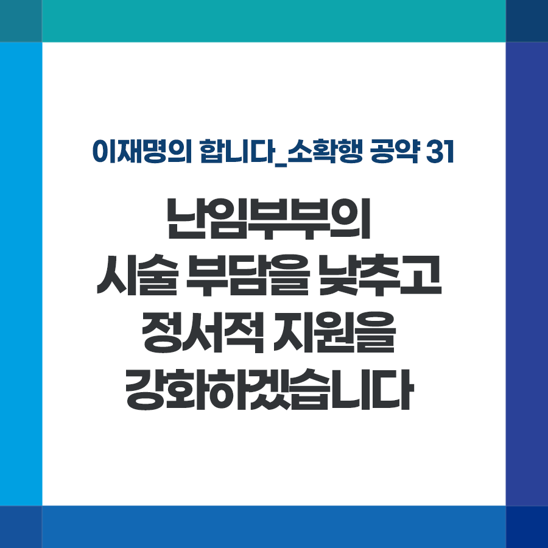

## 소확행 시리즈
# 난임부부의 시술 부담을 낮추고 정서적 지원을 강화하겠습니다
> 2021-12-24 08:36:24

이재명의 합니다_소확행 공약 31

우리나라 부부 7쌍 중 1쌍이 난임 문제를 겪고 있습니다. 난임부부의 삼중고, 겪어보지 않은 사람은 결코 헤아릴 수 없을 것입니다. 육체적 고통, 경제적 부담도 힘든데 정신적 고통까지 상당합니다.

아기를 기다리는 분들의 절박함을 개인의 문제로 두지 않고 국가가 부족함을 더 채우겠습니다.

첫째, 체외수정 시술별 복잡하게 나뉘어진 지원금액, 횟수 등을 간소화해 총 지원회차 내에서 자유롭게 지원받도록 하겠습니다.

둘째, 과배란유도제 같이 꼭 필요한 약제비 등에 대한 보험급여화를 확대하겠습니다.

셋째, 난임 조기검사 지원을 강화하겠습니다. 난임여부 확인을 위한 남녀 기초검사를 건강검진항목에 포함시켜 난임 조기 예방과 건강한 출산을 돕겠습니다.

넷째, 난임부부들에 대한 정서·심리적 지원을 강화하겠습니다.

난임시술 실패나 유산으로 힘들어하는 난임부부에게 상담 바우처를 지급하고 찾아가는 심리상담 프로그램을 확대, 강화하겠습니다.

난임시술은 끝을 알 수 없는 긴 터널과 같다고 합니다. 그 터널을 뚫고 지난해 신생아 10명 중 1명이 난임시술을 통해 태어났습니다.

아기를 기다리는 분들의 손을 잡고 함께 걷겠습니다. 언젠가 올 아기천사를 위해 국가가 최선을 다해 돕겠습니다.