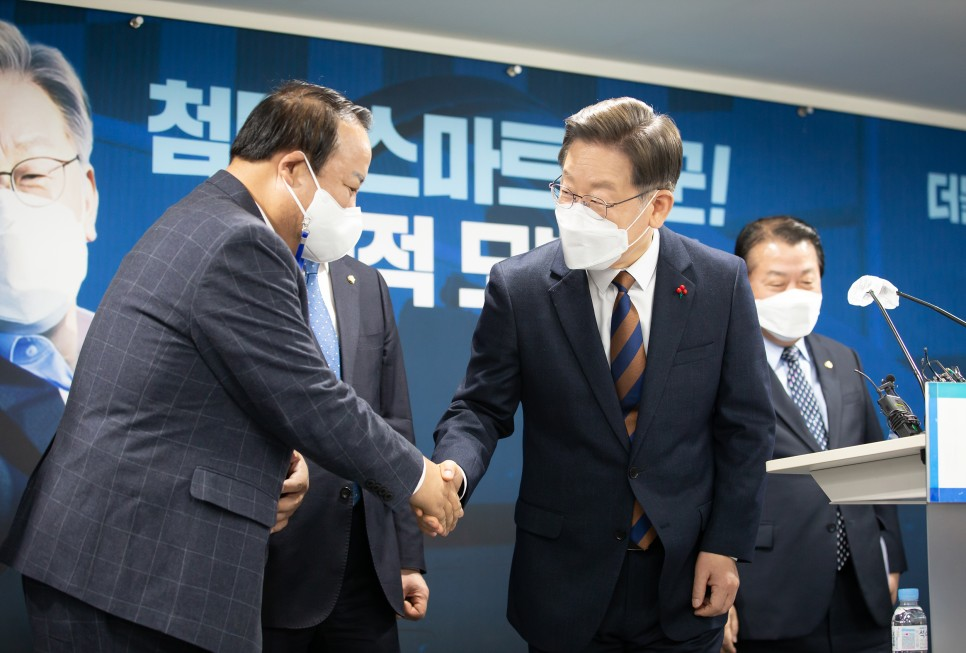

## 대표공약
# 4차산업혁명 첨단기술로 스마트 강군 육성, 선택적 모병제로 정예강군 건설, 이재명은 합니다!
> 2021-12-24 15:45:57

먼저, 혹한의 날씨에도 가족과 조국의 안녕을 위해서 불철주야, 묵묵히 헌신하고 계신 50만 국군 장병 여러분, 머리 숙여 감사 말씀을 드립니다. 고맙습니다. 여러분이 있어 대한민국이 있습니다.

​

존경하는 국민 여러분, 강력한 국가안보는 국가 존립의 최우선 목표입니다. 튼튼한 안보 위에서만 국민의 생명과 민주주의 가치, 경제발전과 국가성장이 존립할 수 있습니다.

​

그동안 대한민국 역대 정부는 한반도 평화를 지키기 위해 부단하게 노력해왔습니다. 지금까지 대한민국 평화를 만들어 낸 굳건한 안보 속에는 조국을 위해 젊음을 기꺼이 바쳐 온 대한민국 청년들의 뜨거운 조국애가 함께하고 있습니다.

​

이제 청년의 애국심에 혁신의 신무기를 장착해야 합니다. 21세기 디지털 정보화 사회는 안보에 대한 새로운 정립을 요구하고 있기 때문입니다.

​

지금까지 안보는 외부로부터 침략에 대한 방비가 주 목적이었습니다. 하지만 갈수록 다양화된 국가 위협 속에서 안보와 국방의 역할은 그 범위가 날로 확대되고 있습니다. 코로나 펜데믹과 같은 비전통적인 위협과 전장의 공간은 이제 육상·해상·공중을 넘어 사이버·심해·우주로까지 확장되고 있습니다.

​

이와 함께 저출생 인구절벽으로 인한 병력수급 불안정성은 현행 국방력 유지와 강화를 위해서 시급하게 선결해야 할 현안으로 대두되고 있습니다. 지금 우리는 새로운 국가 위협과 인구절벽 현안에 맞서 새로운 안보의 방향성을 모색해야 합니다.

​

불확실성의 위협 요소를 철저하게 점검하여 대비하고 발 빠른 혁신 국방의 변화로 국민과 대한민국 영토를 지켜내야 합니다. 시대에 맞는 안보, 시대를 이끌어 가는 국방혁신이 필요합니다. 4차 산업혁명 첨단기술을 과감하게 국방에 도입하여 인공지능과 무인화, 메타버스 훈련체계로 혁신해야 합니다. 병력 규모 위주의 전술 방식을 뛰어넘는 혁신 전략과 전술로 스마트 강군으로 전환해야 합니다.

​

이재명 정부는 유·무인 복합전투는 물론이며 육·해·공·사이버·심해·우주의 통합전쟁에 대비하는 전술로, 스마트 강군을 위한 체계 전환을 과감하게 단행하겠습니다. 스마트 강군과 군인력 전문성 강화를 위해 선택적 모병제를 도입하고 장병들의 복무 여건을 과감하게 개선하여 장병이 만족하고 국민이 안심하는 정예강군을 만들겠습니다.

​

이를 실현하기 위한 5대 공약을 말씀드리겠습니다.

첫째, 스마트 강군을 건설하겠습니다.

스마트 강군은 4차 산업혁명 첨단기술을 활용해서 새로운 전장 환경에 최적화시킨 효율적이고 강한 군대입니다.

​

무기체계를 첨단화하고 군구조를 합리적으로 개선하겠습니다. 핵·대량살상무기(WMD) 위협에 대응하는 핵심 전력을 강화하고, 지상부터 우주까지의 무인 감시·정찰 체계와 유·무인 복합전투체계를 우선적으로 전력화하겠습니다.

​

핵심전력 강화 연구개발에 아낌없이 투자하여, 자주국방 역량을 확충하겠습니다. 인공지능, 초연결, 초융합의 첨단기술에 투자해서 미래전의 게임체인저가 되겠습니다.

​

변화된 전장 환경에서 속도감 있는 작전이 가능하도록 지휘체계를 단순화하고 군구조를 효율화하겠습니다. 민간과 역할을 효율적으로 분배하고 예비전력을 내실화하여 군구조를 스마트하게 바꿔가겠습니다.

​

미래전에 대비하는 핵심 전력을 확보하겠습니다. 공고한 한미동맹을 바탕으로 북핵 위협에 대비해 장기간 수중매복과 감시·정찰이 가능한 원자력 추진 잠수함 건조를 추진하겠습니다.

​

작전영역을 우주로 확대해 초소형 감시정찰 위성군과 한국형 조기경보 위성체계, 국방우주네트워크를 구축하고 우주사령부 창설을 추진하겠습니다.

​

둘째, 선택적 모병제를 도입하겠습니다.

첨단기술을 적용한 스마트 강군으로 발전시키기 위해서는 군인력의 전문화가 절실합니다. 이를 실현하기 위해 선택적 모병제를 도입하겠습니다.

​

선택적 모병제는 현재 시행되고 있는 국민개병제를 유지하면서 병역 대상자가 ‘징집병’과 ‘기술집약형 전투부사관 모병’ 가운데 선택할 수 있는 제도입니다.

​

특히 군의 전문성이 요구되는 분야에는 징집병 대신에 기술집약형 전투부사관과 군무원을 배치하겠습니다.

​

우리 군은 여전히 30만 명에 달하는 징집병에 의존하고 있습니다. 전문성을 바탕으로 미래전을 수행하기 위해서는 병역제도의 근본적 개혁이 필요하다는 것을 우리 국민 여러분께서도 가장 잘 알고 계십니다.

​

이재명 정부는 병력구조를 간부 중심으로 대전환하겠습니다. 군 구조 효율화와 민간위탁 등 대전환을 통해서 임기 내에 징집병의 규모를 15만 명으로 축소하겠습니다. 그 대신에 모병을 통해 전투부사관 5만 명을 증원하고 행정, 군수, 교육 분야에 전문성을 가진 군무원 5만 명을 충원하겠습니다.

​

징집병이 담당해온 분야 중 조리와 시설경계 등 민간에서 더 잘할 수 있는 영역은 과감하게 민간 외주로 바꿔서 병사들이 이 업무를 담당하지 않도록 인력 대체를 하겠습니다. 모병된 기술집약형 전투부사관은 첨단장비 운용과 전투지휘 같은 전투 전문성과 숙련도가 높은 직위에 활용하겠습니다.

​

우수인력을 안정적으로 확보하기 위해 급여 외에 전역 시 사회 정착용 목돈을 지급하겠습니다. 복무 중 야간대학·대학원 위탁교육, 자격증 취득지원, 취업·창업지원, 사회 진출을 위한 경력인증제도, 경력직 군무원 채용기회 부여 같은 다양한 맞춤형 인센티브를 부여하겠습니다.

​

비전투분야도 과감하게 혁신하겠습니다. 증원된 5만 명의 군무원은 징집병이 담당해온 행정·군수·교육 분야 같은 민간으로 대체 가능한 직위에 활용하겠습니다.

​

분야별 성격에 따라 일반직 군무원과 임기제 군무원을 구분하고, 제대군인의 임기제 군무원 채용을 확대하겠습니다. 군이 직접 수행해온 시설경계 등의 기능을 과감하게 민간으로 전환하고 후방지역의 해안경계 임무는 해양경찰 이관을 추진하겠습니다.

​

민간 위탁과 함께 각 군의 중복기능을 해소하고 효율화하면, 약 5만 명에 육박하는 군의 인력을 대체할 것입니다. 이러한 병력구조 개편으로 스마트 강군은 40만 정예강군으로 거듭날 것입니다.

​

선택적 모병제는 10만여 개의 청년 일자리를 창출하는 효과가 있습니다. 동일한 규모의 징집병을 대체할 수 있기 때문에 국방 환경에 따라 향후 징집병 복무기간이 자연스럽게 단축될 수 있을 것입니다.

셋째, 병사의 월급을 최저임금 수준으로 올려 200만 원 시대를 열겠습니다. 

우리의 젊은 장병들은 나라의 부름을 받고, 청춘을 희생해 고단한 병역의 의무를 다하고 계십니다. 국가는 그동안 신성한 국방의무를 내세울 뿐, 대한민국의 귀한 아들과 딸들을 충분히 존중하지 못했습니다.

​

국가 공동체의 안전과 평화를 위해 애쓰고 계신 장병들에게는 그 헌신에 걸맞게 대우해야 마땅합니다. 장병들의 노고에 대해 최저임금제에 맞춰 급여를 단계적으로 인상해서 2027년에는 병사 월급 200만 원 이상을 보장하겠습니다.

​

넷째, 장병의 복무 여건을 획기적으로 개선하겠습니다.

국가경제력 수준과 청년의 눈높이에 맞춰서 군인 복무환경 혁신 계획을 수립하겠습니다. 현재의 다인실 병영생활관을 2인 내지 4인의 소인실로 전면 개선하겠습니다. 민간인을 고용하는 직영과 민간 외주화를 통해 군 급식의 수준을 더한층 높이겠습니다.

​

군 복무 중에 학업 공백의 최소화를 위해 취득학점 확대는 물론, 학점인정제를 모든 대학에 적용하고 자격증 취득 같은 다양한 교육을 지원하겠습니다.

​

모든 장병의 근무시간 외 개인적 권리를 보장해서 자율성에 바탕을 둔 병영문화를 조성하겠습니다. 군 인권을 보장하여 군복 입은 시민을 존중하는 국가를 만들겠습니다. 장교·부사관·군무원의 생활 여건을 선진형으로 개선하겠습니다. 낙후된 장교·부사관 숙소를 쾌적한 생활공간으로 바꾸겠습니다. 독립적인 영외 생활이 가능하도록 지원하겠습니다.

다섯번째, 대통령 직속의 ‘국방혁신기구’를 설치하겠습니다.

지속적인 국방혁신으로 미래에 대비하겠습니다. 국군통수권자인 대통령이 직접 국방혁신을 주도할 수 있도록 대통령 직속 ‘국방혁신기구’를 설치하겠습니다.

​

국방정책에 정통한 민간 전문가, 국방정책을 집행하는 행정 전문가, 군대를 운용하는 군사전문가가 함께 참여해서 민·관·군의 충분한 숙의를 통한 국방혁신을 추진하겠습니다.

​

존경하는 국민 여러분! 사랑하는 국군장병 여러분

​

국방과 안보를 지키기 위한 대비는 아무리 빨라도 결코, 빠르거나 과하지 않습니다. 유비무환, 화가 닥치기 전에, 환란이 오기 전에 대비해야 국가와 국민을 위협으로부터 지켜낼 수 있습니다.

​

시대의 대전환은 준비하는 자가 승리합니다. 실천력과 강한 추진력이 강한 안보와 혁신 국방을 만듭니다.

저 이재명이, 대한민국 미래 안보와 든든한 국방을 위해 국군통수권자로서 대통령이 직접 국방혁신을 주도하고 지휘하겠습니다.

​

우리 국토의 땅 한 뼘, 섬 하나라도 다시는 외세가 감히 넘보지 못하게 하겠습니다. 끝까지 우리 국민의 안전과 생명을 보호하고 지킬 것입니다.

​

혁신 국방으로 강력한 안보 속에 한반도 평화 정착과 대한민국을 동북아 평화의 중심축으로 만들어가겠습니다.

4차 산업혁명 첨단기술로 스마트 강군 육성, 선택적 모병제로 정예강군 건설, 이재명은 합니다! 고맙습니다.