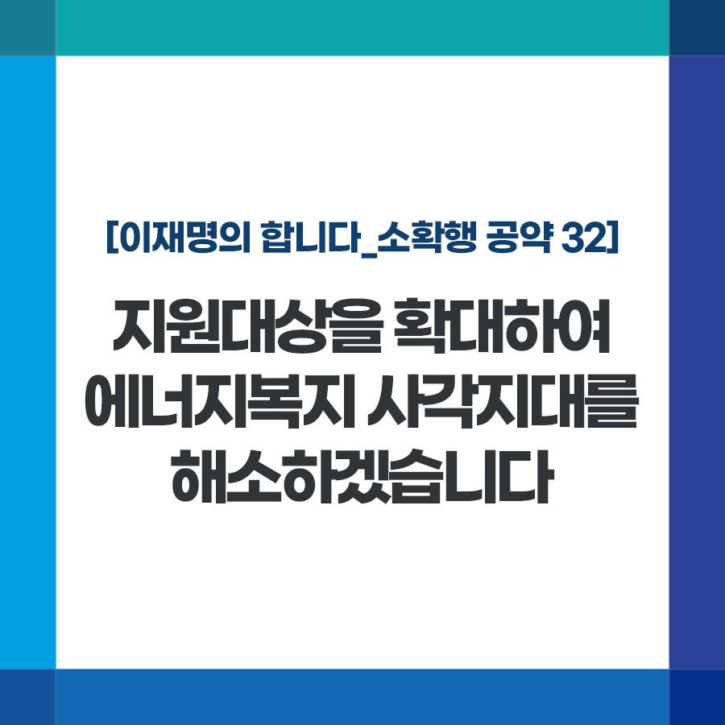

## 소확행 시리즈
# 지원대상을 확대하여 에너지복지 사각지대를 해소하겠습니다
> 2021-12-26 12:36:45

이재명의 합니다_소확행 공약 32

기후변화로 인한 폭염과 한파가 잦아지고 있습니다. 재작년 여름 서울은 111년 만에 최고 기온을 기록했고, 작년 여름에는 역대 최장 장마가 이어졌습니다.

​

혹독해지는 기후로 어려운 분들의 계절나기도 갈수록 힘겹습니다. 낮은 소득, 낡은 주택과 냉난방 설비 탓에 어려운 분들의 연료비 부담이 커져만 갑니다.

​

기초생활수급자, 차상위계층 중 상당수가 전체 소득 중 연료비 비중이 10%를 넘는 에너지 빈곤층으로 분류됩니다. 이제는 필수 생활용품이 된 에어컨 보급률도 서울 소재 저소득가구의 경우 18%에 불과한 실정입니다.

​

정부가 에너지복지를 지속적으로 확대하고 있지만 여전히 일부 저소득가구에 한정돼 있습니다.

​

기후변화 시대, 어려운 분들의 에너지 빈곤을 시급히 해소하겠습니다.

​

첫째, 기초생활수급자 중 일부로 한정된 에너지바우처 지급대상을 확대해 사각지대를 없애겠습니다.

​

1년에 약 200억원이면 더 많은 분들이 폭염과 추위에서 벗어날 수 있습니다.

​

둘째, 저소득층 절반 이상이 20년 넘는 노후주택에서 거주하고 있습니다. 노후 주택에 대한 단열, 냉방기기 지원 등 에너지효율개선 사업을 더욱 확대하겠습니다.

​

셋째, 잘 몰라서 지원받지 못하는 일이 없도록 행정력을 최대한 동원하겠습니다.

​

모든 국민이 보편적인 에너지 기본권을 누리는 것이 국가의 책무입니다. 에너지복지를 확대해 에너지 취약계층의 건강과 안전, 주거환경의 질을 높이겠습니다.