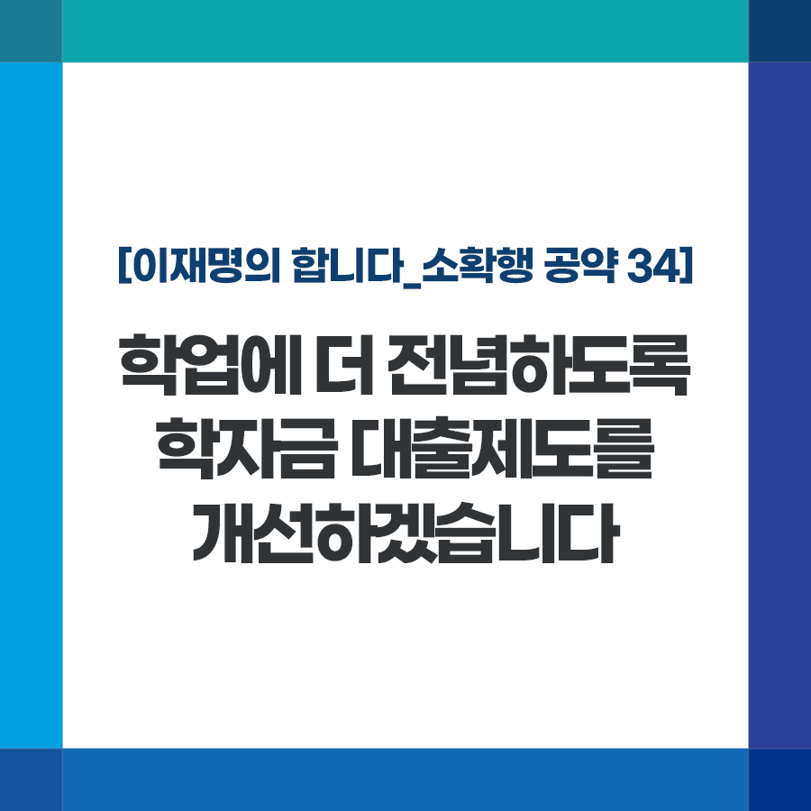

## 소확행 시리즈
# 학업에 더 전념하도록 학자금 대출제도를 개선하겠습니다
> 2021-12-29 10:47:32

이재명의 합니다_소확행 공약 34

매년 1월 초면 국가가 시행하는 내년도 1학기 학자금 대출 사전 신청이 진행됩니다.

​

안타깝게도 신청한 학생 중 취업 후 상환 학자금(ICL)을 이용할 수 있는 대상은 일부뿐입니다. 부모님 소득 및 재산을 기준으로 학부생은 소득 하위 48%(8구간), 일반대학원생은 27%(4구간)만이 대상자로 선정됩니다.

​

더불어민주당이 그동안 꾸준히 문제제기해 ICL 중 성적 요건을 폐지하고 일반대학원생까지 범위도 넓혔습니다. 1%대로 대출금리도 낮췄습니다.

​

그러나 여전히 상당수 학생들은 학비 및 생활비 부담을 느끼고 있고 연간 최고 2,000만 원에 달하는 등록금을 부담해야 하는 로스쿨과 같은 전문대학원생들은 아예 신청조차 못 합니다.

​

학비와 생활비 걱정에 아르바이트에 매달리고, 휴학하지 않도록, 자칫 이자 부담에 신용유의자로 전락하는 일이 없도록 부담을 대폭 낮추겠습니다.

첫째, 학부생은 제한을 두지 않고 ICL을 이용할 수 있도록 하겠습니다. 일반대학원생은 향후 8구간까지 대상을 확대하고, 로스쿨 등 전문대학원생도 ICL 이용이 가능하도록 하겠습니다.

​

둘째, 학자금 대출 상환 유예제도를 본인뿐만 아니라 배우자･자녀･부모 등 부양가족이 심각한 질병 및 사고를 당한 경우까지 확대 적용하겠습니다.

셋째, 졸업 성적이 우수한 저소득층 학생을 선정하여 학자금 대출 원리금을 탕감하여 안정적인 사회 첫걸음을 응원하겠습니다.

​

넷째, 연간 300만 원의 생활비 대출 한도액을 향후 500만 원까지 늘리겠습니다.

​

더 많은 학생들이 학업에 전념할 수 있고, 부모님의 부담을 덜도록 국가 시행 학자금 대출이 더 큰 희망이 되겠습니다.