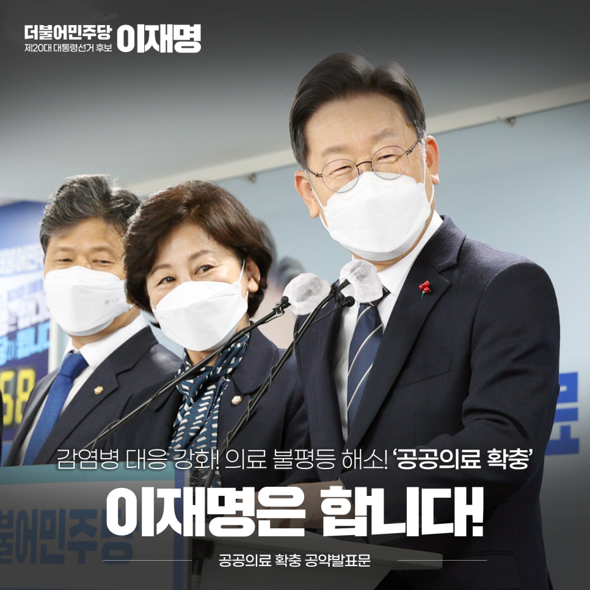
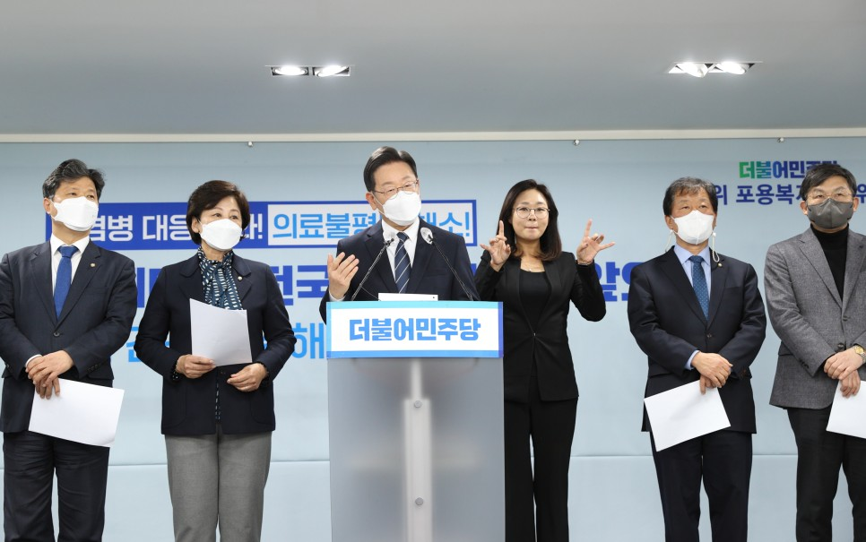
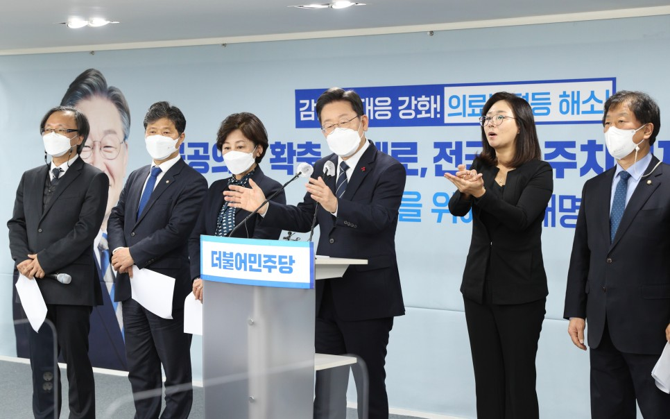
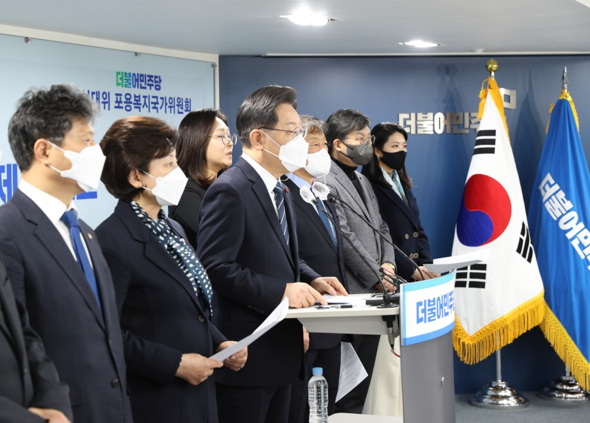
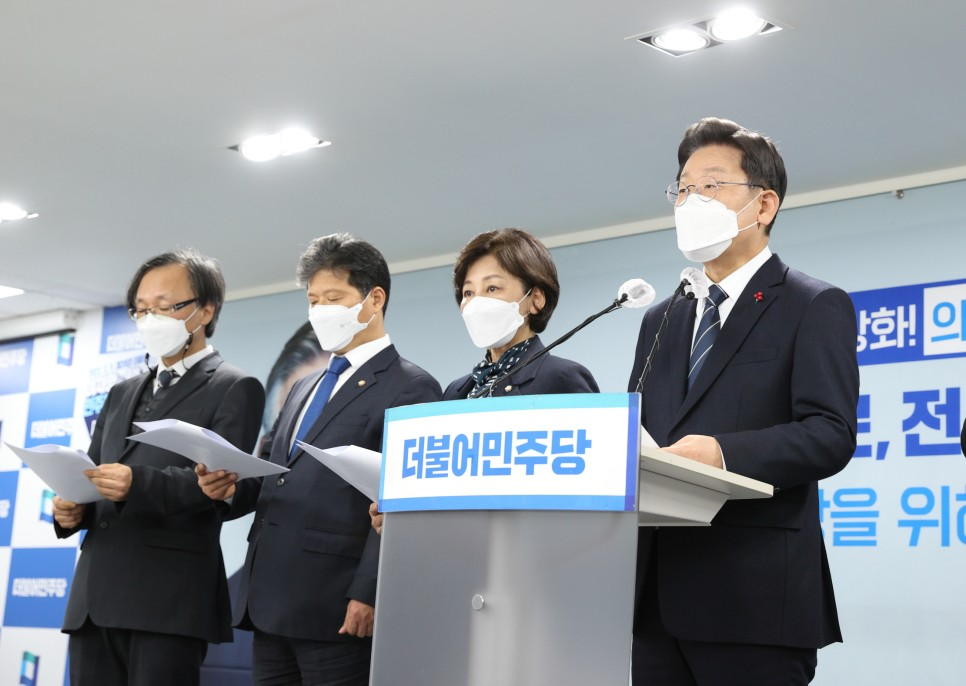
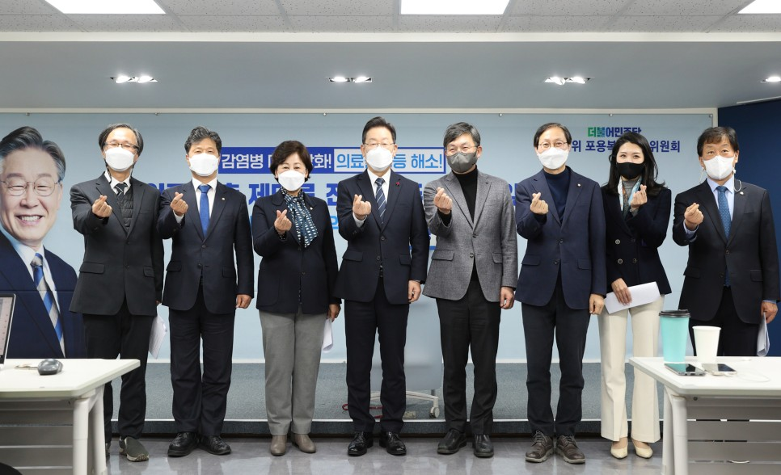

## 대표공약
# 감염병 대응 강화! 의료 불평등 해소! ‘공공의료 확충’, 이재명은 합니다.
> 2022-01-01 10:59:16

먼저, 이 시간 혹한의 추위에도 불구하고 현장에서 국민의 생명과 건강을 지키고 계신 전국의 수많은 방역관계자와 의료인 여러분께 진심으로 감사하다는 말씀을 드립니다.

​

여러분께서 실천하고 계신 희생과 헌신을 우리 대한민국 역사와 국민들은 잊지 않으실 것입니다.

​

코로나19가 시작된 지 2년여 시간이 지났습니다. 대한민국은 세계가 부러워하는 방역체계를, 또 방역성과를 만들었습니다. 그 자긍심과 자부심에는 우리 국민 한 분 한 분의 눈물 어린 헌신과 협력이 함께하고 있습니다.

​

사회적 거리두기와 코로나 진단검사, 백신접종, 그리고 치료 예방에도 적극적으로 참여해 주셨습니다. 우리 대한민국은 위대하고 대한 국민은 더 위대했습니다.

​

안타깝게도 국민의 헌신적인 노력에도 불구하고 전 세계적으로 다시 창궐하고 있는 코로나 팬데믹 위협이 다시 우리 앞에 다가왔습니다. 지금 우리는 국난 극복의 가혹한 시험대에 서게 됐습니다.

​

이번 코로나19에서 2003년 사스, 2015년 메르스까지 이제 감염병 창궐은 지나가는 일회성이 아니라 국가의 커다란 재난 요소가 됐다는 점이 확인됐습니다.

​

정부는 2015년 메르스 사태 이후, 중앙과 권역에 감염병전문병원 설립을 약속했습니다. 그러나 안타깝게도 지금까지 제대로 된 시설을 갖춘 감염병전문병원은 하나도 없습니다.

​

공공병상 비중은 여전히 10%에 불과합니다. 대다수 공공병원은 300병상 이하의 소규모 병원이고 공공의료 인력도 턱없이 부족한 실정입니다.

​

이제 정부가 나서서 감염병 창궐을 국가 재난으로 상정하고 철저하게 점검하고 완벽하게 대비해야 합니다. ‘할 수 있다’는 막연한 표어보다는 ‘할 수 있도록’ 정부가 나서야 합니다.

저는 이번 코로나 팬데믹 위기를 대한민국 공공의료 체제 대전환의 기회로 삼겠습니다. 소를 잃었다 해도 외양간은 반드시 고쳐야 합니다. 그래야 다시는 더 이상 소를 잃지 않을 테니까요.

​

저는 한 사람의 시민으로 지역의 공공의료원 설립 운동을 주도한 경험이 있습니다. 공공의료원이 서민과 소외계층에게 얼마나 절실한지 현장에서 배우고 깨우쳤습니다. 탁상공론의 벽에서 겪은 좌절감이 저를 현실 정치로 뛰어들게 만들었습니다.

​

성남시장에 당선된 후, 일부 기득권과 정치세력의 저항을 뚫고 시민을 위한 성남시의료원을 건립해냈습니다. 경기도지사 때는 과감한 결단으로 도립의료원을 신축하고 의료원의 현대화를 위해서 적극적인 투자를 단행했습니다. 지금 성남시의료원은 대한민국 공공의료 영역에서 가장 혁혁한 공로를 만들어내고 있습니다.

​

길을 가 본 사람이 길을 잘 알고 일을 해 냈던 사람이 확실하게 일을 할 수 있습니다. 이재명의 경험과 실천력으로 대한민국 공공의료의 전환을 만들어내겠습니다. 감염병 대응 역량 강화는 물론 공공의료를 대폭 확충하겠습니다. 국민의 생명과 안전을 지키고 서민과 소외계층에 대한 의료 불평등을 해소하겠습니다.

​

국민이 아프면 치료받아야 합니다. 이재명 정부는 아프면 누구나, 언제, 어디서나, 차별 없이 치료받을 수 있는 의료 권리를 보장하겠습니다.

​

지금부터 국민의료권리 보장을 위한 공공의료 4대 공약을 말씀드리겠습니다.

첫째, 대한민국 전역에 공공병원을 충분히 마련하겠습니다.

필요한 지역에 우수한 공공병원 신축과 증축을 통해서 지역 간 의료 격차를 적극적으로 해소하겠습니다.

​

70군데 중진료권별로 공공병원을 1개 이상 확보하겠습니다. 중증질환을 치료할 수 있는 병원이 부족한 지역은 국립대병원을 신축하거나 증축하고 민간병원을 상급종합병원으로 지정하는 방식의 의료 역량을 강화해 나가겠습니다. 필요하다면 민간병원을 인수해 공공의료 역할을 부여하는 방안을 추진하겠습니다.

​

공공병원뿐만 아니라 보건소를 확충해서 방역은 물론이고 거동불편 노인과 장애인에 대한 재택 의료를 현실화하겠습니다. 중앙과 권역 감염병전문병원을 조속하게 건립하겠습니다. 중앙은 감염병 의료 대응을 총괄·조정 역할을 하고 권역은 권역 내에 병상의 공동 대응, 환자 전원·이송과 같은 권역 내 협업체계를 구축하는 역할을 수행할 것입니다.

​

현재 추진 중인 감염병전문병원은 신속한 설립하도록 하겠습니다. 이와 함께 수요를 파악해 권역 감염병전문병원을 추가로 확충해 나가겠습니다.

둘째, 필수 의료 인력을 충분히 확보하겠습니다.

제대로 된 공공의료 체계를 갖추려면 먼저 충분한 의료인이 필요합니다. 현재 중앙과 지역, 도시와 시골의 상주 의료인 편차가 매우 심각합니다.

​

공공·필수 의료 분야의 인력 양성을 위해서 국립보건의료전문대학원을 설립하겠습니다. 의대가 없는 지역에는 의대를 신설하겠습니다. 의대 정원을 합리적으로 증원하되 운영을 내실화해서 의학교육의 질을 높이고 환자의 안전을 책임지겠습니다.

​

응급ㆍ외상ㆍ심뇌혈관ㆍ암 같은 중증질환은 물론이고 내과ㆍ외과ㆍ산부인과ㆍ소아과 같은 필수 진료 분야에 대한 지원을 통해서 국가의 책임을 강화하겠습니다. 교육ㆍ수련 비용 지원, 근무환경 개선을 통해서 진료 과목에 따른 의료인력의 심각한 불균형을 해소 또는 최소한 완화하겠습니다.

​

역학조사관과 같은 감염병 대응 의료인력 양성체계를 마련하고 감염병 전담 의료기관과 의료진에 대한 지원도 아끼지 않겠습니다.

​

수술이 필요한 응급환자가 발생해도 필수진료를 담당할 전문 의료진이 없어서 생사의 골든타임을 놓치는 환자가 너무 많습니다.

​

일정 규모 이상의 병원에서는 필수의료인력을 충분히 채용할 수 있도록 시스템을 바꿔나가겠습니다.

​

지역 필수의료 분야에 대해서는 별도의 수가 가산제를 도입하여 지역별 의료자원의 불균형과 의료서비스 격차를 해소하겠습니다.

​

지역의사제, 지역간호사제를 도입해서 지역·공공·필수 의료 인력을 충분히 확보하겠습니다. 지역 의대와 간호대는 해당 지역 인재를 더 많이 선발하고 육성하겠습니다. 우수한 간호인력 확보와 적정 배치, 처우개선을 위한 법적·제도적 기반도 마련하겠습니다.

​

지방의료원의 의료 인력 확보와 서비스 질 향상을 위해서 공공임상교수제도를 도입하겠습니다. 국립대병원 소속 교수가 지역거점병원에서 환자를 진료하면서 수련의들의 교육과 연구를 지원하도록 하겠습니다.

셋째, 지역 의료기관들의 협력체계를 구축하겠습니다.

병상과 인력 부족으로 치료받지 못하는 환자가 있어서는 결코 안 됩니다. 감염병 진료체계의 핵심인 병상동원체계를 제대로 구축하겠습니다.

​

국립대병원을 중심으로 각 지역 병원들과 진료 협력체계를 구축하겠습니다. 구축된 협력망을 통해서 감염병 환자의 분류와 이송을 신속하게 하는 효과적이고 효율적인 공공의료 협력 시스템을 정착시킬 것입니다.

​

지방에도 뛰어난 진료와 연구 역량을 갖춘 국립대병원들이 있습니다. 국립대병원을 거점으로 지역 병원과 의원을 연결해서 지역 주민들이 고품질 의료서비스를 받도록 조치하겠습니다.

​

정보통신기술을 적극적으로 활용해서 지역 내 의료기관들이 거점병원을 중심으로 협력하는 지역의료 네트워크를 구축하겠습니다.

​

코로나19 대응 과정에서 민간의료기관의 기여가 참으로 컸고, 지금도 매우 큰 역할을 하고 있습니다. 이미 작동된 공공-민간 파트너십을 공공의료와 의료 불평등 해소에 적극적으로 활용하겠습니다.

​

민간 의료자원의 충분한 활용을 위한 체계적 시스템을 마련하고 민간병원이 공공의료 역할을 대신 수행할 경우에는 정부의 든든한 재정적ㆍ정책적 지원을 통해서 ‘아 혹시 손해 보는 것 아닐까’라는 그런 우려를 하시지 않고 과감하게 공공의료정책에 참여하실 수 있게 하겠습니다.

넷째, ‘전 국민 주치의 시대’를 열겠습니다.

일상에서 많은 국민들이 갑자기 아프고 몸에 이상을 느낄 때 어떻게 대처해야 할지 몰라서 당황하는 경우가 많습니다. 정확한 진단과 적절한 치료를 위한 의료기관과 의사가 반드시 필요합니다.

​

무턱대고 일단 대학병원부터 찾고 우왕좌왕 이 병원 저 병원 옮겨 다니다 보면 의료 비용도 증가되고 치료 시기도 놓치는 그런 불이익이 발생합니다. 사회적 비용이라고 하겠습니다.

​

내 건강을 정확하게 알고 있는 의사가 있다면 병으로부터 예방과 진료에 드는 시간과 비용 절감은 물론이고 신속하고 정확한 진단으로 일상에서 건강을 지킬 수 있습니다.

​

국민 한 분 한 분의 건강을 가까이서 꼼꼼하게 챙겨줄 주치의가 반드시 필요합니다.

​

우선 급한 대로 노인, 장애인, 아동과 같은 각별한 돌봄과 보호가 필요한 분들부터 시작하겠습니다. 나아가서 단계적으로 모든 국민에게 확대 적용하도록 하겠습니다. 집 가까이에서 나를 위한 든든한 전담 주치의가 나의 건강을 꼼꼼히 체크하고 지켜주는 전 국민 주치의 시대를 열어 가겠습니다.

​

존경하는 국민 여러분!

사랑하는 보건의료인 여러분!

​

국가 제일의 사명은 국민의 건강과 생명을 지키는 것입니다. 공공의료는 국민에게 베푸는 시혜가 아닙니다. 국민이 누려야 할 당연한 권리이고 국가가 국민에게 부담하고 있는 의무입니다. 국민 누구나 차별 없이 제대로 된 의료서비스를 받는 것이 공평한 나라를 만드는 기본이자 공정한 나라의 척도라고 믿습니다.

​

국민의 건강과 생명을 두고 시장 논리를 앞세워선 안 됩니다. 사업성과 적자를 이유로 국민 건강을 방기해서도 안 됩니다. 국민의 건강과 생명을 보호하는 일보다 중요한 것이 대체 무엇이겠습니까? 이재명 정부는 과감하게 국민의 건강과 생명을 제일 앞에 핵심 국가과제로 두겠습니다.

​

저는 어린 시절 공장에서 일해야 했던 소년공이었습니다. 그때 다친 굽은 왼팔이 평생의 장애로 남아 있습니다. 굽은 팔을 안고 곧은 세상을 만들기 위해서 지금까지 달려왔습니다.

​

우리 아이들에게 불합리하고 불공평하고 또 불공정한 세상을 물려줘서는 안 된다는 뼈저린 각오 때문입니다. ‘돈보다 생명이 먼저입니다.’ 그런 세상을 꼭 만들겠습니다.

​

가난이라는 굴레로, 또 지역에 산다는 이유로 다치고 아파도 치료받지 못하는 나라, 이제 끝내야 되지 않겠습니까?

​

이재명이 국민과 함께 이제 끝내겠습니다.

건강한 오늘과 행복한 내일을 꿈꾸는 그런 미래가 있는 나라를 만들겠습니다.

​

공공의료 확충, 제대로

전 국민 주치의제, 앞으로

건강한 나를 위해, 이제는 유능한 이재명!

​

감염병 대응 강화! 의료 불평등 해소!

이재명은 합니다. 고맙습니다.

​

​

​

2021년 12월 31일

더불어민주당 제20대 대통령 후보 이 재 명