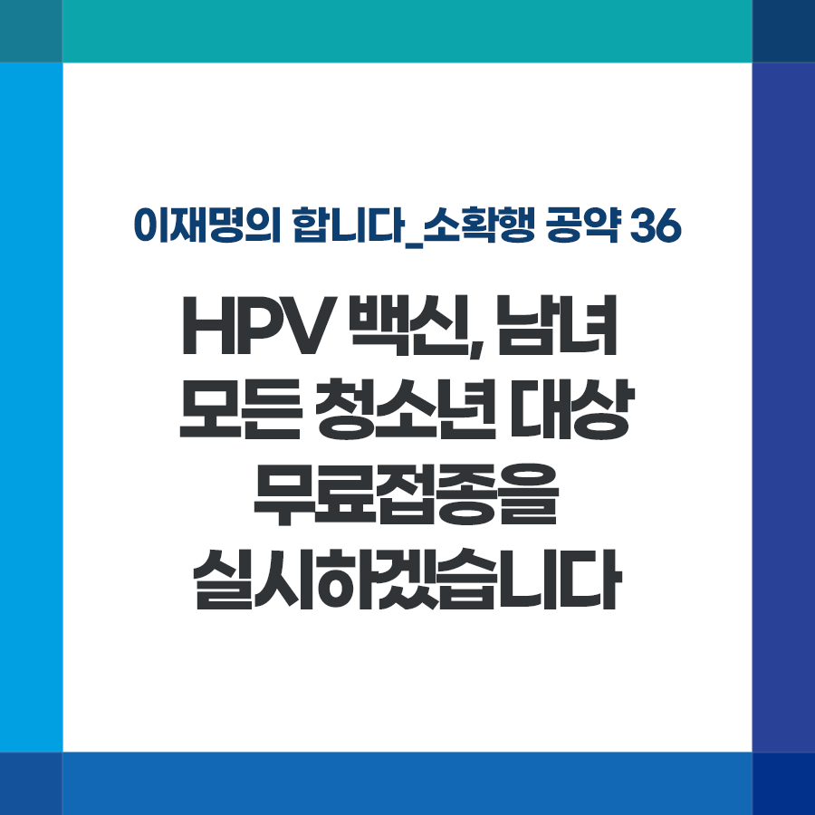

## 소확행 시리즈
# HPV 백신, 남녀 모든 청소년 대상 무료접종을 실시하겠습니다
> 2022-01-01 11:10:14

이재명의 합니다_소확행 공약 37

여성의 자궁경부암, 남녀 모두의 항문암과 생식기 사마귀 등을 유발하는 HPV(사람유두종바이러스)를 예방하기 위한 백신은 조기에 접종해야 효과적입니다.

​

작년까지는 만 12세 여성만 무료 접종을 실시했습니다. 그러나 최대 60만 원에 이르는 백신 비용 때문에 접종율이 낮아 지원 대상을 확대해야 한다는 요구가 높습니다.

​

다행히 정부가 올해부터 만 12~17세 모든 여성 청소년과 만 18~26세 저소득층 여성 청년까지 접종 지원을 확대했습니다.

​

그러나 HPV는 성 접촉을 매개로 남녀 모두 감염되기에 성별과 관계없이 접종해야 효과가 높음에도 일명 ‘자궁경부암 백신’으로 알려지면서 남성 청소년은 접종 지원 대상에서 제외돼 있습니다.

​

이낙연 위원장님께서 이런 점을 지적, "HPV 백신 접종을 국가가 책임지겠다"고 약속하신 바 있습니다. 저도 전적으로 동의하며 신속히 추진하겠습니다.

​

첫째, 여성 청소년과 동일하게 만 12세부터 17세 이하 모든 남성 청소년에게 HPV 백신 무료접종을 지원하겠습니다.

​

둘째, 아울러 현행 ‘건강 여성 첫걸음 클리닉 사업’의 명칭을 ‘HPV 백신 국가예방접종 사업’으로 변경해 남녀 청소년 누구나 자신의 건강을 지키도록 하겠습니다.

​

최대한 많은 분들이 적기에 접종할 수 있도록 홍보도 강화하겠습니다.

​

청소년 여러분 모두의 건강한 성장과 삶을 위한 HPV 백신 접종, 국가가 책임지겠습니다.