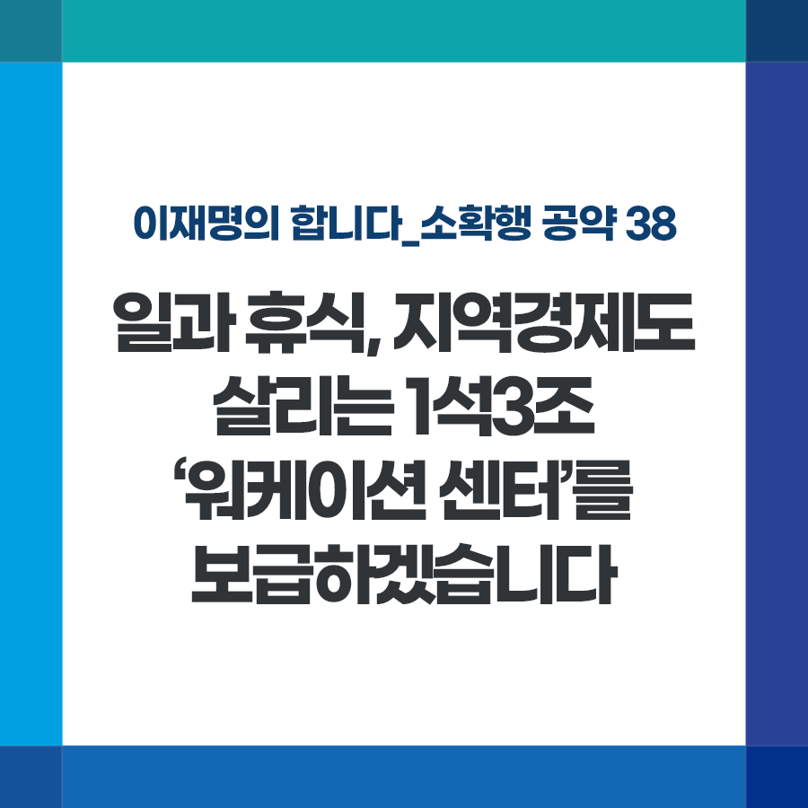

## 소확행 시리즈
# 일과 휴식, 지역경제도 살리는 1석3조 ‘워케이션 센터’를 보급하겠습니다
> 2022-01-04 16:30:36

이재명의 합니다_소확행 공약 38

직장과 거주지가 달라도 되는 세상이 오고 있습니다.

​

코로나19로 재택, 원격근무가 일상적인 근무 형태로 자리 잡아가고 있습니다. 우리나라 100대 기업 91.5%가 재택근무를 시행했으며, 코로나 이후 이런 추세는 더욱 확대되고 있습니다.

​

직장은 서울에서 구하더라도, 꼭 서울에 살면서 일해야 할 이유가 없어지는 것입니다. 이런 변화를 지방 소멸위기를 극복하는 기회로 활용할 필요가 있습니다.

​

현재 전국 40%에 달하는 지방이 인구감소로 소멸 위기에 놓여 있습니다. 그러나 지방은 풍부한 관광 휴식 자원을 가지고 있습니다.

이를 효과적으로 연계하여 일과 휴가, 관광을 접목하는 이른바 워케이션(Workation)으로 3마리 토끼를 잡겠습니다.

​

첫째, 소멸 위기 지역을 중심으로 일과 휴식, 관광을 연계할 수 있는 ‘워케이션 센터’를 설치하겠습니다.

​

둘째, 어느 곳이건 직장과 동일한 업무 환경을 구현하도록 초고속 인터넷망, OA센터, 각종 비대면 회의실 설치 등에 필요한 예산을 지원하겠습니다.

​

셋째, ‘워케이션 센터’ 이용자들에게 지역상품권을 보다 저렴하게 구입하도록 지원해 지역경제 활성화도 돕겠습니다.

​

넷째, ‘워케이션 센터’를 활용하는 기업들에게는 기업이 부담하는 ‘근로자 휴가지원비’를 추가 지원하겠습니다.

​

새로운 시대 변화, 고용환경 변화에 발맞춰 일과 휴식이 균형 잡힌 삶을 지원하고, 어려운 지역경제도 함께 살리겠습니다.