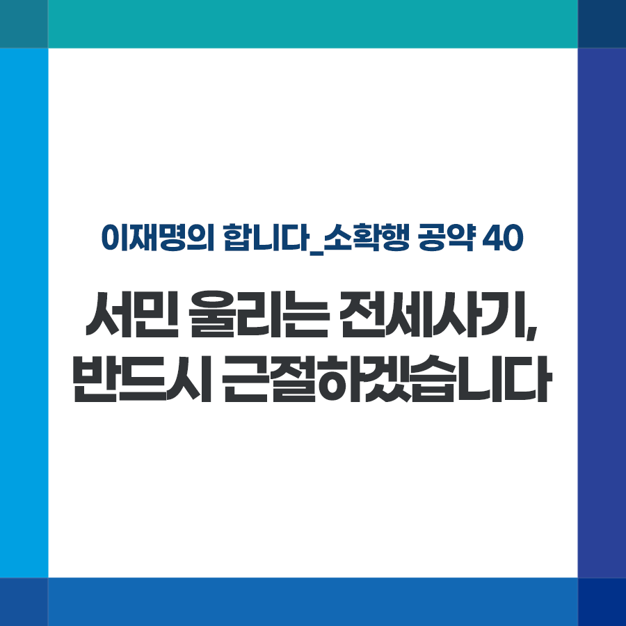

## 소확행 시리즈
# 서민 울리는 전세사기, 반드시 근절하겠습니다
> 2022-01-06 11:03:13

이재명의 합니다_소확행 공약 40

전세 사기는 서민 주거 안정을 위협하는 반사회적 범죄입니다.

​

주택도시보증공사에 따르면 전세 사기를 저지른 악성 임대인이 작년 10월 기준 154명이며, 이들이 저지른 보증금 미반환 사례는 1194건, 피해액은 2,433억 원입니다.

​

특히 피해자들의 3분의 2 이상이 대학생, 사회초년생, 신혼부부 등 2030청년세대입니다.

​

관련자에 대한 강력한 처벌과 예방 시스템 구축, 피해 회복 지원으로 전세 사기를 근절하겠습니다.

​

첫째, 경기도지사 시절 만든 ‘깡통전세 피해 예방 상담센터’를 전국으로 확대하고 주택도시보증공사(HUG)와 기타 보증기관과의 연계를 강화하겠습니다.

​

누구나 쉽게 교육과 피해 상담을 받도록 관련 기관 간 연계를 강화하고, HUG와 같은 공공기관이 전세 사기 의심자 형사고발 조치를 적극적으로 실시하도록 하겠습니다.

​

둘째, 전세 사기에 가담한 공인중개사 및 무자격 공인중개사 처벌을 강화하겠습니다.

​

중개의뢰인에 대한 성실, 보호 의무를 저버리고 신뢰를 악용한 만큼 처벌 수위와 손해배상 책임도 강화하겠습니다.

​

셋째, 금융 시스템과 연계해 임차인이 해당 부동산에 대한 근저당권 설정 진행 여부를 확인할 수 있게 하겠습니다.

​

현재는 근저당권 설정이 완료된 부동산은 계약단계에서 알 수 있지만, 근저당권 설정이 진행되는 경우에는 확인할 길이 없습니다.

​

그러다 보니 계약이 끝난 후 뒤늦게 근저당권이 발견돼도 임차인은 대응할 방법이 없습니다. 이를 개선해 임차인의 피해를 예방하도록 하겠습니다.

​

서민이 어렵게 마련한 보증금 가로채는 전세 사기, 강력하게 대응해 반드시 근절하겠습니다.