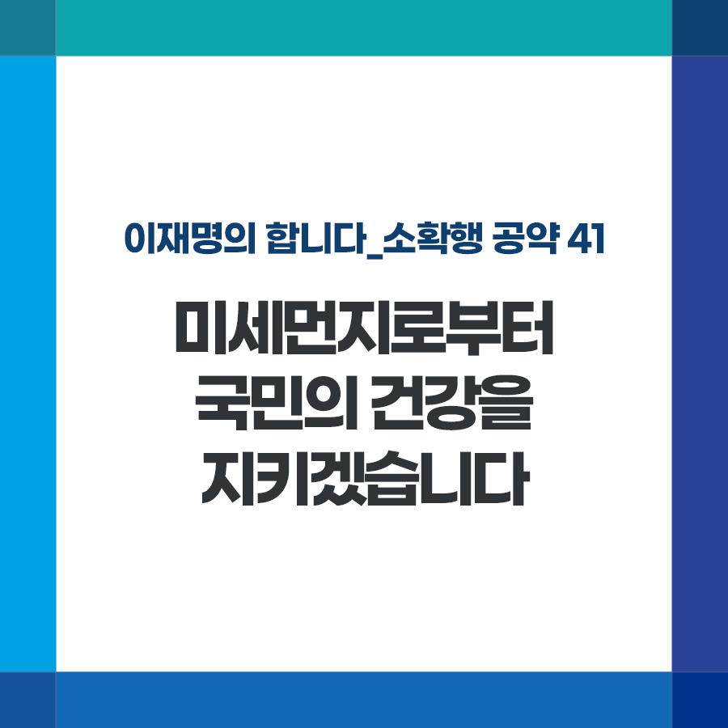

## 소확행 시리즈
# 미세먼지로부터 국민의 건강을 지키겠습니다
> 2022-01-07 09:32:20

이재명의 합니다_소확행 공약 41

팬데믹 기간 동안 생산과 소비가 줄면서 많은 사람들이 미세먼지 없는 맑은 하늘을 자주 경험했습니다.

그럼에도 여전히 전국 80% 지역에서 미세먼지가 연평균 환경기준을 초과할 만큼 국민의 건강과 일상을 괴롭히고 있습니다.

일상이 회복되면 기쁨과 함께 다시 미세먼지와의 싸움도 시작될 것입니다.

가정과 직장 주변에서 국외 유입까지, 지역별 맞춤형 대책으로 절반 이상의 지자체에서 연평균 환경기준을 달성할 수 있도록 하겠습니다.

첫째, 현행 미세먼지 계절관리제를 한층 개선하고 강화하겠습니다.

생활권 인근 사업장 배출을 줄이고, 노후 건설장비의 무공해 전환을 적극 추진하겠습니다. 주민들이 점검과 대책 검토에 직접 참여하도록 하겠습니다.

둘째, 관리 사각지대에 있는 소규모·영세사업장(4·5종)의 배출 저감 지원사업을 대폭 확대하겠습니다. 영세사업자의 부담도 최소한으로 줄이겠습니다.

셋째, 미세먼지 실시간 관측, 분석 및 맞춤형 대응이 가능한 ‘스마트 클린 도시’를 확대 조성하겠습니다.

넷째, 국외 유입 문제에도 적극 나서겠습니다.

한중 양국간 대기질 개선 협력체계인 ‘청천(晴天) 계획’을 직접 점검하고 ‘아·태 다자간 대기협정’을 주도적으로 추진하겠습니다.

국민들께서 체감할 수 있도록, 미세먼지 걱정 없는 맑은 하늘을 되찾겠습니다.