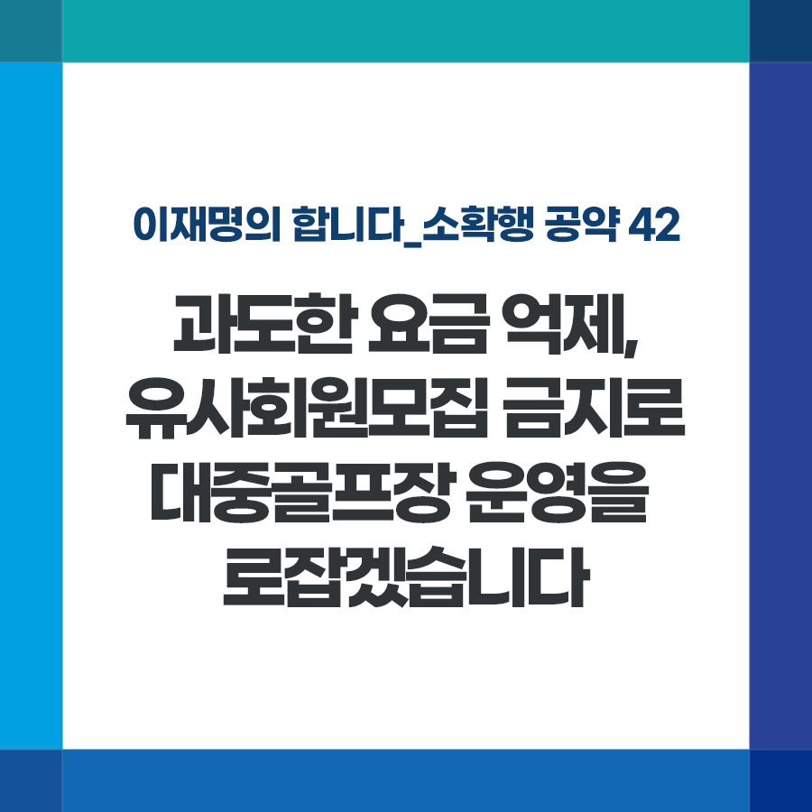

## 소확행 시리즈
# 과도한 요금 억제, 유사회원모집 금지로 대중골프장 운영을 바로잡겠습니다
> 2022-01-08 11:15:41

이재명의 합니다_소확행 공약 42

IMF로 지친 국민들에게 큰 위로가 됐던 박세리 선수의 활약을 기억합니다. 그 이후 골프는 국민들에게 큰 사랑을 받았고 이제 대중스포츠로 자리 잡았습니다.

이에 역대 정부도 골프 대중화를 위해 노력해왔습니다. 세금 감면 등을 통해 대중골프장 보급을 추진했고 그 결과 대중골프장은 지난 10년간 2배나 증가했습니다.

이러한 인프라 확대에 힘입어 젊은 세대로 이용층도 대폭 확대되었습니다. 코로나 이후에는 국외 수요까지 몰리면서 이제 골프시장 규모는 5.6조에 이르렀고 앞으로도 높은 성장세가 예상되고 있습니다.

하지만 그간 비싼 이용료와 금지된 유사회원모집 등으로 이용객의 불만이 높습니다. 더구나 코로나 이후 이용자 급증을 틈타 지난 2년간 19%에 달하는 요금을 인상한 것은 횡포나 다름없습니다.

골프 인구 500만 시대에 걸맞게 대중골프장 운영 방식을 건전화하겠습니다.

첫째, 대중골프장의 회원제식 운영을 근절하겠습니다.

지난 연말 통과한 체육시설법에 따라 대중골프장의 회원모집 금지, 이용우선권 제공과 판매 금지 등의 규정이 잘 지켜지도록 문체부와 지자체의 유기적 협조 아래 철저히 감독하겠습니다.

둘째, 대중골프장 운영심사제를 도입하겠습니다.

체육시설법 개정 후속 조치에 따른 규정을 신설해 일방적인 요금 인상을 억제하고 적정 수준을 유지하도록 관리를 강화하겠습니다.

지난해 대중제 골프장 전체에 감면해준 세금 액수가 7,000억이 넘는다고 합니다.

국민이 편리하고 쾌적하게 이용하도록 혜택을 보장한 만큼, 앞으로는 제대로 운영되도록 철저하게 점검하고 바로 잡겠습니다.