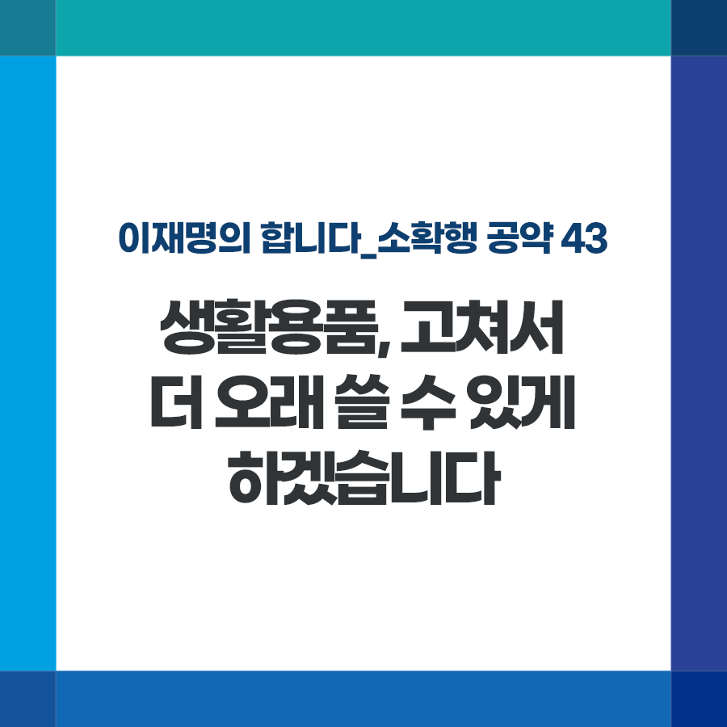

## 소확행 시리즈
# 생활용품, 고쳐서 더 오래 쓸 수 있게 하겠습니다
> 2022-01-11 08:48:33

이재명의 합니다_소확행 공약 43

퀴즈하나 드립니다. 휴대폰, 노트북 등 전자제품 수명을 1년 연장하면 자동차 몇 대에 해당하는 탄소배출량을 줄일 수 있을까요?

놀라지 마십시오. 무려 자동차 200만대가 배출하는 400만톤의 탄소배출을 줄일 수 있다는 연구결과가 있습니다.

텀블러의 고무 패킹 등 부품을 따로 구할 수 없어 텀블러를 통째로 버린 경험 있으시죠? 일회용 쓰레기를 줄이고자 시도한 변화지만 더 많은 새로운 쓰레기를 양산하는 셈입니다.

휴대폰 같은 IT 제품은 고장 나면 제법 비용을 들여 공인 또는 사설서비스센터를 통해 수리해야만 합니다. 그마저 제조사 부품 보관 주기가 짧아 결국 새 제품을 구매해야 하는 경우도 비일비재합니다.

이처럼 우리 생활용품 수명만 연장해도 탄소를 획기적으로 줄일 수 있습니다.

‘고쳐 쓰고 오래 쓸 소비자의 권리도 보장하고 기후위기에도 더 효율적으로 대처하겠습니다.

첫째, 주요 생활용품의 소모성 부품 보유 및 판매 기간을 현행보다 늘리거나 새로 도입하겠습니다.

정부는 기업이 효율적인 부품 보유와 수리 편의를 위한 제품 규격화에 나설 수 있도록 필요한 지원을 뒷받침하겠습니다.

둘째, 전자제품, 가전제품의 소비자 수리권을 확대하겠습니다.

수리용 부품 보유 의무 및 보유 기간을 확대하고, 수리 매뉴얼 보급 등으로 편리하게 고쳐 쓸 수 있게 하겠습니다. 국회에 제출된 관련 법안도 조속히 통과되도록 하겠습니다.

소비자 수리권이 확대되면 수리·서비스 시장도 커져 새로운 중소기업, 소상공인의 참여도 더욱 활성화될 것입니다.

이제 우리 생활에서부터 탄소저감 노력을 기울일 때입니다. 소비자 권리 보호와 생활폐기물을 줄일 수리권 보장도 반드시 필요합니다. 이재명 정부가 돕겠습니다.