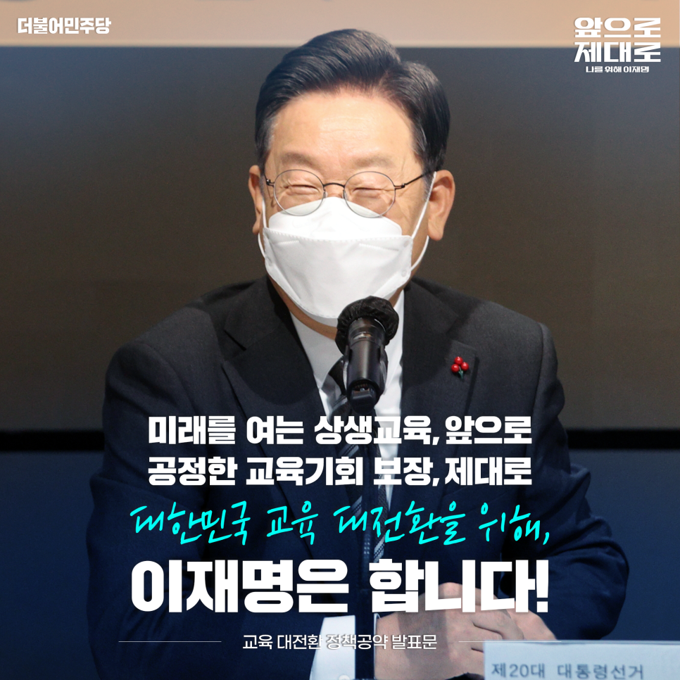

## 대표공약
# 미래를 여는 상생교육, 앞으로 공정한 교육기회 보장, 제대로 대한민국 교육 대전환을 위해, 이재명은 합니다!
> 2022-01-11 08:59:47

가난한 부모는 있다 손 치더라도 가난한 아이가 있어서는 안 됩니다.

대한민국에서 더 이상, 금수저 흙수저라는 말이 대물림돼선 안 됩니다.

​

존경하는 국민 여러분, 저는 오늘 절박한 마음으로 이 자리에 섰습니다.

우리 사회의 불평등과 격차의 시작은 교육의 양극화에서 비롯된다고 해도 과언이 아닙니다.

​

많은 분들이 저를 두고 ‘개천에서 용 났다’고 말씀하십니다. 가난한 소년공이 검정고시를 통해 성장한 성공스토리가 더 이상 우리사회의 모범이 돼선 안 됩니다.

​

하늘에서 별 따기 만큼 힘든 특수한 상황을 일반화시켜서는 안 됩니다. 국가는 공부하고 싶은 아이들이 마음껏 공부할 수 있는 공평한 교육으로 국가책임교육을 실현해야 합니다.

​

아이들의 꿈이 실현되는 교육, 밟고 일어서는 경쟁이 아닌 쓰러진 친구를 일으켜 세우는 배려를 가르치는 교육, 배우고 싶은 모든 국민이 삶의 새로운 성장을 추구할 수 있는 교육, 더불어 사는 공동체의 소중함을 누리는 교육으로 대한민국 교육 대전환을 만들어야 합니다.

​

이재명 정부, 돌봄에서 평생교육까지 국가책임교육을 확고히 하겠습니다. 교육 기회의 사다리를 더 공평하고 단단하게 세우겠습니다. 모든 아이가 함께 성장하는 상생 교육을 실현하겠습니다. 미래를 여는 교육으로 대한민국의 성장 동력을 탄탄히 하겠습니다.

이를 위한 이재명 정부의 8대 교육 공약을 말씀드리겠습니다.

첫째, 우리 아이들의 돌봄을 국가가 책임지겠습니다.

유치원과 어린이집을 단계적으로 통합하여 영유아들이 좋은 환경에서 자랄 수 있게 고른 돌봄과 교육으로 보살피겠습니다.

​

장애 영유아처럼 각별한 돌봄이 필요한 아동들에게는 차별 없는 통합 돌봄이 이뤄지도록 하겠습니다.

​

유치원과 어린이집, 초등 돌봄교실에 양질의 문화예술체육 프로그램을 도입하여 아이들의 특기를 조기에 개발할 수 있도록 하겠습니다.

​

초등학교 저학년이 ‘나 홀로 아동’으로 방치되는 것은 반드시 막겠습니다. 초등학생 오후 3시 동시 하교제를 추진하고 저녁 7시까지 방과후 돌봄 시간을 연장하겠습니다.

​

교육지원청과 지방정부가 협력해 돌봄 인력을 체계적으로 관리하고 돌봄이 필요한 아동들은 질 좋은 돌봄 프로그램으로 잘 보살피겠습니다.

​

이와 함께 돌봄 전용교실을 마련하여 아이들이 머무르고 싶은 교실 부모님이 안심하고 맡기는 교육공간으로 바꾸겠습니다.

​

교육청과 지방정부가 함께 긴급돌봄센터를 구축하여 야간돌봄·긴급돌봄 등 꼭 필요하고 요긴한 적재적소의 돌봄 수요기반을 확립하겠습니다.

둘째, 디지털 전환 교육으로 미래 경쟁력을 책임지겠습니다.

세계는 지금 디지털혁명중입니다. 우리 아이들이 4차 산업혁명의 주인공이 되어야 합니다. 메타버스 ․ AI 등 디지털 혁신교육을 신속하게 도입하겠습니다.

​

디지털시대를 주도할‘100만 혁신 미래인재’를 양성하겠습니다.

​

초·중·고교의 디지털 역량 교육을 강화하겠습니다. 대학에서는 숙련된 고급 전문가를 배출할 수 있도록 교육의 수준과 질을 한 차원 더 업그레이드 하겠습니다.

​

디지털 산업, 디지털 사회로의 신속한 전환과 정착을 위하여 디지털 교육인력, 개발 전문인력, 산업인력을 양성하겠습니다.

​

코로나 팬데믹을 지나며 이제 디지털 기기는 교육의 필수품이 됐습니다. 학생 모두에게 1인 1 디지털 학습기기를 지급하겠습니다.

​

교육판 ‘넷플릭스’라고 할 수 있는 온라인 교육 플랫폼 K-Eduverse를 구축하여 학생도 교사도 언제 어디서나 양질의 콘텐츠를 활용할 수 있도록 하겠습니다.

​

디지털 전환교육은 새로운 시대전환의 시작입니다. 디지털 전환교육으로 우리사회의 격차를 해소하고 개인은 물론, 국가가 함께 성장하는 대전환의 다리를 만들겠습니다.

셋째, 공교육 국가책임을 확대해 교육 기회의 사다리를 공정하게 복원하겠습니다.

코로나 팬데믹은 공교육의 결손을 만들었습니다. 먼저 공교육의 공백부터 신속하게 회복시키겠습니다. 방과 후와 방학을 활용해 다양한 교육 회복 프로그램을 제공하고 학습 보완의 기회를 마련하겠습니다.

​

학생들의 기본학력은 국가가 반드시 책임지겠습니다. 빅데이터·AI를 활용한 K-Eduverse를 기반으로 개인별 맞춤형 수업 및 학습방안을 점검하여 학생 개개인에 적합한 교육을 시행하겠습니다.

​

초등학교에서부터 기본학력을 찬찬히 살펴 특별한 도움이 필요한 학생들에게는 기본학력 전담교사를 확충하여 배치겠습니다.

​

중학교 3학년의 기본학습역량을 진단하여 학습 필요 학생에게는 보충교육의 기회를 제공하고 향후 고교학점제와 연동될 수 있도록 하겠습니다.

​

학교교육의 여건과 환경을 확실하게 개편하겠습니다. 초등학교 저학년부터 20명을 목표로 학급당 학생 수를 단계적으로 줄여나가겠습니다.

​

교육복지 우선지원사업 대상 학교를 확대해 지역 간 교육격차를 적극적으로 해소하겠습니다. 장애학생, 다문화가정, 새터민청소년과 같은 다양한 소수문화 학생에 대한 지원도 꼼꼼하게 챙기겠습니다.

​

학교 밖 청소년도 따뜻하게 품겠습니다. 학교 밖 청소년 교육 바우처를 통해 학교를 떠나는 청소년에 대한 배려와 지원을 아끼지 않겠습니다. 대안교육 기관 학생들에게 필요한 점을 세심하게 살피겠습니다.

넷째, 학교와 지역에서 함께 배우는 ‘행복한 지요일’을 도입하겠습니다.

한 아이를 키우기 위해서 온 마을의 사랑과 관심이 필요합니다. 일주일에 하루는 학교 울타리를 넘어 살고 있는 지역사회가 배움의 현장이 되는 ‘행복한 지요일(지역학습일)’제도를 도입하겠습니다.

​

전 학년 학생들이 교실에서 공부한 역사·지리, 금융· 경제/ 노동·인권/ 생태·환경과 같은 교과서 지식이 어떻게 삶에 적용되고 사회를 떠받치는지 생생한 현장체험으로 살아있는 교육을 시키겠습니다.

​

‘행복한 지요일’지역 현장 학습은 이미 해외에서 성공사례가 있습니다. 국내에서 시행된 혁신교육지구, 마을교육공동체, 아웃도어스쿨과 같은 운영성과들을 접목해 더 좋은 성과를 만들겠습니다.

​

‘행복한 지요일’수업으로 ‘어디나 학교, 누구나 교사’가 가능해집니다. 지역이 곧 돌봄과 교육의 터전이 되며 공동체 삶 전체가 교육현장이 될 수 있도록 하겠습니다.

다섯째, 대학입학 전형제도의 공정성을 대폭 강화하고 미래지향적으로 개편하겠습니다.

고질적인 입시병폐는 하루아침에 해결되기 쉽지 않습니다. 이재명 정부에서는 우선, 입시의 공정성을 더 강화하겠습니다. 동시에 현행 대입제도를 안정적으로 운용하면서 더 공정하고 투명한 미래지향적 대입전형제도로 개편하겠습니다.

​

수시전형의 공정성 강화를 위해 ‘대입 공정성 위원회’를 설치·운영하겠습니다. 각 대학 수시전형의 전 과정을 모니터링하고 선발 결과를 분석해 학생과 학부모에 정보를 제공하며 수시전형의 입시 부정은 꿈도 꾸지 못할 만큼 엄단하겠습니다.

​

대학입학 전형의 공정성과 투명성 확보를 위해 외부 전문가가 참여하는 공공입학사정관제를 도입하겠습니다.

​

수능 시험에 사교육 의존도가 높은 초고난도 문항 출제를 없애겠습니다. 수능 문항을 고교 교육과정 범위에서 출제할 수 있도록 출제와 검토과정에 교사 참여의 폭을 확대하고대학생이 수능 문항 검토에 참여하도록 하겠습니다.

​

전형별 모집 인원을 합리적으로 조정하여 학생 선발의 공정성을 높이겠습니다. 수시전형 선발 인원이 지나치게 높은 대학은 정시와 수시 비율을 합리적으로 조정하겠습니다.

​

현재 수능은 시행 삼십 년이 됐습니다. 현실에 맞는 수능으로 재검토해야 할 때입니다. 당장이 아니라 시간을 두고 충분히 연구 검토하겠습니다.

​

2028년도 대입제도를 미래지향적으로 설계하겠습니다. 국가교육위원회가 사회적 논의를 통해 미래지향적 대입 제도를 만들도록 지원하겠습니다.

여섯째, 지역사회․산업체․대학이 동반 성장하는 새로운 고등교육 생태계를 조성하겠습니다.

지역대학이 위기입니다. 반드시 살려야 합니다. 지역대학 교육의 질을 수도권 대학 수준으로 높이겠습니다.

​

세계 10위권 경제대국에 걸맞게 교육에 국가재정을 획기적으로 투입할 것입니다.

​

회생이 불가능한 대학은 엄격한 심사를 거쳐 안정적 퇴출 경로를 마련하겠습니다. 동시에 지역대학 혁신을 위해 정부가 직접 나서겠습니다.

​

국가인적자원위원회를 통해 각 부처에 흩어져있는 고등교육 인력양성 지원 예산을 효율적으로 통합 관리하겠습니다.

​

정부가 지역대학 혁신법인을 설립해 지역의 산업체·지방정부·대학, 그리고 청년이 참여하는 지역대학 혁신체제를 구축하고 예산과 지원을 확대하겠습니다.

​

혁신체제 안에는 각 대학의 교수·연구인력, 교육 프로그램, 실험실습 시설을 공유하는 ‘공유대학’을 추진하겠습니다. ‘공유대학’은 지역에 따라 공동입학과 공동학위까지 추진하는 ‘연합대학’으로 발전할 수 있을 것입니다.

​

지역대학 혁신체제의 완성은 지역과 대학이 함께 살아나는 국가균형발전 정책이기도 합니다. 지역에 좋은 일자리와 정주 여건 마련을 위해 대기업을 포함한 첨단산업의 지역이전을 유도하고 지역소재 공공기관은 지역 출신을 우선 채용하는 제도를 강화하여 정착시키겠습니다.

​

지역에 정착하는 청년에게는 기본금융은 물론이며 기본주택 입주우선권 혜택과 대학생·대학원생의 학자금 부담을 덜도록 학자금 대출 대상을 확대하겠습니다.

​

지역 대학이 혁신 부가가치를 직접 창출하는 스타트업 창업과 공동투자 인수운영이 가능하게끔 지역 대학 스타트업 생태계 구축사업도 적극 추진하겠습니다.

일곱째, 대학의 연구체제를 전환해 학문 강국을 건설하겠습니다.

국립대·연구중심사립대·정부출연연구소 간에 ‘한국형 대학원 공유체제’를 구축하여 대학원 연구개발 역량을 대폭 강화하겠습니다. 해외 대학과 교육·연구 공유체제를 더욱 확대하겠습니다.

​

신기술 분야와 국가성장 동력 분야는 물론이며 기초학문 분야에서 전문연구자의 안정적인 연구 여건 마련을 지원하고 학문 후속세대를 양성할 수 있는 환경을 조성하겠습니다.

​

학문의 균형적인 발전과 수준 높은 성장을 위해 인문사회·문화예술·기초과학 등 기초학문 분야에 전폭적으로 투자하겠습니다. 또한 우수 연구자가 안정적으로 연구와 교육에 전념하도록 하겠습니다.

​

다양한 대학평가제도를 효율적으로 통합하고 선 재정지원, 후 평가 체계로 전환해 대학의 부담은 줄이고 자율성은 높이겠습니다. 아울러 대학 운영에 대한 불합리한 규제를 대폭 개선해 대학이 스스로 경쟁력을 갖춰나갈 수 있도록 하겠습니다.

​

여덟째, 누구나 배울 수 있는 평생학습 체제로 전환하겠습니다.

​

평생학습의 사각지대를 없애겠습니다. 평생교육의 대상을 단계적으로 확대해 국민 누구나 배움의 기회를 누리도록 하겠습니다. ‘평생학습계좌제’를 통해 청년·중장년·노년 등 생애 전환기에 필요한 학습을 지원하겠습니다.

​

지역 평생교육기관·대학·전문대학이 함께 참여하는 평생학습시민대학 플랫폼을 신설하겠습니다. 질 높은 교양교육과 직업교육의 장을 열어 온 국민이 함께 성장하는 배움의 시대를 개막하겠습니다.

​

​

사랑하는 국민 여러분!

지금 대한민국은 교육대전환이 필요합니다.

​

국가는 아이들이 공평하게 꿈 꿀 권리를 보장해야 합니다. 여건과 환경 때문에 꿈을 포기하고 현실에 좌절해서는 안 됩니다.

​

저는 어린 시절, 꿈이 뭔지 몰랐습니다. 오로지 희망 없는 현실에서 벗어나는 것이 꿈의 전부였습니다. 잃어버린 꿈을 찾기 위해 낮에는 공장에서 일하고 밤에는 쏟아지는 잠을 이를 악물고 이겨가며 공부했습니다.

​

결코 그 서러운 꿈을 우리 아이들에게 물려주지 않겠습니다. 이재명, 대한민국 교육 대전환 제대로 이뤄내겠습니다.

​

우리 아이들 스스로 ‘나를 위한 교육’

미래를 여는 상생교육, 앞으로

공정한 교육기회 보장, 제대로

대한민국 교육 대전환을 위해, 이재명은 합니다!

​

고맙습니다.

​

​

2022년 1월 7일

더불어민주당 제20대 대통령 후보 이재명