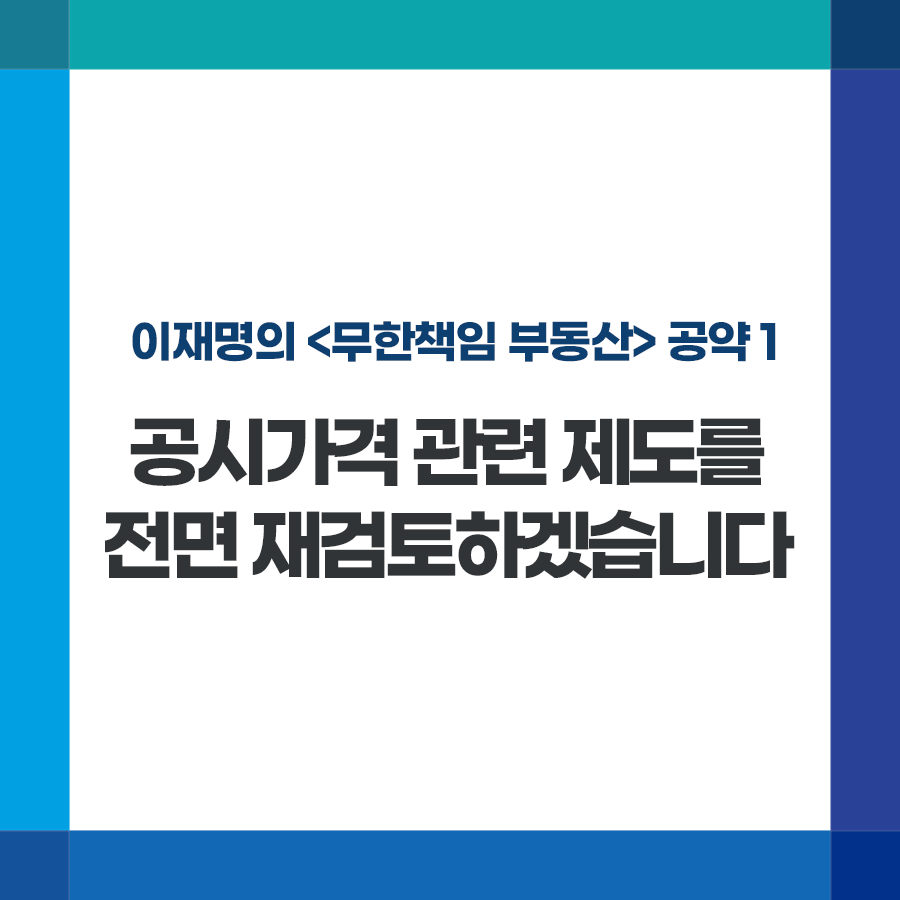

## 무한책임 부동산
# 공시가격 관련 제도를 전면 재검토하겠습니다
> 2022-01-11 16:52:31

이재명의 공약 1

모든 정책의 목표는 국민의 고통과 불편을 줄이고, 국민의 더 나은 삶과 행복을 실현하는데 있습니다. 목표와 수단을 혼동해서는 안됩니다. 정책이 국민을 더 고통스럽고 어렵게 해서는 안됩니다.

정치는 국민의 명령을 따르는 것이고 국민을 위해 존재합니다. 때문에 국민이 요구하고 국민에게 필요한 일은 언제든지 할 수 있어야 합니다. 그것이 실용이고 국민주권을 실천하는 길입니다.

정치인은 자신의 정치적 이념과 가치를 실현하기 위해 정책을 수행해서는 안됩니다. 국민이 원하고, 국민행복에 필요한 일이라면 언제든 바꿀 수 있는 용기와 유연성이 있어야 합니다.

자신의 신념을 관철하는 것 보다 훨씬 더 우선하는 것이 국민의 삶이기 때문입니다.

올해 주택가격이 큰 폭으로 상승하여 내년도 부동산 공시가격 또한 상당히 오를 것으로 예상됩니다.

부동산 공시가격 상승은 재산세, 건강보험료 부담 증가, 복지 수급 탈락 등 국민부담으로 이어집니다. 집값 폭등으로 인한 부담을 온전히 국민에게 전가하는 것은 공정하지 않습니다. 어려움에 처한 민생경제를 고려해 공시가격 관련 제도를 전면 재검토 해야 합니다.

당과 정부에 몇 가지 필요한 대책을 제안합니다.

첫째, 재산세나 건강보험료는 올해 수준으로 유지하도록 대책을 마련해 주시기 바랍니다.

공시가격을 과세표준으로 삼는 재산세는 ‘공정시장가액비율’ 인상 계획을 유예·재조정하여 세 부담을 현재와 유사한 수준이 되도록 해야 합니다. 과거에도 공시가격이 많이 올랐던 현실을 고려해 세 부담 상한 비율도 낮추어야 합니다.

둘째, 부동산 공시가격 상승으로 복지 수급 자격에서 탈락하는 일이 없도록 다각적인 보완 대책도 마련해야 합니다.

부동산 공시가격은 68가지나 되는 민생제도에 연쇄적으로 영향을 미치고, 이 중 39가지는 국민이 직접 부담합니다.

그런데 기초연금, 장애인연금, 기초생활보장 등 여러 복지제도는 공시가격 상승에 따른 완충장치가 없습니다. 영향이 큰 제도부터 공정시장가액비율과 유사한 ‘조정계수’를 신속히 도입해야 합니다.

68가지 제도 중 ‘조정계수’가 없는 제도는 성격에 따라 4~5개 항목으로 대분류하고, 각 제도에 적합한 ‘조정계수’ 순차적 도입을 검토해야 합니다.

2022년 공시가격 열람과 확정까지 남은 시간이 많지 않습니다. 12월 말부터 표준지 공시지가를 시작으로 단독주택과 공동주택의 공시가격이 연달아 결정됩니다.

당정은 신속한 협의를 통해 국민부담을 올해 수준으로 동결하고, 과도한 부담이나 억울한 일이 발생하지 않도록 합리적인 제도 개편에 나서 주기 바랍니다.