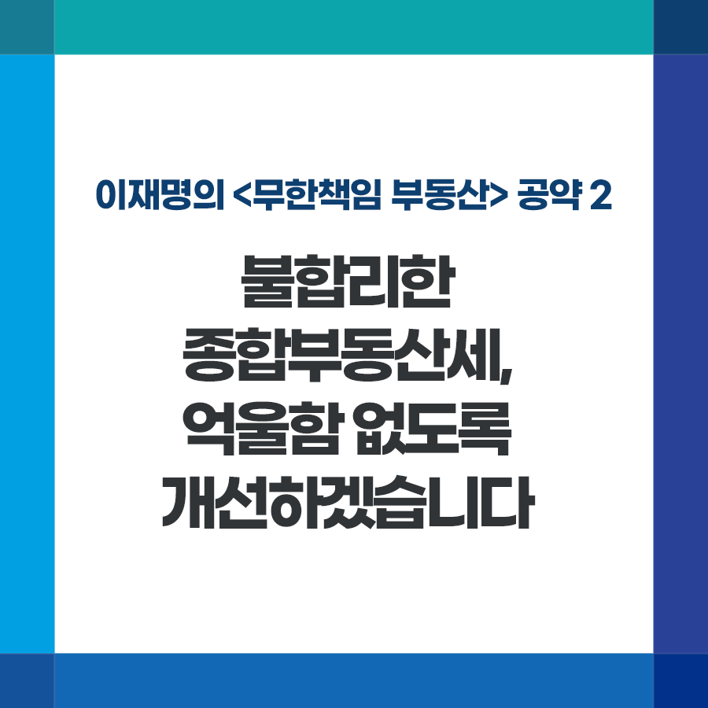

## 무한책임 부동산
# 불합리한 종합부동산세, 억울함 없도록 개선하겠습니다
> 2022-01-11 16:55:00

이재명의 공약 2

집값 폭등으로 국민 고통과 불안이 늘어납니다. 1주택 보유 실거주자도, 내 집 마련에 나선 실수요자도 모두가 힘들어하십니다.

부동산 정책은 우리 정부의 아픈 부분입니다. 여당 후보로서 감추지 않고 저부터 반성하고, 현실을 꼼꼼히 살펴 국민께 필요한 정책을 마련하겠습니다.

앞선 공시가격 제도 전면 재검토를 시작으로, 오늘은 이재명의 부동산 공약 두 번째인 종합부동산세를 말씀드리려 합니다.

정부는 그동안 집값 폭등을 막으려고 종부세 개편을 추진해 왔습니다. 하지만 섬세하지 못한 제도 설계로 국민께서 억울함을 느끼는 사례가 여럿 발생하고 있습니다.

정책의 목표는 국민 고통과 불편을 줄이고, 더 나은 삶과 행복을 실현하는 데 있습니다. 정책 일관성이나 가치와 이념에만 매달려 국민을 힘들고 어렵게 해선 안 됩니다.

종부세도 마찬가지입니다. 국민 상식으로 납득할 수 있는 합리적인 개선이 필요합니다. 관련해 몇 가지 개편 방향을 제안 드립니다.

첫째, 이직이나 취학 등 일시적으로 2주택자가 된 분들은 구제해야 합니다. 양도세처럼 종부세도 일시적 2주택자를 1주택자로 간주하는 제도가 필요합니다.

둘째, 상속 지분으로 인해 다주택자가 되신 분들 또한 억울하십니다. 가족 사망으로 예기치 않게 상속받으신 분들의 경우 상속 지분 정리에 필요한 일정 기간은 1주택자로 간주해야 합니다.

셋째, 투기가 목적이 아닌 주택은 종부세 중과에서 제외해야 합니다. 종중 명의 가택, 전통 보전 고택, 협동조합형 사회주택, 농어촌주택이나 고향집 등에 종부세를 중과하는 것은 합리적이지 않습니다. 일정한 요건을 갖춰 투기·이윤 목적이 없는 게 확인되면 다주택으로 합산하지 않아야 합니다.

넷째, 1주택 장기보유 저소득층과 노인가구의 종부세 납부를 연기해 드려야 합니다. 노인 은퇴자 중에는 1주택만 보유한 채 연금소득이나 자녀 용돈에 의존해 생활하시는 분들이 많습니다. 1주택, 소득 등 제한적 요건을 충족하면 소득이 생기거나 주택을 처분하는 시점까지 종부세 납부를 연기해 드려야 합니다.

국민께서 부당하다고 보시는 제도는 빨리 고쳐야 합니다. 당정은 신속히 제도개선에 나서 주시기 바랍니다. 더 나아가 올해 불합리한 납부분은 환급해 드리는 방안도 검토해 주시기 바랍니다. 한 명의 억울한 사례가 없도록 하는 것이 정부의 마땅한 책무입니다.

투기는 억제하되, 주택 실거주자와 실수요자는 철저히 보호하겠습니다.