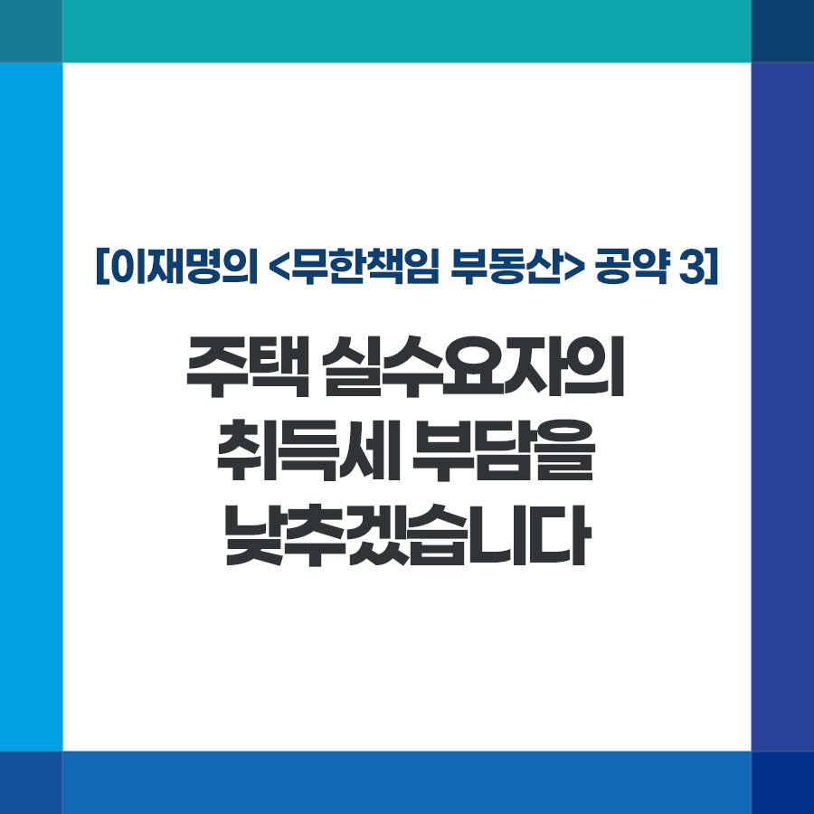

## 무한책임 부동산
# 주택 실수요자의 취득세 부담을 낮추겠습니다
> 2022-01-11 17:05:56

이재명의 공약 3

보유세는 적정 수준으로 높이고 거래세는 낮추는 것이 저의 부동산 세제 원칙입니다.

​

역대 정부마다 이 원칙이 제대로 자리 잡지 못하고 결과적으로 거래세와 보유세 모두 오르고 말았습니다.

​

특히 국세와 지방세를 관장하는 부처가 나뉘어 있고, 중앙정부와 지방자치단체의 이해관계가 갈리면서 거래세 인하를 요구하는 국민의 목소리는 반영되지 못했습니다.

​

주택가격 상승으로 증가한 취득세 부담을 합리적으로 조정해 국민의 부담을 덜어드리고 부동산 세제 원칙도 바로 세우겠습니다.

​

첫째, 생애 최초 주택 구입자의 취득세 부담을 대폭 낮추겠습니다.

​

전국적인 주택가격 상승으로 경기도 평균 아파트값이 이미 6억 원을 넘었습니다.

​

그러나 생애최초 주택 구입자의 취득세 50% 감면 혜택 기준은 여전히 수도권 4억 원, 지방 3억 원 이하의 주택에 머물러 있습니다. 이 기준을 수도권은 6억 원, 지방은 5억 원 이하의 주택으로 올리겠습니다.

​

취득세 감면 대상이 되는 부부합산 소득기준도 높이고, 취득세 면제 대상 주택 범위도 넓히겠습니다.

​

둘째, 취득세율 최고구간 기준을 높여 실수요자 부담을 줄이겠습니다.

​

서울 아파트 평균 매매가격이 12억원을 넘었습니다. 종합부동산세 부과 기준은 공시가격 11억 원, 양도소득세의 고가주택은 실거래가 기준 12억 원으로 상향했습니다.

​

취득세 최고세율 3% 부과 기준도 현행 9억 원에서 12억 원으로 올리는 것이 합리적입니다.

​

취득세 감소로 인한 지방세수 감소분은 지방소비세율(부가가치세 중 지방 이전 분) 인상 등을 통해 보전하겠습니다.

​

주택가격 상승으로 실수요자의 거래세 부담까지 늘어나는 것은 바람직하지 않습니다. 국민이 처한 불합리한 현실을 개선하는 정치의 본분을 다하겠습니다.

