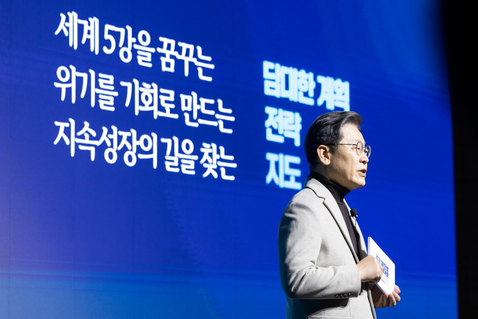

## 대표공약
# 대전환–세계 5강, 이재명 신경제가 해내겠습니다
> 2022-01-12 16:57:41

반갑습니다. 더불어민주당 대통령후보 이재명입니다.

​

저는 그동안 성장을 회복하고 경제를 부흥시키겠다고 국민 여러분께 약속드렸습니다. 관련한 공약도 여러 차례 발표했습니다.

​

오늘은 저의 경제 정책인 ‘전환적 공정성장’을 성장의 관점에서, 실행 방향을 담아서 말씀드리려고 합니다. 또한 그 동안 발표된 여러 경제 정책을 이해하기 쉽게, 전체 골격을 설명 드리겠습니다.

​

이재명의 신경제는, 대전환 – 세계 5강이라는 담대한 ‘계획’입니다. 위기를 기회로 만드는 ‘전략’입니다. 그리고 다시 지속성장의 길을 찾는 ‘지도’이기도 합니다.

​

지금 우리는 에너지 전환, 디지털 전환, 그리고 최근에는 코로나 팬데믹까지 동시에 맞으면서 역사적인 대전환의 시대를 살고 있습니다. 불안정하고 양극화된 세상 속에서 갈등도 참 많아졌습니다. 그렇다면 여기서 주저앉아야 되겠습니까?

​

우리 위대한 대한민국은 언제나 위기를 기회로 만들면서 성장하고 성취해 왔습니다. 이번 대전환도 마찬가지입니다. 그리고 바로 지금이 대전환의 ‘골든타임’이라고 생각합니다.

​

이재명 신경제의 목표는 종합국력 ‘세계 5강의 경제대국’입니다.

세계 5강 국가는 과연, 어떤 나라일까요?

​

저는 다섯 가지로 세계 5강 국가의 기준을 제시해보겠습니다.

​

첫째는 세계적 수준의 경제력, 그리고 누구도 넘볼 수 없는 국방력, 소위 하드파워를 완비한 국가입니다.

​

두 번째는 높은 문화 수준을 갖춰서 다른 국가들이 선망하는 소프트파워를 가진 나라입니다.

​

세 번째는 상시적으로 혁신하고 늘 미래를 지향하는 혁신국가입니다.

​

인권과 다양성이 보장되는 개방형 국가, 그리고 마지막으로 기후 위기대응, 신흥국 지원과 같은 인류 사회를 위해서 공헌하는 그런 국가입니다.

​

‘세계 5강’ 이 말을 하는 저도 가슴이 벅차오릅니다. 물론 쉽지 않겠지요. 그렇지만 이 다섯 가지 기준을 모두 갖춘 대한민국을, 우리 다음 세대에 꼭 물려줘야 하지 않겠습니까?

​

지금부터 “이재명 신경제” 세계 5강으로 가는 네 가지 대전환에 대해서 말씀드리겠습니다. 4대 대전환은 과학기술, 산업, 교육, 국토 이 네가지 영역의 대전환입니다.

### 4대 대전환

첫 번째, 과학기술 대전환에 대해서 말씀드리겠습니다.

​

대한민국을 세계 5대 과학 강국으로 도약시키겠습니다. 인공지능, 양자기술, 우주항공과 같은 10대 미래전략기술을 ‘대통령 빅(Big) 프로젝트’로 추진하겠습니다.

​

정권 단위가 아닌, 장기적인 계획 하에 개발이 가능하도록 과감하게 지원하겠습니다. 과학기술혁신 부총리제를 도입해서 국가 과학기술 혁신을 주도하도록 하겠습니다.

​

연구개발 체제를 산업계와 연구자 중심의 개방형 체계로 완전하게 바꿔내겠습니다. 새롭게 구상하는 영토인 우주 기술은 자립을 넘어서, 우주강국으로 도약시키겠습니다.

​

두 번째는 산업 대전환입니다.

​

지금 산업은 과거와 완전히 다른 모습으로 진화하고 있습니다. 그 첫 번째 영역으로 디지털 분야를 말씀드려 보겠습니다.

​

역시 디지털 전환이 가장 중요합니다. 디지털 전환 성장 전환을 위해서 물적·제도적·인적 인프라를 선제적으로 구축하겠습니다.

​

디지털에 특화된 미래 인재를 백만 명을 양성하겠습니다. 고구려의 기병처럼 디지털 산업영토, 기술영토, 글로벌 영토를 확장하는 기회를 선점하겠습니다.

​

마이데이터를 전 산업분야로 확장하고, 안심데이터를 도입해서 확장된 디지털 영토의 혜택이 모든 국민에게, 모든 기업에게 고루 돌아가게 하겠습니다.

​

궁극적으로 약 135조 원의 디지털 전환 투자로 200만 개의 새로운 일자리를 마련하겠습니다.

​

산업대전환 중에서 두 번째로 중요한 에너지 분야입니다.

​

당면한 기후위기에 대응하기 위해서 에너지 산업을 새로운 성장동력으로 만들겠습니다. 박정희 대통령의 ‘산업화 고속도로’, 김대중 대통령의 ‘인터넷 고속도로’에 이어 ‘바람과 햇볕이 달리는 에너지 고속도로’를 건설하겠습니다.

​

세계를 선도하는 그린산업 강국으로 도약하기 위해서, 태양전지, 풍력발전, 에너지 저장장치 그리고 이를 활용한 친환경 미래차와 같은 다양한 분야의 기술을 서둘러 개발하겠습니다.

​

에너지 대전환은 배제가 없는 정의로운 전환이어야 합니다. 이 정의로운 전환을 위해서 기후대응기금을 확충하겠습니다. 전환기업 노동자에게 체계적인 직업 훈련을 지원할 것입니다. 그리고 충분한 사회안전망도 반드시 마련해야 합니다. 기후에너지부를 신설해서 에너지 대전환을 확실하게 뒷받침하겠습니다.

​

산업대전환 중에 세 번째로 중요한 제조업 성장전략을 말씀드리겠습니다.

​

국민소득 3만불의 주역인 제조업을 5만불 성장의 새로운 주역으로 만들겠습니다. 주력산업의 제조공정을 디지털로 혁신하겠습니다.

​

글로벌 보호주의 강화에 맞서 제조업의 공급망을 자립하고 산업주권을 지켜내야 합니다. 아직 취약한 소부장 산업을 더 확실하게 육성해서 글로벌 소부장 핵심국가로 도약해야 합니다. 우리 제조기업이 글로벌 탑 기업으로 성장할 수 있도록 더 과감하게 지원하고 규제도 합리화해내겠습니다.

​

산업대전환 중에 네 번째로 중요한 중소·벤처기업 분야입니다.

​

중소·벤처기업 육성은 산업대전환을 넘어 공정 사회로 가는 기반이기도 합니다. 그렇기 때문에 적극적인 정책적 배려와 관심이 꼭 필요합니다.

​

중소․벤처기업을 위해서 모태펀드를 10조원, 기술보증의 보증규모를 2배로 확충하겠습니다. 중소기업의 디지털 전환, ESG 전환을 위해서 컨설팅과 투자비용을 지원하겠습니다. 가업 승계처럼 세대를 뛰어넘어, 기업의 영속성이 유지되는 방안도 함께 마련하겠습니다.

​

산업대전환 중에서 다섯 번째로, 서비스업 분야를 말씀드리도록 하겠습니다.

​

국민경제의 가장 큰 비중을 차지하는 서비스업 발전 없이는 국민소득 5만 달러, 쉽지 않습니다. ‘문화선도 국가’를 목표로 서비스업을 성장 산업으로 키워내야 합니다. 법률, 회계, 건축, 금융과 같은 지식서비스업 중심으로 서비스업을 고도화해내야 합니다.

​

세계 일류 콘텐츠 개발에 과감하게 지원하겠습니다. K-콘텐츠 산업은 이미 우리의 수출과 성장에서 큰 역할을 하고 있습니다. 모두가 아는 것처럼 이미 K-콘텐츠 산업은 일자리 68만 개, 매출 127조 원을 유발해서 반도체 산업에 육박한다는 이런 연구 결과도 있습니다.

​

산업대전환 중에서 여섯 번째로, 수출 분야에 대해서 말씀드리겠습니다.

​

우리는 수출로 성장신화를 써 온 국가입니다. 다시 수출로 성장엔진을 가속시켜야 합니다. 현재 예순 아홉 개인 세계 1등 수출 제품을 백 개 이상으로 늘려야 합니다. 범정부 차원에서 통합수출지원체계를 강화하고 메타버스 무역플랫폼과 같은 새로운 지원체계를 확실하게 구축하겠습니다.

​

최근에 급성장하고 있는 서비스 수출을 늘리기 위해서 획기적인 지원책도 함께 마련하겠습니다. 해외에 계신 우리 동포들과 함께 강력한 문화·경제 네트워크를 만들어서 수출의 불씨를 이어가겠습니다.

​

지금까지 말씀드린 산업대전환 계획이 성공적으로 달성된다면 우리는 균형 있고 튼튼한 경제 체력을 갖추게 될 것입니다.

​

교육 대전환 부분에 대해서 말씀드리겠습니다.

​

우리 경제는 교육을 통해서 발전해왔습니다. 앞으로도 역시 우리는 인적자원, 사람으로 승부해야 합니다.

​

대전환에 대응하기 위해서 우선, 대학교육에 대한 지원을 획기적으로 늘리겠습니다. 대학이 미래산업에 대응할 수 있도록 교육과정을 유연하게 바꾸겠습니다.

​

지역 대학 혁신체제를 구축하고 대학도시 건설도 추진하겠습니다. 지역과 국가를 초월하는 온라인 중심의 대학교육을 확대하겠습니다.

​

평생 교육에 대한 지원을 확대해서, 시민과 직장인 누구나, 언제든지, 원하면 배울 수 있는, 평생 학습 사회로 전환하겠습니다.

​

마지막으로 국토 대전환입니다.

​

이제 국가균형발전은 시혜나 배려가 아니라, 피할 수 없는 국가 생존 전략이 됐습니다.

​

대한민국을 5극 3특 체제로 재구축해서 초광역 메가시티로 발전시키겠습니다. 메가시티는 네트워크 도시를 지향하고, 실질적인 자치가 이루어질 수 있도록 개선하겠습니다.

​

직업, 문화, 교육 여건 때문에 더 이상 지방의 청년들이 수도권으로 이주하는 일이 없게 해야 지역 발전은 물론이고, 국민경제 전체의 성장도 가능해집니다.

​

고속철도를 중심으로 국가 교통체계를 완전히 재편하겠습니다. 그 일환으로 광주-대구 달빛내륙철도를 조기에 추진하겠습니다.

​

주요 이동 수단을 고속철도로 전환해서 입체적이고 친환경적인 전국 교통망을 구축하겠습니다. 가덕도 신공항을 비롯한 항공교통망 구축도 차질 없이 지원하겠습니다.

​

수도권과 부산 이러한 대도시 도심 철도 구간을 지하화해서 도심의 단절을 극복하고, 지역 상황에 맞게 활용 가치를 높이도록 하겠습니다. 수도권과 광역시의 주요 고속도로도 지하화해서 분절된 도심들을 다시 연결하고, 지역 발전의 거점으로 다시 만들겠습니다.

​

지금까지 말씀드린 4대 대전환은 지금, 반드시, 실천해야 하는 중요한 과제입니다.

​

지금 세계는 전환의 속도를 놓고 경쟁 중입니다. 길어도 5년 내에 승부가 갈릴 것으로 보입니다. 그래서 지금이 바로 대전환의 골든타임이다, 이렇게 말씀드리는 것입니다.

​

저는 임기 중에 대전환 위기를 새로운 도약의 토대로 만들겠다고 다시 한 번 국민 여러분께 약속드립니다. 앞서 말씀드린 “4대 대전환”만으로는 세계 5강을 꿈꾸는 이재명 신경제를 완성할 수가 없습니다. 그래서 대전환을 지원하는 2가지 개혁 과제를 추가로 말씀드리겠습니다.

### 대전환을 지원하는 2가지 개혁 과제

첫 번째는, 우리 국민들께서 모두 동의하시는 ‘공공 개혁’입니다.

​

세계 5강에 걸 맞는 유능한 정부를 만들겠습니다.

​

공직사회를 개혁해서 청렴한 서비스 조직으로 다시 태어나게 하겠습니다. 개방형 임용제를 확대해서 공무원의 전문성을 획기적으로 높여 가겠습니다.

​

단순히 현재 상황을 관리하는 관료중심형 정부가 아니라, 문제 해결형 스마트 정부로 만들겠습니다. 유연한 조직문화 속에서 부처 간 조정기능을 강화하고, 얽힌 문제를 능동적으로 해결해 나가겠습니다.

​

과학기술혁신부총리제를 도입하고, 기후에너지부 설치, 데이터 전담부서 설치로 경제성장을 지원하는 정부로 혁신해 가겠습니다.기획 예산 기능도 권한과 책임이 조화를 이루는 방향으로 개편하겠습니다.

​

두 번째, 매우 중요한 부분입니다. 바로 금융 개혁입니다.

​

금융은 대전환의 모든 분야와 아주 밀접하게 연결되어 있습니다. 자본시장은 시중 자금이 산업 현장으로 넘어가는 징검다리입니다. 국민에게는 자산 증식의 기회를 제공하기도 합니다.

​

우리 주식시장은 불투명하고 불공정한 거래 관행 때문에, 글로벌 시장에 비해서 제대로 평가받지 못하고 있습니다. 소위 말하는 ‘코리아 디스카운트’라는 것이지요.

​

제가 주가지수 5천포인트 시대를 열어 제치겠습니다.

​

원스트라이크 아웃제를 도입해서 단 한 번이라도, 단 한 번이라도 주가 조작에 가담한 경우에는 다시는 주식시장에 발조차 붙이지 못하도록 징벌과 배상을 확실하게 하겠습니다.

​

MSCI 선진국지수 편입을 추진하겠습니다.

​

연기금, 보험사와 같은 글로벌 장기투자가 중심으로 외국인 투자자의 선수교체를 만들어내겠습니다. 모자회사 쪼개기 상장 같은 방법으로 소액투자자들이 더 이상 피해를 입지 않게 하겠습니다. 장기투자를 유도하기 위해서 인센티브를 마련하고, 공공과 민간기금의 국내투자 활성화를 촉진하겠습니다.

​

모험자본과 인내 자본의 과감한 확충으로 혁신의 마중물을 제공하겠습니다. 스타트업과 같은 신생 벤처기업에게 많은 자금이 흘러갈 수 있도록 제도를 정비하겠습니다.

​

기보, 신보, 서민금융진흥원의 기능을 확대하고 사회적 금융 지원을 강화해서 금융이 서민의 삶을 더 촘촘하게 지원하도록 하겠습니다. 경제와 금융에 대한 조기 교육을 활성화해서, 건전한 투자문화가 자리 잡도록 하겠습니다.

​

지금은 팬데믹 비상 상황입니다. 추후 경제 방역으로서의 충분한 보상, 또 충분한 대책을 당연히 마련해낼 것입니다.

​

지금까지 세계 5강을 꿈꾸는 이재명 신경제의 네 가지 대전환과 두 가지 개혁에 대해서 말씀드렸습니다.

​

이재명 신경제의 성공은 결국 투자, 투자에 달려 있습니다. 이재명 정부는 국가의 백년대계를 준비하면서 과감한 대투자를 추진하겠습니다.

​

정부의 대대적인 선행투자를 통해서 민간 기업의 과감한 투자를 유인하고 경제성장을 이끌어내겠습니다. 경제 생태계에 창의와 혁신이 마음껏 뛰어놀 수 있도록 규제를 합리화하겠습니다. 대한민국을 기업하기 좋은 규제 프리국가, 혁신의 자유공간으로 만들겠습니다.

저는 세계 5강 대한민국을 만들기 위해서 네 가지 원칙으로 일할 생각입니다.

​

가장 먼저 속도가 중요합니다.

전 세계가 동시에 맞닥뜨린 이 위기는 속도를 높여야 위기를 기회로 바꿀 수 있습니다.

​

두 번째, 바로 확산입니다.

호수에 돌을 던져 파동을 만들어내듯이 정부 대투자가 민간 기업과 개인투자자까지 동심원적으로 확산을 시켜내야 합니다. 그렇게 되면 성장의 선순환 생태계가 구축됩니다.

​

세 번째 원칙, 바로 실용입니다.

모두가 아시는 것처럼 상황이 매우 유동적이고 불확실합니다. 따라서 상황 변화에 맞게 기민하게 대응해야 합니다.

​

마지막, 바로 희망입니다.

모든 기적과 변화는 ‘할 수 있다’는 희망과 믿음에서 시작됩니다.

​

우리는 할 수 있습니다. 그리고 해 왔습니다. 경제개발 60년 성장신화도 만들어냈습니다.

​

우리는 세계적인 문화 강국의 반열에 들어섰습니다. 북한이라고 하는 평화경제의 투자 기회도 열려 있습니다.

​

이재명 신경제는 세계 5강을 향한 성장의 신경제입니다.

여러분, 시간이 없습니다. 바로 지금이 대전환 위기를 성장의 기회로 바꿀 수 있는 골든타임입니다.

지금까지 전환적 공정 성장 중에서 전환 성장과 관련된 내용을 중심으로 말씀드렸습니다.

​

저 이재명이 대한민국 경제를 새롭게 세워보겠습니다. 우리 국민들께 기회부족으로 경쟁이 아닌 전쟁을 겪게 하는 것이 아니라 협력적 경쟁이 가능한 희망 넘치는 세상을 만들어 보여 드리겠습니다.

​

다시는 청년들이 남과 여로 나뉘고 수도권과 지방으로 나뉘어서 친구가 적이 되는, 적대적 대결을 하는 생존투쟁의 장으로 내몰지 않겠습니다.

​

성장 앞으로, 공정 제대로, 대한민국 세계 5강을 이재명 신경제가 해내겠습니다.

​

고맙습니다.