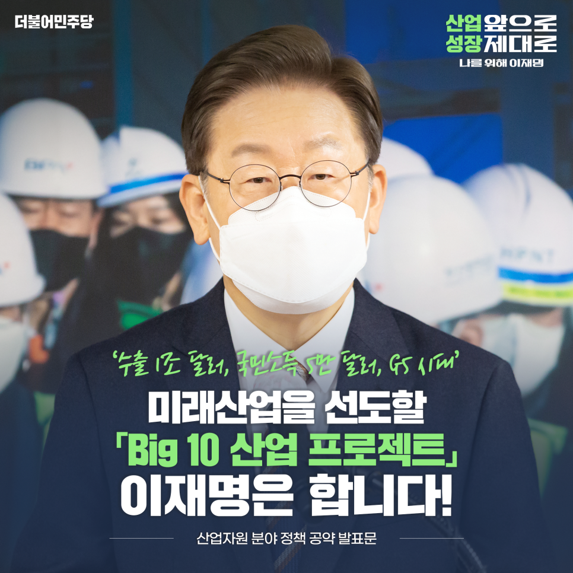
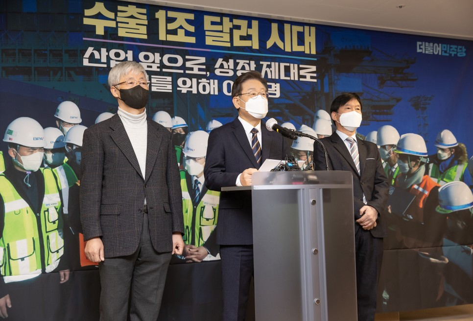
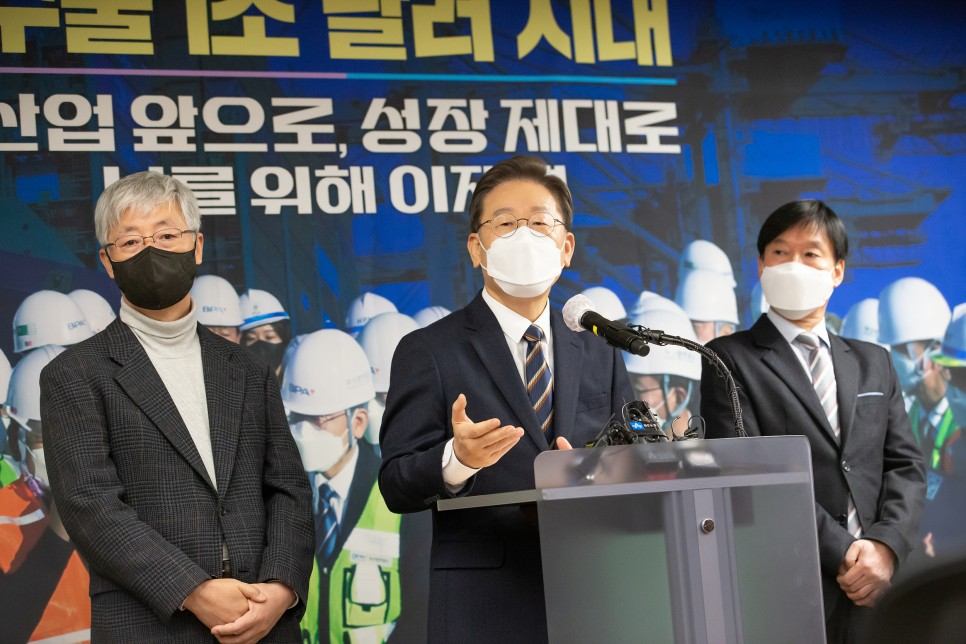
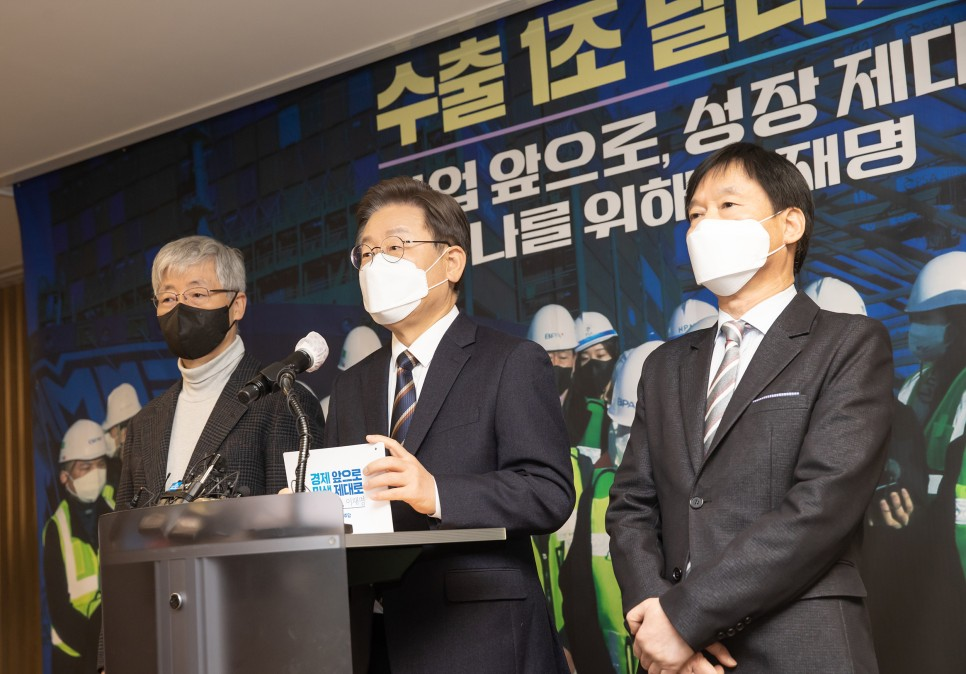
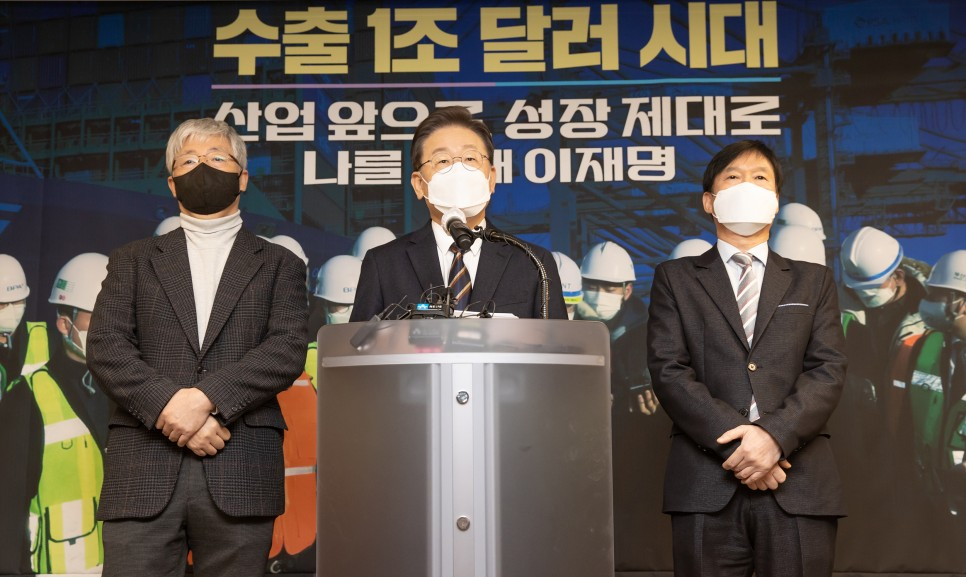
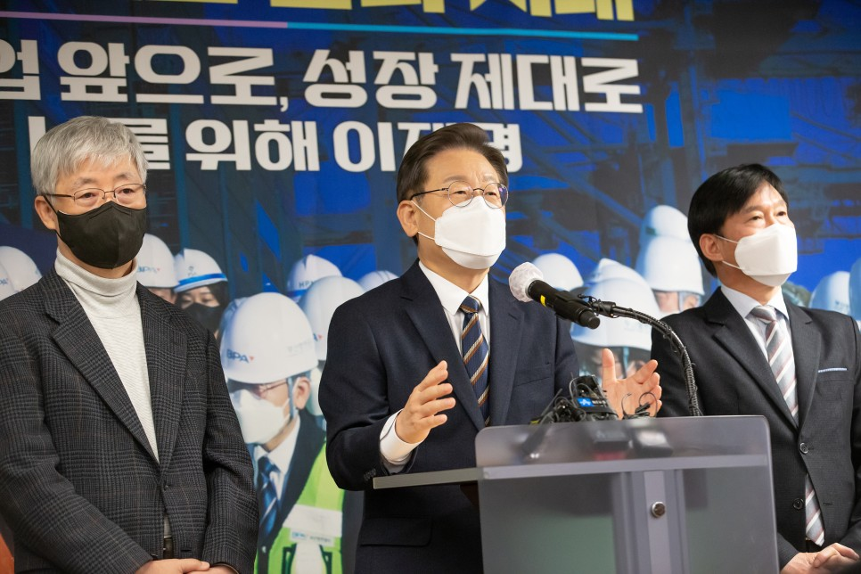
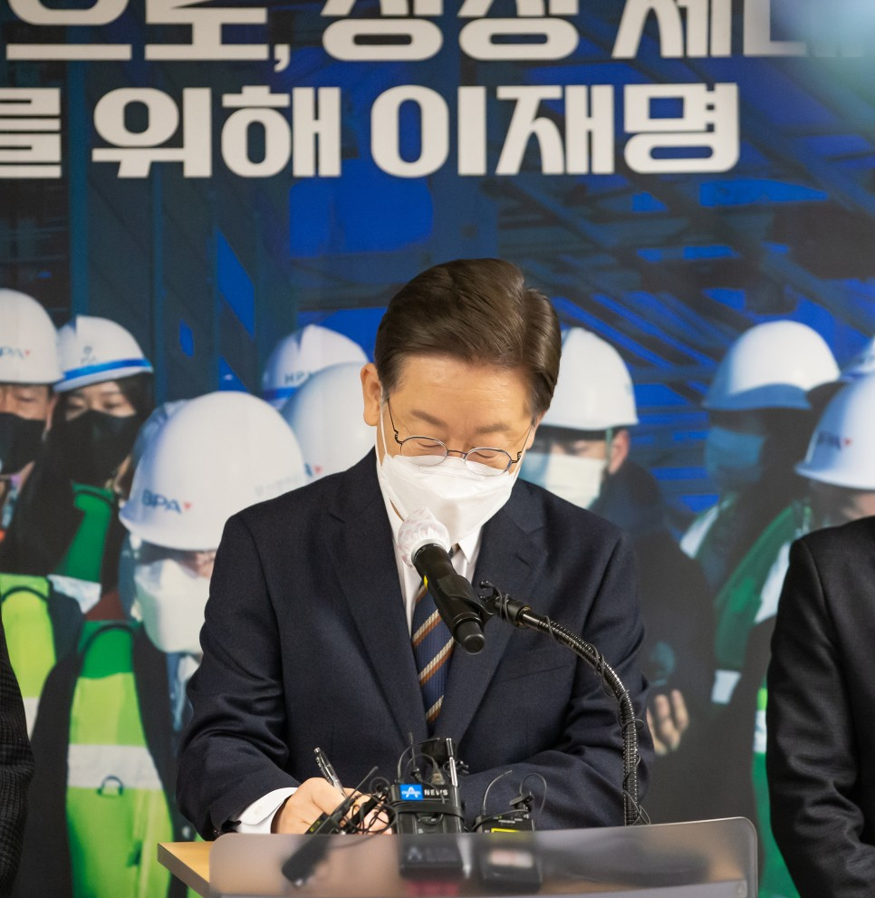
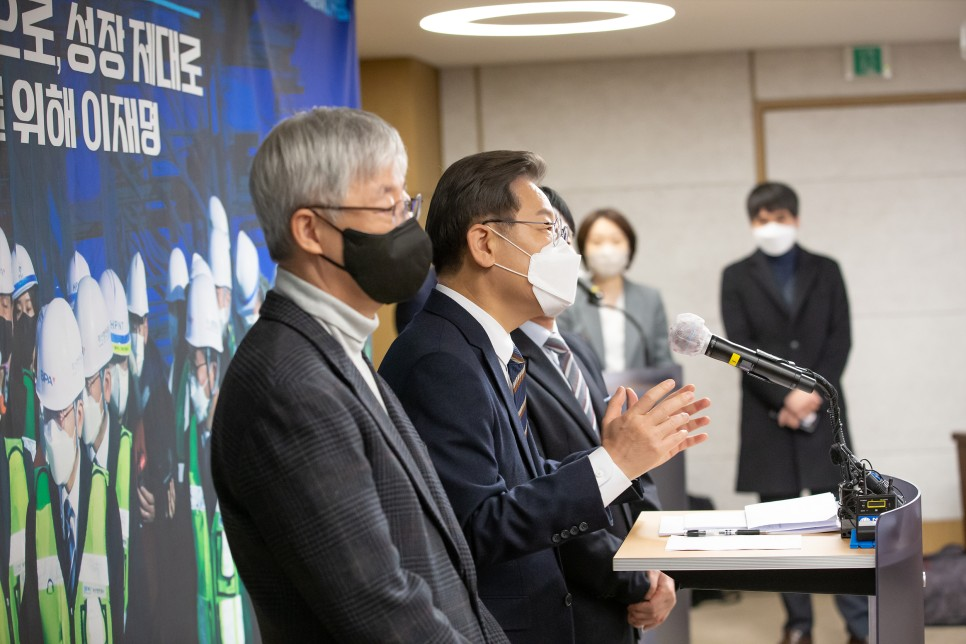
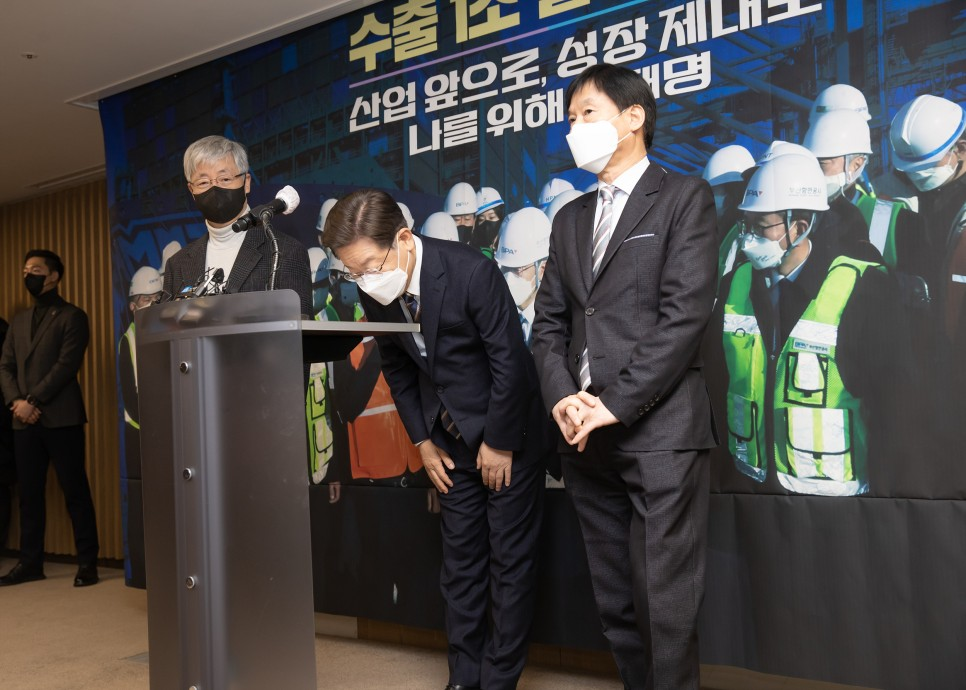
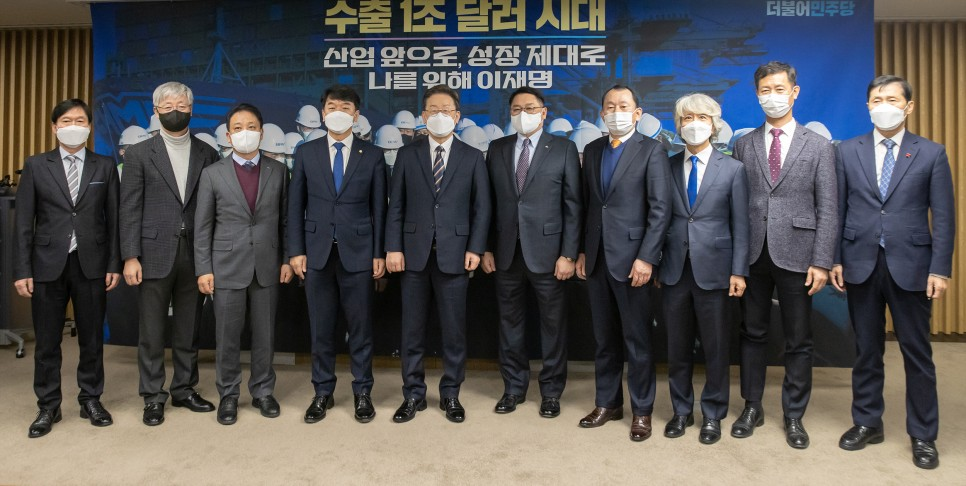

## 대표공약
# 수출 1조 달러, 국민소득 5만 달러, G5 시대 기반 마련! 산업 앞으로, 성장 제대로, 이재명은 합니다!
> 2022-01-12 17:09:18

대한민국 국민은 위대합니다. 우리는 식민지를 겪은 나라 중에서 유일하게 세계 경제 10대 강국의 반열에 올랐습니다.

​

지난해 우리나라 연간 수출액은 6천 445억 달러로 사상 최고치를 기록했습니다. 무역액도 역대 최대치인 1조 2천 596억 달러를 달성해서 무역 순위는 세계 8위가 됐습니다.

​

반도체·자동차·석유화학 등 주요 15대 품목 수출 실적이 모두 두 자릿수로 증가했습니다.

​

주목할 점은 바이오헬스·이차전지와 같은 고부가가치 신산업으로 수출 품목이 다변화되고 있다는 사실입니다.

​

중남미·인도·ASEAN·독립국가연합(CIS) 지역 수출량이 20% 이상씩 증가하면서 수출 다변화도 역시 함께 이뤄지고 있습니다.

​

2018년 유엔산업개발기구(UNIDO)가 발표한 세계제조업경쟁력지수(CIP)에서 우리나라는 독일·중국에 이어서 3위를 기록했습니다.

​

미래를 선도할 반도체·배터리·바이오의약과 같은 첨단산업 분야에서는 기술력과 제조역량이 이미 세계 일류수준입니다.

​

이처럼 커다란 성과에도 불구하고 한국 경제의 잠재성장률은 계속 하락하고 있습니다. 산업 전환의 지연, 그리고 생산연령 인구감소가 큰 이유입니다.

​

이뿐만 아니라 급속한 4차 산업혁명으로 인한 산업생태계의 급변, 기후위기와 코로나 팬데믹, 미·중 간 패권 경쟁에 따른 글로벌 공급망 재편까지 수많은 위기들이 우리 앞에 놓여 있습니다.

우리는 담대한 변화로 직면한 위기를 도약의 기회로 전환해야 합니다. 저 이재명이 국민과 함께, 국민 개개인 ‘나를 위한’ ‘대한민국 산업 대전환’시대를 열겠습니다.

​

4차 산업혁명을 주도할 디지털 대전환과 기후위기에 대응한 에너지 대전환의 그루터기를 만들어서 산업 대전환의 환경과 여건부터 단단하게 구축하겠습니다.

​

이를 발판으로 글로벌 공급망을 주도하고 대대적인 투자와 지원으로 산업생태계를 혁신해서 미래산업으로 나아가는 안정적 기반을 다지겠습니다.

​

이재명 정부가 약속드립니다. 전환의 위기를 경제 재도약의 기회로 만들 것입니다. 획기적인 미래형 산업 전환으로 양질의 일자리를 만들겠습니다. 수출 1조 달러, 국민소득 5만 달러, 글로벌 G5 시대를 향해 전진하겠습니다.

​

이를 실현하기 위한 이재명 정부의 산업 대전환 7대 공약을 말씀드리겠습니다.

첫째, 디지털 전환으로 주력 제조업을 혁신하겠습니다.

인공지능(AI)과 데이터와 같은 4차 산업혁명 기술을 바탕으로 우리 산업의 디지털 대전환을 힘 있게 추진하겠습니다.

​

센서·사물인터넷(IOT)·로봇으로 제조공정을 스마트화하고 생산성을 높여서 산업의 글로벌 경쟁력을 한층 더 높이겠습니다.

​

중소제조업의 스마트공장 보급을 확대하고 기술의 질적 고도화로 명실공히 스마트화 2.0 시대를 열겠습니다.

​

고부가가치 제조 기반 서비스산업이 새롭게 창출될 수 있도록 제조업의 다양한 서비스화를 추진하겠습니다.

​

자동차, 조선, 철강, 섬유·석유화학, 에너지, 기계, 가전·전자, 헬스케어, 유통·물류, 뿌리·소재와 같은 10대 업종의 디지털 전환으로 제조업 혁신을 이루겠습니다.

​

업종 내, 그리고 업종 간, 대-중소기업 간 연대협력사업을 적극적으로 지원하고 협업에 기반한 디지털 전환을 촉진하겠습니다.

​

협업지원센터를 전국적으로 확대해서 부족한 인적·물적·기술 역량으로 인한 디지털 전환에 어려움을 겪는 지역산업을 지원하겠습니다.

둘째, 재생에너지를 확충하고 탄소중립 산업 전환을 촉진하겠습니다.

재생에너지 산업의 확충은 이제 환경문제를 넘어 서서 국가산업 경쟁력과 직결된 반드시 해결해야 될 핵심 현안이 됐습니다.

​

애플, BMW와 같은 거대 다국적기업은 산업 부품까지도 재생에너지만을 사용하는 RE100을 요구하고 있습니다.

​

에너지고속도로를 기반으로 하는 RE100 산업단지를 조성하고 충분한 재생에너지를 공급하겠습니다.

​

한국형 RE100 산업에 기업의 적극적인 참여와 확대를 위해서 세제, 금융 지원과 같은 인센티브를 제공하고 에너지 다소비 기업은 재생에너지 전환을 유도하겠습니다.

​

분산형·지능형 전력 인프라, 에너지 고효율화 기술, 탄소 저감 설비, 제로에너지건물과 같은 그린 신산업을 집중 육성하고 관련업종의 질 좋은 일자리를 창출하겠습니다.

​

탄소 배출량이 많은 수출의존도 산업의 탄소중립 전환과 제조공정 효율화를 위해서 현재 시행 중인 공정개선 R&D와 같은 정부 통합지원 방안을 확대하도록 하겠습니다.

​

에너지전환에 취약한 제조업 산업군을 분류해서 중소제조업의 탄소중립과 에너지전환을 위한 지원을 더욱 세분화하고 그 범위를 확대하겠습니다.

​

탄소중립의 신기술 적용을 위한 제도를 신속히 정비해서 미국과 유럽의 탄소국경세 등에 선제적으로 대응하겠습니다.

​

동시에 수소경제 이행을 적극적으로 추진하겠습니다. 생산과 유통, 활용까지 전 단계에 걸쳐서 수소산업 활성화를 위한 산업생태계를 확실하게 조성하겠습니다.

​

청정수소 생산기술을 조속히 개발하고 전국적인 수소 유통망을 구축하겠습니다. 수소 기반 모빌리티와 수소 발전설비 같은 수소 활용 기술을 적극적으로 개발하겠습니다.

셋째, 미래산업을 선도할 ‘Big 10 산업 프로젝트’를 추진하겠습니다.

미래산업은 기술 간, 산업 간의 초연결로 융합되면서 전통적 산업 간의 경계가 허물어지고 있습니다. 첨단기술과 미래산업에 대한 획기적 투자로 향후 우리 경제를 책임질 수 있는 미래 먹거리를 창출하겠습니다.

​

이에 대한 구체적 실현 방안으로 이재명 정부는 대한민국 미래산업을 선도할 ‘Big 10 산업 프로젝트’를 추진할 것입니다.

​

먼저 우리나라가 세계적으로 경쟁력을 이미 확보한 반도체, 미래 모빌리티, 이차전지, 디스플레이, 바이오헬스 산업의 ‘5대 수퍼클러스터’를 구축하겠습니다.

​

융복합과 초연결 시대를 이끌어 갈 수 있도록 산업을 고도화하고 기술 초격차를 확보하도록 하겠습니다.

​

이를 통해 첨단산업의 글로벌 경쟁력을 강화하고 미래산업을 창출하는 포트폴리오를 완성하겠습니다.

​

‘5대 수퍼클러스터’구축과 함께 미래 신산업으로 성장할 로봇, 그린에너지, 우주항공, 패션테크, 메타버스의 ‘이머징 5 신산업 프로젝트’도 동시에 추진하겠습니다.

​

저는 앞서 과학기술혁신을 위해 대통령이 직접 보고 받고 추진상황을 점검하는 과학기술혁신 ‘대통령 빅 프로젝트’를 국민께 약속드린 바가 있습니다.

​

인공지능 같은 과학기술 분야의 ‘대통령 빅 프로젝트’ 연구성과를 산업에 적용해서 새롭고 다양한 제품과 서비스가 생산될 수 있도록 지원하겠습니다.

​

핵심기술 개발과 규제 혁신은 물론이고 새로운 플레이어의 시장 진입을 적극적으로 지원하고 벤처기업의 성장을 촉진하는 혁신생태계를 조성하겠습니다.

​

‘Big 10 산업’의 역량 극대화를 위해 필요한 인력·자금·규제 3대 혁신기반을 과감하게 개선하겠습니다.

​

우리 사회가 신기술환경 변화에 연착륙할 수 있도록 새로운 혁신기술 교육을 통해서 분야별 전문가를 양성하고 학교와 산업현장을 연결해서 새롭고 다양한 시도가 가능한 산학연 파트너십 운영 확대를 제도적으로 완비하겠습니다.

​

Big 10 산업 모태펀드를 조성해서 기업의 안정적인 자금조달을 지원하고 규제 개선을 통해 Big10 산업의 진취적 성장을 유도하겠습니다.

넷째, 공급망의 자립화와 다변화로 경제안보와 산업주권을 실현하겠습니다.

현대는 경제안보가 곧 국가안보입니다. 제2의 반도체 대란, 요소수 대란과 같은 국가산업 위협 요소를 방지하기 위해서 부처별로 공급망 대응 체계를 총괄하는 국가공급망 진단체계를 구축하겠습니다.

​

시시각각 글로벌 공급망을 세분화해서 모니터링하고 시나리오별 대응 전략을 미리미리 수립하겠습니다.

​

대외의존도가 높고 국민경제에 파급효과가 큰 품목을 ‘경제안보 핵심품목’으로 지정하고 관리하겠습니다. 연관산업에 파급효과, 국민경제에 미치는 영향이 큰 첨단전략 기술과 산업을 정부가 직접 보호하고 육성하겠습니다.

​

공급망 강화를 위해서 미국·중국·신남방·유럽의 글로벌 핵심 국가와의 전략적 협력관계를 강화하겠습니다. 특히 한미 산업기술 대화를 정례화해서 협력을 더욱 공고히 하겠습니다.

​

산업 핵심품목이 안정적으로 국내에서 생산될 수 있는 기반을 구축하고 우리나라를 국제협력 글로벌 공급망의 중심국가로 자리매김해가겠습니다.

다섯째, ‘소부장 3.0 프로젝트’로 우리 산업의 허리를 튼튼하게 하겠습니다.

소재·부품·장비 산업의 집중 육성을 위한 ‘소부장 3.0 프로젝트’를 추진해서 글로벌 소부장 핵심국가로 도약하겠습니다.

​

소부장 특별회계를 2029년까지 5년 더 연장하고 관련 예산을 추가로 확보하겠습니다. 필수 소비재를 포함한 소부장 핵심품목을 발굴하고 기업주도의 기술개발을 통해서 경쟁력을 높이겠습니다.

​

소부장 기업의 기술개발 성과가 제품화되어 시장에 안정적으로 공급될 수 있도록 필요한 장비와 인력 지원을 강화하겠습니다. 이를 통해서 글로벌 Top 소부장 기업으로 성장할 ‘소부장 으뜸기업’을 200개 이상 육성하겠습니다.

​

탄소중립, 디지털전환 같은 산업 패러다임 변화에 대응하는 미래 유망산업 분야의 소부장 산업투자를 확대하겠습니다. 이를 위한 글로벌 소부장 산업의 공급망을 분석하고 산업전략을 수립하겠습니다.

​

소부장 산업의 핵심이자 우리 산업생태계의 허리인 중견기업의 경쟁력을 강화하겠습니다. 우수한 역량을 보유한 중견기업의 핵심기술 자립을 보장하고 글로벌 전문기업으로 성장할 수 있도록 정부가 적극 지원하겠습니다.

​

소부장 산업의 근간인 뿌리산업의 인력난 해소, R&D 강화, 기술과 공정의 첨단화, 금융 지원 같은 전체적 지원을 확대하겠습니다. 생산 공정의 스마트화와 지능화, 그리고 디지털화 촉진을 위한 지원으로 소부장 산업의 경쟁력을 더욱 강화하겠습니다.

여섯째, 산업혁신을 촉진하기 위해 맞춤형 혁신인재를 양성하고 참여혁신연계망을 구축하겠습니다.

산업의 디지털화와 탄소중립 전환을 위해서 전문인력의 양성과 교육훈련을 대폭 강화하겠습니다. 국가기간 전략산업과 전문기술과정의 훈련 교육을 확대하고 산업계 수요에 기반한 맞춤형 교육과정을 운영하겠습니다.

​

고급 전문인력 양성을 위해서 반도체·배터리와 같은 전략산업 분야를 중심으로 정부, 지자체가 산업체와 계약을 통해 대학에 개설할 수 있는 계약학과를 더 확대하고 산업혁신아카데미 설립을 지원하겠습니다. 이와 함께 체계적 혁신인재 양성을 위해서 산업기술인력 수급 실태 조사를 정기적으로 실시하겠습니다.

​

글로벌 경쟁력을 갖춘 혁신제품과 서비스를 창출할 수 있는 우수인력이 확보될 수 있을 겁니다. 연구인력 부족에 시달리는 기업, 그리고 일자리를 찾아 헤매는 청년들이 편리한 연계를 통해서 서로 상생할 수 있는 시스템을 만들겠습니다.

​

산업전환과 혁신 촉진을 위해서 산업계·연구기관·정부가 함께 참여하는 ‘참여혁신연계망’을 구축하겠습니다. 참여자에게 전문적 자문을 지원하고 기술과 정보, 인적자원이 한 번에 손쉽게 상호 교류하는 ‘참여혁신연계망’을 제공하겠습니다.

​

이와 동시에 기업 간 네트워크와 대기업과의 연계는 물론이고 새로운 사업 기회를 도모할 수 있도록 최선으로 지원하겠습니다.

​

‘참여혁신연계망’을 통해서 민간과 공공의 혁신에너지가 산업으로 확산되고 기술과 전문인력, 사업화와 투자, 그리고 수출이 산업 성장으로 이어지는 선순환 혁신생태계를 구축하겠습니다.

일곱째, 임기 내 수출 1조 달러 시대를 열어 가겠습니다.

수출 1조원 시대를 열기 위하여 먼저 품목과 시장을 다변화해야 합니다. 우리 수출이 견고하게 성장할 수 있는 든든한 여건과 환경을 마련하겠습니다.

​

메모리반도체·석유화학·일반기계와 같은 수출 주력 품목 외에 바이오헬스·차세대 모빌리티와 같은 미래산업 품목, 그리고 농축수산물까지 수출 품목의 다양화를 이뤄내겠습니다.

​

세계적으로 각광받고 있는 영역이 있습니다. 바로 문화콘텐츠입니다. 문화콘텐츠에 게임·교육·의료와 같은 다양한 서비스산업의 수출 길을 확대하고 서비스 교역 활성화와 각국의 불합리한 서비스 무역장벽 해소를 위해서 정부가 선제적으로 방법을 찾고 대처하겠습니다.

​

북방·중남미·중동·아프리카로 수출 지역을 다변화하고 신흥시장 수출 시장을 개척하고 또 활성화해서 대한민국 글로벌 경제지도를 보다 더 크게 확장하겠습니다. 수출기업의 협상력을 높이기 위해서 수출금융을 더 확대하겠습니다.

​

급변하는 글로벌 통상 환경에 선제 대응을 위해서 디지털 무역협정을 적극적으로 활용하겠습니다.

​

전자상거래와 디지털 무역 지원을 위해서 ‘메타버스 무역플랫폼’과 같은 새로운 디지털 혁신지원 체계를 구축하겠습니다.

​

대한민국이 경쟁력 있는 분야의 기술을 국제 표준화하도록 지원하겠습니다. 국내 규범도 급변하는 통상 질서에 맞춰서 재정비하겠습니다. 무역협정의 적극적 활용을 위해서 양자 및 다자간 무역협정, 환경 및 서비스무역 협정을 확대하겠습니다. 무역협정은 항상 국익의 관점에서, 국민 합의에 기초해서 추진하겠습니다.

​

국민 여러분이 모두 아시다시피 대한민국은 통상으로 선진국이 된 나라입니다. 통상은 대한민국의 과거와 현재, 그리고 미래의 지표입니다. 지금까지 이룩한 모범 통상국가의 전형을 계속 이어가겠습니다.

​

선진국과 활발한 교류, 개발도상국과 호혜 협력을 바탕으로 세계를 이끌어 가는 명실상부한 글로벌 통상 선도국가로 도약하겠습니다.

존경하는 국민 여러분!

​

세계 대전환은 우리에게 위기인 동시에 또 기회입니다. 저, 이재명이 대전환의 위기를 당당하게 극복하는 것을 넘어서서 국민 대도약 시대를 새로 열어 내겠습니다.

​

수출 1조 달러 시대를 열고 종합 국력 세계 5위, 이른바 G5를 목표로 국민소득 5만 달러를 향해서 나아가겠습니다.

​

국가 성장의 과실이 온전하게 국민 모두에게 돌아가야 합니다. 국민이 성장하고 그 힘으로 부강한 나라로 성장하는 ‘나를 위한’ 대한민국의 경제성장을 저 이재명이 반드시 만들어 내겠습니다.

​

수출 1조 달러, 국민소득 5만 달러, G5 시대 기반 마련!

산업 앞으로, 성장 제대로

이재명이 하겠습니다.

​

고맙습니다.

​

​

2022년 1월 12일

​

더불어민주당 제20대 대통령 후보 이 재 명