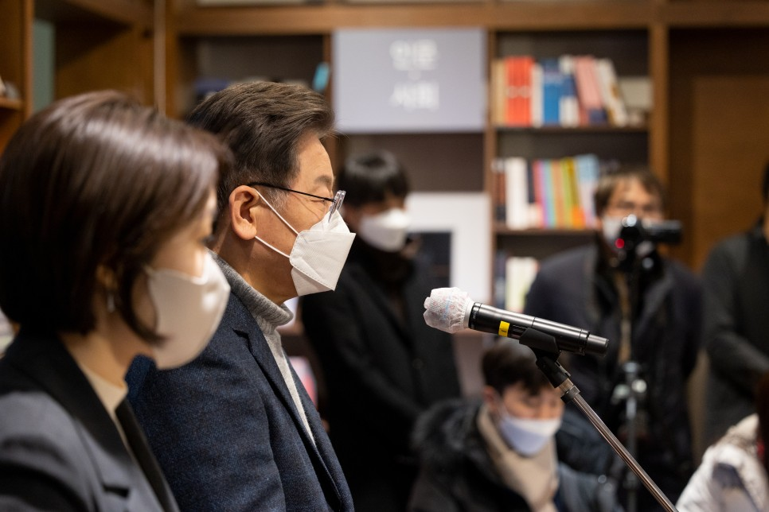

## 대표공약
# 재개발‧재건축 활성화 6대 정책 발표
> 2022-01-13 17:52:11

존경하는 국민 여러분, 인사드립니다.

더불어민주당 제20대 대통령선거 후보 이재명입니다.

​

많은 국민들께서 부동산 문제로 인해서 정부와 더불어민주당에 실망하고 계신 점을 너무 잘 알고 있습니다. 집권여당의 대선후보로서 큰 책임감을 느낍니다. 국민 여러분께 다시 한 번 깊이 사과드립니다.

​

정치의 목적은 국민의 불편을 해소하고, 더 나은 삶을 살 수 있도록 하는 것입니다. 목적과 수단이 뒤바뀌면 안 됩니다. 더 유연하고 실용적인 정책집행이 필요합니다.

​

물론, 정책의 일관성은 매우 중요한 가치입니다. 그렇긴 하지만 국민의 불편을 방치하는 이유가 될 수는 없습니다.

역대 민주정부는 재개발·재건축을 과도하게 억제한 측면이 있습니다. 그러나 재개발·재건축을 금기시하지 말고, 국민의 주거 상향 욕구도 존중해야 합니다.

​

지지층의 비판이 있을 수 있다는 것을 알지만 용적률, 층수규제 완화를 통한 재개발·재건축이 필요하다는 게 제 입장입니다.

​

재개발·재건축은 도심 내 주요한 주택공급 수단입니다. 그리고 동시에 도시 슬럼화를 막고 거주 주민들의 주거의 질을 높이는 필수적인 정책이기도 합니다.

​

재개발·재건축을 과도하게 억제하면 주택공급이 부족해질 수밖에 없습니다. 본래 기능을 살려서 도심 내 주택공급을 확대하고, 국민의 주거 상향을 적극적으로 지원하겠습니다.

​

구체적인 방법을 말씀드리겠습니다.

첫째, 재개발·재건축 신속협의제를 도입하고, 500%까지 용적률 상향이 가능한 4종 주거지역을 신설하겠습니다.

정부, 지자체와 주민 간 신속 개발에 협의가 되면 인허가 통합심의를 적용해서 사업기간을 대폭 단축하겠습니다.

​

4종 주거지역 적용을 포함한 용적률 상향, 층수 제한, 그리고 공공기여 비율 등도 유연하게 조정하고 기반시설 설치에 필요한 비용도 지원하겠습니다.

​

과도한 개발이익이 발생하는 사업구역은 적절히 공공 환수를 해서 지역 사회에 환원이 될 수 있도록 하겠습니다. 아마 가장 좋은 방법은 청년주택과 같은 공공주택 공급이 되겠습니다.

둘째, 재건축의 안전진단 기준을 합리적으로 개선하겠습니다.

공동주택 노후화에 따른 주거환경 악화를 방치하지 않겠습니다. 거주민 삶의 질 향상의 관점에서 재건축 안전진단 심사가 이뤄질 수 있도록 구조안전성 비중 하향과 같은 제도 개편을 단행하겠습니다.

​

셋째, 공공재개발을 활성화하겠습니다.

​

공공재개발을 할 경우에는 종 상향 등 추가 인센티브를 부여하고, 임대주택 기부채납 등 공공기여 비율을 사업구역에 따라 탄력적으로 조정하도록 하겠습니다.

넷째, 고도제한지역·1종 일반주거지역에 맞춤형 지원대책을 마련하겠습니다.

이들 지역에는 도시기반기설, 생활형 SOC 투자를 적극적으로 확대하겠습니다. 주택 정비가 시급한 지역은 공공정비사업을 통한 저층고밀도개발 같은 다양한 방안을 검토해서 추진하겠습니다.

다섯째, 재정착이 어려운 원주민을 위한 특별 대책을 마련하겠습니다.

원주민 재정착 지원비용을 공공기여에 포함시키겠습니다. 분담금이 부족한 분들에게는 기본주택을 공급하고, 상가소유자·상가세입자, 다가구주택소유자 등이 생계수단을 잃지 않도록 그에 해당하는 정당한 보상을 시행하겠습니다.

여섯째, 재건축 수준으로 노후 공동주택 리모델링이 가능하도록 뒷받침하겠습니다.

‘리모델링 특별법’을 제정해서 세대수 증가와 수직증축을 지원하겠습니다. 인허가 절차, 안전진단과 안전성 검토 기준을 정비해서 사업 기간을 단축하겠습니다.

​

주민들의 관점에서 유연하고 실용적으로 접근하되, 재개발·재건축 관련 부정·비리는 엄단해서 사업이 투명하게 추진되도록 하겠습니다. 재개발·재건축, 주민들의 주거환경 개선을 위해서, 그리고 주택공급을 늘리기 위해서 반드시 시행하겠습니다.

​

고맙습니다.

​

​

2022년 1월 13일

​

더불어민주당 제20대 대통령선거 후보 이 재 명