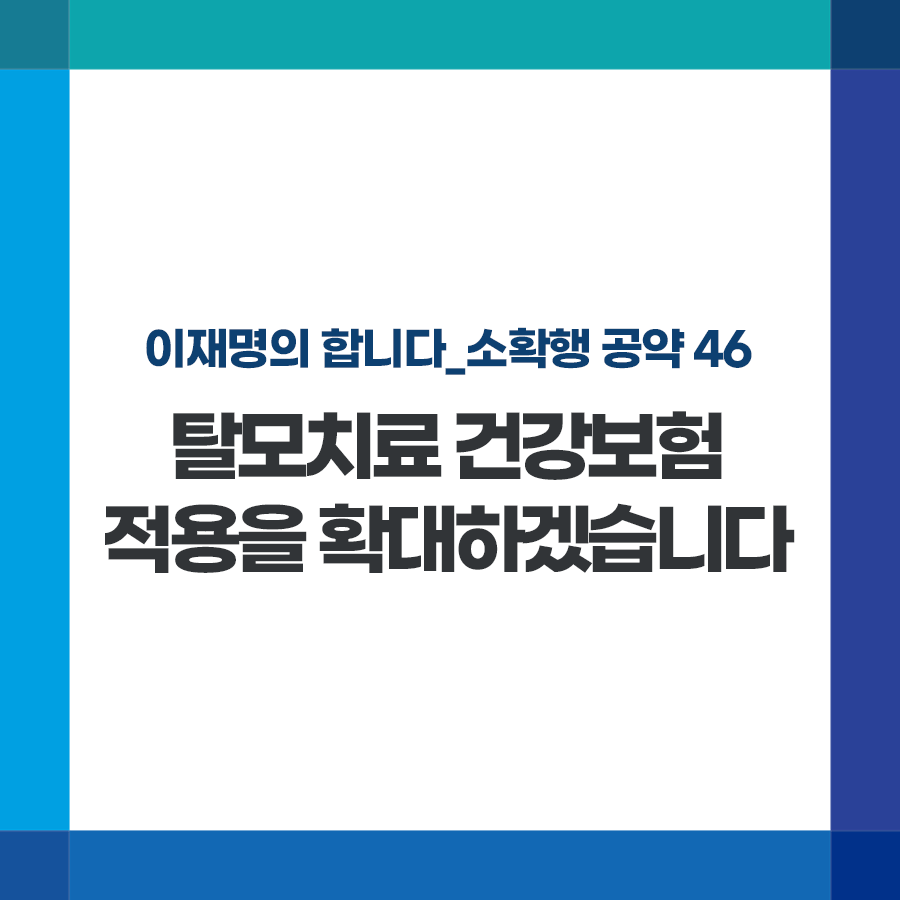

## 소확행 시리즈
# 탈모치료 건강보험 적용을 확대하겠습니다
> 2022-01-14 11:18:33

이재명의 합니다_소확행 공약 46

‘탈모 치료가 곧 연애고 취업이고 결혼이다’

단 한 문장이지만 겪어보지 못한 사람은 모를 절박함이 담겨 있습니다.

탈모인이 겪는 불안, 대인기피, 관계 단절 등은 삶의 질과 직결되고 또한 일상에서 차별적 시선과도 마주해야 하기에 결코 개인적 문제로 치부될 수 없습니다.

치료를 받는 환자 절반 이상이 30대 이하의 청년층이고, 남녀 비율도 거의 비슷할 만큼 특정 연령, 성별의 문제도 아닙니다.

현재 전체 탈모 치료 환자의 2%를 제외한 나머지 치료는 노화, 유전으로 인한 ‘미용’ 목적으로 간주 돼 건강보험 적용이 제외되고 있습니다.

비싼 약값으로 인해 동일 성분의 전립선 치료제를 처방받는 서글픈 편법, 이제는 끝내야 합니다.

국가가 적절하게 지원해 탈모 치료에 도움을 드리겠습니다.

첫째, 탈모치료약에 대한 건강보험 적용을 확대하겠습니다. 적정한 본인부담율과 급여 기준을 시급히 정하겠습니다.

둘째, 중증 탈모 치료를 위한 모발이식의 건강보험 적용 확대도 적극 검토하겠습니다.

전문가들의 의견 수렴과 사회적 논의를 거쳐 적정 수가를 결정하면 건강보험 부담도 최소화할 수 있을 것입니다.

급여화가 이뤄지면 안정적인 시장이 형성돼, 관련 제품 개발이 활성화될 것이고, 이에 따라 기존 제품 가격도 인하될 수 있을 것입니다.

박근혜 정부에서 미용으로 취급되던 치아 스케일링, 고가의 임플란트에 건강보험을 적용한 사례도 있습니다. 이때와 달리 탈모인들의 고통과 불편을 외면한 채 포퓰리즘으로 무조건 반대하는 것은 정치적 내로남불에 가깝습니다.

저는 우리 국민의 집단지성을 믿습니다. 충분한 토론과 논쟁을 통해 합리적인 결과를 도출할 수 있으리라 생각합니다.

치료 받는 국민에게 적절한 지원을 제공하는 것은 국가의 의무입니다. 탈모인들의 경제적 부담을 덜어 치료에 전념할 수 있도록 돕겠습니다.