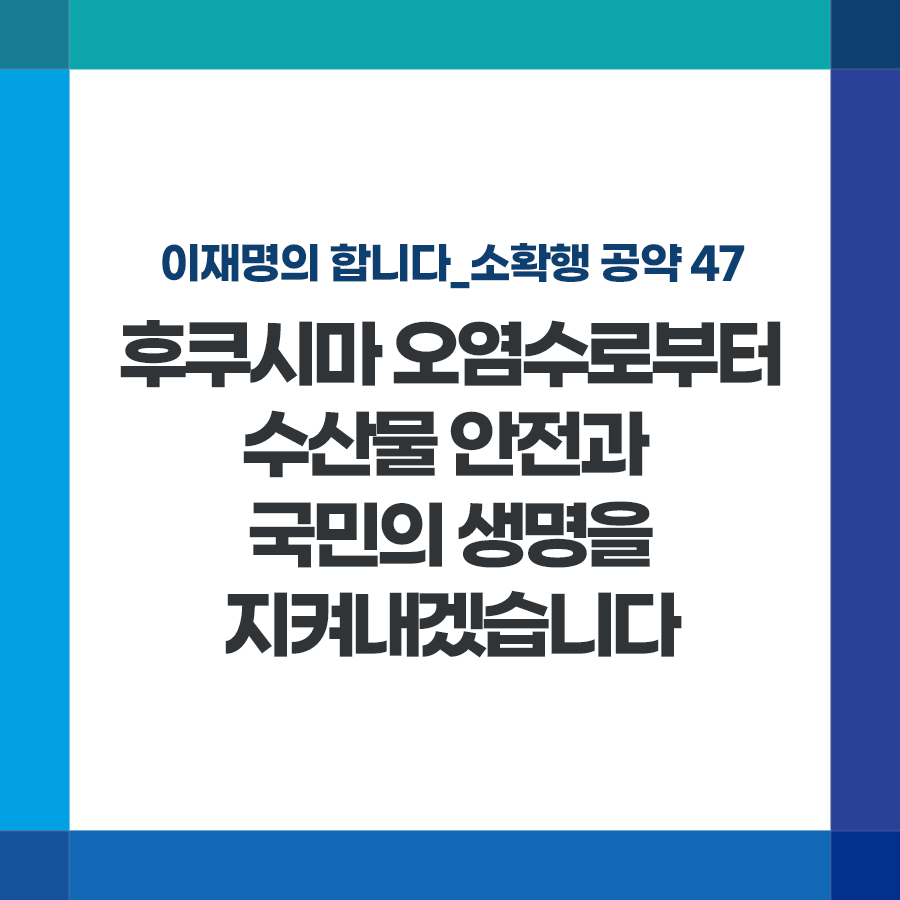

## 소확행 시리즈
# 후쿠시마 오염수로부터 수산물 안전과 국민의 생명을 지켜내겠습니다
> 2022-01-16 11:51:38

이재명의 합니다_소확행 공약 47

일본은 여러 우려와 반대에도 불구하고 후쿠시마 원전 오염수 방출 계획을 강행하고 있습니다.

​

투명한 정보공개와 검증이 생략된 일본의 방출 계획은 과거사, 영토 문제에 이어 한일 양국의 미래지향적 관계 구축에도 큰 걸림돌입니다.

​

무엇보다 막대한 양의 방사능 오염수가 방출될 경우 우리의 해양 생태계에도 지대한 영향을 미치며 조업 활동 피해, 수산물 안전 등 심각한 위협이 될 수 있습니다.

​

일방적인 방출에 대한 강력한 외교적 대응과 함께 예상되는 경제적 피해와 수산물 안전에 적극 대비하겠습니다.

​

첫째, 국내산 수산물에 대한 방사능 조사 강화와 국제기준 안전관리제도인 ‘허용물질목록관리제도’를 도입하여 일본 방사능 오염 수산물 수입을 원천 봉쇄하는 등 수산 먹거리 안전을 책임지겠습니다.

​

잔류허용기준이 없는 물질도 0.01mg/kg 이하일 때만 수입할 수 있도록 강력히 조치하겠습니다.

​

둘째, 방사능 검사 장비·인력 등 안전 관리 인프라를 대폭 확대하겠습니다.

​

노후 위판장 현대화에 맞춰 방사능 검사 장비, 실험실 등에 대한 투자를 함께 늘려 가겠습니다.

​

윤석열 후보는 “후쿠시마 원전은 지진하고 해일이 있어서 피해가 컸지만, 원전 자체가 붕괴된 것은 아니므로 방사능 유출은 안됐다”고 말한 바 있습니다.

​

진실은 분명합니다. 2011년 3월 지진과 해일이 후쿠시마 원전을 덮쳤고 건물이 손상되고 원전기능이 마비되어 대규모 방사능물질 유출되었습니다.

​

이에 국제원자력기구가 원자력사고등급(INES) 최고등급인 7단계를 부여하였습니다. 이것이 팩트입니다.

​

외교적 저자세로 후쿠시마 원전 방사능 오염수의 위험을 외면하는 것은 국민의 생명과 안전에 눈 감는 것과 다름없습니다.

​

국민 안전을 지키는 데는 과잉 대응이라 평가받을 정도로 강력하게 대처하겠습니다.