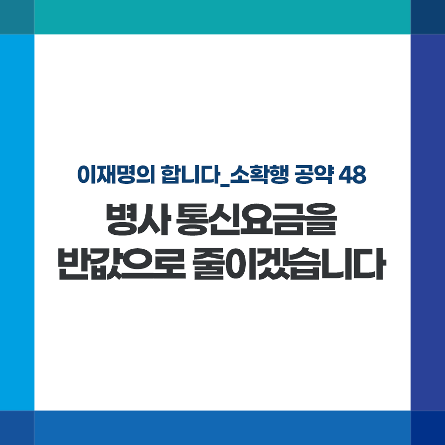

## 소확행 시리즈
# 병사 통신요금을 반값으로 줄이겠습니다
> 2022-01-17 11:36:42

이재명의 합니다_소확행 공약 48

2019년 도입된 국군장병의 휴대전화 사용은 병영생활의 긴장을 풀고 외부와의 단절을 막아주어 병사나 군인가족 모두가 만족하는 정책입니다.

특히 코로나로 면회 등이 더 어려워진 상황에서도 자기개발과 여가활동을 이어가도록 큰 도움을 주고 있습니다.

다만 장병들의 평균 휴대전화 사용시간이 3~4시간인데 반해 이용요금이 비싼 점은 개선이 필요합니다.

국방부 조사에 따르면 10명 중 3명은 월 5만원 이상의 요금을 지출하고 있으며, 전체 병사 기준으로는 월급 67만원의 10%를 통신비로 지출한다고 합니다.

가장 보편적인 100G 요금제 기준으로 군인요금제가 통신사가 지난해 내놓은 ‘언택트 요금제’보다 비쌉니다.

병사 통신료를 반값으로 낮추겠습니다.

첫째, 전기통신사업법 요금감면 규정을 개정해 통신사의 기존 20% 요금할인을 50%까지 대폭 상향하겠습니다.

100G 요금제 기준으로 월 34,500원의 요금만 납부하면 되고, 전국민 대상의 선택약정할인까지 추가한다면 17,250원으로 낮출 수 있습니다.

둘째, 안정적인 정책 실행을 위해 정부가 감면 비용의 일부를 재정에서 부담하는 방안도 검토하겠습니다.

공용 와이파이를 쓸 수 없는 군 특성상 장병들은 저렴한 통신망 사용이 중요합니다. 휴대전화 이용요금을 낮춰 사기 진작, 자기개발에 활용하도록 제대로 지원하겠습니다.