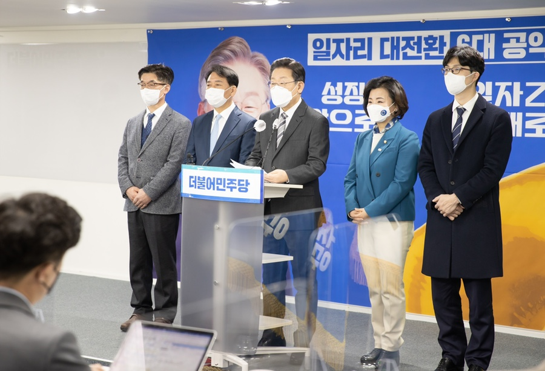

## 대표공약
# 일자리 성장, 앞으로! 정의로운 일자리 대전환, 제대로! 나의 일자리를 위해서 이재명은 합니다
> 2022-01-18 15:03:52

세계는 지금 디지털·비대면 탈탄소 경제로 급속하게 전환하고 있습니다. 이와 함께 일자리 역시 더 빨리, 더 크게 변화할 것입니다.

많은 전문가들은 급변의 대전환기에 일자리의 양과 질이 저하되고, 또 이로 인한 사회적 양극화는 더 심화될 것이다라고 예견합니다.

​

늦었다고 생각하면 뒤처진 것입니다. 미리 준비하고 체계적으로 대응해야 비로소 전환시대를 이끌어 갈 수가 있습니다.

​

우리가 마주한 일자리 위기를 일자리 대전환의 기회로 만들어야 합니다.

​

일자리가 곧 경제이고, 일자리가 곧 복지입니다. 저 이재명이, 경제와 일자리가 선순환되는 일자리경제를 활성화시켜서 국민이 행복한 경제성장을 이뤄내겠습니다.

​

기업과 지역이 연계해서 주도적으로 일자리를 창출하고, 정부의 진취적인 정책 기획과 과감한 지원으로 대한민국 일자리 대전환 시대의 문을 활짝 열겠습니다.

​

이를 실현하기 위한 이재명 정부의 일자리 대전환 6대 공약을 말씀드리겠습니다.

첫째, 디지털·에너지·사회서비스 대전환을 통해서 300만개 이상의 일자리를 만들겠습니다.

신속하고 선도적인 디지털 대전환을 통해서 혁신형 일자리를 늘리는데 135조 원을 투입한다는 말씀을 미리 드렸습니다.

​

국비, 지방비, 민간자금을 포함한 135조 원을 조성해서 디지털 인프라 조성, 데이터 고속도로와 산업생태계 구축, 초기술·초연결 신산업 육성, 디지털 문화콘텐츠 육성, 스마트 SOC 투자를 힘 있게 추진하겠습니다.

​

탈탄소·녹색경제로의 빠른 전환을 통해서 신산업 일자리 창출의 기회를 만들겠습니다. 에너지 고속도로 구축, 그린에너지와 에코모빌리티 산업 혁신, 탄소중립 신기술 개발, 자원순환 신산업 육성을 강력하게 추진하겠습니다.

​

사회서비스 대전환을 통해 일자리를 만들면 복지와 성장이 선순환됩니다. 돌봄, 간병, 보육의 사회서비스와 코로나 팬데믹 극복을 위한 공공보건 분야에서 반듯한 일자리를 늘리겠습니다.

​

사회서비스 종사자의 교육·훈련을 강화하고, 근무환경과 처우를 개선하겠습니다. 이를 통해 사회적 경제 발전의 토대를 마련함과 동시에 사회서비스 일자리를 OECD 평균 수준으로 끌어올리겠습니다.

​

이 사회서비스 일자리 공약은 유승민 전 의원께서 정말 훌륭하게도 ‘사회서비스 일자리 100만개’공약을 실사구시 입장에서 미리 주장하셨는데 이 부분을 저희가 과감하게 수용했다는 말씀을 드립니다. 유승민 전 경선후보 주장에 의하면 OECD 평균에 우리가 도달하기 위해서 약 140만 개의 추가 사회적 일자리가 필요하다, 이렇게 분석하신 바가 있고 저희도 거기에 전적으로 공감합니다.

둘째, 누구도 소외되지 않는 ‘정의로운 일자리 전환’ 체계를 구축하겠습니다.

급속한 디지털·에너지 대전환은 특정 산업분야와 관련 지역의 쇠퇴, 그리고 노사갈등을 유발할 수 있습니다.

​

유럽연합은 탄소중립경제로의 전환을 공정하게 추진하기 위해서 공공기금, 전환펀드, 민간투자를 대규모로 조성해서 기업전환, 노동전환, 지역전환 이 3개 전환을 지원하고 있습니다. 유럽연합의 ‘공정전환계획(Just Transition Scheme)’에 버금가는 한국형 ‘정의로운 일자리 전환체계’를 마련하겠습니다.

​

산업과 일자리의 변화를 예측하고 분석해서 맞춤형 직업훈련과 직업상담을 미리 제공하고, 일자리 이동을 신속하게 지원하겠습니다.

​

기업이 신산업으로 전환할 경우 규제 특례, 사업전환자금을 확대 지원하고 대기업과 중소기업의 상생 전환을 적극 지원하겠습니다.

​

‘정의로운 노동전환’의 정착을 위해 장기유급휴가훈련 제도를 확대 시행하고, 노동전환지원금 규모를 점차 늘려가겠습니다.

​

일자리전환 관련 의사결정 과정에 반드시 노동자가 참여해서 함께 의논하는 그런 시스템을 마련하고, 이를 위한 ‘노동전환지원법’ 제정을 서두르겠습니다.

​

주력산업의 쇠퇴가 예상되는 지역은 선제적으로 고용위기지역과 산업위기지역으로 지정하고, 피해방지와 복구방안과 같은 종합대책을 마련해서 지역경제가 회복되고 신산업으로 전환을 할 수 있도록 미리미리 체계적으로 준비하겠습니다.

셋째, 일자리를 경제정책의 최우선 과제로 삼고 일자리 정책체계를 효과적으로 재정비하겠습니다.

이재명 정부의 고용을 통한 성장은 국민이 행복한 성장입니다. 우선 일자리정책과 경제정책을 상호보완하고 동시에 기획하는 ‘일자리전환기본법’을 제정하겠습니다.

​

기획재정부를 개편하는 과정에서 일자리정책의 기획과 조정기능을 대폭 강화하고 일자리전환의 컨트롤타워로 만들겠습니다.

​

현재의 일자리위원회를 ‘일자리대전환위원회’로 개편해서 업종과 계층, 지역별 다양한 이해관계자가 골고루 함께 참여할 수 있도록 운영하겠습니다.

​

‘일자리전환 기본전략’을 수립하고 재정과 금융, 세제와 조달을 비롯한 필요한 정책 수단을 총동원해서 기업전환, 노동전환, 지역전환을 통합적이고 체계적으로 지원하겠습니다.

​

일자리정책에 대한 과감한 예산 편성은 물론이고 대출과 보증, 투자유도와 같은 금융정책이 일자리 효과로 이어지도록 하겠습니다.

​

국민이 언제, 어디서라도 편리하게 이용할 수 있도록 일자리서비스 기능을 촘촘하게 구축하겠습니다. 일자리 관련 집행조직을 국민 편익에 맞춰 개편하겠습니다. 각종 일자리 지원센터를 통합적으로 운영하여 업무의 효율성과 이용의 편의성을 높일 것입니다.

넷째, 기업 주도의 일자리 성장을 촉진하고 강력한 일자리 환류 정책을 추진하겠습니다.

기업이 늘어나고 기업이 성장해야 일자리도 많아집니다. 좋은 일자리 창출을 위해서는 창업(Start-Up)만큼이나 기업의 성장(Scale-Up)도 중요합니다. 유니콘기업을 기업가치 100억 달러가 넘는 데카콘기업으로, 또 중소기업이 중견기업으로 더 크게 성장할 수 있도록 기업의 성장 사다리를 더 크고 튼튼하게 만들겠습니다.

​

우선 미래핵심 산업의 창업을 돕는 테크형 메가펀드인 K-비전펀드를 50조원 규모로 조성하겠습니다. 벤처투자 규모를 10조원 수준으로 크게 늘리고, 국민참여형 벤처투자펀드를 도입하겠습니다. 성공적인 벤처투자펀드 조성을 위해 배당소득에 대해서는 저율의 분리과세를 도입하겠습니다.

​

강력한 투자로 국가대표 혁신기업 3,000개, 유니콘기업 100개와 다수의 데카콘기업을 육성하겠습니다.

​

대기업이 사내유보금을 일자리 창출에 투자할 수 있도록 투자·상생협력촉진세제의 일자리 세액공제를 늘려가겠습니다. 고용유지 과세특례, 고용증대세제 감면을 확대해서 조세의 일자리 선순환 기능을 강화하겠습니다.

다섯째, 미래전략산업 육성과 기업도시 2.0 프로젝트로 혁신형 지역 일자리를 만들겠습니다.

지역에 기업이 많아져야 지역 일자리가 늘어나고 지역경제가 살아납니다.

​

먼저 지역 특색에 맞는 혁신선도기업을 적극 육성하겠습니다. 수도권 소재 기업의 지방이전을 지원하고, 해외에서 국내로 복귀하는 기업들이 지역으로 이전할 수 있도록 지원하겠습니다.

​

규제개혁, 조세특례, 산업부지 등을 과감하게 지원해서 기업의 투자 여건을 대폭 개선하겠습니다. 이와 함께 지역 노동자의 정주 여건 마련과 삶의 질 향상에 힘쓰겠습니다.

​

반도체, 미래모빌리티, 그린에너지, 바이오헬스, AI, 로봇과 같은 미래전략산업이 지역에서 성장하고 지역경제의 중심으로 정착하는 ‘K-혁신밸리’를 조성하겠습니다.

​

이를 위해 국가 R&D 투자, 스마트산단 조성, 혁신인재 양성, 상생금융 지원, 맞춤형 행정이라고 하는 지원 인프라를 반드시 구축하겠습니다.

​

기업도시 2.0 프로젝트를 추진해서 지역경제를 활성화하겠습니다. 기업도시를 혁신도시, 규제자유특구, 국가혁신융복합단지, 산학융합지구와 연계하여 시너지를 내도록 하겠습니다.

​

기업에 필요한 인재와 연구역량 확충을 위해 지역대학과 함께 혁신인재를 양성하고 산학혁신의 그루터기를 조성하겠습니다.

​

기업도시의 안정적인 성장 여건을 조성하기 위해 도시계획과 개발에 대한 기업의 자율권을 확대하겠습니다.

​

배후지역의 교육과 교통, 의료와 문화 기반을 획기적으로 개선하겠습니다. 이를 위해 지역특화지원 세제 혜택을 높이고 지역활력, 산업활력 펀드를 대폭 확대하겠습니다.

​

‘광주형 일자리사업’으로 알려지고 있는 상생형 지역일자리사업을 전국적으로 확대하겠습니다. 상생형 일자리사업을 10개 이상 추가 발굴해서 지역에 50조 원 이상의 투자가 이뤄지도록 지원할 것입니다. 상생형 일자리기업과 노동자를 위한 재정지원도 확대하겠습니다.

여섯째, 더 과감하고 세심하게 청년 일자리를 지원하겠습니다.

청년의 위기는 대한민국의 위기 그 자체를 보여줍니다. 가장 어렵고 힘든 우리 청년세대가 열심히 일하면서 미래의 희망을 꿈꿀 수 있도록 청년 일자리에 집중적으로 지원하겠습니다.

​

임기 내, 청년 고용률 5%p 향상을 목표로 과감한 상상력을 지닌 담대한 일자리정책을 펼치겠습니다. 청년 일자리정책의 효용성은 더 높이고 청년의 눈높이에 맞추며, 청년의 자율성을 더 존중하겠습니다.

​

국민내일배움카드를 개편해서 청년 지원금을 현재보다 두 배 더 늘리도록 하겠습니다. 직업훈련기관에 대한 심사평가 요건을 현실에 맞게 개선해서 청년이 더 다양한 과정을 선택할 수 있게 하겠습니다.

​

장기간 취업 실패로 구직을 포기한 청년들이 취업 의지를 되살려서 다시 도전할 수 있도록 만들어가겠습니다.

​

교육과 취업을 포기한 청년, 소위 니트족(NEET)을 대상으로 전문가 멘토를 활용해 현재 역량을 진단하고 교육‧훈련의 맞춤형 서비스를 제공하는 ‘청년 위기극복 1 : 1 프로젝트’를 시행하겠습니다. 단 한 명의 낙오자도 생기지 않도록 정부와 지역사회, 기업이 함께 힘을 모으겠습니다.

존경하는 국민 여러분!

‘모든 국민은 근로의 권리를 가진다.’ 대한민국 헌법에 명시된 일자리 기본권입니다. 국민께 더 안정적이고 더 나은 일자리를 보장하는 것은 국민을 위한 국가의 중요한 책무 중에 하나입니다.

​

저 이재명이 성남시와 경기도를 이끌어오며 신속한 정책과 추진력으로 지역 일자리와 청년 일자리를 만들기 위해서 노력해왔습니다.

​

저는 정책을 알고 실행 방향을 압니다. 아는 만큼, 그리고 경험한 만큼 새로움을 창출할 수 있습니다. 일자리정책에 능력과 경험이 많은 제가 국민 여러분의 일자리를 늘려드리고, 지켜드리고, 또 바꿔드리겠습니다.

​

일자리 성장, 앞으로

정의로운 일자리 대전환, 제대로

나의 일자리를 위해서 이재명은 합니다!

고맙습니다.