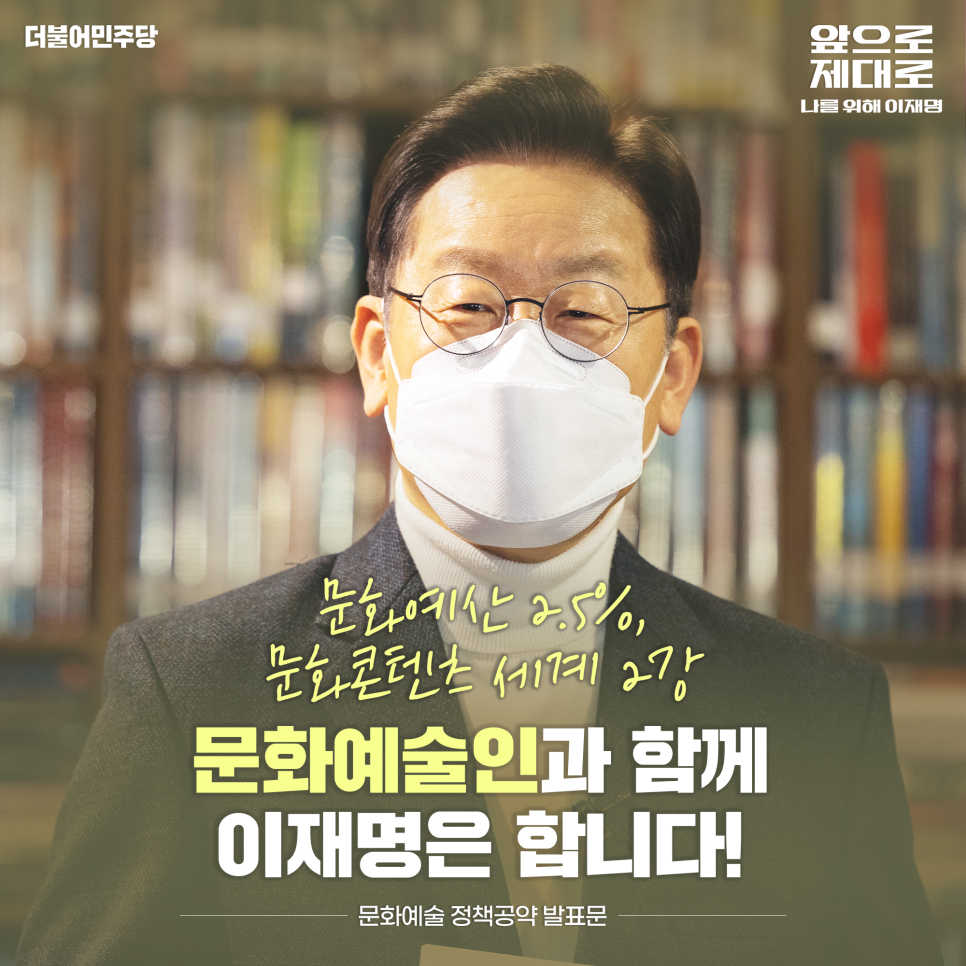
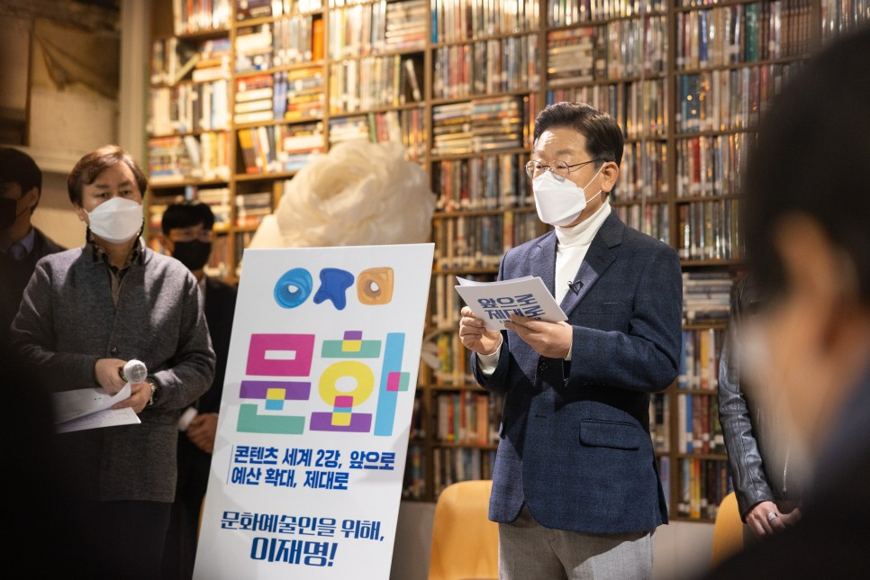
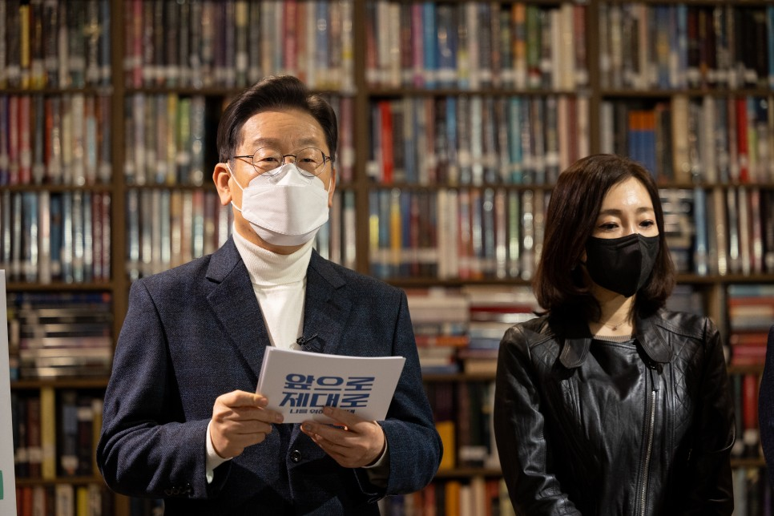
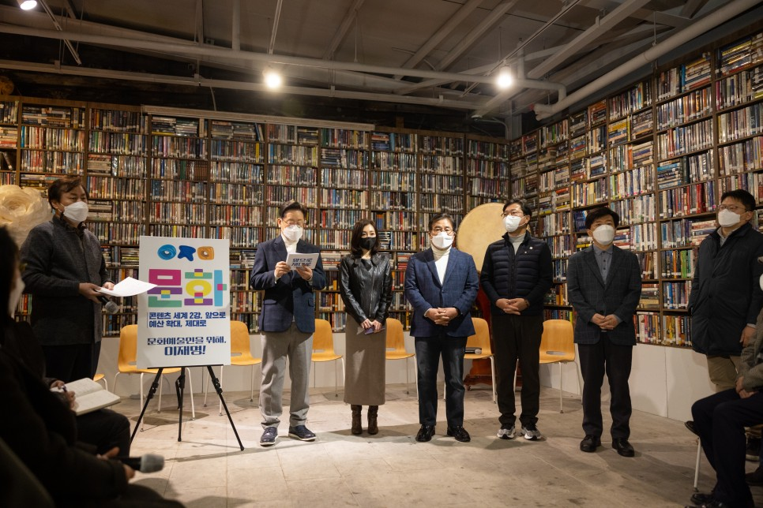
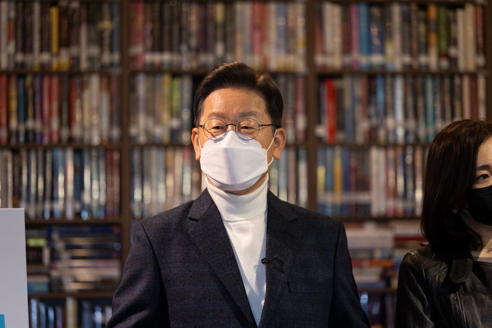
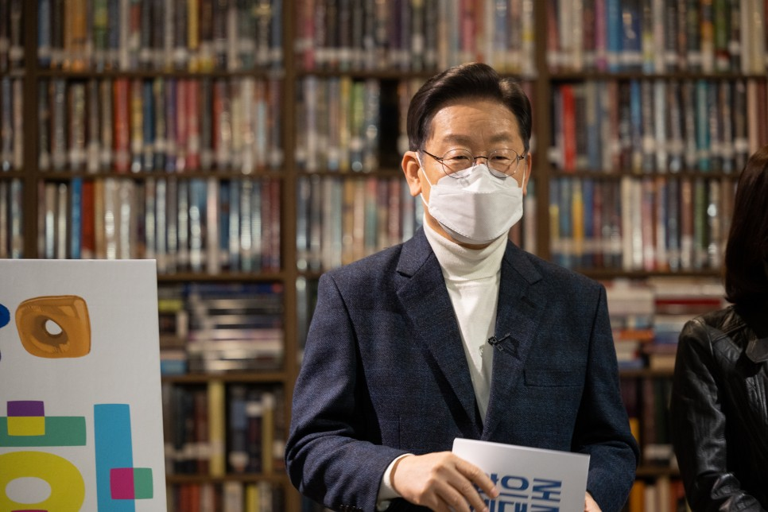
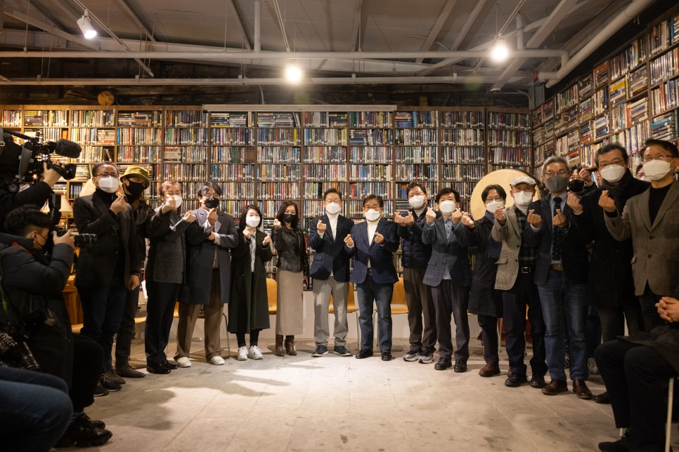

## 대표공약
# 문화예산 2.5%, 문화콘텐츠 세계 2강 문화예술인과 함께, 이재명은 합니다!
> 2022-01-20 14:15:33

문화는 사람과 사람을 이어주는 연결망입니다. 코로나 팬데믹이 만든 거리두기로 공연장이 문을 닫고, 또 예술가들의 춤과 노래는 멈췄습니다. 백척간두 벼랑에 선 문화예술인의 절망적인 숨통에 다시 예술의 숨결을 불어 넣어야 합니다.

​

예총, 민예총을 비롯한 문화예술인과 소통하고 마음을 모아 조명이 꺼진 무대를 다시 노래하고 춤추는 희망의 한마당으로 불 밝히겠습니다.

​

한류를 세계 속에 더 크게, 그리고 넓게 키워서 대한민국과 미국, 콘텐츠 세계 2강의 지평을 열어보겠습니다. 문화의 힘으로 ‘한류코리아 프리미엄’을 창출하겠습니다.

​

우리 문화자산과 디지털 첨단기술을 융복합해서 대한민국을 문화콘텐츠의 글로벌 허브로 만들겠습니다. 디지털 문화콘텐츠의 창조 혁신역량으로 외교, 경제, 산업에서 문화의 힘을 극대화하겠습니다.

​

이를 실현하기 위한 문화예술 분야 6대 공약을 말씀드리겠습니다.

첫째, 문화 예산을 2.5%까지 늘리고 문화예술인 기본소득을 지급하겠습니다.

국가 재정에서 문화예산 비중을 현재보다 두 배 이상 더 높은 2.5%까지 대폭 확충하겠습니다.

​

문화예술인에게 연간 100만 원의 기본소득을 지급하고 공공임대주택 보급을 확대하겠습니다.

​

일의 유형과 관계없이 프리랜서, 계약직을 포함한 모든 문화예술인에게 충분한 노동권 보장을 위한 사회보장제도를 강화하겠습니다.

​

문화예술인 없는 문화예술정책을 바로잡고 과도한 성과주의를 앞세운 탁상관료주의를 배격하겠습니다.

​

문화예술기관 채용에 개방형 공모제를 확대해서 문화예술인의 현장경험과 전문성이 정책에 반영될 수 있도록 하겠습니다.

​

지역 문예회관의 지역예술인 공연제작 지원을 활성화하고 예술인 직접 고용을 늘려 안정적 창작활동을 보장하겠습니다.

​

지역별 장애인지원센터의 기능과 지원을 확대해 장애인들의 문화예술 활동의 폭을 넓혀나가겠습니다.

​

이명박 박근혜 정부의 문화예술인 블랙리스트 때문에 아직까지 고통 받고 계신 문화예술인들의 피해치유를 위해 더 노력하겠습니다.

둘째, 국민의 문화기본권을 보장하고 ‘국민창작 플랫폼’을 운영하겠습니다.

국민의 문화기본권을 보장해서 누구나 풍요로운 문화와 예술을 누리도록 하겠습니다.

​

통합문화이용권 지원을 생애주기별로 확대하겠습니다. 원하는 국민 누구나 집 가까운 곳에서 ‘1인 1예술교육'을 받을 수 있도록 하겠습니다.

​

전국의 기초단위 지방정부에 작은미술관과 작은영화관을 하나 이상 건립하고 운영을 지원하겠습니다. 도서관과 작은 도서관을 지역별로 균형 있게 확충하겠습니다.

​

각 지역도서관을 복합문화공간으로 기능을 확대 강화해 지역 문화예술 활동의 거점공간으로 만들겠습니다. 자료구입비와 주민참여 도서 선정을 늘리고 사서 인력도 확대해서 도서관의 내실을 다지겠습니다.

​

민간이 운영하는 작은 도서관에는 도서 구입과 프로그램 운영을 지원하는 정책을 마련해서 공적인 역할을 강화하겠습니다.

​

‘국민창작 플랫폼’을 운영하겠습니다. 국민 누구나 자신이 생산한 문화콘텐츠를 보존하고 활용해서 유통할 수 있는 시스템을 마련할 것입니다. 국민의 창작활동 활성화를 위해 국민지식재산권을 적극적으로 보호하겠습니다.

​

각종 게임이 국민의 보편적 문화생활로 자리 잡을 수 있게 이용자의 편리와 권익 증진을 위해 더욱 노력하겠습니다.

셋째, 지역의 문화자치를 강화하고 문화마을을 조성하겠습니다.

지역별 특색과 문화적 차이를 존중하고 다양성을 살려 지역주민이 주도하는 특화된 문화정책을 실현하겠습니다.

​

기초단위 지방정부와 지역주민 간의 문화 협치를 강화하겠습니다. 법정문화도시 지정을 확대하고 다양한 문화자원을 발굴해 각 지역을 대표하는 문화브랜드로 육성하겠습니다.

​

전국 3,501개 읍면동마다 문화마을을 조성하는 ‘3501 문화마을’사업을 추진하겠습니다. 농산어촌부터 시범사업을 시작하겠습니다. 마을의 문화예술인과 주민이 마을재생과 문화사업을 함께 직접 주도하도록 하겠습니다.

​

문화마을과 문화도시를 연결해 마을 특성에 기반한 문화관광 콘텐츠와 프로그램이 개발될 수 있게 지원하겠습니다.

​

유휴시설의 창작공간 활용을 늘려서 연습과 창작, 공연과 전시, 체험과 돌봄을 활성화하고 지역주민과 문화예술인의 연대와 상생을 강화하겠습니다.

넷째, 청년 문화예술인 ‘1만 시간 지원 프로젝트’를 실시하겠습니다. 국가가 청년 마을예술가를 고용하겠습니다.

청년의 꿈이 커야 대한민국의 미래도 커집니다. 미래 청년세대의 의견과 요청을 적극 수용하겠습니다.

​

청년의 문화 정책수립 권한을 대폭 확대하고 청년예술가들의 도전정신과 창의적 아이디어가 문화예술 현장정책에 적극 반영되도록 하겠습니다.

​

청년 문화예술인 성장을 위한 ‘1만 시간 지원 프로젝트’시범사업을 실시하겠습니다. 전문가가 되려면 만 시간의 투자가 필요하다고 합니다. 청년 문화예술인에게 5년간 창작에 전념할 수 있는 여건을 지원하여 스스로 창작의 경로를 찾을 수 있게 하겠습니다. 단계별 창작활동 비용, 문화기관 이용권, 예술인 멘토 지원, 사업화 컨설팅과 같은 분야별 맞춤형 서비스를 제공하겠습니다.

​

국가가 청년을 마을예술가로 채용하겠습니다. 청년의 패기와 창의력 넘치는 문화예술 활동을 동력으로 소멸위기 지역을 사람이 모이는 활기찬 곳으로 바꿀 것입니다.

다섯째, 대통령이 직접 나서 문화외교를 강화하고 코리아 프리미엄을 창출하겠습니다.

지난 3년 동안 한류는 세계 속의 문화강물을 만들었습니다. 터진 한류의 물꼬에 K- 문화강국의 배를 띄울 수 있게 됐습니다.

​

아시아, 아프리카, 중남미를 잇는 신남방과 러시아, 몽골, 중앙아시아를 관통하는 신북방의 한류 프로젝트를 가동하겠습니다.

​

신남방과 신북방 루트에서 각국 문화와 한류를 연결하는 문화정상회의를 개최하겠습니다.

​

한류 페스티벌과 K-콘텐츠 마켓을 열어 역내 국가들과 문화교류 협력의 장을 강화하겠습니다. 높은 문화의 힘으로 한류 프리미엄을 창출하고 K-브랜드의 가치를 높여 세게 속 한국의 위상을 드높이겠습니다.

​

해외문화홍보원이 한류 컨트롤타워 역할을 할 수 있도록 그 기능을 더욱 확대 강화하겠습니다.

​

한류 콘텐츠의 번역과 글로벌 확산을 위해 외국인 번역전문가를 양성하는 번역대학원대학교를 운영하겠습니다.

​

세계인이 우리의 문화유산과 K-컬처를 경험할 수 있도록 ‘코리아 콘텐츠 메타버스' 플랫폼을 구축하겠습니다. 문화예술, 문화재, 관광과 연계한 관련 기관과 기업을 입점 시켜 한류를 확산시키도록 하겠습니다.

여섯째, 투자와 일자리 창출을 대폭 확대해 ‘문화콘텐츠 세계 2강’으로 우뚝 서겠습니다.

세계 최고 수준의 K-콘텐츠밸리를 조성하고 미국과 견주는 글로벌 문화콘텐츠 세계 2강 국가로 도약하겠습니다.

​

문학, 미술, 음악, 출판, 광고, 영화, 드라마, 방송, 게임, 애니메이션, 웹툰, 캐릭터 등 콘텐츠 산업 육성에 투자, 융자, 보증의 방식으로 지원하겠습니다. 공공과 민간의 투자, 융자, 보증을 5년간 50조 원 이상 규모로 확대하겠습니다.

​

우리의 다양한 문화자산을 AI, 5G, XR, 사물인터넷, 빅데이터, 메타버스와 같은 첨단 과학기술과 융복합한 K-콘텐츠밸리를 문화강국 전진기지로 만들고 문화 일자리 창출 50만 개를 목표로 산업을 강력하게 육성하겠습니다.

​

공공 기반의 콘텐츠 투자회사를 설립하겠습니다. 5년 동안 200개의 중소 콘텐츠 기업에 지분 투자와 프로젝트 투자를 실행하고 유니콘 문화기업이 10개 이상이 나올 수 있도록 하겠습니다.

​

투융자 방식의 영화제작 지원을 확대하고 세계 최고 수준의 애니메이션 인력이 창작에 몰입할 수 있도록 애니메이션 투자펀드도 만들겠습니다.

​

웹툰 고유의 식별체계 도입으로 국제표준을 선도하고 세계 1위인 한국 웹툰의 산업경쟁력을 강화하겠습니다.

​

문화예술 분야에 공정한 생태계를 조성하고 갑을 관계 차별과 대기업의 독과점 폐해를 시정하겠습니다.

​

국내외 콘텐츠 저작권 침해와 불법 서비스 근절을 위해 전담기구와 인력을 확충하겠습니다.

존경하는 국민 여러분, 그리고 문화예술인 여러분.

그 어느 때보다 우리 문화에 대한 자부심과 문화강국으로서의 자신감이 가득한 대한민국입니다. 한류의 물결이 지구촌을 휘감고 있습니다. BTS의 한복과 탈춤, 조선 힙합 이날치 밴드의 판소리가 세계인을 춤추게 만들고 있습니다. 

우리가 만든 문화, 우리가 누려야 합니다. 우리의 문화적 자긍심과 자부심이 국민의 삶 속에서 ‘나를 위한’ 행복으로 재현되어야 합니다. 이재명 정부는 문화의 풍요로움을 국민께 돌려드리겠습니다. 

국민 누구나, 어디에서나, 모두의 마음을 모아 일상 속 문화예술을 마음껏 누리실 수 있도록 하겠습니다. 

문화예술과 문화산업의 디지털 콘텐츠 대전환으로 김구 선생께서 꿈꾸셨던 문화강국 대한민국을 만들어가겠습니다. 

문화예산 2.5%, 문화콘텐츠 세계 2강, 문화예술인과 함께, 이재명이 하겠습니다. 고맙습니다.

