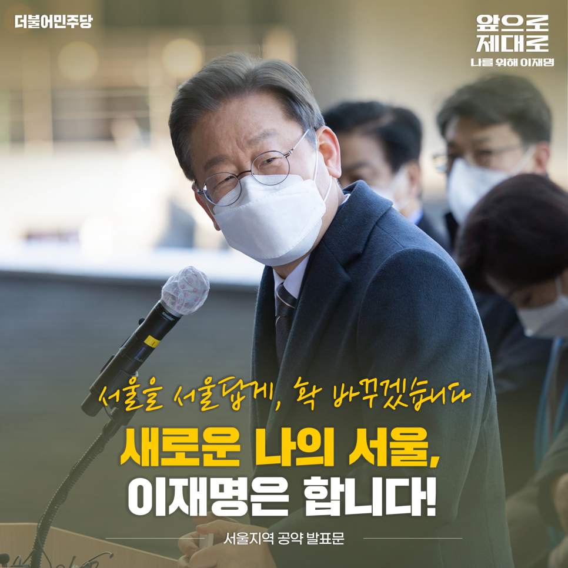
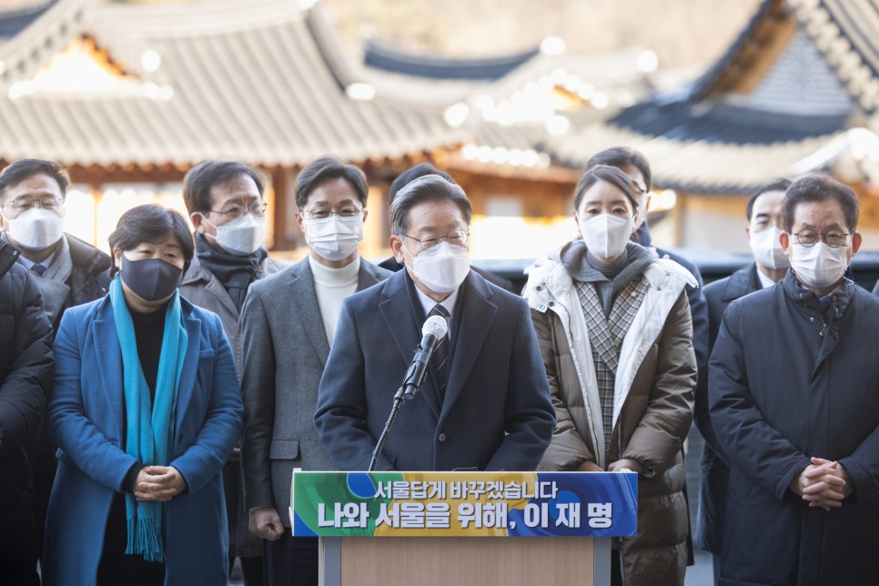
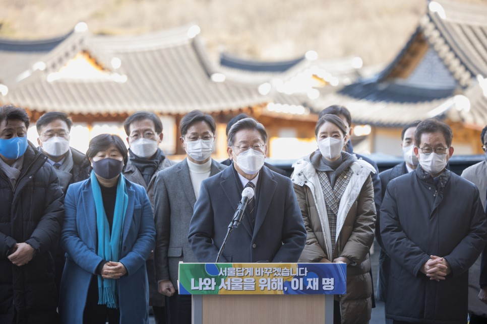
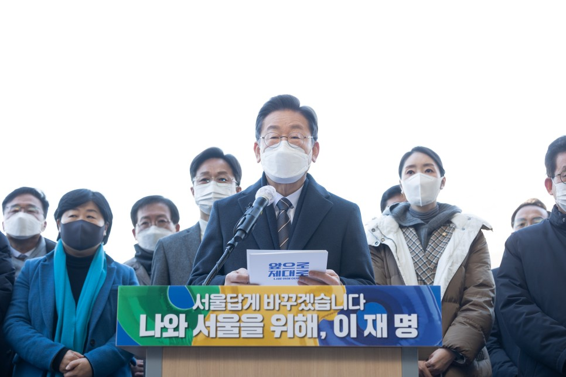
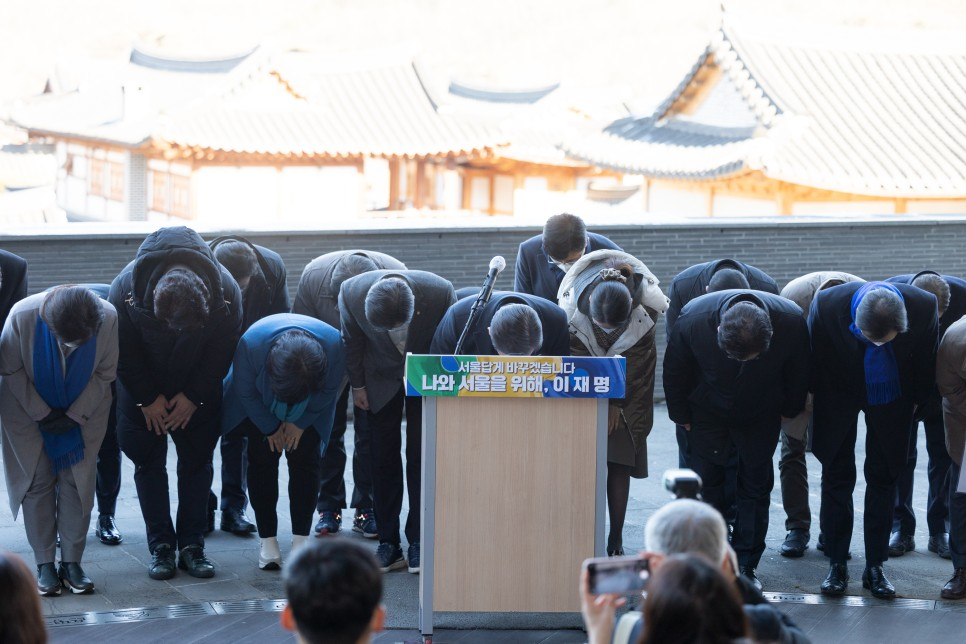
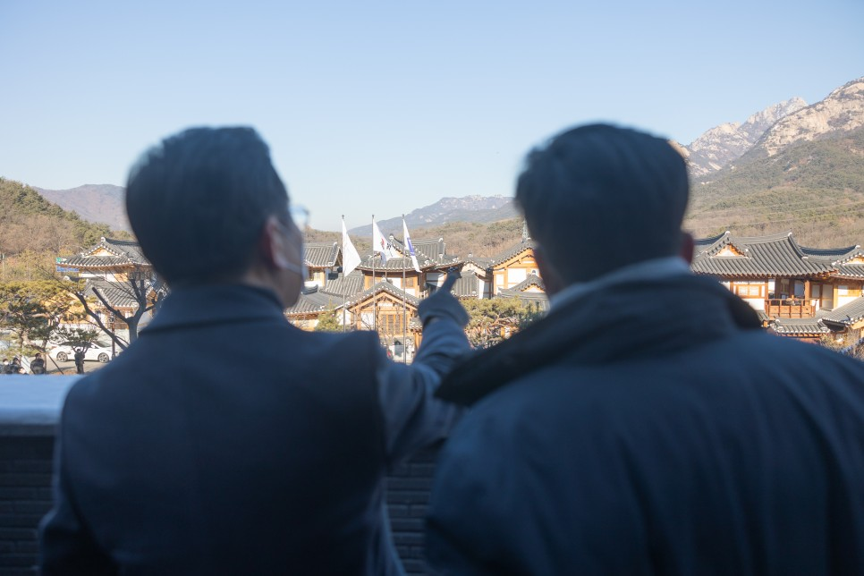
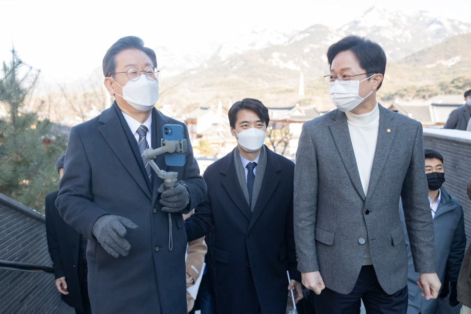
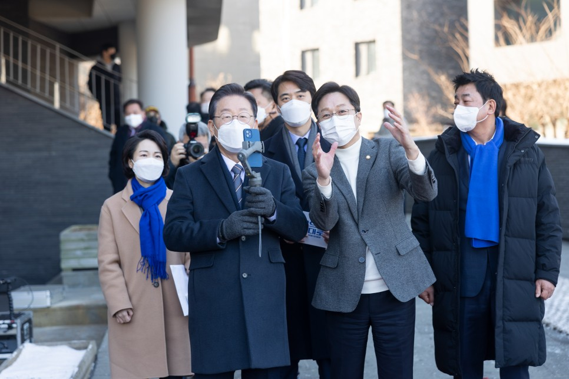
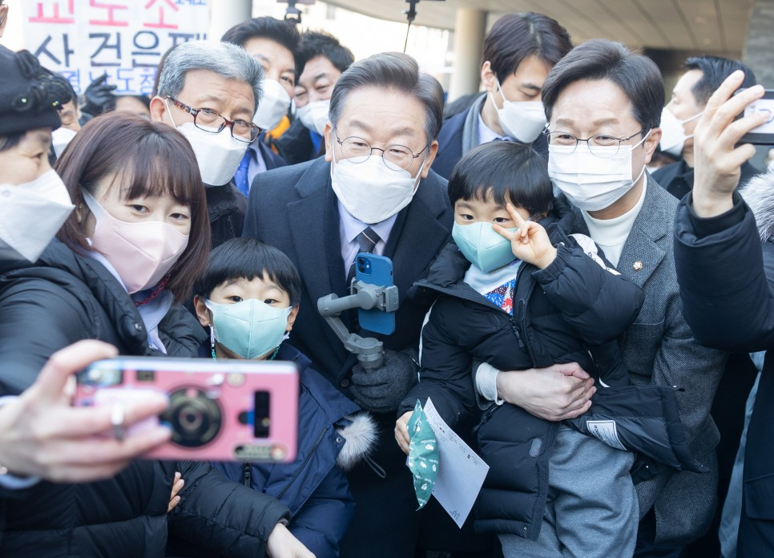

## 지역공약
# 서울을 서울답게, 확 바꾸겠습니다. 새로운 나의 서울, 이재명은 합니다!
> 2022-01-21 17:57:25

존경하는 서울시민 여러분, 세계의 경제와 문화를 선도하는 도시는 끊임 없이 변화했습니다. 파리, 런던, 뉴욕, 베를린, 샌프란시스코가 지난 200여 년간 세계 각국의 모델이었습니다. 그리고 지금 세계는 대한민국의 수도 서울을 주목하고 있습니다. 글로벌 대전환의 위기를 기회로 바꿔낸다면 서울이 이들 도시와 나란하게 발돋움하는 것도 결코 어려운 일이 아닙니다.

​

저 이재명이 어느 곳보다 역동적인 서울, 다양성과 창의성이 넘치는 서울, 경제와 문화에서 세계를 선도하는 서울을 만들겠습니다. 서울의 도약이 서울시민의 삶의 질과 직결되게 해야 합니다. 서울시민 여러분께서 가장 깊이 걱정하고 체감하시는 주거 불안정, 교통 체증, 지역 불균형, 환경 파괴와 같은 문제들을 정공법으로 돌파해나가겠습니다. 대전환의 시대, 서울을 서울답게 만들기 위한 이재명 정부의 7대 공약입니다.

첫째, 서울 시민들의 주거안정을 위해 대규모 주택 공급방안을 제시하겠습니다.

이사 다닐 걱정 없는 주거 안정은 국민의 당연한 헌법 상의 권리입니다. 민주당 정부는 서울시민 여러분의 주거권을 제대로 지켜드리지 못했음을 반성합니다. 살 곳을 마련하기 위해 청약시장, 부동산중개소, 금융기관을 찾아 다니시며 발 구르고 속 태우게 한 점 또 깊이 반성합니다. 집 걱정을 덜어드리지 못해 정말 송구합니다.

​

저 이재명은 서울의 주거 안정을 제일의 목표로 삼겠습니다. 내 집 마련의 꿈은 모든 서울시민의 꿈과 희망이 되어버렸습니다. 너무 당연한 것이 너무 멀어졌습니다. 청년들을 포함한 서울 시민들의 꿈을 실현하고 주거안정을 위해 대규모 주택 공급방안을 제시하겠습니다. 공급 규모와 방식을 비롯한 구체적인 방안은 매우 중요하므로 며칠 내에 구체적이고 세심한 방안을 마련해 별도로 발표하겠습니다. 청년세대를 포함한 무주택 서민들의 내 집 마련 꿈을 이루도록 대규모 공급방안을 마련해 튼튼한 주거 사다리를 놓겠습니다.

둘째, 철도와 도로의 지하화로 탁 트인 서울을 조성하겠습니다.

지상의 주요 철도와 도로가 지역을 분절시키고 발전을 저해하고 있습니다. ‘사람은 지상, 차량은 지하’라는 대원칙 아래 철도와 도로의 지하화를 추진하겠습니다. 지하철 1․2․4호선, 경의선, 중앙선, GTX-C 노선의 지상 구간을 단계적으로 지하화하겠습니다. 경부고속도로 양재~한남 구간의 지하화를 추진하고 동부간선도로의 지하화를 조기에 마무리하겠습니다. 도심 차량기지를 이전하거나 입체적으로 개발해서 서울시민의 주거와 삶의 질을 높이기 위한 새로운 공간을 만들어내겠습니다.

​

지하철 4․6․7호선의 급행 노선 건설을 추진하고 현재 추진되고 있는 GTX-A뿐 아니라 서울시청에서 상명대와 은평구를 지나는 신분당선 연장선 건설을 조속히 추진하겠습니다. 경전철 동북선을 조기 완공하고 면목선과 강북횡단선(목동선․난곡선) 추진을 적극 지원하겠습니다. 이를 통해 서울시민 여러분께서 편리하고 쾌적한 사통팔달의 대중교통망을 누리도록 하겠습니다.

셋째, 혼자서도 행복한 서울을 만들겠습니다. 혼자 살아도 안심할 수 있어야 합니다.

혼자 살아도 행복할 수 있어야 합니다. 1인 가구의 주거 안전을 위해 방범 카메라와 같은 안심 장치를 확대 보급하겠습니다. 1인가구 맞춤형 행정서비스를 강화하겠습니다. 긴급자금 대출, 개인 건강검진, 여성 안심귀가, 독거 어르신 돌봄과 같은 든든한 생활 안전망을 내실 있게 마련하겠습니다. 원룸․오피스텔, 다가구․다세대 주택에 거주하는 시민들께서 불투명한 관리비, 불공정한 임대차 계약, 불법 건축물로 인해 갈등을 겪지 않도록 하겠습니다. 주택 임대시장에서 빈번히 발생하는 불공정 행위가 근절되도록 서울시와 소통하고 협력하겠습니다.

넷째, 강북과 강남이 함께 발전하는 서울을 만들겠습니다.

서울 각지의 격차 해소에 각별한 노력을 기울이겠습니다. 어느 지역도 마찬가지이지만, 대한민국의 수도권과 지방, 제가 잠시 행정을 맡았던 성남도 분당과 구시가지, 경기도도 남부 지역과 북부지역에서 지역 간 격차와 차별의 문제는 있었습니다. 이 차별을 최소화하는 것이 가장 중요한 과제입니다. 관악․구로 스타트업의 창의적인 아이디어, 가산․구로 중소기업의 제품화 능력, 마곡지구의 대기업 연구기관을 서울 서남부권을 관통하는 연구창업벨트로 연결해 새로운 지식산업지구가 되도록 적극 지원하겠습니다.

​

은평구에 위치한 서울혁신파크를 서울의 새로운 지식 거점으로 만들겠습니다. 서울시립대 은평캠퍼스, 서울연구원과 같은 주요 교육과 연구시설이 서울혁신파크 부지에 입주하도록 적극 지원하겠습니다. 2025년에 창동 차량기지 이전이 완료됩니다. 창동~노원역 일대가 서울 동북부권의 문화․의료․산업의 중심지가 되도록 적극 지원하겠습니다.

다섯째, 서울을 첨단산업과 창업의 글로벌허브로 만들겠습니다.

서울은 2020년 21위, 2021년 16위로 성장 중인 창업도시입니다. 서울을 세계 10대 스타트업 도시로 끌어올리겠습니다. 4차 산업혁명 시대를 선도할 혁신 기업들이 서울에서 출발하고 성장해 성공할 수 있도록 지원하겠습니다. 마곡과 구로․금천 G밸리는 첨단정보통신기술(ICT), 양재는 인공지능(AI), 홍릉과 창동․상계는 의약과 바이오, 성수․마포는 소셜벤처와 기술창업 중심의 클러스터로 육성해 서울이 세계적인 R&D와 창업의 중심지가 되도록 하겠습니다.

​

대한민국 금융중심지인 여의도를 뉴욕․런던․홍콩과 견주는 아시아의 금융허브로 발전시키겠습니다. 범정부 국제금융 유치단을 구성해 세계적인 금융 자본과 인재가 서울로 모이게 하겠습니다. 글로벌 금융, 핀테크, 빅테크가 융합하는 미래금융의 중심지로 서울을 만들어가겠습니다.

여섯째, 서울을 문화․관광의 세계 중심지로 발전시키겠습니다.

문화콘텐츠 세계 2강으로 도약하기 위해 상암 DMC 일대에 방송․문화콘텐츠 산업과 게임 산업 인프라를 확충하겠습니다. 강남과 성수의 K-POP 인프라를 확대하겠습니다. 도봉구 창동에 조성 중인 K-POP 전용극장 ‘서울 아레나’를 조기에 완공하여 창동 일대를 음악 중심의 문화산업 혁신 공간으로 발전시키겠습니다. 종로를 중심으로 역사 문화 ․ 관광의 부가가치를 높이고 메타버스를 활용해 서울의 문화관광을 세계화하겠습니다.

​

힙지로, 샤로수길, 송리단길과 같이 다채로운 문화적 특색이 살아 있는 골목형 상점가를 적극 육성하고 발전시키겠습니다. 코엑스와 잠실종합운동장 일대의 국제교류 복합지구를 중심으로 전시․컨벤션 산업을 육성하겠습니다. 국제업무․스포츠․엔터테인먼트가 융합된 세계 최고 수준의 비즈니스․관광 도시 서울을 만들겠습니다.

​

일곱째, 탄소중립 생태도시 서울로 나아가겠습니다.

도시형 재생에너지를 생산하고 첨단기술을 활용해 에너지 사용을 효율화하고 화석연료 의존을 줄여나가겠습니다. 공공분야부터 민간영역까지 서울에 제로에너지 건물이 많이 들어서도록 지원하겠습니다. 친환경 자동차 충전시설을 확충하고 버스․택시를 친환경차로 바꾸겠습니다. 자전거와 같은 1인용 모빌리티 인프라 확충을 지원하겠습니다. 배달 이륜차는 2030년까지 모두 전기 이륜차로 전환하겠습니다. 용산공원을 뉴욕 센트럴파크에 버금가는 자연 속 휴식과 문화의 공간으로 조성하겠습니다.

​

존경하는 서울시민 여러분! 지역 간 격차로 인해 원도심과 신도시가 대립하던 성남시가 기업이 몰려들고 신산업이 융성하는 성남시, 모두가 자부심을 가지고 통합된 함께 잘 사는 성남시로 탈바꿈했습니다.저는 수도 서울의 주변부였던 경기도를 남부럽지 않게 복지를 누리고 남북이 상생하며 도민이 경기도민이라는 귀속감과 자긍심을 가지는 경기도로 바뀌었습니다.

​

서울시의 축소판인 성남시, 대한민국의 축소판인 경기도에서 실적으로 증명해온 실력을 기반으로 서울의 변화, 나아가 대한민국의 변화를 반드시, 확실하게 실현하겠습니다. 문제를 해결하고 갈등을 조율하는 정치, 변화를 선도하고 위기를 기회를 만들어 가는 정치로 서울시민의 행복과 서울의 도약을 이끌어내겠다고 감히 자신 있게 말씀드립니다.

​

제가 자주 말씀드리는 것처럼, 선거에 임박할수록 모든 후보의 선거 공약이 비슷비슷해져 갈 것입니다. 제가 많은 준비를 통해서 많은 공약들을 발표하고 있지만, 결국 상대 후보들도 저의 공약과 거의 차이가 없는, 심지어 토씨와 표현까지 똑같은 정책들이 이어서 발표되고 있습니다. 저는 환영합니다. 그렇게 해야 합니다. 가장 효율적인 정책들을 만들어서 집행해야 합니다. 누가 만들었든 무슨 상관이 있겠습니까. 정책에는 저작권이 없습니다. 좋은 정책이면 상대 후보가 한 것이라도 과감하게 받아들여야 합니다. 인재 역시도 진영과 관계없이 좋은 사람을 써야 합니다. 우리가 가진 정책과 물적 자원, 인적 자원을 차별하지 않고, 가리지 않고 가장 유능하고 효율적인 방식으로 써야 하기 때문입니다.

​

그러나 여기서 가장 중요한 것이 있습니다. 말이야 누가 못하겠습니까. 약속은 누가 못하겠습니까. 전문가들 몇 사람 며칠 밤새 일하면 대한민국에서 최고 좋은 공약은 얼마든지 만들어낼 수 있습니다. 다만 이것을 실천하느냐가 문제입니다. 실천에는 전제가 있습니다. 정치집단들이 과거에 약속을 지키지 않았다면 지금의 약속도 공염불이 될 가능성이 높습니다. ‘선거 때는 무슨 말을 못하나, 선거 때 한 공약을 다 지키면 나라 망한다’는 소리하시는 정치세력들, 앞으로도 똑같이 할 가능성이 매우 높은 것이 경험 아니겠습니까. 그것이 합리적인 추론입니다. 어떤 정치인이 어떤 약속을 한다면 실천될지는 과거 과연 약속을 지켜왔는지로 판단하는 것이 타당합니다.

​

저는 성남시정에서 공약이행률 94%를 지켰습니다. 경기도에서 사퇴했던 1년 전 시점을 기준으로 98.1%였다고 합니다. 재작년 연말 기준으로도 96% 이행률이었다고 합니다. 할 수 있는, 지킬 수 있는 약속만 했고 지킬 수 있는 약속을 했다면 반드시 지키려고 했습니다. 정부가 저의 정책 집행을 방해했기 때문에 제가 광화문에 목숨을 걸고 단식투쟁을 하면서까지 시민들에게 한 약속을 지켰고, 만든 정책을 집행해냈습니다. 앞으로 대한민국 경영을 맡겨주시면 제가 지금까지 해왔던 것 이상으로 약속을 반드시 지키고, 실적으로 검증된 실력을 발휘해서 이 위기의 대한민국을 확실히 새로운 나라로, 위기를 기회로 바꾸면서 우리 국민들이 더 나은 삶을 사는, 우리 청년들이 기회의 부족으로 청년들끼리 편을 나누어서 잔혹하게 다투지 않아도 되는 기회 넘치는 성장하는 나라를 반드시 만들겠습니다.

​

국민 여러분, 정치는 누군가의 사적 욕망을 채워주기 위해서 권력을 누릴 사람을 뽑는 것이 아닙니다. 나와 내 가족, 다음 세대들의 운명을 걸고 우리의 운명을 책임질 사람을 뽑는 것입니다. 이 나라의 운명이 걸려 있습니다. 능력 있는, 실적이 검증된, 준비된 리더가 반드시 필요합니다. 그리고 국가의 운명과 5,000만 국민들의 미래와 삶은 주사위를 던져서 결정해선 안 됩니다. 합리적이고 논리적이고 과학적인 근거에 의해서 예측하고 그에 합당한 정책을 만들어서 대응해야 합니다. 그래서 누군가에게 권한 없는 사람에게 권한이 부여되면 안 됩니다. 우리가 최순실 사태에서 겪지 않았습니까. 우리 국민들은 공식적으로 부여된 권력을 행사하는 사람이 아닌, 권한이 없는 사람의 권한 참여를 ‘국정농단’이라고 불렀습니다. 다시는 이러한 위험과 불안정이 반복되면 안 된다는 말씀으로 제 공약 발표를 마치겠습니다.

​

서울을 서울답게, 확실하게 바꾸겠습니다. 새로운 나의 서울, 이재명이 하겠습니다.

​

​

2022년 1월 21일

​

더불어민주당 제20대 대통령 후보 이 재 명