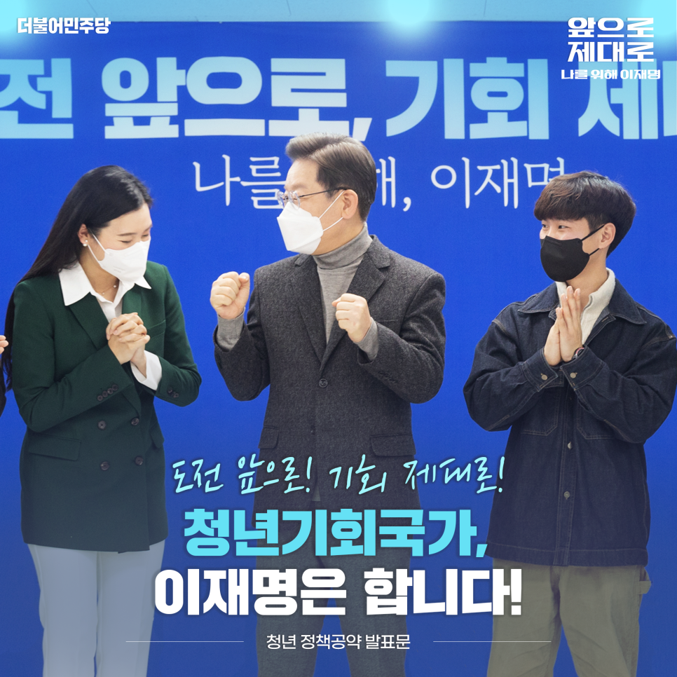
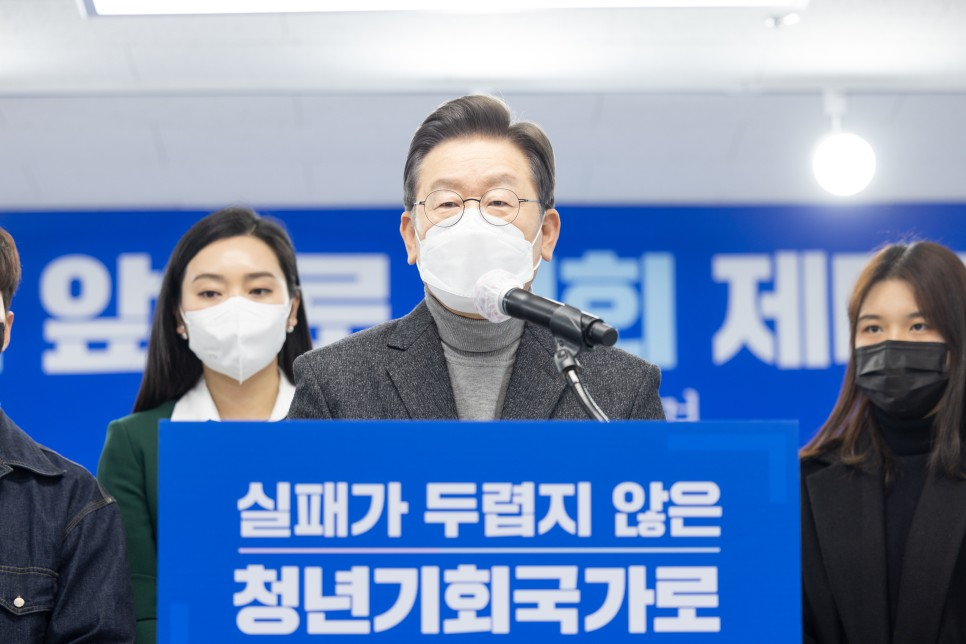
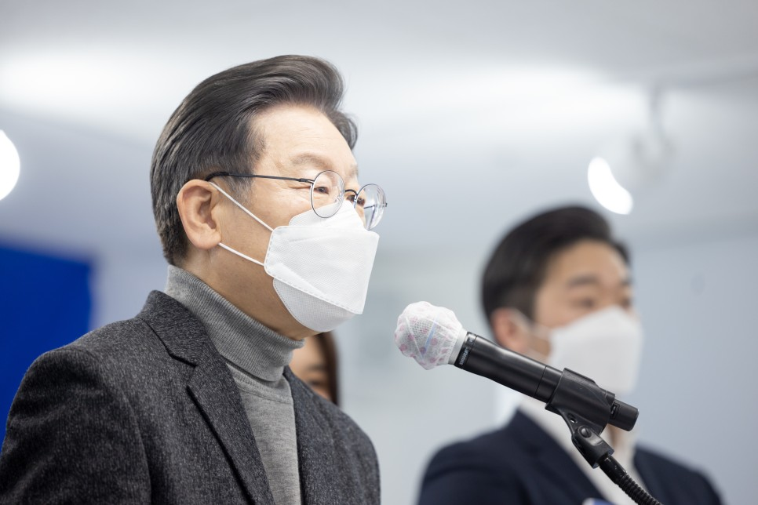
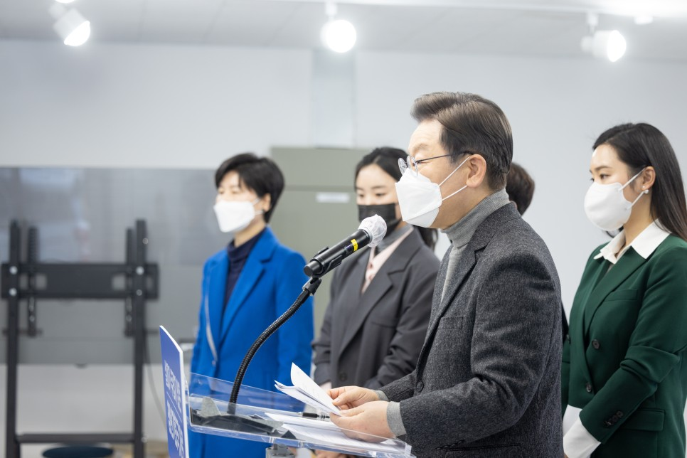
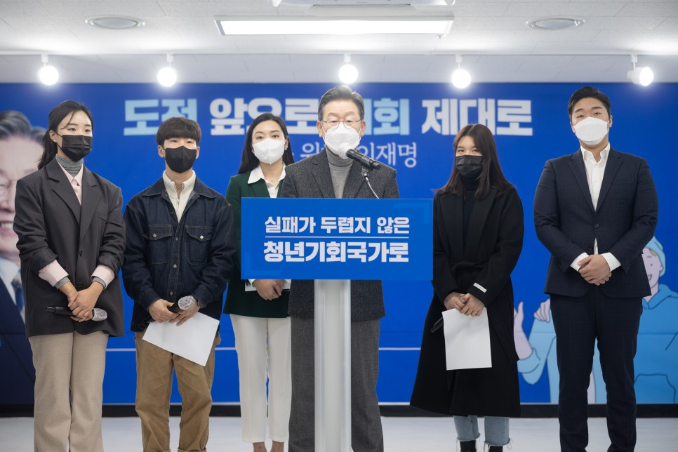
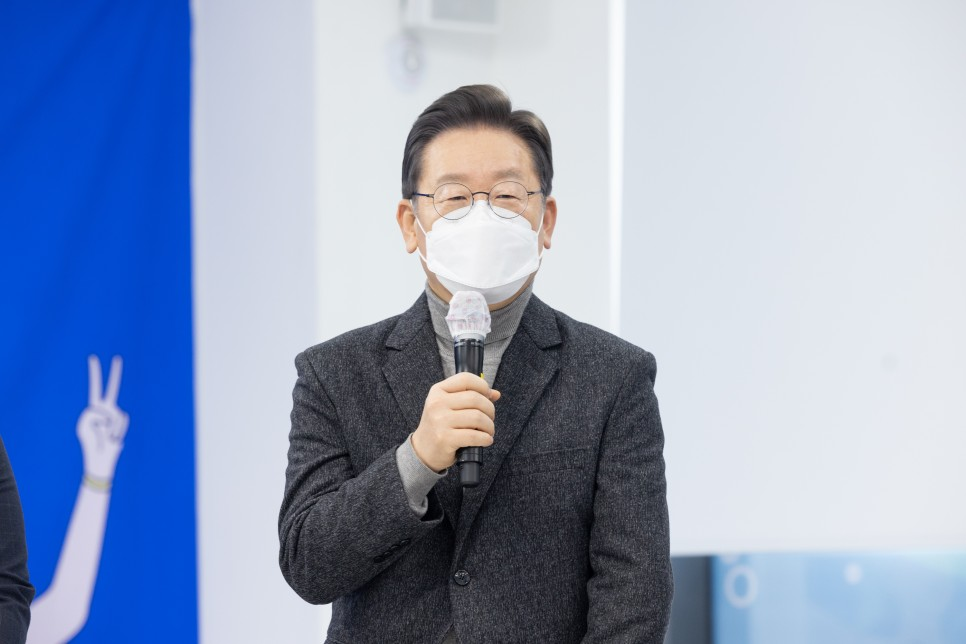
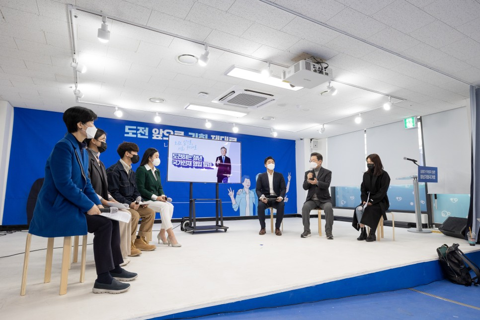
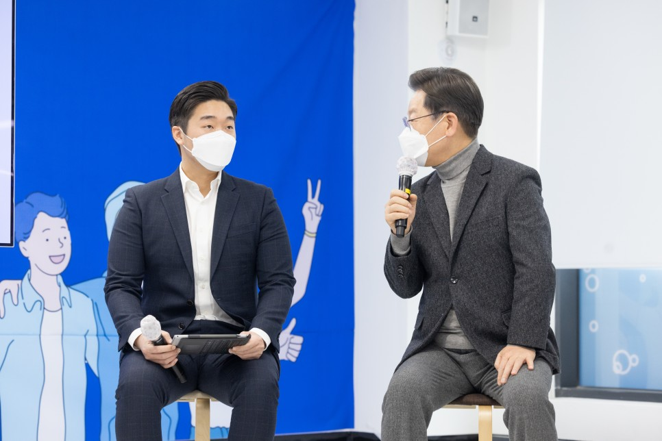
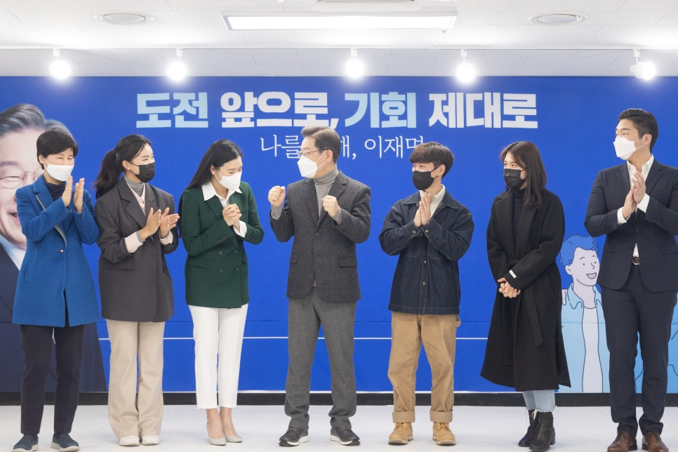
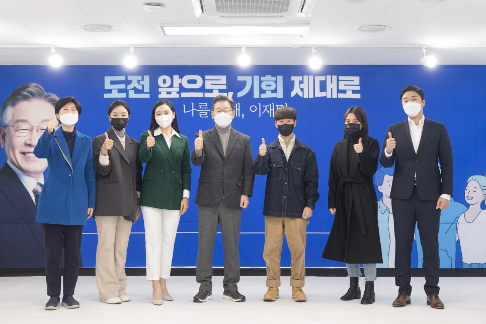

## 대표공약
# 청년참여 보장으로 마음껏 도전할 수 있는 청년기회국가, 이재명은 합니다!
> 2022-01-22 13:53:44

"청년이 인간으로서의 존엄과 가치를 실현하고 행복한 삶을 영위할 수 있는 권리를 보장받는다."

​

청년기본법에 명시된 대한민국 청년의 권리입니다. 하지만 우리 사회에서 청년은 인간으로서 존엄한 가치를 실현할 기회를 잃고 사회적 약자가 되고 말았습니다.

​

우열을 가르는 경쟁은 생사가 걸린 전쟁이 되어버렸습니다.

​

오늘날 청년이 성별과 지역, 교육과 경제 수준에 따라 편을 가르고 극단적 갈등을 빚게 된 까닭은 청년들 자신의 문제가 아니라 기성세대의 책임이 큽니다.

​

고도성장기에 넘치는 기회를 누리면서 기득권의 지위를 차지한 기성세대가 공정에 관한 문제를 방치하는 동안 우리 사회는 불공정 격화와 양극화 심화, 그리고 끝내 저성장이라는 결과에 도달했습니다. 그에 따르는 고통을 고스란히 떠안고 있는 것이 바로 청년 세대입니다.

​

청년문제 해결은 대한민국의 사회 구조적 문제를 해결하는 단초입니다. 청년뿐 아니라 우리 사회 구성원 모두를 위해서라도 반드시 해결해야만 하는 국가적 과제입니다.

​

청년들이 편을 갈라 전쟁하지 않고 협력적으로 경쟁하는 사회, 실패에 대한 두려움 없이 도전하는 사회, 행여 실패하더라도 다시 일어날 기회가 넘치는 청년기회국가, 저 이재명이 반드시 만들겠습니다.

​

청년기회국가를 위한 8대 공약을 말씀드리겠습니다.

첫째, 청년의 내집 마련 꿈을 실현시키고 더 든든한 주거 안전망을 구축하겠습니다.

청년도 저렴한 가격으로 내집 마련의 꿈을 실현할 수 있도록 돕겠습니다.

​

부족함 없이 주택을 대량 공급하고 공급 물량의 상당 부분을 청년에게 배정하겠습니다.

​

청년에게 우선 배정하는 일반 분양형을 비롯해 낮은 임대료로 살다가 10년 후 최초분양가에 분양받는 ‘누구나집형’, 조금씩 자기 지분을 적립해 가는 ‘지분적립형’ 주택을 공급하겠습니다.

​

무주택자가 생애 최초로 주택 구입 시 금융제한을 완화하고 부동산 취득세를 감면해 세금 부담을 줄이겠습니다.

​

다음으로 토지는 공공이 소유하는 저렴한 ‘건물 분양형’ 나중에 이사갈 때 주택가격 상승분의 절반 정도를 공공과 공유하는 ‘이익공유형’의 주택을 공급해서 선택의 폭을 넓히겠습니다.

​

원한다면 30년 이상 장기 거주할 수 있는 ‘장기공공임대형’ 기본주택, 또 셰어하우스 형태로 저렴하게 거주하는 ‘공유형’ 주택도 다양하게 공급해서 선택할 수 있도록 하겠습니다.

​

청년에게 적합한 다양한 유형의 맞춤형 주택 공급으로 청년의 주거 선택권을 보장하겠습니다.

​

원룸·다가구·다세대 주택에 임대 거주하는 청년이 많습니다. 불법 건축물, 불투명한 관리비, 불공정한 임대차 계약으로 고통받지 않도록 지방정부와 협력해 불공정 관행을 개선하겠습니다.

​

청년의 월세 주거비 부담을 덜어드리겠습니다. 월세 세액공제를 확대하여 두 달 치에 해당하는 월세를 지원하겠습니다. 현재의 소득이 적어 공제를 받기 어려우면 최대 5년 뒤까지 이월하여 공제를 신청할 수 있도록 제도를 바꾸겠습니다. 그래서 실질적으로 소득이 없는 청년들도 주거비용을 지원받을 수 있게 하겠습니다. 공제 대상 주택가격 기준을 상향해 월세 공제 혜택의 대상도 확대하겠습니다.

​

둘째, 청년기본소득(청년배당)을 도입해 국가가 책임지고 삶의 기본을 높이겠습니다.

대한민국에서 생애주기별로 보면 똑같은 세금을 내고 가장 지원받지 못하는 세대가 청년세대들입니다. 청년세대들은 가장 어려운 상황에 처해있습니다. 우리가 국민들을 배려할 때 어려운 사람에게, 어려운 계층에게 더 배려하는 게 당연히 맞는데 가장 어려운 세대에게 가장 배려하지 않고 있다는 게 우리의 참혹한 현실입니다.

​

그래서 내년부터 만 19세에서 29세까지의 청년에게 연간 100만 원의 청년기본소득(청년배당)을 지급하겠습니다.

​

성남시와 경기도의 사례에서 보듯이 적다면 적은 돈입니다만, 청년들의 삶에 큰 변화가 있었습니다.

​

생활비 때문에 아르바이트를 전전하던 청년들이 학습과 자기계발 시간이 늘어나 미래를 준비하고 꿈꿀 수가 있었다고 합니다.

​

청년이 자신의 삶을 영위할 수 있는 기본적인 안전망 속에서 미래의 희망을 설계하고 새로운 삶의 진로를 개척할 수 있는 환경을 조성하겠습니다.

​

셋째, 청년기본금융(기본대출·기본저축)제도를 도입하겠습니다.

우리가 경험으로 알다시피 같은 금액의 돈이라도 어려울 때, 또 여유있을 때 가치가 다릅니다. 청년기, 그리고 장년기의 가치도 다릅니다. 기본대출과 기본저축의 청년기본금융을 도입해서 기본금융권을 보장하겠습니다.

​

도덕적 해이가 발생하지 않는 1,000만 원 이내의 돈을 언제든지 장기간 은행금리 수준으로 빌리고 갚을 수 있는 ‘청년 기본대출’을 시행하겠습니다. 그래서 우리 청년들이 고금리의 대부업체, 그리고 사채업자들에게 약탈당하지 않도록 하겠습니다. 그리고 기존의 고금리 대출을 은행 이자 수준의 기본대출로 전환해서 미래를 준비할 수 있도록 하겠습니다.

​

청년이 높은 금융문턱 때문에 고리대부업체나 불법사채시장에 내몰리는 일이 반드시 근절되어야 합니다.

​

이와 함께 1천만 원 이내의 기본저축제도를 도입하겠습니다. 우리 기성세대가 기억하는 젊은 시절의 재형저축, 재산형성저축과 같다고 보시면 되겠습니다. 일반예금 금리보다 약간 높은 금리를 적용해서 청년의 자산증식 기회를 만들어드리겠습니다.

넷째, 청년 일자리를 늘리고 질 높은 교육 훈련을 제공하겠습니다.

임기 내 청년고용률 5%p 향상을 목표로 정부의 정책 수단을 총동원하겠습니다.

​

코로나 팬데믹으로 더욱 어려워진 우리 청년세대의 고용상황을 고려할 것입니다. 공공기관의 청년고용 의무비율을 기관별 정원의 3%에서 5%로 단계적 상향 조정을 하겠습니다.

​

우리 청년들이 자기 역량개발을 위해서 교육 훈련 프로그램에 참여해야 하는데 민간기업에서 시행하는 직업훈련 프로그램에 줄을 서고 있다고 합니다. 결국 공공영역에서 제공하는 프로그램이 좀 부족하다, 그런 뜻이기도 합니다. 정부가 지원하는 직업 훈련 제도가 청년들에게 매력적이지 못하기 때문일 겁니다.

​

직업훈련 과정의 전면적인 혁신을 이뤄내겠습니다. 정부·지방정부·기업이 협력하여 청년의 요구와 기업의 수요에 맞춘 양질의 직업훈련 모델을 개발하겠습니다.

​

국민내일배움카드 제도를 쇄신하겠습니다. 현재 개인당 300만 원 내지 500만 원의 훈련비용인데 이 비용을 600~1,000만 원까지 두 배로 대폭 확대하겠습니다. 그리고 청년이 선택할 수 있는 교육 훈련 프로그램을 청년들의 수요에 맞춰서, 그리고 기업들의 수요에 맞춰서 다양화하겠습니다.

​

공정한 취업기회를 제공하고 청년 구직자들의 권리를 향상시키겠습니다. 채용을 포함한 고용 전 과정에 성차별 방지를 위한 법제도를 강화하고 사회적인 제재 방안도 마련하겠습니다.

​

공공부문에서부터 채용 면접시험을 진행할 때 면접수당 지급을 의무화하겠습니다. 그리고 민간기업으로 확산을 유도하겠습니다.

​

청년이 취업을 하고나서라도 자신의 적성과 능력에 더 적합한 일자리를 모색할 수 있는 여건과 기반도 마련하겠습니다. 청년의 자발적으로 더 나은 직장을 위해서 이직하는 경우에 생애 딱 한 번 정도는 구직급여를 받을 수 있도록 하겠습니다.

다섯째, 군장병 지원을 확대하겠습니다.

남성 청년들의 군복무 문제를 가지고 사회적 갈등이 심각합니다. 이 문제를 해결하는 방식에 대해서 여성도 같은 부담을 지우자, 이런 주장들이 있지만 이런 방식의 네거티브한 방식, 퇴행적 방식은 옳지 않습니다. 국가와 공동체를 위해서 특별한 희생을 치르는 사람들, 또는 특별한 희생을 치르는 지역에 대해서는 특별한 보상을 하는 것이 정의롭고 공정합니다. 그래서 우리 남성 청년들이 군복무를 헌법에 따라서 해야 하지만 그에 상응하는 보상을 해서 억울하다라는 생각이 들지 않도록 해야 합니다.

​

그래서 군 장병 생활을 안정적으로 지원하도록 하겠습니다. 임기 내 병사 월급을 최저임금 수준인 200만 원 이상으로 인상해서 전역 이후 사회진출 기반을 다지는데 힘이 되게 하겠습니다. 소극적이던 윤석열 후보께서 병사월급 200만 원 공약을 받아주신 것, 진심으로 감사하고 적극적으로 환영합니다.

​

미리 발표했던 것처럼 휴대폰 요금도 절반으로 줄이겠습니다. 이게 협의에 따라 충분히 가능하다라고 판단이 됩니다. 군 복무가 소중한 시간이 되도록 최소 1학기를 이수할 있게 취득학점 인정제를 실시하겠습니다. 그리고 취업에 필요한 자격증 취득 수강료 전액을 지원하겠습니다.

​

자기계발을 위해 e-book포인트를 지급하고, 태블릿PC 사용을 허용하겠습니다. 핸드폰은 되는데 태블릿 PC는 안 된다, 이거 문제 많습니다. 디지털, AI, 드론과 같은 전문기술을 습득하여 제대 후 즉시 더 좋은 직장에 취업할 수 있는 길을 열어드리겠습니다.

여섯째, 대학생 지원을 확대하겠습니다.

대학생의 교육비 부담을 낮추겠습니다. 학점비례 등록금제를 도입하고 성남시와 경기도에서 지속해온 학자금 대출이자 지원사업을 확대하겠습니다.

​

가정의 소득과 재산에 상관없이 모든 대학생이 ‘취업 후 상환 학자금’ 제도라고 하는 것이 있는 걸 아실 겁니다. 이 제도를 제한 없이 모든 대학생이 이용할 수 있도록 하겠습니다. 가능한 대학원생의 범위도 확대하겠습니다.

​

학자금 대출 상환유예 제도를 부양가족이 질병·사고를 당한 경우로 까지 확대하고 연간 생활비 대출 한도액을 상향 조정해서 생계비 때문에 학업을 포기하는 일이 없도록 하겠습니다.

일곱째, 마음건강부터 니트족까지 청년복지 사각지대를 꼼꼼하게 챙기겠습니다.

우울증·자살충동·고립감과 같은 청년이 겪는 다양한 마음건강 문제를 조기에 발견하고 회복할 수 있도록 지원하겠습니다. 진단 전 초기 단계에 심리지원이 필요한 청년을 대상으로 마음건강 바우처 지원을 확대하겠습니다.

​

참으로 안타깝게도 전 세계에서 대한민국이 청년 자살율이 가장 높습니다. 노인 자살율과 더해서 이 국민 자살율이 가장 높은 나라, 이제는 좀 바꿔야 합니다. 청년 영역부터 확실하게 바꾸겠습니다.

​

교육과 취업을 포기한 니트(NEET)족 청년들이 다시 일어서는‘청년 위기극복 1:1 프로젝트’를 시행하겠습니다. 단 한 명의 낙오자도 생기지 않도록 정부·지역사회·기업이 함께 힘을 모으겠습니다.

여덟째, 청년들이 직접 청년정책과 예산을 결정하는 그런 이재명 정부를 만들겠습니다.

과거에 우리 기성세대들이 우리의 아버지 세대들, 어머니 세대들을 전혀 이해하지 못하는 세대 단절 현상이 있었습니다. 민주주의에 관한 문제에 대해서 기성세대는 무관심했고, 그래서 청년들이 구속과 생명을 던져가면서 민주화를 위해 싸웠던 시절이 있었습니다. 기성세대는 이해하지 못했습니다, 왜 그러는지를. 지금 똑같은 일이 벌어지고 있습니다. 우리 청년들이 어떤 생각을 하는지 청년들이 지향하는 세상이 어떤지를 저를 포함한 기성세대들은 아무리 이해하려 해도 100% 완전히 이해하기 어렵습니다. 그래서 정책 내용이 접근 시각부터 달라서 내용이 결코 청년들의 문제를 청년들의 시각에서 해결하는 내용이 되지 못하고 있다는 문제가 있습니다. 그래서 이 문제를 해결하기 위해서 청년들이 직접 청년정책을 만드는 그런 시스템을 만들겠습니다.

​

아까 말씀드렸던 것처럼, 청년이 겪는 문제는 청년만의 문제가 아니라 우리 사회의 모든 구조적 문제가 집약된 표징입니다. 청년문제 해결은 우리 사회문제 해결의 출발점입니다.

​

청년이 말하고 결정하면 대통령이 듣고 책임지도록 하겠습니다. 정책설계, 예산편성, 집행까지 청년이 직접 관여하고 결정할 수 있도록 청년의 참여와 권한을 확대해서 청년 대표성을 확보하겠습니다.

​

청년 정책을 담당하는 수석비서관 제도를 도입하겠습니다. 청년 특임장관도 임명을 해서 청년정책에 대한 결정과 집행과정에 있어 청년들의 의사를 확실하게 반영하도록 하겠습니다.

​

국무총리 산하 청년정책조정위원회를 확대하겠습니다. 각 분야에서 다양한 성장 배경을 가진 오늘 보신 여러 청년 인재들처럼 청년들이 고르게 참여할 수 있도록 청년위원을 확대하겠습니다.

​

각 부처의 청년예산만큼은 청년정책조정위원회가 심의·조정하고 청년이 직접 결정하도록 하겠습니다. 이를 위해 실질적인 ‘청년예산 총액배분 자율편성’을 보장하도록 하겠습니다.

​

청년 누구나 청년정책을 만드는 과정에 참여해서 자유롭게 제안할 수 있는 창구를 만들겠습니다. 현재 정부의 청년참여단을 개편해서 청년 당사자가 이끌어가는 청년의회를 상설화하겠습니다.

​

국민참여예산에 청년참여예산 쿼터를 적용해서 예산편성 과정에서 청년의 참여를 최대한 넓히겠습니다.

​

그리고 한두 가지 좀 빠진 게 있는데, 아까 저희가 본의 아니게, 본인의 의사와 다르게 국가의 명령에 의해서 병역 의무를 부담해야 되는 이 징병제도를 보완할 필요가 있습니다. 그것도 역시 이거는 군사정책, 군정책이긴 하지만 청년정책인 측면이 있습니다. 원하지 않는 징병을 피해서 본인의 역량과 자질을 개발하고, 또 전문직업인으로 거듭날 수 있는 기회를 주는 선택적 모병제를 도입하는 것도 청년들을 위해서 매우 유용한 정책이 될 것이고, 우리 청년들에게 약 10만 개 새로운 일자리를 만드는 길이 될 겁니다. 아마도 드론 부대라든지 또는 AI를 활용하는 군사전략에 관한 문제 등등에 우리 청년들이 모병으로 참여해서 사회에서의 적정한 임금 수준을 지급받는 그런 제도도 있을 수 있습니다. 청년들의 정치참여 역시 확대할 필요가 있습니다. 청년들의 정치참여를 위한 할당제도 저희가 적극 검토 중이라는 말씀드립니다.

존경하는 국민 여러분, 그리고 사랑하는 청년 여러분.

청년의 고통과 갈등을 정치에 이용하지 않겠습니다. 그리고 청년의 고통과 갈등을 정치에 이용해서는 안 됩니다. 불공정, 양극화, 저성장이라는 고통의 근본적 원인을 제거하겠습니다. 그것이 오늘날 청년이 당면한 문제에 근원적 책임을 가지고 있는 우리 기성세대, 기성 정치인들의 역할입니다.

저 이재명은 기성세대의 일원으로서 무거운 책임을 가지고 이 땅에 존재하는 모든 구조적 문제에 청년들과 함께 손잡고 맞서는 그런 대통령이 되겠습니다.

청년은 미래가 아니라 지금 당장 현실, 그리고 현재여야 합니다. 지금 청년에게 부족한 것은 노력과 역량뿐만이 아니라 기회와 권한입니다. 청년 당사자의 기회와 권한을 획기적으로 늘리겠다는 말씀을 드립니다.

과거 우리 기성세대들이 그랬던 것처럼 실패를 두려워하지 않고 마음껏 도전할 수 있는 나라, 그리고 한 번 실패해도 다시 일어설 수 있는 기회가 넘치는 나라를 만들겠습니다.

도전 앞으로! 기회 제대로! 청년기회국가, 이재명은 합니다. 고맙습니다.