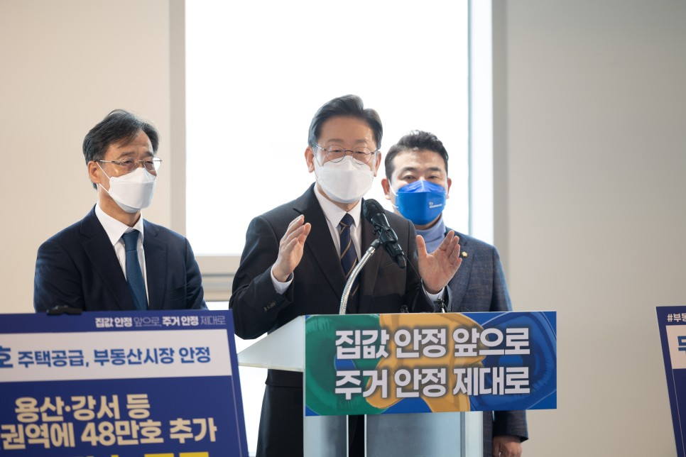
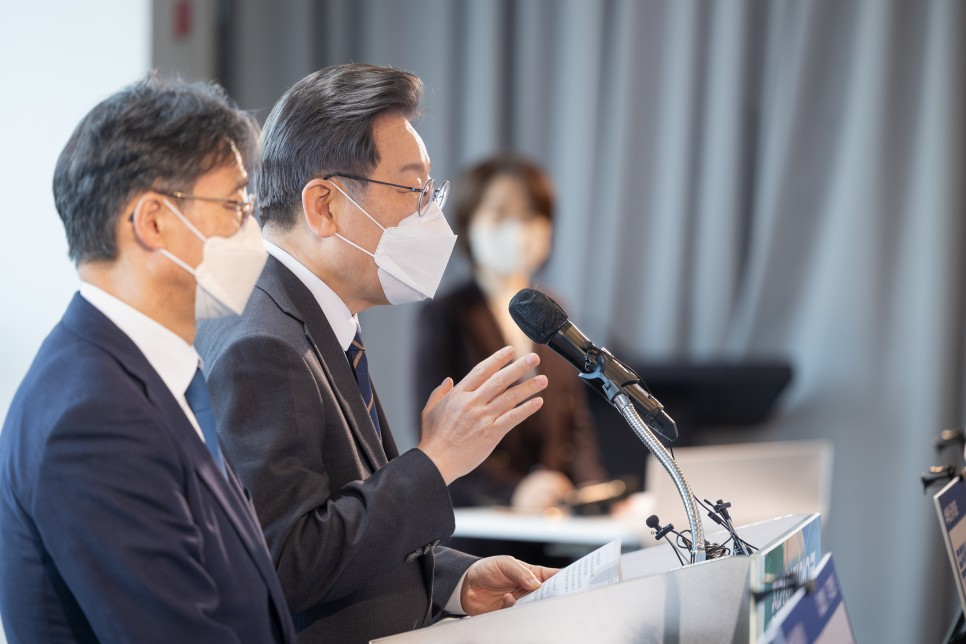
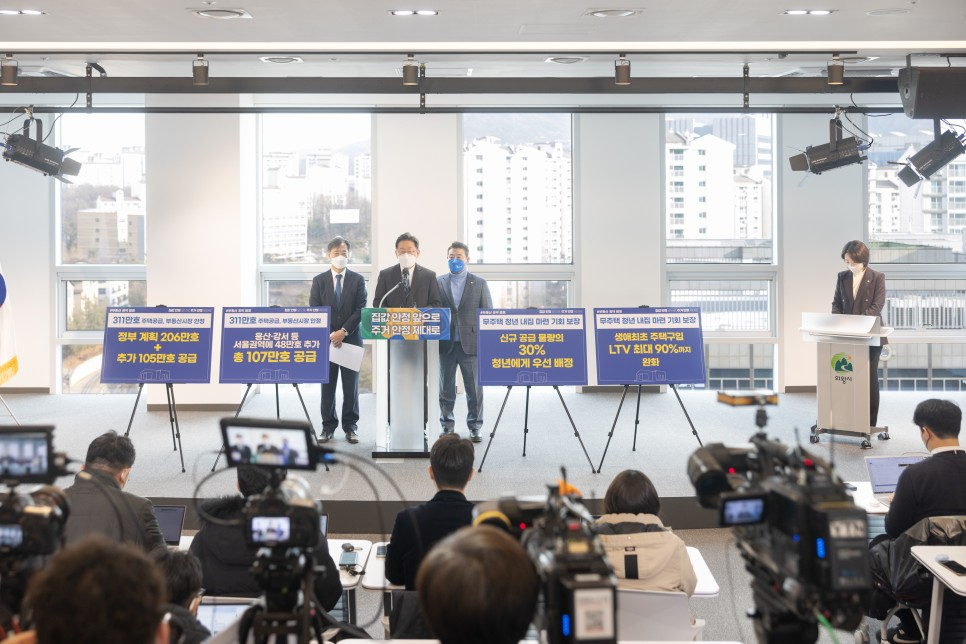
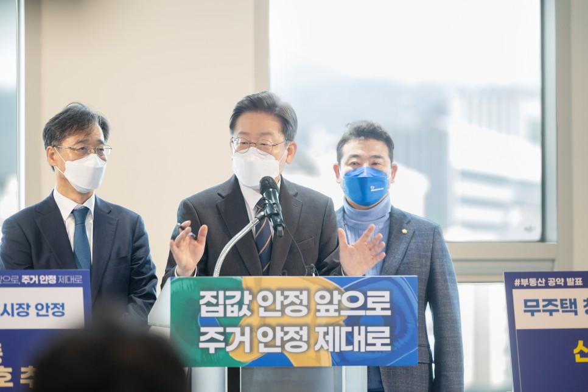

## 대표공약
# 311만호 공급으로 내 집 마련 꿈 실현, 이재명은 합니다!
> 2022-01-24 09:13:23

국민의 걱정 없는 삶을 만드는 것은 정치의 책임인데도 주거 문제로 국민 여러분께 고통을 안겨드렸습니다.

​

시장의 공급부족 신호를 정부가 무시한다고 여긴 시장은 유례없는 집값 폭등으로 답했습니다.

​

청년을 포함한 무주택자는 평생 벌어도 내 집 마련이 불가능하다는 좌절감으로 공포매수에 나서게 됐습니다.

​

부인할 수 없는 정책 실패입니다.

더불어민주당의 일원이자 대통령 후보로서 또다시 고개 숙여 사과드립니다.

변명하지 않고 무한책임을 지겠습니다.

​

이재명 정부는 국민의 꿈과 시장의 요구를 존중하겠습니다.

필요한 주택을 충분히 속도감 있게 공급하겠습니다.

​

무주택자에게는 내 집 마련의 꿈을 실현해 드리고 유주택자도 쉽게 더 나은 주택으로 옮겨갈 수 있도록 주거 사다리를 확실히 만들겠습니다.

​

주거 사다리 강화를 위해 조세·금융·재정지원 정책과 거래규제 합리화 같은 가능한 정책 수단을 총동원하겠습니다.

​

집값 폭등 요인을 면밀하게 점검해 부동산정책을 완전하게 재정비하고 부동산시장, 특히 주택시장을 안정시키겠습니다.

​

공약 이행률 평균 95%에 이르는 저 이재명이 ‘한다면 하는’ 추진력으로 국민 여러분께서 더이상 주거 문제로 고통받지 않게 하겠습니다.

​

첫째, 전국에 총 311만호의 주택을 신속히 공급하겠습니다.

그동안 정부는 206만호 가량의 공급계획을 발표했습니다.

이재명 정부는 여기에 서울 48만호, 경기․인천 28만호, 타 지역 29만호 등 105만호를 더해 총 311만호를 공급하겠습니다.

​

먼저, 서울에는 기존 공급계획 59만호에 48만호를 더해 총 107만호를 공급하겠습니다.

​

이중 공공택지로 공급되는 주택은 기존 계획 12만호에 신규 28만호를 합한 40만호입니다.

​

신규 공공택지 공급은 김포공항 주변(공항존치) 총 20만호 중 8만호, 용산공원 일부부지와 주변 반환부지 10만호, 태릉‧홍릉‧창동 등 국공유지 2만호, 1호선 지하화로 8만호입니다.

​

기존택지 재정비에 의한 공급은 기존 계획분 21만호에 재개발‧재건축과 리모델링 규제 완화로 10만호, 노후 영구임대단지 재건축으로 10만호를 추가해 총 41만호입니다.

​

경기도와 인천에는 기존 계획 123만호에 28만호를 더해 151만호를 공급하겠습니다.

​

이중 공공택지로 공급되는 주택은 기존 계획된 91만호에 신규택지 20만호를 합한 111만호입니다.

​

신규 공공택지 공급은 김포공항 주변(공항존치) 총 20만호 중 12만호, 경인선 지하화로 8만호입니다.

​

기존택지 재정비에 의한 공급은 기존 계획분 20만호에 신도시 재건축과 리모델링 규제 완화로 8만호를 추가해 총 28만호를 공급하겠습니다.

​

그 외 지역에는 기존 계획 24만호에 29만호를 더해 총 53만호를 공급하겠습니다.

둘째, 주택 공급가격을 반값까지 대폭 낮추겠습니다.

공공주택 용지 공급가격 기준이 박근혜 정부 당시 조성원가에서 감정가격으로 바뀌면서 택지가격이 주변 집값에 연동되어 공공분양주택까지 상승했습니다.

​

앞으로 공공택지 공급가격 기준을 조성원가로 바꾸고 분양원가 공개 제도 도입과 분양가 상한제 적용으로 인근 시세의 절반 정도인‘반값 아파트’를 대량 공급하겠습니다.

​

저렴한 분양주택의 지속적 대량 공급으로 무주택자의 내 집 마련 꿈을 실현해드리고 주택시장 안정화를 기하겠습니다.

셋째, 개인의 선호와 부담 능력에 맞는 다양한 맞춤형 주택을 공급하겠습니다.

무주택자와 실수요자의 선호와 부담 능력에 부합하는 다양한 맞춤형 주택이 공급되어야 하고 여력이 생기면 주거를 상향할 수 있어야 합니다.

​

공공택지에는 분양주택과 공공주택을 균형있게 그리고 다양하게 공급하겠습니다.

​

분양주택은 일반분양형 외에 자금 여력이 부족한 서민과 청년들을 위해 건물분양형(토지임대부), 지분적립형, 누구나집형(당초 확정된 분양가로 임대 종료 후 매입), 이익공유형(매각 시 지분에 따라 이익을 배분) 등의 다양한 유형의 주택을 선택할 수 있게 하겠습니다.

​

분양형 외에 중산층도 원하는 경우 원하는 만큼 장기간 거주할 수 있는 공공임대주택(기본주택 또는 평생주택)과 사회주택(협동조합형), 공유주택 등도 충분히 공급하겠습니다.

넷째, 청년의 내 집 마련 꿈을 실현시켜 드리겠습니다.

청년을 포함한 무주택자가 평생 한 번은 당첨될 수 있도록 주택공급 기반을 확대하겠습니다.

​

기성세대가 안일하게 불공정과 양극화를 방치한 결과 저성장과 기회 부족에 따른 고통을 죄 없는 청년들이 모두 부담하고 있습니다.

​

기성세대의 책임으로 어려운 처지에 놓인 청년을 위해 신규 공급을 대폭 확대하는 만큼 공급물량 30%를 무주택 청년에게 우선 배정하겠습니다.

특히 용산공원 인근 주택은 전량 청년기본주택으로 공급하겠습니다.

​

다섯째, 청년 등 생애최초 주택 구입자의 금융제한을 완화하고 거래세 부담을 대폭 낮추겠습니다.

​

생애최초 주택 구입자에 대해서는 지역․면적․가격 등을 고려해 LTV를 최대 90%까지 인정하는 등 금융규제를 대폭 완화해 내 집 마련을 쉽게 해 드리겠습니다.

​

또한 취득세 부담을 3억원 이하 주택은 면제, 6억원 이하 주택은 절반으로 경감하겠습니다.

​

존경하는 국민 여러분!

​

이재명 정부는 청년과 무주택자, 실수요자의 집 걱정을 완전히 해소할 것입니다.

​

주거 문제에 대한 국민의 말씀과 시장을 존중하면서 실용적이고 현실적인 해법으로 국민이 부동산 정책효과를 바로 체감하시도록 하겠습니다.

​

모든 국민이 내 집 마련의 꿈을 이루고 주거안정과 주거기본권을 누리는 대한민국을 만들겠습니다.

​

주택 311만호, 앞으로!

내 집 마련 꿈, 제대로!

이재명은 합니다!

​

고맙습니다.

​

2022년 1월 23일

​

더불어민주당 제20대 대통령 후보 이 재 명