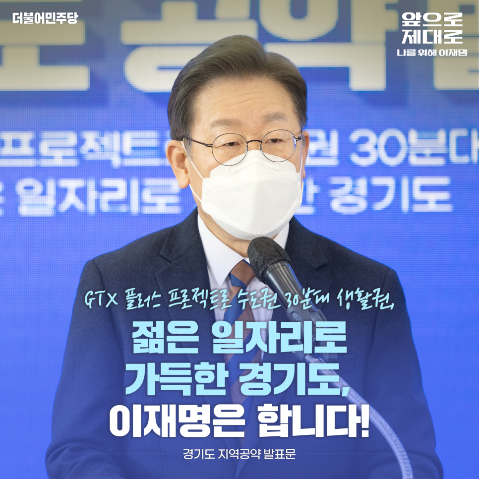
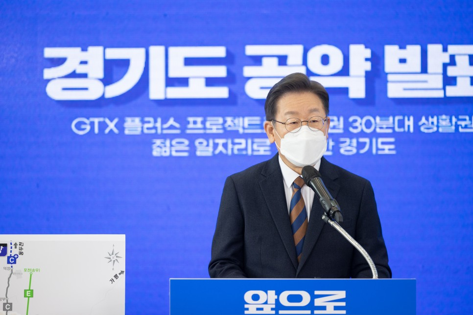
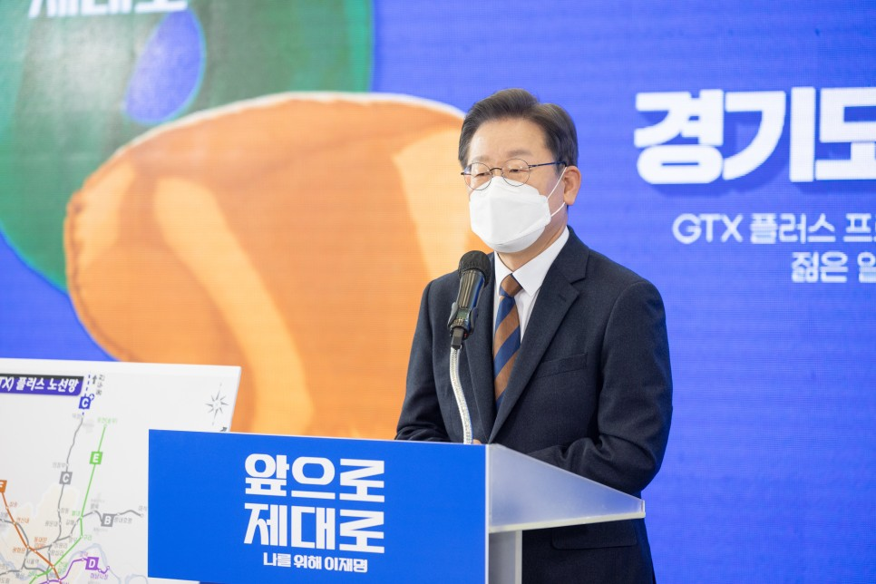
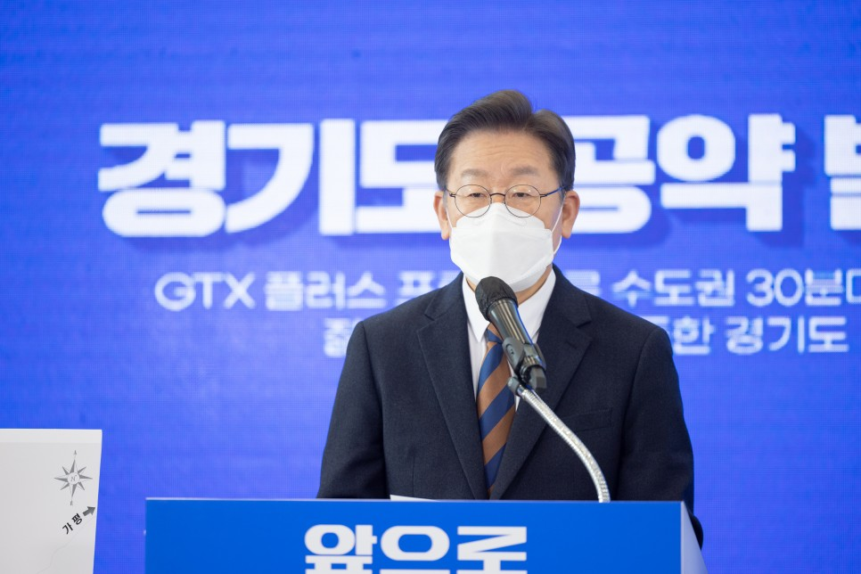
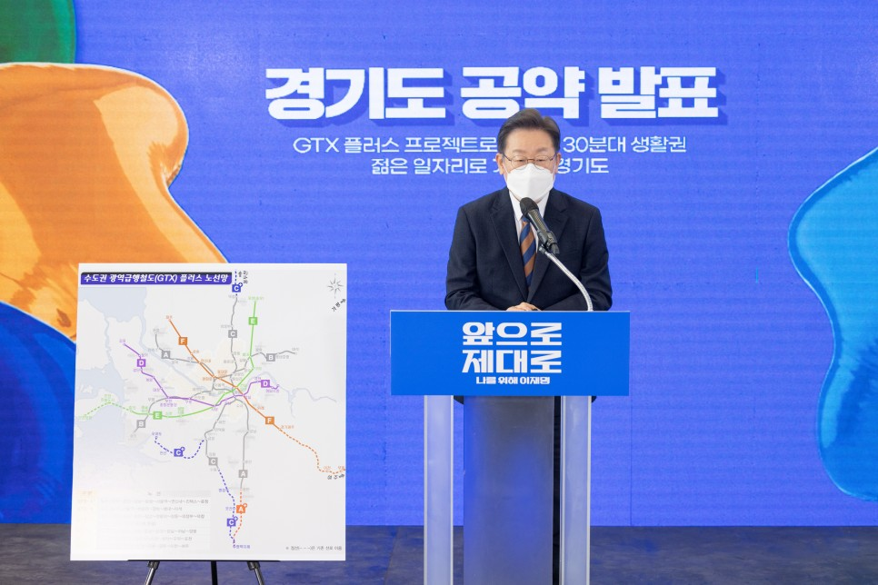
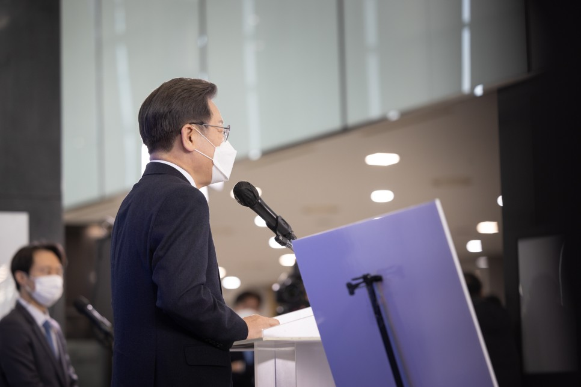
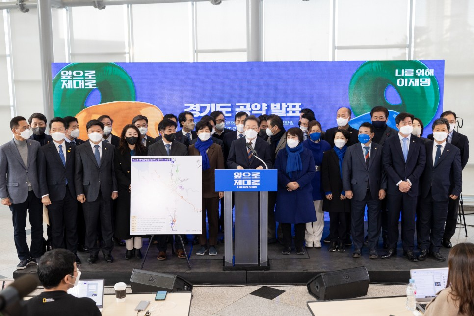
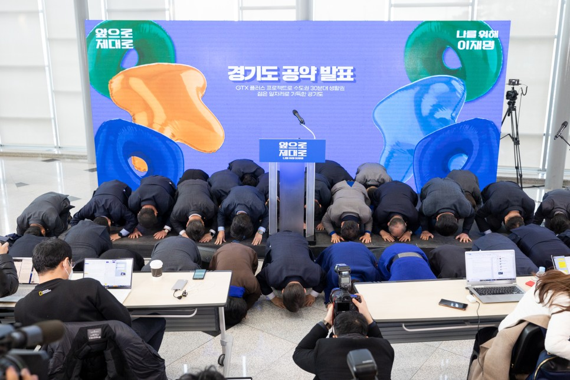
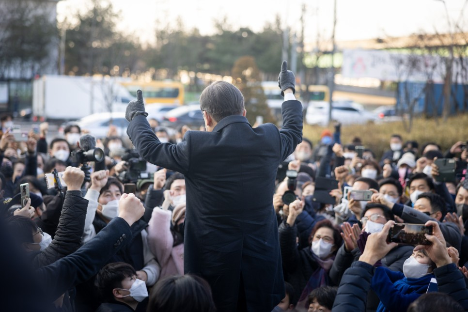
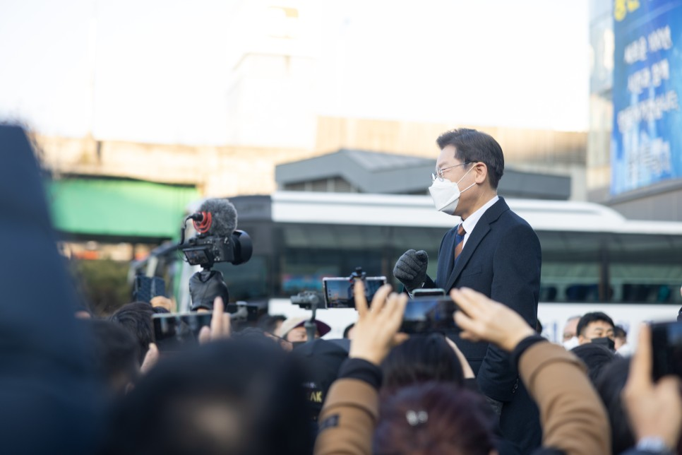

## 지역공약
# GTX 플러스 프로젝트로 수도권 30분대 생활권, 젊은 일자리로 가득한 경기도, 이재명은 합니다!
> 2022-01-24 10:52:35

존경하는 경기도민 여러분, 경기도민 이재명입니다.

​

가난한 소년 노동자 이재명을 인권변호사로, 또 성남시장과 경기도지사로 키워준 이곳 경기도에서 더불어민주당의 대통령 후보로 인사드립니다.

​

그동안 경기도민 여러분께서 제게 주권자의 존엄한 권한을 위임해 주신 덕분에 크고 작은 성과를 쌓으며 이곳까지 오게 됐습니다. 각별한 감사의 말씀을 먼저 드립니다.

​

경기도는 대한민국 경제의 중심이자 전국 인구의 4분의 1을 차지하는 대한민국의 축소판입니다.

​

활기차게 살아 움직이는 경기도, 청년이 미래를 꿈꾸며 마음껏 일할 수 있는 경기도, 한반도 평화경제를 선도하는 경기도가 되어야 합니다.

​

경기도를 누구보다도 잘 아는 이재명이 경기도의 대전환, 반드시 이루겠습니다.

첫째, ‘GTX 플러스 프로젝트’로 수도권 30분대 생활권을 만들겠습니다.

수도권 전역을 평균 30분대 생활권으로 연결하는 교통혁명을 추진해 경기도민의 직주근접을 대폭 높이겠습니다.

​

지금까지 착착 진행해온 교통망 구축 사업을 기초로 GTX에 신규 노선을 추가하는 GTX 플러스(+) 프로젝트를 추진하겠습니다.

​

이를 통해 수도권 교통난을 해소하고 누구나 차별없는 이동권을 보장하겠습니다.

​

현재 추진 중인 GTX-A·B·C 노선의 속도를 높이겠습니다. 선 교통, 후 입주’ 원칙을 분명히 지켜 3기 신도시 입주민의 불편함이 없도록 하겠습니다.

​

이에 더해 GTX-A+, C+ 노선을 적극 추진하겠습니다. GTX-A+는 동탄에서 평택으로 연장을 추진하겠습니다. GTX-C+는 북부 구간은 동두천으로 연장하고 남부 구간은 병점․오산․평택으로 연장과 금정에서 안산과 오이도까지 연결(기존선 활용)을 추진하겠습니다.

​

GTX-D는 현 정부의 김포~부천 구간을 당초 경기도의 제안대로 김포~부천~강남~하남 구간까지 정상화하겠습니다.

​

GTX-E는 인천~시흥․광명신도시~서울~구리~포천 노선을, GTX-F는 파주~삼송~서울~위례~광주~이천~여주 노선을 적극 추진하겠습니다.

​

향후 지역주민들의 요청과 수요가 있는 지역에는 GTX를 추가로 추진하여 수도권의 30분대 생활권 형성을 지원하겠습니다.

​

서부선을 서울대 관악산역부터 안양까지 잇도록 하고 3호선 북부를 대화~금릉~경의․중앙선으로 연결하고 남부는 성남․용인․수원까지 연장하겠습니다.

​

서울 지하철 5호선의 김포 연장을 최대한 신속하게 착공해 김포에도 서울과 직접 연결되는 지하철 시대를 열고 교통난을 해소하겠습니다.

​

5호선(방화~김포), 6호선(신내~구리~남양주), 7호선(옥정~포천), 8호선(성남판교~서현~광주오포), 9호선(강동~하남~남양주), 인천 2호선 김포․고양 연장과 고양~은평선 신설이 원활하게 추진되도록 노력하겠습니다.

​

소사․대곡선의 파주 연장을 조기에 마무리하고 금천~광명선 신설을 원활히 추진되도록 노력하겠습니다.

​

별내선(남양주 별내~구리~성남 모란~암사)과 월곶~판교 복선전철도 차질 없이 추진하겠습니다. 수도권 내륙선(동탄~안성~청주공항)과 부천 대장~서울 홍대 구간을 잇는 대장 홍대선 사업을 적극 추진하겠습니다.

​

수도권 제2순환고속도로 건설사업은 전 구간 조기 개통을 적극 지원하겠습니다. 양재IC와 동탄IC에 걸친 경부고속도로 경기도 구간의 지하화를 추가적으로 검토하겠습니다. 수원 군공항 이전과 연계해 경기 남부 공항 건설을 검토하겠습니다.

​

GTX 플러스 프로젝트로 대표되는 교통혁명이 경기도민의 직주근접을 강화하고 구도심, 접경지역, 상수보호구역 같이 그동안 소외되어온 지역을 균형 있게 발전시키고 경기도민 누구에게나 차별 없는 이동권을 보장하겠습니다.

둘째, 분당‧산본‧일산‧중동‧평촌 1기 신도시를 자족가능한 스마트도시로 재탄생시키겠습니다.

경기도에 위치하는 1기 신도시 다섯 곳은 신도시라는 이름이 무색할 만큼 낡은 도시가 되어가고 있습니다. 주차난, 층간소음, 노후된 기반시설로 생활환경이 나빠지는 중입니다.

​

이른바 ‘분당‧산본‧일산‧중동‧평촌 신도시 특별법’을 만들어 베드타운이 된 신도시를 자족 가능한 스마트도시로 바꾸겠습니다.

​

재건축‧재개발과 리모델링 규제를 완화하고 주민께서 선호하는 적합한 방식을 선택하도록 하겠습니다. 재건축 안전진단 기준과 리모델링 안전성 검토기준을 현실에 맞게 완화하겠습니다.

​

용적률이 500%까지 허용되는 4종 일반주거지역을 적용하고 인허가를 신속히 진행해 시간과 비용을 확 줄이겠습니다. 리모델링은 세대수 증가와 수직증축으로 사업성을 높이고 중대형 아파트의 세대 구분 리모델링을 확대하겠습니다. 재개발 활성화를 위해 종 상향과 같은 추가 인센티브 부여를 검토하겠습니다.

​

일자리를 창출하는 자족형 도시로 만들겠습니다. 주요 역세권은 주거와 상업, 산업이 어우러진 성장거점으로 만들겠습니다. 도시형 첨단산업 기반을 구축해 혁신역량을 모으고 직주근접 일자리를 창출하겠습니다.

​

신도시 여건에 맞게 트램․드론․도심항공교통과 같은 최첨단 교통수단이 도입되도록 지원하겠습니다.

셋째, 경기 남부권을 첨단산업과 반도체 허브로 만들어 젊은 일자리를 대규모로 창출하겠습니다.

경기권 4개 테크노밸리를 대한민국을 대표하는‘글로벌 첨단산업 거점 벨트’로 키우겠습니다.

​

광명․시흥은 첨단산업과 제조․유통․주거가 융합된 혁신클러스터로 키우고 판교에는 ICT 기반의 핀테크와 팹리스 등을 육성하겠습니다.

​

용인은 반도체 국가전략산업 특화단지로 조성하고 반도체 배후도시로 조성 중인 용인 플랫폼 시티를 차질 없이 추진하겠습니다.

​

반도체는 4차 산업혁명의 쌀이자 우리 경제의 버팀목입니다. 화성, 오산, 기흥, 평택, 이천을 반도체 거점 단지로 육성해 경기 남부를 글로벌 반도체 허브로 만들겠습니다.

​

안산 강소연구개발특구를 대한민국을 대표하는 ICT 융복합 부품소재 혁신 클러스터로 육성하겠습니다. 대표적인 제조업 단지인 반월․시화 국가산업단지에는 디지털 기반 공정혁신 시뮬레이션 지원센터 구축에 힘을 싣겠습니다.

​

경기 남부에 산재돼 있는 노후 산업단지를 스마트-그린산업단지로 전환하고 기업이 사용하는 전력 100%를 재생에너지로 충당하는 RE100 산업단지로 변모할 수 있도록 지원하겠습니다.

넷째, 경기 북부의 희생에 확실히 보상하고 평화경제의 기반을 확충하겠습니다.

북한과 맞닿은 경기 북부권에는 여전히 분단의 상처가 크게 남아 있습니다.

​

70여 년간 국가안보를 위해 특별한 희생을 감내해온 경기 북부에 특별한 보상으로 보답해 평화경제 기반을 확충하겠습니다.

​

미군 반환 공여지는 국가 주도 개발을 추진하고 주변 지역에 대한 지원도 확대하겠습니다.

​

평화경제특구법 제정을 적극 지원해 남북경제협력의 새 모델을 만들겠습니다. 접경지역을 대륙으로 진출하는 첨단산업단지로 만들겠습니다. 판문점을 거점으로 DMZ관광을 활성화하고 DMZ를 생태평화지구로 조성하겠습니다. 경기에서 강원까지 이어진 DMZ를 체계적으로 보존하고 DMZ를 안고 있는 접경지역 발전을 위한 행정협의체를 설립하겠습니다.

​

도라산, 임진각과 한탄강 유역(포천․연천)의 역사․문화․관광 콘텐츠와 프로그램을 확대해 경기 북부의 평화‧생태관광 활성화를 지원하겠습니다.

​

경기 북부의 지역경제 발전을 위해 지역별 산업기반을 더욱 탄탄하게 다지겠습니다.

​

양주 테크노밸리와 남양주 왕숙 산업단지 조성사업의 성공적 마무리를 돕겠습니다. 의정부 K-POP, 포천 물류‧가구, 파주 메디컬, 고양 방송․영상 클러스터 사업을 적극 지원하고 추진 중인 구리 AI 플랫폼시티 사업을 잘 챙기겠습니다.

​

경기미래교육 파주캠퍼스에 4차 산업혁명대학교 설립을 추진해 인공지능(AI)․미래차․에너지․바이오와 같은 미래 신산업 전문인력을 양성하겠습니다.

​

경기도의 역점사업인 경기 순환철도망 완성을 위해 교외선의 고양시~의정부 구간과 탑석~별가람~별내를 잇는 의정부~남양주 구간 연결을 적극 지원하겠습니다.

​

경원선 백마고지~군사분계선 연장 사업을 조속히 재개하고 동서평화고속도로와 서울~연천 고속도로 사업을 추진해 접경지역 간선 교통망을 확충하겠습니다.

​

39번 국지도의 국도 승격과 국도 3호선 의정부~연천 구간의 정비를 적극 지원해 평화경제시대를 준비하겠습니다.

​

향후 남북 고속철도 연결을 대비해 KTX와 SRT 등을 접경지역까지 운행하는 방안도 검토하겠습니다.

다섯째, 자연과 사람이 공존하는 쾌적하고 편리한 경기 동부를 만들겠습니다.

경기 동부권은 2,600만 수도권 인구의 식수원인 팔당 상수원을 보호하기 위해 많은 희생을 감내해 왔습니다.

​

중첩되고 불합리한 입지규제는 합리적으로 개선하고 보전이 불가피한 지역은 더 크게 보상하겠습니다.

​

경기 동부권의 광역교통망도 촘촘하게 구축하겠습니다. 하남~양평간 고속도로, 국도3호선 이천~여주 사업, 수서~광주, 여주~원주 복선전철 사업을 차질 없이 진행하겠습니다. 하남~남양주~포천 고속도로 신설도 적극 추진하겠습니다.

​

경기 동부 전역에 친환경 모빌리티 체계 구축을 지원하고 헬스 투어 힐링 특구 조성을 지원하겠습니다. 가평․양평 등 남한강과 북한강의 아름다운 자연환경을 토대로 경기 동부를 생태친화적 문화․관광 허브로 발전시키겠습니다.

​

경기 동부권의 농업경쟁력을 높이기 위해 스마트팜 보급과 첨단농업 육성을 지원하겠습니다.

​

여섯째, 생태 문화 공간이 살아 숨 쉬는 경기 서부를 만들겠습니다.

​

물, 숲, 바람과 문화가 공존하는 생태공원을 조성해 도민들께 행복한 일상을 선사해 드리겠습니다.

​

국가 지원을 확대해 경기도의 대표적인 지천인 안양천, 안성천과 오산천, 경안천, 문산천과 한탄강에 친환경 생태공원이 조성되도록 적극 지원하겠습니다.

​

안양교도소 이전을 조기에 마무리하고 숲이 포함된 문화광장 조성을 지원하겠습니다.

존경하고 사랑하는 경기도민 여러분,

​

2018년 초여름, 도민 여러분의 삶을 바꾸기 위한 365가지 약속을 드렸고 3년 여 동안 그 약속 중 96% 이상을 지켰습니다.

​

약속은 반드시 지키고 마는 저 이재명이 이제 경기도민 여러분 앞에 더 큰 약속을 드립니다.

​

더욱 폭넓은 권한과 책임으로 우리 경기도민의 삶을 바꾸고 경기도를 또 한번 도약시키겠습니다.

​

나아가 대한민국의 축소판 경기도를 바꿨던 것처럼 대한민국의 대전환, 반드시 해내겠습니다.

​

수도권 30분대 생활권,

젊은 일자리로 가득한 경기도,

이재명은 합니다!

​

고맙습니다.

​

​

2022년 1월 24일

​

더불어민주당 제20대 대통령 후보 이 재 명