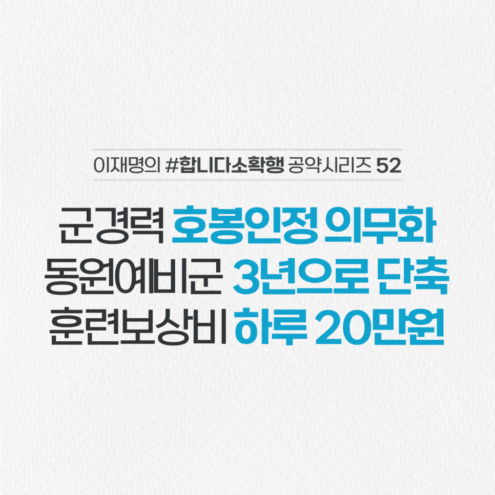

## 소확행 시리즈
# 군경력 호봉인정 의무화! 예비군 훈련기간 단축, 훈련비 인상!
> 2022-01-25 09:29:42

며칠 전 정부가 군경력과 학력의 시기가 일부 겹친 교원들의 중복 호봉을 불인정하고, 지급된 급여 일부를 환수하겠다고 통보했다는 기사를 접했습니다.

우리 사회가 아직도 군 의무 복무로 보낸 시간을 가볍게 보는 것이 아닌가 안타까운 생각이 들었습니다.

군복무를 존중하며, 나라를 지킨 봉사에 대해 국가가 마땅히 보답하겠습니다.

첫째, 호봉 및 임금 산정 시 ‘군경력 호봉 인정’을 의무화하겠습니다.

현재는 법률상 권장사항에 불과해 일부 공기업과 민간기업의 60%가 인정하지 않고 있습니다.

둘째, 예비군 훈련기간도 단축하고, 동원훈련 보상비도 대폭 인상하겠습니다.

동원예비군 훈련기간을 4년에서 3년으로 단축하겠습니다.

동원예비군은 생업을 중단한 채 훈련소에 입소해 훈련을 받습니다. 그러나 훈련 보상비는 2박 3일에 6만 3천원으로 최저시급에도 한참 못 미칩니다.

지난 총선 때 민주당 공약보다 2배 인상해 일 20만원을 지급하도록 하겠습니다.

이 약속한 일 10만원을 두 배로 대폭 인상하겠습니다.

저는 줄곧 특별한 희생에는 특별한 보상이 필요하다고 말씀드렸습니다.

조국 수호를 위해 희생한 시간을 정당하게 보상하는 정부를 만들겠습니다.