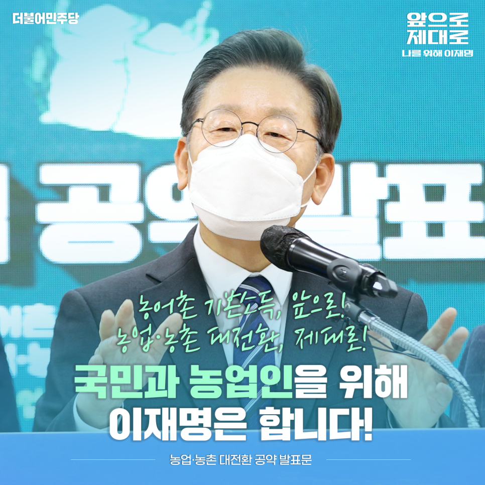
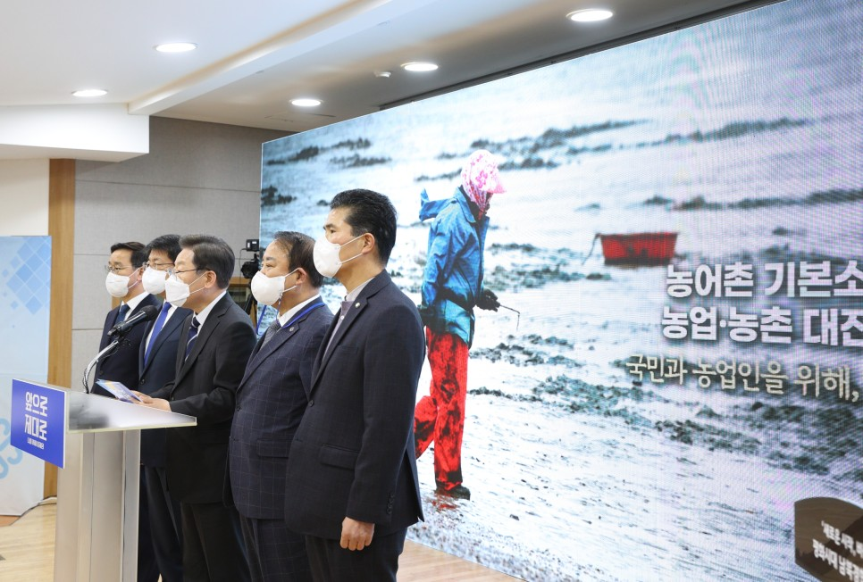
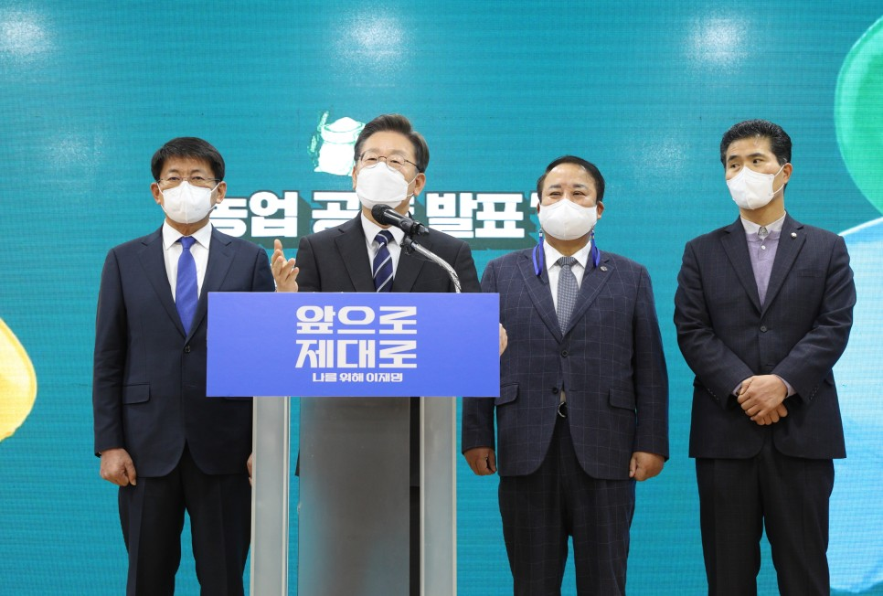
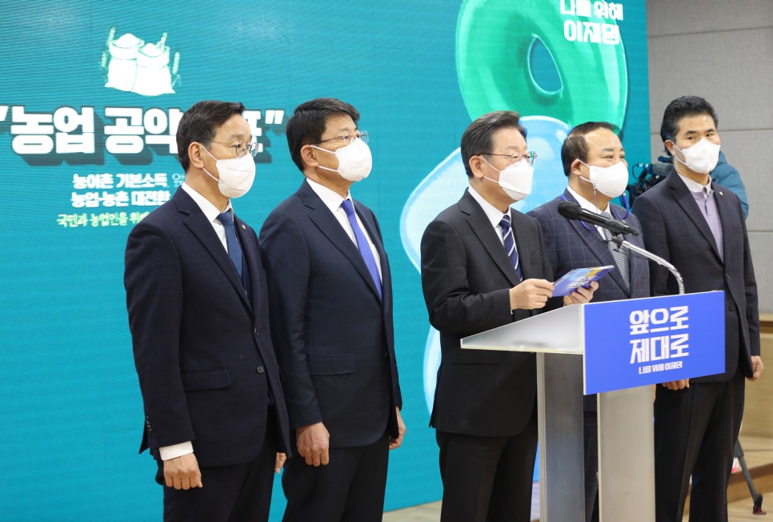
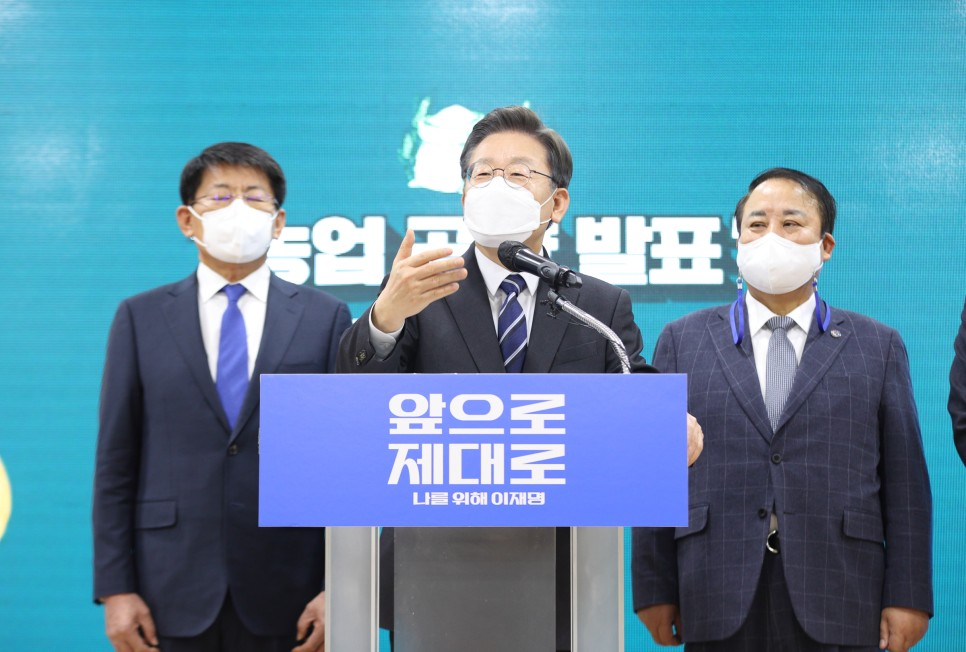
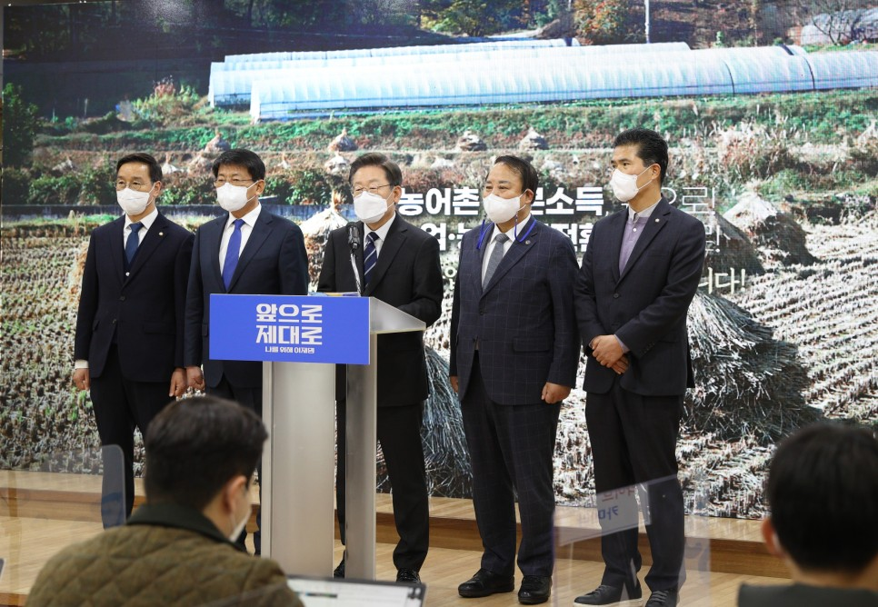
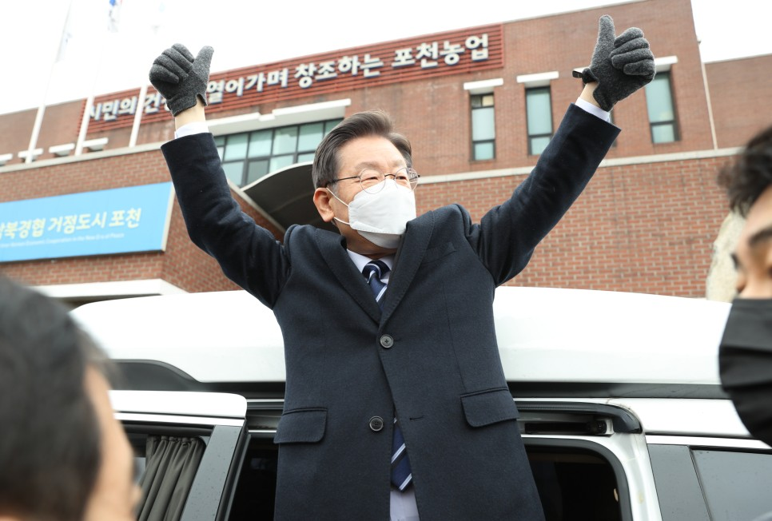

## 대표공약
# 농어촌 기본소득, 앞으로! 농업․농촌 대전환, 제대로! 국민과 농업인을 위해, 이재명은 합니다!
> 2022-01-25 15:17:50

존경하는 농업인 여러분！

​

이상기후와 코로나 팬데믹의 어려움 속에서도 국민의 안전한 먹거리를 책임져주시고 농촌 지역사회를 든든하게 지키고 계신 농업인의 헌신과 노고에 깊이 감사드립니다.

​

오늘날 세계 10대 경제대국 대한민국의 이름에는 농업인의 눈물과 희생이 함께하고 있습니다. 농업은 대한민국을 만들어 온 근본 바탕입니다.

​

세계는 갈수록 식량안보의 중요성이 커져가고 있습니다. 농업은 이제 국민 생명을 지키는 원천이자, 식량주권을 수호하는 국가존립의 기반이 됐습니다.

​

이와 함께 기후환경의 위기 앞에 자연과 환경을 지켜 온실가스를 감축하는 탄소흡수원이자 재생에너지의 보고입니다.

​

지금 우리는 위기의 대전환시대에 직면해 있습니다. 에너지 전환, 디지털 전환과 코로나 팬데믹 위기는 우리의 농업과 농촌에도 커다란 변화를 요구하고 있습니다.

​

이재명 정부는 농업의 중요성을 인식하여 국가성장전략에 포함시켜 적극 보호하고 육성할 것을 천명합니다.

​

농업인의 이익 보호를 국가의 책무로 명시한 헌법 123조를 엄중하게 준수할 것을 약속합니다. 농업, 농촌 대전환을 성공시켜 위기를 도약의 기회로 바꾸겠습니다.

​

이를 위한 이재명 정부의 5대 공약을 말씀드리겠습니다.

​

첫째, 소멸위기의 농촌을 균형발전의 거점으로 대전환하겠습니다.

농어촌에 거주하는 농어민과 주민 여러분께 기본소득을 지급하고 경제적 기본권을 보장하겠습니다. 지방정부의 선택과 지역의 여건에 따라 1인당 100만원 이내의 농어촌 기본소득을 지급하겠습니다. 농어촌 기본소득 지급으로 농어촌과 도시 간 소득격차를 줄이고 농어촌 소멸을 막겠습니다. 또한 농어촌지역의 어려움을 감안해 이장 수당 20만원, 통장 수당 10만원을 각각 임기 내에 인상하겠습니다. 농어촌 기본소득 지급과 이‧통장 수당 인상은 지역균형 발전에 큰 도움이 될 것으로 기대합니다.

​

농림수산식품 분야 예산을 국가예산 대비 5%로 확대하겠습니다. 농업 · 농촌 및 임업·산림 공익직불제를 확대하여 탄소중립 실천, 생태환경 보전, 생물다양성 증대 등 생태 환경을 위한 농업의 공익적 역할을 국가가 지원하겠습니다. 농정예산구조를 개편하여 불요불급한 예산을 절감하고 농가직접지원을 늘리겠습니다.

​

‘농촌재생뉴딜 300’ 프로젝트를 추진하겠습니다. 농촌 공간계획 제도화로 300개 읍면 생활권을 정비하고 농촌 재생활동가, 마을주치의, 생활 돌봄 제도를 도입하겠습니다. 기본주택, 혁신학교, 마을실버타운을 조성하여 어르신이 걱정 없고, 젊은이들이 살기 편한 농촌을 만들겠습니다.

​

농촌을 재생에너지 산업의 거점으로 육성하겠습니다. 태양광과 풍력 재생에너지 사업방식을 전면 개편하겠습니다. 마을공동체가 주도하고 주민의 소득을 늘려주는 ‘돈 버는 에너지 마을’을 조성하고 육성하겠습니다. 마을에서 생산된 전력은 에너지고속도로를 통해 판매하고 농업인에게 햇빛·바람·바이오에너지 연금으로 지급하겠습니다.

​

전국에 있는 공공건축물의 목재 사용 비율을 의무화하여 자원순환림, 목재가공센터, 분산형 에너지센터를 연결하는 산림 뉴딜 클러스터를 조성하겠습니다.

​

둘째, 국민의 먹거리 기본권을 보장하고 농업을 식량안보 산업으로 대전환하겠습니다.

기후 위기와 코로나 팬데믹을 겪으며 세계 각국이 곡물 수출을 제한하자 국제 곡물가격이 급등하고 있습니다. 현실이 된 식량안보 문제에 신속히 대응해야 합니다.

​

국가의 식량자급 목표를 60%로 정하겠습니다. 식량안보 직불제를 도입하여 밀, 콩과 같은 주요 식량곡물 자급을 확대하겠습니다. 한국인에게 꼭 필요한 김치와 같은 기본 먹거리 자급률도 함께 높이겠습니다. 무분별한 농지전용을 막아 식량 자급에 필요한 농지를 확보하겠습니다.

​

농지투기를 근절하고 경자유전의 원칙을 지키겠습니다. 농지실태를 전수조사하고 농지 소유와 이용에 대한 상시 조사 인력을 확충하여 투기 감시를 통해 임차농 보호를 강화하겠습니다.

​

국민 건강과 안전한 먹거리 보장을 위해 먹거리 기본법을 제정하고 국가 먹거리 종합전략을 수립하겠습니다.

​

코로나 팬데믹으로 취약계층의 식생활 여건이 악화됐습니다. 임산부 친환경 농산물꾸러미 공급사업을 본격적으로 시행하고 어린이 과일 간식사업을 더욱 확대하겠습니다. 어린이집과 군대, 복지시설에 공공급식 체계를 확대하여 각 지역에서 생산된 친환경농산물 공급을 늘리겠습니다.

​

취약계층이 긴급한 빈곤 상황에 처했을 때, 일정한 기간 동안 정부가 음식을 제공하는 ‘긴급끼니 돌봄’ 제도를 도입하겠습니다. 동시에 취약계층 ‘농식품바우처 사업’도 확대하겠습니다.

​

유전자변형식품(GMO) 완전표시제를 도입하겠습니다. 내가 먹는 음식에 대한 유전자 변형원료 포함 여부를 사전에 인식하는 소비자 알권리와 선택권을 보장하겠습니다.

셋째, 기후위기를 극복하는 그린탄소농업으로 대전환하겠습니다.

우선 논 농업부터 친환경유기농업으로 전환하겠습니다. 친환경 유기농업의 재배면적 비중 20%를 목표로 화학비료와 농약을 줄여나가겠습니다.

​

가축분 퇴비와 액비를 중심으로 통합양분 공공관리체계를 확대 구축하겠습니다. 가축분퇴비 이용 기반을 조성하여 재배농가와 축산이 함께 상생하는 자원순환농업을 활성화하겠습니다.

​

지속 가능한 축산업 발전을 위해 국가 주요 산업인 축산과 사료산업의 위상을 강화하겠습니다. 국내 사료 생산을 안정화하여 수입 사료를 대체하고 저메탄·저단백질 사료 보급을 확대하겠습니다.

​

농산물 생산에서 가공과 유통, 소비와 폐기까지 지역 순환형 먹거리 시스템을 구축하여 탄소배출을 줄이겠습니다.

​

탄소 흡수력이 높은 건강산림을 조성하겠습니다. 임도 확대와 임업기계 확보 등 산림육성 기반확립으로 지역단위 산림계획 수립과 산림경영 기술지원체계를 구축하여 우리 산을 더 싱싱하고 푸른 숲으로 조성하겠습니다.

​

넷째, 일손과 가격, 재해 걱정 없는 안심 농정으로 대전환하겠습니다.

농촌의 고령화로 인한 농업노동력 부족은 농촌이 직면한 매우 심각한 현안입니다.

일손 부족으로 인한 어려움부터 해결하겠습니다.

​

광역단위에 인력중개센터를 설치하고 공공형 계절근로자제도를 도입하겠습니다. 농업인력지원법을 조속히 제정하여 일손 부족에 대한 근본대책을 마련하겠습니다. 이와 함께 밭 농업 기계화율을 높여 일손을 덜어드리겠습니다.

​

농산물 가격과 수급의 안정은 헌법에 명시된 국가책무입니다. 농업인의 생산비 보장을 위한 근본 대책을 마련하겠습니다.

​

무, 배추와 같은 주요채소의 가격안정을 위한 계약재배 비중을 단계적으로 생산량의 50%까지 확대해 실질적으로 최저가격이 보장되도록 하겠습니다.

​

지역 농가의 특성을 잘 아는 농협의 지역별·품목별 연합 체제를 강화하고 지역 농협의 판매사업을 확대하여 생산자가 주도하는 선제적 수급조절 기능을 강화하겠습니다.

​

생산자도 소비자도 더 좋은 가격의 모두에게 이익이 되는 농식품 유통구조로 쇄신하겠습니다. 농식품 온라인거래소 체계를 구축하여 생산에서 소비까지 농산물 디지털정보를 통합관리하고 산지거래 확대와 유통시설 스마트 시스템 강화로 신속하고 편리한 농식품 디지털유통 고속도로를 만들겠습니다.

​

이상기후에 대비해 농업재해보험의 대상 품목과 보상 범위, 보상율을 확대하고 농업재해 대책의 복구비 지원 단가를 높이겠습니다.

​

농업인 안전보험을 산재보험 수준으로 강화하겠습니다.

​

여성농업인의 사회경제적 지위 향상을 위해 법제도를 개선하겠습니다. 근골격계 질환과 같은 과중한 농작업으로 인해 어려움을 겪고 있는 여성농업인을 위해 현재 시범사업 중인 특수건강검진사업을 전체 농업인에게 단계적으로 확대하겠습니다.

​

중앙지원센터 설립을 지원하고 전국 여성농업인의 편리한 협력활동을 지원하는 여성농업인 스마트 플랫폼을 구축하겠습니다.

다섯째, 농업을 미래전략산업으로 대전환하겠습니다.

농업과 농촌을 바꾸고 전환적 성장을 이끌어갈 청년 미래농업혁신 인재 5만 명을 키우겠습니다. 정부 주관 농업혁신 인재 아카데미를 운영하여 디지털, AI, 드론과 같은 4차산업 농업혁명시대의 농업 대전환을 주도할 핵심인재를 육성하겠습니다.

​

청년농업인 영농정착 지원사업 기간과 대상자를 늘리겠습니다. 농촌 체험부터 귀농과 귀촌을 준비하고 독립할 때까지 귀농정착 원스톱 지원체계를 구축하겠습니다.

​

고령으로 은퇴한 농업인에게는 연금과 텃밭을 지급하는 방안을 검토하겠습니다. 은퇴농의 농지는 청년농에게 우선 제공하도록 하겠습니다.

​

농식품산업을 첨단 디지털 · 생명산업으로 육성하겠습니다.

​

4차산업혁명 첨단기술을 접목하여 농업과 농촌의 스마트화를 촉진하겠습니다. 농지, 기반시설과 같은 농업 SOC에서부터 생산, 가공, 유통, 소비 전 영역을 디지털화하고 노지작물과 축산에도 스마트농업을 활성화하겠습니다.

​

농촌 생활환경 개선에 ICT기술을 적용하여 스마트 빌리지, 스마트교육으로 농촌과 도시 간의 생활환경 격차를 줄이겠습니다. 이와 연계하여 스마트농촌관광도 활성화겠습니다.

​

그린 바이오산업은 2030년 세계시장에서 15조 달러 규모에 달하는 미래먹거리 산업입니다. 국내 동식물 자원을 활용하여 마이크로바이옴, 대체식품, 메디푸드를 세계 수준으로 발전시켜 미래 농식품 산업의 성장을 이끌어 가겠습니다.

존경하는 국민 여러분, 그리고 농업인 여러분!

​

농업의 위상이 완전히 새롭게 바뀌어야 합니다. 나라의 근간이 되는 전략적 식량안보 산업으로, 기후 위기와 국가 불균형발전을 돌파하는 핵심 산업으로 농업의 가치를 국가성장전략의 일환으로 전환해야 합니다.

​

농업을 확실히 육성하고 농업인의 기본권을 철저히 보장하여 대한민국 속에 농업인의 위상과 농업의 가치를 재정립하겠습니다.

​

반드시 농업, 농촌, 그리고 농업인의 미래를 바꾸는 대전환을 이뤄내겠습니다.

​

농어촌 기본소득, 앞으로!

농업․농촌 대전환, 제대로!

이재명은 합니다!

고맙습니다.

​

2022년 1월 25일

​

더불어민주당 제20대 대통령 후보 이 재 명