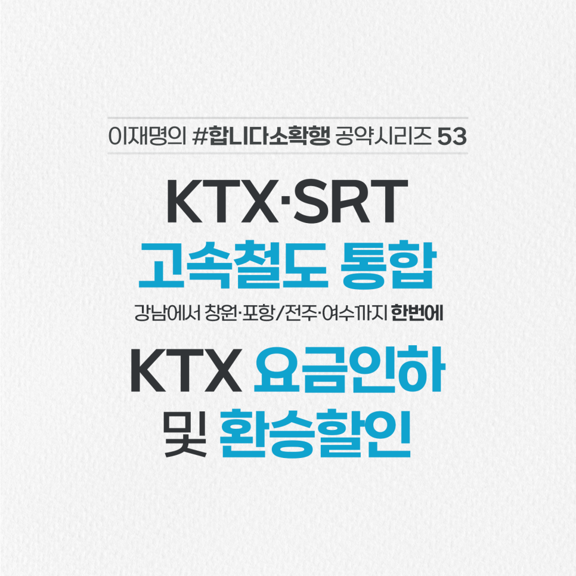

## 소확행 시리즈
# KTX-SRT를 통합해 시민불편을 해소하겠습니다
> 2022-01-26 10:22:31

민족의 대표적인 명절, 설입니다. 수도권 동남부에 거주하는 분들과 창원, 포항, 진주, 밀양, 전주, 남원, 순천, 여수에 사시는 분들은 이 맘 때만 되면 궁금해 하십니다.

​

왜 수서역을 오가는 SRT는 우리 동네에 가지 않을까?

​

정답은 박근혜 정부 시절인 지난 2016년 개통한 수서고속철도(SRT)와 KTX간 아무런 합리적 이유 없이 분리 운영해 경쟁을 시켰기 때문입니다.

​

SRT는 지방 알짜노선을 중심으로 운행함으로써 그 외 지방 주민들은 강남 접근성이 떨어지는 차별과 함께 일반열차와 환승할인도 적용받지 못 하고 있습니다.

​

반면에 수익성이 떨어지는 지방 소도시 등에도 철도를 운행하는 KTX는 공공성을 지키는 데 따른 부담도 다 떠안고 있습니다.

​

또한 SRT는 독자적인 운영 능력이 없어 코레일에 전체 차량의 절반 이상을 임차하고 차량정비·유지보수·관제·정보시스템 구축 등 대부분의 핵심 업무를 위탁하고 있습니다. 무늬만 경쟁인 셈입니다.

​

SRT-KTX를 통합해 지역 차별을 없애고 요금할인 등 공공성을 높이겠습니다.

​

첫째, 양사를 통합해 수서발 고속철도가 부산, 광주 뿐 아니라 창원, 포항, 진주, 밀양, 전주, 남원, 순천, 여수로 환승없이 갈 수 있도록 하겠습니다.

​

둘째, KTX 요금을 SRT와 동일하게 10% 더 낮추겠습니다. SRT와 새마을, 무궁화호 간 일반열차와 환승할인도 적용하겠습니다.

​

셋째, 양사 통합운영으로 불필요한 대기시간, 정차횟수를 줄여 고속열차 운행횟수를 증편하겠습니다.

​

넷째, 양사 통합에 따른 수익으로 일반철도 적자를 보조하고 차량 개선 등으로 국민의 교통기본권을 보장하겠습니다.

​

다섯째, 철도산업의 경쟁력도 본격적으로 키우겠습니다. 규모의 경제를 실현해 해외진출, 유라시아-대륙 철도시대를 열어가겠습니다.

​

지방주민과 수도권 동남부 주민의 교통권을 보장하고 철도효율성과 경쟁력을 높이는 KTX-SRT 통합, 제대로 하겠습니다.