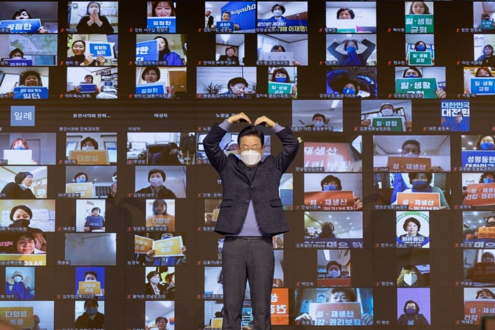
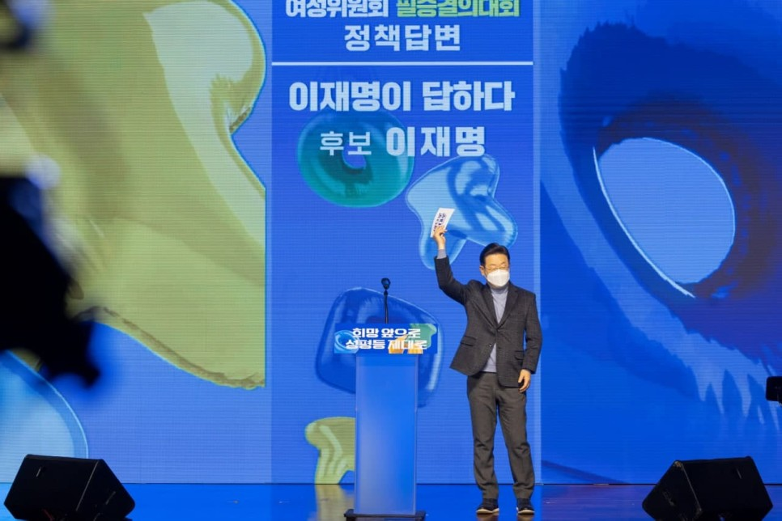
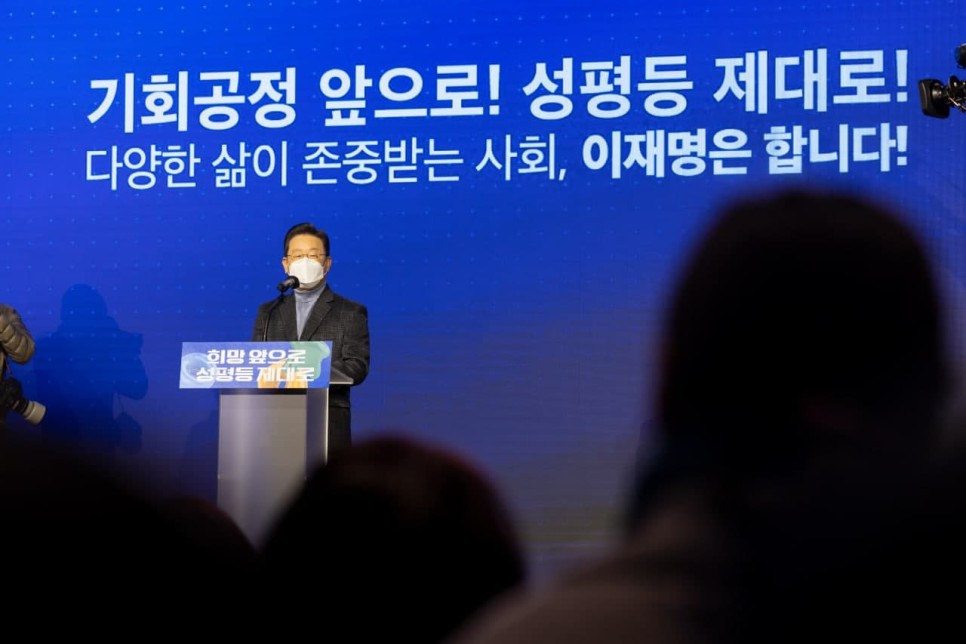
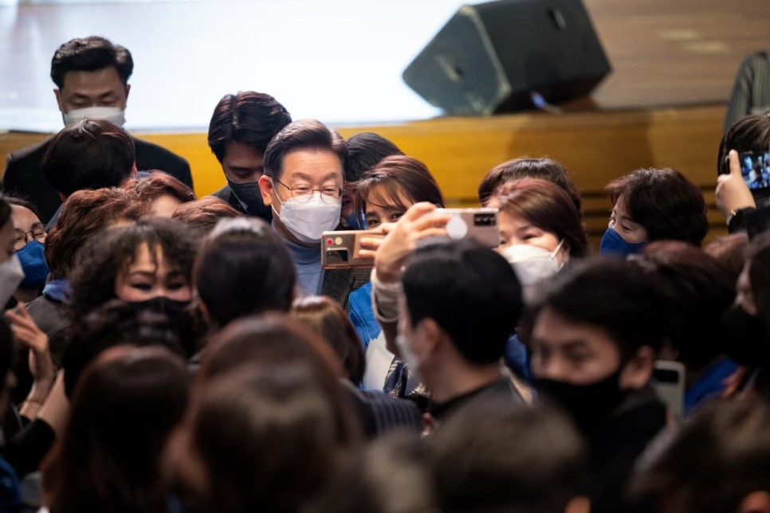
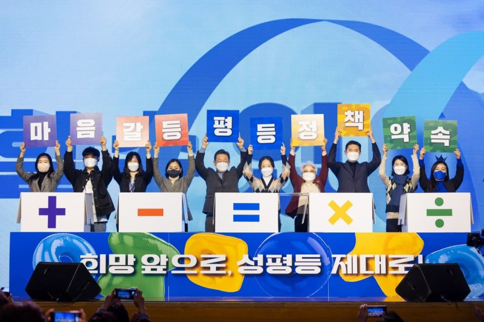
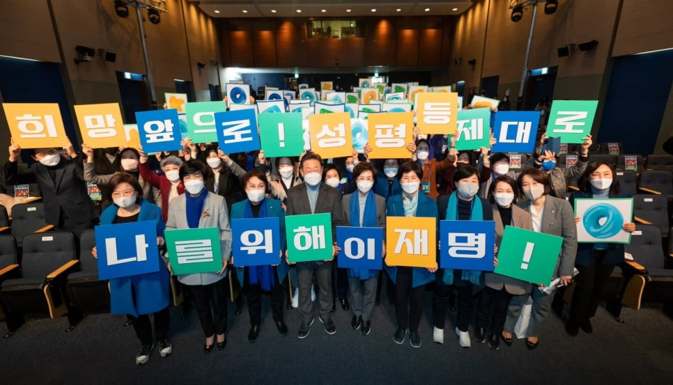

## 대표공약
# 희망 앞으로, 성평등 제대로! 나를 위해, 이재명!
> 2022-01-26 11:30:06

선대위 여성위원회 필승결의대회에서 누구나 행복한 성평등 대한민국을 향한 의지를 다지고, 여성·가족 정책 비전을 말씀드리고 왔습니다.

​

우리 사회에 분열과 갈등이 극심합니다. 회피하는 대신 깊이 들여다보며 근본적 해결책을 찾고, 편가르는 대신 하나로 어우러져 함께 잘사는 세상을 만드는 것이 무릇 정치가 해야 할 일입니다. 그러나 요즘 우리 정치가 반대로 가고 있는 것이 몹시 안타깝습니다.

저부터 달라지겠습니다. 좁은 둥지 안에서 누가 먼저 떨어질 것인가를 생각하지 않고, 어떻게 하면 둥지를 더 넓힐 수 있을지를 끊임없이 고민해나가겠습니다.

​

그 고민의 산물로, 누구나 평범한 일상과 더 많은 기회를 누리는 사회로 나아가기 위한 여성·가족 분야 5대 정책공약을 준비했습니다.

​

‘고용평등임금공시제’ 도입 등을 통해 차별없는 공정한 일터를 만들겠습니다. 자녀를 돌보고 싶은 남성, 일하고 싶은 여성의 선택권이 모두 존중받도록 하겠습니다. 육아휴직 급여액 현실화, 출생 시 부모 모두의 육아휴직이 자동 신청되는 자동 육아휴직등록제 등으로 엄마아빠가 자녀를 함께 돌보는 사회로 나아가겠습니다.

​

여성의 임신과 출산 지원에만 초점이 맞춰져 있던 정책 방향을 모성보호뿐 아니라 남녀 모두를 포괄하는 쪽으로 바꿔나가겠습니다. 소확행 공약으로도 발표한 바 있는 남성 청소년 HPV백신 무료접종 지원, 난임시술 약제비 급여화 등을 추진하겠습니다.

​

급속히 변하고 있는 우리 국민의 삶과 가족의 다양한 모습이 존중받는 사회를 만들겠습니다. 행복마을관리소, 주택공급 등 1인가구 지원을 늘리겠습니다. 빈곤을 증명해야 하는 현행 한부모가족증명서 발급 소득요건을 없애고 양육비 국가 대지급제를 도입하는 등 한부모가족의 아이들이 차별 없이 씩씩하게 성장할 수 있도록 하겠습니다.

​

선진국 지위를 부여받을 만큼 우리나라의 위상은 날로 높아지고 있습니다. 이제 그 위상에 걸맞게 구성원 개개인의 평등과 존엄이 실현되는 사회로 나아가야 합니다. 비록 어렵고 힘들더라도 갈라치기 정치, 나쁜 정치가 아닌 통합의 정치, 좋은 정치를 펼치겠습니다. 그리하여 누구나 행복하고 당당한 세상 만들겠습니다.