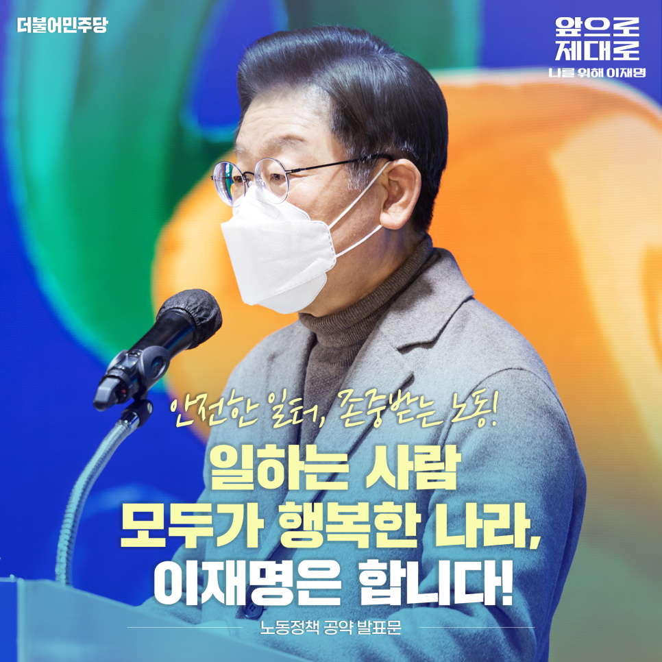
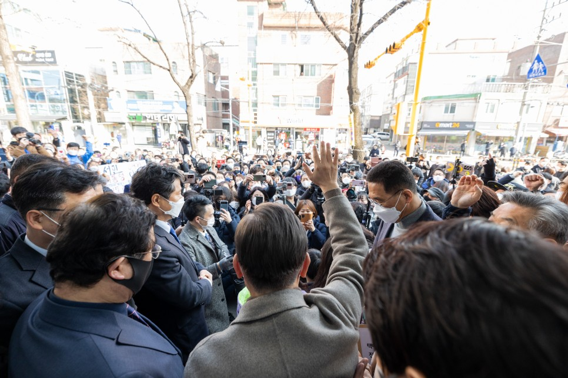
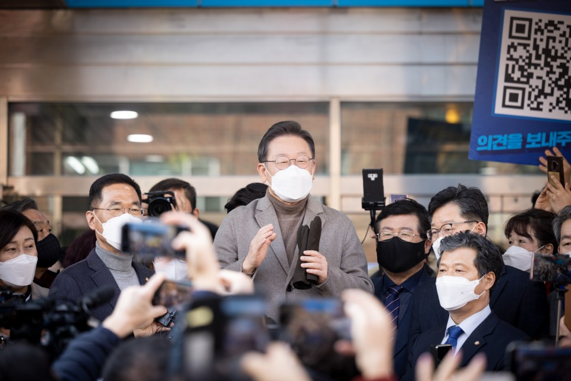
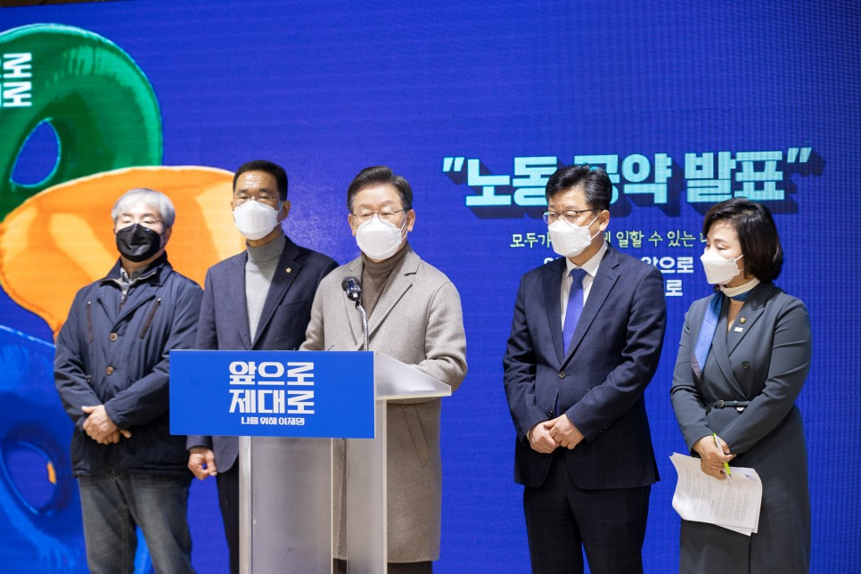
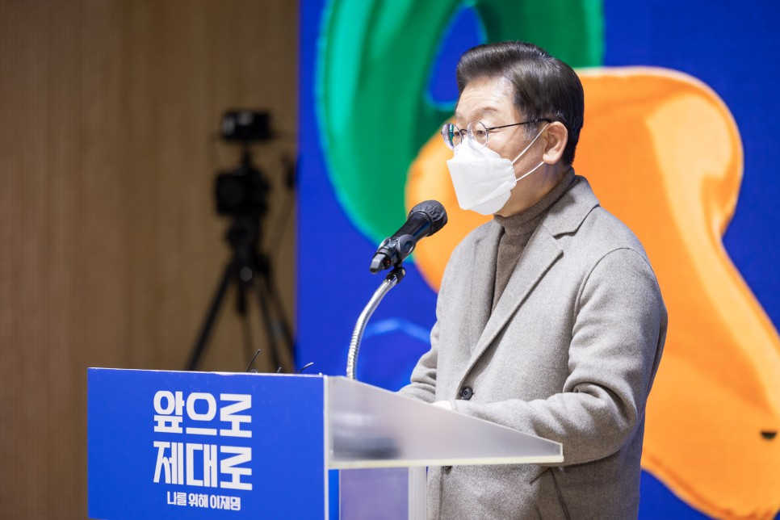
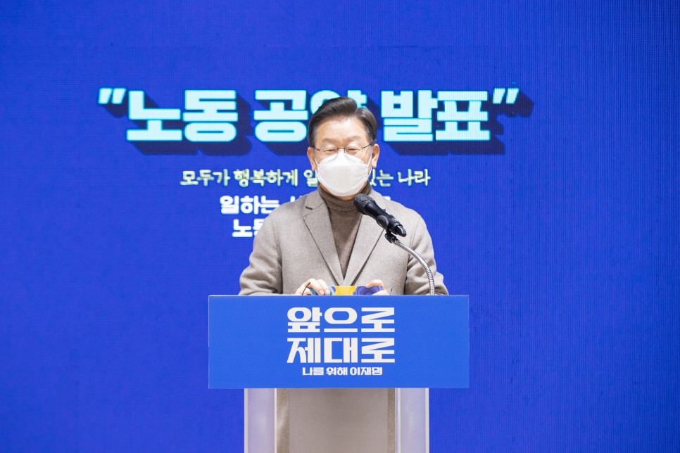
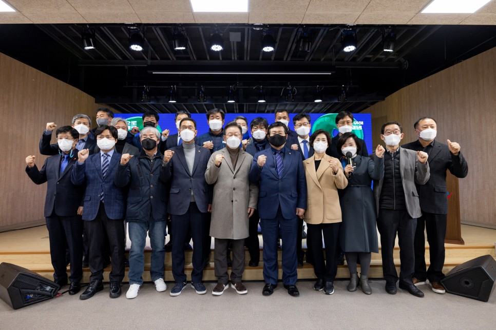
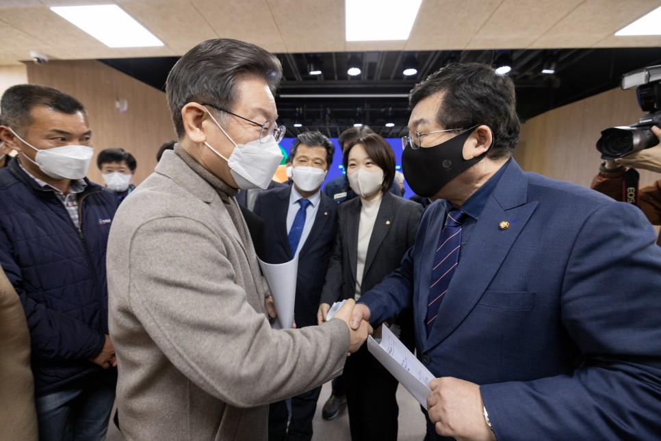
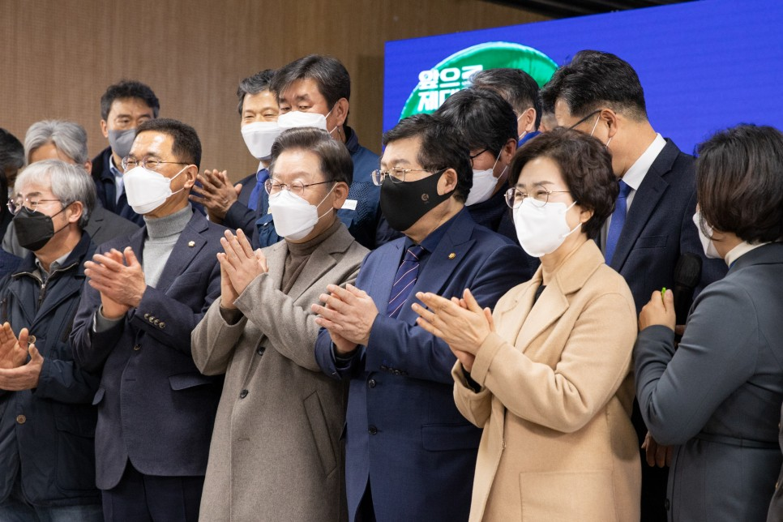
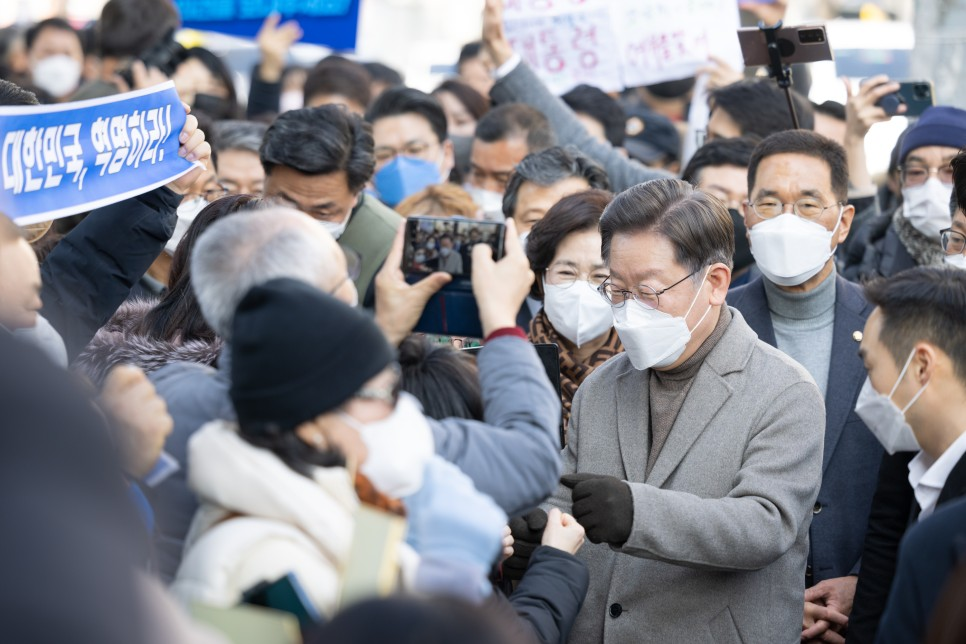

## 대표공약
# 안전한 일터, 존중받는 노동! 일하는 사람 모두가 행복한 나라, 이재명은 합니다!
> 2022-01-26 17:06:03

대한민국은 세계가 부러워할 만큼 급속한 경제성장을 이룩한 나라입니다.

​

고난과 역경에 굴하지 않고 위기 때마다 하나가 되어 희망을 만든 우리 국민의 강인함 덕분입니다.

​

국민의 노력으로 경제는 세계 10위의 강국이 됐지만 일하는 사람의 권리와 노동 환경은 세계 10위 경제대국의 위상을 따라가지 못하고 있습니다.

​

여전히 많은 노동자가 일터에서 사고로 목숨을 잃고 노동자를 위한 노동관계법은 노동자의 법적 권리를 제대로 보장하지 못하고 있습니다.

​

고용불안과 차별받는 노동자, 생명이 위태로운 일터, 부끄러운 경제대국 대한민국의 현주소입니다.

​

급기야 전 세계를 강타한 코로나 팬데믹은 대기업과 중소기업 간 일자리 양극화를 심화시키고 비정규직은 역대 최대치로 늘어났습니다.

​

국가는 국민이 안전한 환경 속에서 일하고 공정한 노동을 통해 더 나은 삶을 추구할 수 있도록 보장해야 합니다.

​

대전환 시대를 준비하는 대한민국의 과제는 공정한 노동시장에서 일하는 모든 사람들의 노동기본권을 보장하는 것입니다.

​

대한민국의 성장 동력은 물적자원이 아닌 인적자원입니다. 저 이재명은 사람을 비용이 아닌 자산으로 삼겠습니다.

​

노동자의 권리를 온전히 보장하고 일하는 사람들의 기본권이 존중받도록 하겠습니다. 국민 개개인이 스스로 능력을 발휘하고 누구나 행복하게 일할 수 있는 나라를 만들겠습니다.

​

이를 위한 이재명 정부의 6대 공약을 말씀드리겠습니다.

첫째, ‘일하는 사람 권리보장 기본법’을 제정하겠습니다.

산업 구조의 변화와 비약적인 기술의 발전은 새롭고 다양한 고용 형태를 만들었습니다. 하지만 현행 근로기준법은 정규직 임금노동자를 중심으로 설계돼 변화된 노동 환경을 제대로 반영하지 못하고 있습니다. 다양한 방식으로 일하는 사람들의 실질적인 권리보장이 필요합니다.

​

특수고용·플랫폼노동·프리랜서와 같은 모든 일하는 사람을 포괄적으로 보호하는 ‘일하는 사람 권리보장 기본법’을 제정하겠습니다. 이를 통해 노동법 사각지대를 해소하겠습니다.

​

노동기본권에 차별이 있어서는 안 됩니다. 5인 미만 사업장에서 일하는 노동자들을 보호할 수 있도록 노동관계법의 사각지대를 단계적으로 줄이겠습니다. 코로나 팬데믹으로 소상공인·자영업자의 어려운 상황을 감안하고 을들 간의 전쟁이 되지 않도록 보완대책을 세심하게 마련해 모두가 공감할 수 있는 정책을 만들겠습니다.

​

노동자 인권 분야부터 업종·업무의 특수성과 경제적 여건을 고려하여 단계적으로 노동자 보호 확대를 추진하겠습니다. 영세자영업자의 고충을 충분히 살펴 행정과 재정지원을 확대하겠습니다.

​

소득기반 전 국민 고용보험을 조기에 실현하여 실직과 실패를 딛고 재도전할 기회를 보장하겠습니다.

​

고용보험에 가입한 프리랜서와 자영업자가 급격한 소득 상실로 고용보험 불이익을 당하지 않도록 보완하는 방안을 마련하겠습니다.

​

모두의 일 생활 균형을 든든히 뒷받침하기 위해 일하는 모든 사람에게 출산 전후 휴가와 부모 육아휴직을 보장하겠습니다.

둘째, ‘상시·지속업무의 정규직 고용’원칙을 세우고 ‘적정임금제도’를 추진하겠습니다.

비정규직 노동자는 고용불안과 임금 차별이라는 이중고에 시달리고 있습니다.

​

공정한 노동시장은 고용안정에서 시작됩니다.

​

우선, 상시적이고 지속적인 업무와 국민의 생명과 안전에 직결된 업무는 정규직으로 고용하는 원칙을 법제화하겠습니다.

​

이와 함께 용역직 고용보장을 위해 용역회사가 바뀌더라도 고용관계가 승계되도록 제도화하겠습니다.

​

노동현장에서 일하는 사람의 차별을 시정하겠습니다. 근로기준법과 같은 관련 법률의 개정을 추진하고 동일가치노동 동일임금 원칙을 명시하여 차별을 완화하고 해소하는 법적 근거를 마련하겠습니다.

​

공정임금위원회를 설치하고 직무에 대한 객관적 가치평가, 고용평등 임금공시제, 표준임금체계를 도입해 임금제도의 종합적 개혁을 추진하겠습니다.

​

비정규직의 소득을 높이는 다양한 방안을 마련하겠습니다. 원청과 하청에서 발생하는 ‘단가 후려치기’를 근절하겠습니다. 현재 건설 분야 공공발주에서 시범실시 중인 적정임금제도를 공공부문 전체로 확대하고 장기적으로는 사회적 타협을 통해 민간부문 하도급에도 적용해 나가겠습니다.

​

직접고용 1년 미만 단기계약직의 고용불안 해소를 위해 고용 불안정성에 비례하는 추가 보상제도를 시행하겠습니다. 경기도에서 시행 중인‘비정규직 공정수당’을 중앙 행정기관과 공공기관에 도입하겠습니다. 민간부문에도 공정수당 도입을 권고하고 도입한 기업에는 인센티브를 제공해 확산을 유도하겠습니다.

​

셋째, 산재사고 예방과 재해 보상을 강화하고 아프면 쉴 권리를 보장하겠습니다.

이재명 정부는 일하는 국민이 안전하게 일하고, 아프면 쉬고, 다치면 제대로 치료받게 하겠습니다.

​

우선 후진적인 산재사고를 대폭 줄이겠습니다. 위험의 외주화에 의한 산재사고 예방과 국민의 소중한 생명을 지키기 위해 원청과 하청을 통합하는 산업안전보건위원회 설치를 의무화하겠습니다.

​

산재사고 사망률을 OECD 평균 이하로 낮추겠습니다. ‘노동안전보건청’을 설립하여 사고 예방과 재해 보상, 체계화된 재활을 지원하겠습니다.

​

일하는 사람 누구나 아프면 쉴 수 있는 상병수당을 확대하겠습니다. 다치면 걱정 없이 치료받도록 업무상 재해위험이 높은 자영업자까지 포괄해 전 국민 산재보험을 단계적으로 추진하겠습니다.

​

산재예방 예산을 1조 원에서 2조 원으로 두 배 늘려 소규모 사업장 노동자의 안전을 지키고 50인 미만 사업장의 안전사고 예방과 직업병 상담을 우선 지원하겠습니다. 소규모 사업장 노동자, 특수고용과 플랫폼 종사자의 건강 상담을 위해 산업안전 보건주치의 제도를 운영하겠습니다.

​

산재 발생을 선제적으로 대응하여 폭염, 혹한과 같은 산재 발생이 예상되는 경우 작업을 중지할 수 있도록 제도화하고 안전보건 공시제를 단계적으로 도입하여 기업의 안전보건 활동을 투명하게 관리하겠습니다.

넷째, 노조활동 참여와 권리를 확대하고 노동인권을 존중하겠습니다.

우리나라 노조 조직률은 OECD 국가 평균의 절반 정도로 낮은 수준입니다. 비정규직과 영세사업장 노동자들은 자신의 목소리를 낼 창구조차 없는 상황입니다.

​

노동관계법상 근로자대표 제도를 개편하여 비정규직대표의 참여를 보장하겠습니다. 동시에 노조가 없는 취약 노동자의 권익을 대변하기 위해 지역밀착형 노동권익지원센터 설치를 전국으로 확대하고 한국형 노동회의소를 설립하겠습니다.

​

디지털 전환에 따라 다양하게 변화한 고용관계에 맞춰 플랫폼, 프리랜서, 특수고용직과 같은 불안정 취약노동자를 위해 초기업 교섭 활성화와 단체협약 효력확장을 추진하겠습니다. 공동복지기금을 이용할 수 없는 지역의 미조직 취약노동자가 자발적으로 지역노동복지기금을 조성할 경우에는 정부가 적극 지원하겠습니다.

​

모든 국민의 ‘의사 표현’의 자유는 헌법에 보장된 권리입니다. 교원과 공무원도 마찬가지입니다. 교원과 공무원의 정치활동 전면 금지는 국제노동협약 위반이기도 합니다. 교원과 공무원이 근무 외 시간 동안 직무와 무관한 최소한의 정치활동은 보장하겠습니다.

​

노동관계법을 위반하는 잘못된 관행은 반드시 바로잡겠습니다. 고의적이거나 반복적인 임금체불을 막는 일에 중앙정부와 지방자치단체가 함께 나서야 합니다.

​

소규모 사업장의 안전과 임금체불을 효율적으로 지도·감독하기 위한 중앙정부와 지방자치단체의 근로감독 협력 모델을 만들겠습니다. 이를 위해 근로감독관을 충분히 증원하겠습니다.

​

학교 교육에 노동인권 과정을 반영해 청소년이 노동 존중과 노동의 가치를 배우고 이후 사회에 나가서도 노동의 권리를 스스로 지킬 수 있도록 하겠습니다.

다섯째, 실노동시간을 단축하여 노동자의 더 나은 삶을 실현하겠습니다.

국민 70% 이상이 주 52시간 노동시간 단축을 지지해 주셨습니다. 우리나라 노동시간이 주 최대 52시간으로 줄었지만, 우리 국민은 OECD 평균보다 훨씬 더 많이 일하고 있습니다. 일터에 오래 머무른다고 해서 생산성이 높은 것이 아닙니다. 이재명 정부는 생산성은 높이고 노동시간은 줄이는 최선의 노력으로 일하는 국민이 더 나은 삶을 누릴 수 있도록 하겠습니다.

​

연차 휴가 일수와 소진율을 선진국 수준으로 높이고 시간 외 수당을 제대로 지급하지 않는 포괄임금 약정을 제한하겠습니다. 또 가족돌봄휴가제 확대와 같은 방법으로 소득감소 없이 실노동시간을 단축하겠습니다.

​

주 4.5일제 도입을 위한 사회적 대화를 시작하고 단계적 도입을 위한 시범사업을 추진하겠습니다. 선도적으로 주 4일 또는 주 4.5일제를 도입한 기업에는 다양한 방식의 인센티브를 제공하여 노동시간 단축을 확산시키겠습니다.

여섯째, 대전환을 선도하는 일자리 정책을 수립하겠습니다.

산업 대전환 일자리를 위한 사회적 대화를 더욱 활성화하고 합의한 내용은 정부차원에서 반드시 이행할 수 있도록 제도적으로 보장하고 점검을 강화하겠습니다.

​

산업 대전환에 대비하여 성공적인 일자리 전환과 경력개발을 관리하는 ‘정의로운 전환’컨트롤 타워를 탄소중립위원회 내에 설치하고 사회적 대화를 통해 일자리 창출 로드맵을 만들겠습니다.

​

공공 취업지원서비스를 강화하여 원하는 일자리나 구직자를 찾지 못하는 일이 없도록 구직자와 기업을 적재적소에 연결하는 일자리 시스템을 정비하겠습니다.

​

부처별·지역별로 분산된 일자리 센터를 통합하고 효율적으로 재편하겠습니다.

​

민생과 직결된 공공서비스 영역의 일자리는 계속 확대하겠습니다. 영·유아, 초등생, 노인돌봄 서비스와 의료 인력을 확충하겠습니다.

​

생산인구 감소와 고령화에 따라 더 높은 연령대까지 일할 수 있는 기회를 확대하겠습니다. 연금수급기간을 고려해 다양한 계속고용 정책을 실행하고 어르신들의 소득 사각지대를 줄이겠습니다.

​

직업능력개발의 대전환이 필요합니다. 국민내일배움카드 한 장이면 전 국민 누구나 평생 직업능력개발지원을 받을 수 있도록 지원대상과 기간, 규모를 확대하겠습니다.

​

존경하는 국민 여러분!

​

저는 어린 시절 교복 대신 기름때 묻은 작업복을 입어야 했던 소년 노동자였습니다.

​

부당하게 임금을 떼인 적도 많았고 왼팔이 비틀어지고 후각 일부를 상실하는 산업재해를 당했지만, 보상은커녕 제대로 된 치료조차 받지 못했습니다.

그 시절 노동자는 그저 기계보다 값싼 노동력에 불과했기 때문입니다.

​

비록 제 팔은 굽었지만, 굽고 휜 노동 현실은 똑바르게 바로 펴고 싶습니다.

​

사람의 가치를 돈으로 책정하지 않는 노동이 존중받는 세상을 만들고 싶습니다.

​

노동자의 아픔과 불공정하고 부조리한 노동 현실을 뼈저리게 느껴온 저 이재명이 사람을 위한 노동, 공정한 노동 환경을 만들겠습니다.

​

안전한 일터, 존중받는 노동,

일하는 사람 모두가 행복한 나라,

이재명은 합니다!

​

고맙습니다.

​

2022년 1월 26일

​

더불어민주당 제20대 대통령 후보 이 재 명